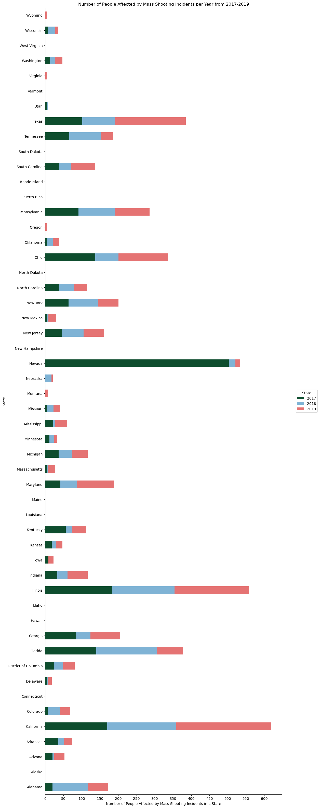
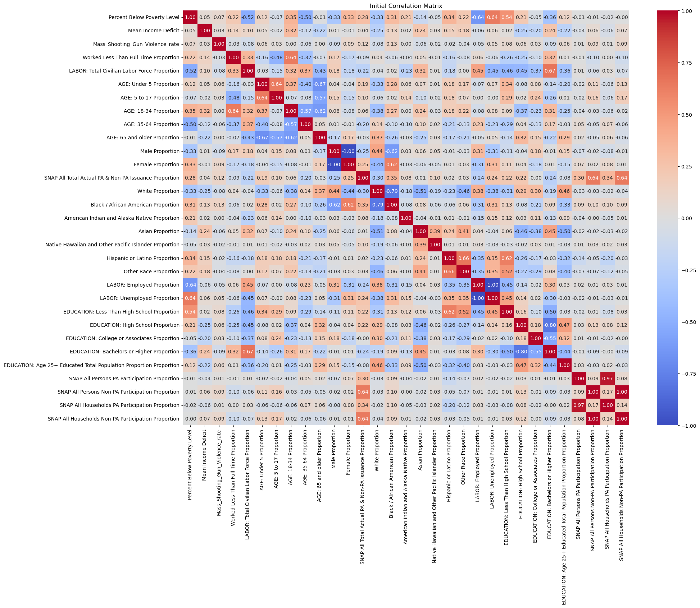
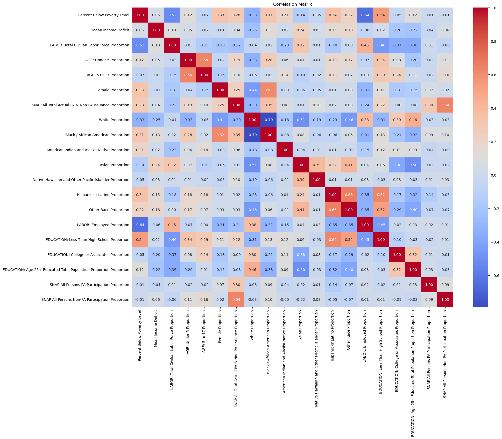

# Research Question: To what extent is food security, a basic need, through SNAP associated with mass shootings gun violence in the United States?

# Overview

The Second Amendment guarantees individual gun ownership, as affirmed by landmark rulings like *District of Columbia v. Heller* (2008). Yet, gun violence remains a significant U.S. mortality cause. Realizing the tension between rights and violence,and knowing better basic need support can forester social stability, we are interested  to explore if access to basic food benefits, provided by the **Supplemental Nutrition Assistance Program (SNAP)**, influences gun violence rates (specifically mass shootings). We hypothesize that basic food security through SNAP fosters societal stability and reduces gun violence.

Our study focuses on the **2017 to 2019 timeframe** to capture conditions before and after *the 2018 Farm Bill* making changes to SNAP and to avoid COVID-19 impacts. We'll examine **mass shootings**, including public, bar/club incidents, family annihilations, drive-bys, and others with at least four victims shot, encompassing mass murder by firearms.

Accordingly, we operationalize the research question as follows. The **outcome variable** of the research is *mass shooting gun violence rate, measured by computing the proportion of mass shooting victims  — both injured and died — to the total population*. Our **independent variable** is SNAP benefit, which we measure as *the ratio of the average number of people participating in SNAP to the total population*. We recognize that there may be an additional variable, household income — if a household is below the poverty line — that may also affect gun violence. For example, counties with a high average household income might have fewer homicides and injuries from gun violence even if they do not have a high use of food through SNAP. Our research targets each state and is at the county level.

# Project EDA

## Applicability of the Data to the Research Question

The outcome variable in our study is the mass shooting gun violence rate in each county. We sourced this data from the Gun Violence Archive, which specifically tracks various forms of gun violence and includes data for each State and County. For this project, we select mass shootings.


Our independent variable is SNAP benefits usage. We measure the total public and non-public assistance cases in each county.  This data also includes demographic information —  age, race, sex, income, and educational attainment — that may be helpful. To standardize this data, we'll calculate the proportion of the population accessing SNAP relative to the total population from 2017 to 2019, using data from the U.S. Census and SNAP's official records. This approach ensures a standardized comparison across diverse county populations. Both datasets contain County, State, and Year, facilitating data merging and analysis relevant to our research question.

## Dependencies
Import all required libraries.


```python
import os
import io
import json
from pathlib import Path
import requests
from tabulate import tabulate
from IPython.display import IFrame
import pandas as pd
import numpy as np
import geopandas as gpd
import matplotlib.pyplot as plt
import seaborn as sns
%matplotlib inline
import folium
from folium.plugins import HeatMap, HeatMapWithTime
from shapely import wkt
import branca
from branca.colormap import linear
import branca.colormap as cm
import sklearn.linear_model as linear
import sklearn.metrics as metrics
import sklearn.svm as svm
from sklearn.preprocessing import StandardScaler
from sklearn.model_selection import (
    train_test_split, 
    KFold, 
    cross_val_score, 
    cross_val_predict, 
    GridSearchCV
)
from sklearn.linear_model import LogisticRegression, RidgeClassifier
from sklearn.tree import DecisionTreeClassifier, DecisionTreeRegressor
from sklearn.ensemble import AdaBoostClassifier, AdaBoostRegressor
from sklearn.metrics import (
    r2_score, 
    accuracy_score, 
    roc_curve, 
    auc, 
    classification_report, 
    mean_absolute_error, 
    mean_squared_error, 
    confusion_matrix, 
    roc_auc_score,
    recall_score,
    precision_score
)
import statsmodels.api as sm
```

# Data
All data is collected for the years 2017-2019 to more clearly examine the effects of SNAP on gun violence without the factor of COVID-19. The Gun Violence Archive changes the number of sources after 2019, which can also affect results. The 2017-2019 range provides the most consistent set of data prior to COVID-19.

### Gun Violence Data
Mass shooting data (2017-2019) retrieved from the Gun Violence Archive.


```python
# Load in gun violence data
mass_shootings_2017 = pd.read_csv('data/mass_shootings_2017.csv')
mass_shootings_2018 = pd.read_csv('data/mass_shootings_2018.csv')
mass_shootings_2019 = pd.read_csv('data/mass_shootings_2019.csv')
gun_violence_data = pd.concat([mass_shootings_2017, mass_shootings_2018, mass_shootings_2019], axis=0).drop_duplicates()
```

### City and Census Data
City data is needed to map cities to counties, and the US Census Burea's data on poverty status provides other demographic information by county.


```python
# Load in city and census data
city_data = pd.read_csv('data/uscities.csv')[['city', 'state_name', 'county_name', 'population', 'density']] #https://simplemaps.com/data/us-cities
us_census_data_2017 = pd.read_csv('data/us_census_data_2017.csv')
us_census_data_2018 = pd.read_csv('data/us_census_data_2018.csv')
us_census_data_2019 = pd.read_csv('data/us_census_data_2019.csv')
```

### SNAP Data
SNAP data is used to analyze the usage per county.


```python
# Load in SNAP data
snap_data_2017 = pd.read_excel('data/snap_data_jan_2017.xls', header=0)
snap_data_2018 = pd.read_excel('data/snap_data_jan_2018.xls', header=0)
snap_data_2019 = pd.read_excel('data/snap_data_jan_2019.xls', header=0)
```

# Data Cleaning

### Gun Violence Data


```python
### CLEANING: gun violence data ###

# Text cleaning city or county names
gun_violence_data['City Or County'] = gun_violence_data['City Or County'].str.replace(r' \(.*?\)', '', regex=True)

# Map cities to counties
gun_violence_data = pd.merge(gun_violence_data, city_data, left_on='City Or County', right_on='city', how='left')
gun_violence_data.drop(['City Or County', 'city', 'state_name', 'population', 'density'], axis=1, inplace=True)
gun_violence_data.insert(4, 'County', gun_violence_data.pop('county_name'))

# Filter by year (target: 2017-2019)
gun_violence_data.insert(2, 'Year', gun_violence_data['Incident Date'].apply(lambda x: int(x.split(', ')[1])))
gun_violence_data = gun_violence_data[(gun_violence_data['Year'] >= 2017) & (gun_violence_data['Year'] <= 2019)]
gun_violence_data

# Remove columns
# (Operations is N/A only, Address is too granular)
gun_violence_data.drop(columns=['Operations', 'Address'], inplace=True)
```


```python
# Check for null values
nulls = gun_violence_data.isnull().mean()
```


```python
# Handle null values
gun_violence_data = gun_violence_data.dropna(subset=['County'])
no_nulls = gun_violence_data.isnull().mean()
```


```python
# Create a column "Victims", which is calculated through "Victims Killed" + "Victims Injured"
gun_violence_data['Victims'] = gun_violence_data['Victims Killed'] + gun_violence_data['Victims Injured']
```

### US Census Data

**NOTE:** _Some feature selection happens in this section of cleaning -- the initial features of interest are directly selected from the dataset._


```python
### CLEANING: US census data ###
us_census_data_2017['Year'] = [2017] * len(us_census_data_2017)
us_census_data_2018['Year'] = [2018] * len(us_census_data_2018)
us_census_data_2019['Year'] = [2019] * len(us_census_data_2019)

# Make dataframe with census data from all years
us_census_data = pd.concat([us_census_data_2017, us_census_data_2018, us_census_data_2019], ignore_index=True)

# Select desired columns: geographic area name, total estimate population, below poverty level population, percent below poverty level,
# In addition to other columns related to race, sex, age group, educational attainment, employment status, and work experience
interest_column_to_name = {
    'NAME': 'County, State',
    'Year': 'Year',
    'S1701_C01_001E': 'Total Population',
    'S1701_C02_001E': 'Below Poverty Level',
    'S1701_C03_001E': 'Percent Below Poverty Level',
    'S1701_C01_058E': 'Mean Income Deficit',
    'S1701_C01_060E': 'Worked Less Than Full Time',
    'S1701_C01_027E': 'LABOR: Total Civilian Labor Force',
    'S1701_C01_028E': 'LABOR: Employed',
    'S1701_C01_031E': 'LABOR: Unemployed',
    'S1701_C01_022E': 'EDUCATION: Age 25+ Educated Total Population',
    'S1701_C01_023E': 'EDUCATION: Less Than High School',
    'S1701_C01_024E': 'EDUCATION: High School',
    'S1701_C01_025E': 'EDUCATION: College or Associates',
    'S1701_C01_026E': 'EDUCATION: Bachelors or Higher',
    'S1701_C01_013E': 'White',
    'S1701_C01_014E': 'Black / African American',
    'S1701_C01_015E': 'American Indian and Alaska Native',
    'S1701_C01_016E': 'Asian',
    'S1701_C01_017E': 'Native Hawaiian and Other Pacific Islander',
    'S1701_C01_018E': 'Other Race',
    'S1701_C01_020E': 'Hispanic or Latino',
    'S1701_C01_003E': 'AGE: Under 5',
    'S1701_C01_004E': 'AGE: 5 to 17',
    'S1701_C01_007E': 'AGE: 18-34',
    'S1701_C01_008E': 'AGE: 35-64',
    'S1701_C01_010E': 'AGE: 65 and older',
    'S1701_C01_011E': 'Male',
    'S1701_C01_012E': 'Female'
}

# Replace codes with column names
us_census_data = us_census_data[interest_column_to_name.keys()].iloc[1:]
us_census_data.rename(columns=interest_column_to_name, inplace=True)

# Clean County, State data (has some data that is not county-level)
us_census_data = us_census_data[us_census_data['County, State'].str.contains(',', na=False)]

# Separate County and State
us_census_data.insert(1, 'County', us_census_data['County, State'].apply(lambda x: x.split(', ')[0]))
us_census_data['County'] = us_census_data['County'].replace(' County$', '', regex=True)
us_census_data.insert(2, 'State', us_census_data['County, State'].apply(lambda x: x.split(', ')[1]))
us_census_data.drop(['County, State'], axis=1, inplace=True)

# From documentation, entries that are 'N' indicate that data for this geographic area
# Cannot be displayed because the number of sample cases is too small. Replace these values with 0.
us_census_data.replace('N', 0, inplace=True)

# Change all values to numeric (all objects currently)
exclude = ['County', 'State']
for column in us_census_data.columns:
  if not column in exclude:
    us_census_data[column] = pd.to_numeric(us_census_data[column])
```


```python
# Check for null values
nulls = us_census_data.isnull().mean()
```

### SNAP Data


```python
### CLEANING: SNAP data - HELPER FUNCTION for partial cleaning ####

def clean_snap_data(dataset):

  # Drop the last 3 columns because they are "U.S. Summary", NaN, NaN
  dataset.drop(dataset.tail(3).index, inplace=True)

  # Extract the state abbreviation, change it to state name, create new column 'State'
  pattern = r'\d{7}\s([A-Z]{2})'
  state_names_mapping = {
    'AL': 'Alabama', 'AK': 'Alaska', 'AZ': 'Arizona', 'AR': 'Arkansas', 'CA': 'California',
    'CO': 'Colorado', 'CT': 'Connecticut', 'DE': 'Delaware', 'FL': 'Florida', 'GA': 'Georgia',
    'HI': 'Hawaii', 'ID': 'Idaho', 'IL': 'Illinois', 'IN': 'Indiana', 'IA': 'Iowa',
    'KS': 'Kansas', 'KY': 'Kentucky', 'LA': 'Louisiana', 'ME': 'Maine', 'MD': 'Maryland',
    'MA': 'Massachusetts', 'MI': 'Michigan', 'MN': 'Minnesota', 'MS': 'Mississippi', 'MO': 'Missouri',
    'MT': 'Montana', 'NE': 'Nebraska', 'NV': 'Nevada', 'NH': 'New Hampshire', 'NJ': 'New Jersey',
    'NM': 'New Mexico', 'NY': 'New York', 'NC': 'North Carolina', 'ND': 'North Dakota', 'OH': 'Ohio',
    'OK': 'Oklahoma', 'OR': 'Oregon', 'PA': 'Pennsylvania', 'RI': 'Rhode Island', 'SC': 'South Carolina',
    'SD': 'South Dakota', 'TN': 'Tennessee', 'TX': 'Texas', 'UT': 'Utah', 'VT': 'Vermont',
    'VA': 'Virginia', 'WA': 'Washington', 'WV': 'West Virginia', 'WI': 'Wisconsin', 'WY': 'Wyoming'
  }
  matches = dataset['Substate/Region'].str.extract(pattern)
  matches.columns = ['State Abbreviation']
  dataset['State'] = matches['State Abbreviation'].map(state_names_mapping)

  # Extract the county, create new column 'County'
  def extract_county_name(string):
      return string.split(' ')[3]
  dataset['County'] = dataset['Substate/Region'].apply(extract_county_name)

  # Change county -> "AUTAUGA" to "Autauga"
  def capitalize_county(county):
      return county.capitalize()
  dataset['County'] = dataset['County'].apply(capitalize_county)

  dataset.drop(['Substate/Region'], axis=1, inplace=True)

  # Convert strings to values
  exclude = ['State', 'County']
  for column in dataset.columns:
    if not column in exclude:
      dataset[column] = pd.to_numeric(dataset[column], errors='coerce').fillna(0)

  return dataset
```


```python
# Clean snap datasets using function above
snap_data_2017 = clean_snap_data(snap_data_2017).assign(Year=2017)
snap_data_2018 = clean_snap_data(snap_data_2018).assign(Year=2018)
snap_data_2019 = clean_snap_data(snap_data_2019).assign(Year=2019)

# Make dataframe with snap data from all years
snap_data = pd.concat([snap_data_2017, snap_data_2018, snap_data_2019],
                      ignore_index=True).groupby(['State', 'County', 'Year']).agg('sum').reset_index()
```


```python
# Check for null values
null_proportions = snap_data.isnull().mean()
null_proportions
```


    State                                                      0.0
    County                                                     0.0
    Year                                                       0.0
    SNAP All Persons Public Assistance Participation           0.0
    SNAP All Persons Non-Public Assistance Participation       0.0
    Calc: SNAP Total PA and Non-PA People                      0.0
    SNAP All Households Public Assistance Participation        0.0
    SNAP All Households Non-Public Assistance Participation    0.0
    Calc: SNAP Total PA and Non-PA Households                  0.0
    SNAP All Total Actual PA & Non-PA Issuance                 0.0
    dtype: float64


```python
# Handle null values
# Drop rows with null state (12)
snap_data.dropna(subset=['State'], inplace=True)
null_proportions = snap_data.isnull().mean()
```

# Merging the Data
Merging the three tables on State, County, and Year


```python
# Join all three tables together by Year, State, and County
census_gun_data = pd.merge(us_census_data, gun_violence_data, on=['State', 'County', 'Year'], how='left').fillna(0)
gun_snap_census_data = pd.merge(census_gun_data, snap_data, on=['State', 'County', 'Year'], how='left').fillna(0)
gun_snap_census_data
```


<div>
<style scoped>
    .dataframe tbody tr th:only-of-type {
        vertical-align: middle;
    }

    .dataframe tbody tr th {
        vertical-align: top;
    }

    .dataframe thead th {
        text-align: right;
    }
</style>
<table border="1" class="dataframe">
  <thead>
    <tr style="text-align: right;">
      <th></th>
      <th>County</th>
      <th>State</th>
      <th>Year</th>
      <th>Total Population</th>
      <th>Below Poverty Level</th>
      <th>Percent Below Poverty Level</th>
      <th>Mean Income Deficit</th>
      <th>Worked Less Than Full Time</th>
      <th>LABOR: Total Civilian Labor Force</th>
      <th>LABOR: Employed</th>
      <th>...</th>
      <th>Suspects Injured</th>
      <th>Suspects Arrested</th>
      <th>Victims</th>
      <th>SNAP All Persons Public Assistance Participation</th>
      <th>SNAP All Persons Non-Public Assistance Participation</th>
      <th>Calc: SNAP Total PA and Non-PA People</th>
      <th>SNAP All Households Public Assistance Participation</th>
      <th>SNAP All Households Non-Public Assistance Participation</th>
      <th>Calc: SNAP Total PA and Non-PA Households</th>
      <th>SNAP All Total Actual PA &amp; Non-PA Issuance</th>
    </tr>
  </thead>
  <tbody>
    <tr>
      <th>0</th>
      <td>Baldwin</td>
      <td>Alabama</td>
      <td>2017</td>
      <td>208868</td>
      <td>19537</td>
      <td>9.4</td>
      <td>5752</td>
      <td>6196</td>
      <td>99235</td>
      <td>94032</td>
      <td>...</td>
      <td>0.0</td>
      <td>0.0</td>
      <td>0.0</td>
      <td>2000.0</td>
      <td>19857.0</td>
      <td>21857.0</td>
      <td>1123.0</td>
      <td>8351.0</td>
      <td>9474.0</td>
      <td>2619236.0</td>
    </tr>
    <tr>
      <th>1</th>
      <td>Calhoun</td>
      <td>Alabama</td>
      <td>2017</td>
      <td>111724</td>
      <td>19767</td>
      <td>17.7</td>
      <td>6823</td>
      <td>4317</td>
      <td>51829</td>
      <td>48586</td>
      <td>...</td>
      <td>0.0</td>
      <td>0.0</td>
      <td>0.0</td>
      <td>2941.0</td>
      <td>18783.0</td>
      <td>21724.0</td>
      <td>1784.0</td>
      <td>8576.0</td>
      <td>10360.0</td>
      <td>2655978.0</td>
    </tr>
    <tr>
      <th>2</th>
      <td>Cullman</td>
      <td>Alabama</td>
      <td>2017</td>
      <td>81055</td>
      <td>10649</td>
      <td>13.1</td>
      <td>5647</td>
      <td>2223</td>
      <td>37513</td>
      <td>34795</td>
      <td>...</td>
      <td>0.0</td>
      <td>0.0</td>
      <td>0.0</td>
      <td>1547.0</td>
      <td>9057.0</td>
      <td>10604.0</td>
      <td>962.0</td>
      <td>3899.0</td>
      <td>4861.0</td>
      <td>1167165.0</td>
    </tr>
    <tr>
      <th>3</th>
      <td>DeKalb</td>
      <td>Alabama</td>
      <td>2017</td>
      <td>70727</td>
      <td>14600</td>
      <td>20.6</td>
      <td>7403</td>
      <td>1493</td>
      <td>29993</td>
      <td>28755</td>
      <td>...</td>
      <td>0.0</td>
      <td>0.0</td>
      <td>0.0</td>
      <td>0.0</td>
      <td>0.0</td>
      <td>0.0</td>
      <td>0.0</td>
      <td>0.0</td>
      <td>0.0</td>
      <td>0.0</td>
    </tr>
    <tr>
      <th>4</th>
      <td>Elmore</td>
      <td>Alabama</td>
      <td>2017</td>
      <td>76708</td>
      <td>8806</td>
      <td>11.5</td>
      <td>5833</td>
      <td>1477</td>
      <td>37709</td>
      <td>35318</td>
      <td>...</td>
      <td>0.0</td>
      <td>0.0</td>
      <td>0.0</td>
      <td>1253.0</td>
      <td>8960.0</td>
      <td>10213.0</td>
      <td>711.0</td>
      <td>3742.0</td>
      <td>4453.0</td>
      <td>1219363.0</td>
    </tr>
    <tr>
      <th>...</th>
      <td>...</td>
      <td>...</td>
      <td>...</td>
      <td>...</td>
      <td>...</td>
      <td>...</td>
      <td>...</td>
      <td>...</td>
      <td>...</td>
      <td>...</td>
      <td>...</td>
      <td>...</td>
      <td>...</td>
      <td>...</td>
      <td>...</td>
      <td>...</td>
      <td>...</td>
      <td>...</td>
      <td>...</td>
      <td>...</td>
      <td>...</td>
    </tr>
    <tr>
      <th>3067</th>
      <td>Ponce Municipio</td>
      <td>Puerto Rico</td>
      <td>2019</td>
      <td>129026</td>
      <td>68627</td>
      <td>53.2</td>
      <td>8258</td>
      <td>3056</td>
      <td>40612</td>
      <td>36614</td>
      <td>...</td>
      <td>0.0</td>
      <td>0.0</td>
      <td>0.0</td>
      <td>0.0</td>
      <td>0.0</td>
      <td>0.0</td>
      <td>0.0</td>
      <td>0.0</td>
      <td>0.0</td>
      <td>0.0</td>
    </tr>
    <tr>
      <th>3068</th>
      <td>San Juan Municipio</td>
      <td>Puerto Rico</td>
      <td>2019</td>
      <td>312498</td>
      <td>124927</td>
      <td>40.0</td>
      <td>8375</td>
      <td>11844</td>
      <td>140720</td>
      <td>115527</td>
      <td>...</td>
      <td>0.0</td>
      <td>0.0</td>
      <td>0.0</td>
      <td>0.0</td>
      <td>0.0</td>
      <td>0.0</td>
      <td>0.0</td>
      <td>0.0</td>
      <td>0.0</td>
      <td>0.0</td>
    </tr>
    <tr>
      <th>3069</th>
      <td>Toa Alta Municipio</td>
      <td>Puerto Rico</td>
      <td>2019</td>
      <td>71897</td>
      <td>22348</td>
      <td>31.1</td>
      <td>7475</td>
      <td>360</td>
      <td>29602</td>
      <td>28383</td>
      <td>...</td>
      <td>0.0</td>
      <td>0.0</td>
      <td>0.0</td>
      <td>0.0</td>
      <td>0.0</td>
      <td>0.0</td>
      <td>0.0</td>
      <td>0.0</td>
      <td>0.0</td>
      <td>0.0</td>
    </tr>
    <tr>
      <th>3070</th>
      <td>Toa Baja Municipio</td>
      <td>Puerto Rico</td>
      <td>2019</td>
      <td>73953</td>
      <td>28367</td>
      <td>38.4</td>
      <td>6873</td>
      <td>1827</td>
      <td>31768</td>
      <td>27886</td>
      <td>...</td>
      <td>0.0</td>
      <td>0.0</td>
      <td>0.0</td>
      <td>0.0</td>
      <td>0.0</td>
      <td>0.0</td>
      <td>0.0</td>
      <td>0.0</td>
      <td>0.0</td>
      <td>0.0</td>
    </tr>
    <tr>
      <th>3071</th>
      <td>Trujillo Alto Municipio</td>
      <td>Puerto Rico</td>
      <td>2019</td>
      <td>63434</td>
      <td>17415</td>
      <td>27.5</td>
      <td>7243</td>
      <td>1581</td>
      <td>28710</td>
      <td>27989</td>
      <td>...</td>
      <td>0.0</td>
      <td>0.0</td>
      <td>0.0</td>
      <td>0.0</td>
      <td>0.0</td>
      <td>0.0</td>
      <td>0.0</td>
      <td>0.0</td>
      <td>0.0</td>
      <td>0.0</td>
    </tr>
  </tbody>
</table>
<p>3072 rows × 45 columns</p>
</div>


# Description of Data

## Summary Table


```python
# Listing all of the columns and their corresponding data type in our dataframe
column_names = gun_snap_census_data.dtypes.reset_index()
column_names.columns = ['Column Names', 'Data Type']
column_names = tabulate(column_names, headers='keys', tablefmt='pretty')
print(column_names)
```

    +----+---------------------------------------------------------+-----------+
    |    |                      Column Names                       | Data Type |
    +----+---------------------------------------------------------+-----------+
    | 0  |                         County                          |  object   |
    | 1  |                          State                          |  object   |
    | 2  |                          Year                           |   int64   |
    | 3  |                    Total Population                     |   int64   |
    | 4  |                   Below Poverty Level                   |   int64   |
    | 5  |               Percent Below Poverty Level               |  float64  |
    | 6  |                   Mean Income Deficit                   |   int64   |
    | 7  |               Worked Less Than Full Time                |   int64   |
    | 8  |            LABOR: Total Civilian Labor Force            |   int64   |
    | 9  |                     LABOR: Employed                     |   int64   |
    | 10 |                    LABOR: Unemployed                    |   int64   |
    | 11 |      EDUCATION: Age 25+ Educated Total Population       |   int64   |
    | 12 |            EDUCATION: Less Than High School             |   int64   |
    | 13 |                 EDUCATION: High School                  |   int64   |
    | 14 |            EDUCATION: College or Associates             |   int64   |
    | 15 |             EDUCATION: Bachelors or Higher              |   int64   |
    | 16 |                          White                          |   int64   |
    | 17 |                Black / African American                 |   int64   |
    | 18 |            American Indian and Alaska Native            |   int64   |
    | 19 |                          Asian                          |   int64   |
    | 20 |       Native Hawaiian and Other Pacific Islander        |   int64   |
    | 21 |                       Other Race                        |   int64   |
    | 22 |                   Hispanic or Latino                    |   int64   |
    | 23 |                      AGE: Under 5                       |   int64   |
    | 24 |                      AGE: 5 to 17                       |   int64   |
    | 25 |                       AGE: 18-34                        |   int64   |
    | 26 |                       AGE: 35-64                        |   int64   |
    | 27 |                    AGE: 65 and older                    |   int64   |
    | 28 |                          Male                           |   int64   |
    | 29 |                         Female                          |   int64   |
    | 30 |                       Incident ID                       |  float64  |
    | 31 |                      Incident Date                      |  object   |
    | 32 |                     Victims Killed                      |  float64  |
    | 33 |                     Victims Injured                     |  float64  |
    | 34 |                     Suspects Killed                     |  float64  |
    | 35 |                    Suspects Injured                     |  float64  |
    | 36 |                    Suspects Arrested                    |  float64  |
    | 37 |                         Victims                         |  float64  |
    | 38 |    SNAP All Persons Public Assistance Participation     |  float64  |
    | 39 |  SNAP All Persons Non-Public Assistance Participation   |  float64  |
    | 40 |          Calc: SNAP Total PA and Non-PA People          |  float64  |
    | 41 |   SNAP All Households Public Assistance Participation   |  float64  |
    | 42 | SNAP All Households Non-Public Assistance Participation |  float64  |
    | 43 |        Calc: SNAP Total PA and Non-PA Households        |  float64  |
    | 44 |       SNAP All Total Actual PA & Non-PA Issuance        |  float64  |
    +----+---------------------------------------------------------+-----------+


Our outcome variable, "Victims" (Column 37), sums "Victims Killed" and "Victims Injured" from each mass shooting. We aim to predict the proportion of mass shootings "Victims" in each county using SNAP (Column 12-45) and US Census data, both of which are counts per person per county. We study factors including variables like SNAP usage (indicating food insecurity), race, educational attainment, and poverty levels. Our model will analyze how these factors correlate with mass shooting incidents, helping us understand which have the most significant associations with mass shootings.

## Descriptive Statistics

Here, we are generating summary statistics of each variable in each table that we have. This helps to give us a general idea of the distribution of each variable.


```python
gun_violence_data.describe()
```


<div>
<style scoped>
    .dataframe tbody tr th:only-of-type {
        vertical-align: middle;
    }

    .dataframe tbody tr th {
        vertical-align: top;
    }

    .dataframe thead th {
        text-align: right;
    }
</style>
<table border="1" class="dataframe">
  <thead>
    <tr style="text-align: right;">
      <th></th>
      <th>Incident ID</th>
      <th>Year</th>
      <th>Victims Killed</th>
      <th>Victims Injured</th>
      <th>Suspects Killed</th>
      <th>Suspects Injured</th>
      <th>Suspects Arrested</th>
      <th>Victims</th>
    </tr>
  </thead>
  <tbody>
    <tr>
      <th>count</th>
      <td>5.586000e+03</td>
      <td>5586.000000</td>
      <td>5586.000000</td>
      <td>5586.000000</td>
      <td>5586.000000</td>
      <td>5586.000000</td>
      <td>5586.000000</td>
      <td>5586.000000</td>
    </tr>
    <tr>
      <th>mean</th>
      <td>1.170605e+06</td>
      <td>2018.030254</td>
      <td>0.900286</td>
      <td>4.255997</td>
      <td>0.063910</td>
      <td>0.041532</td>
      <td>0.559076</td>
      <td>5.156284</td>
    </tr>
    <tr>
      <th>std</th>
      <td>2.479909e+05</td>
      <td>0.835202</td>
      <td>1.759052</td>
      <td>8.531829</td>
      <td>0.262276</td>
      <td>0.243947</td>
      <td>1.053196</td>
      <td>9.698836</td>
    </tr>
    <tr>
      <th>min</th>
      <td>7.394510e+05</td>
      <td>2017.000000</td>
      <td>0.000000</td>
      <td>0.000000</td>
      <td>0.000000</td>
      <td>0.000000</td>
      <td>0.000000</td>
      <td>0.000000</td>
    </tr>
    <tr>
      <th>25%</th>
      <td>9.411440e+05</td>
      <td>2017.000000</td>
      <td>0.000000</td>
      <td>3.000000</td>
      <td>0.000000</td>
      <td>0.000000</td>
      <td>0.000000</td>
      <td>4.000000</td>
    </tr>
    <tr>
      <th>50%</th>
      <td>1.172403e+06</td>
      <td>2018.000000</td>
      <td>1.000000</td>
      <td>4.000000</td>
      <td>0.000000</td>
      <td>0.000000</td>
      <td>0.000000</td>
      <td>4.000000</td>
    </tr>
    <tr>
      <th>75%</th>
      <td>1.404417e+06</td>
      <td>2019.000000</td>
      <td>1.000000</td>
      <td>5.000000</td>
      <td>0.000000</td>
      <td>0.000000</td>
      <td>1.000000</td>
      <td>5.000000</td>
    </tr>
    <tr>
      <th>max</th>
      <td>1.974755e+06</td>
      <td>2019.000000</td>
      <td>60.000000</td>
      <td>439.000000</td>
      <td>3.000000</td>
      <td>3.000000</td>
      <td>10.000000</td>
      <td>499.000000</td>
    </tr>
  </tbody>
</table>
</div>


```python
us_census_data.describe()
```


<div>
<style scoped>
    .dataframe tbody tr th:only-of-type {
        vertical-align: middle;
    }

    .dataframe tbody tr th {
        vertical-align: top;
    }

    .dataframe thead th {
        text-align: right;
    }
</style>
<table border="1" class="dataframe">
  <thead>
    <tr style="text-align: right;">
      <th></th>
      <th>Year</th>
      <th>Total Population</th>
      <th>Below Poverty Level</th>
      <th>Percent Below Poverty Level</th>
      <th>Mean Income Deficit</th>
      <th>Worked Less Than Full Time</th>
      <th>LABOR: Total Civilian Labor Force</th>
      <th>LABOR: Employed</th>
      <th>LABOR: Unemployed</th>
      <th>EDUCATION: Age 25+ Educated Total Population</th>
      <th>...</th>
      <th>Native Hawaiian and Other Pacific Islander</th>
      <th>Other Race</th>
      <th>Hispanic or Latino</th>
      <th>AGE: Under 5</th>
      <th>AGE: 5 to 17</th>
      <th>AGE: 18-34</th>
      <th>AGE: 35-64</th>
      <th>AGE: 65 and older</th>
      <th>Male</th>
      <th>Female</th>
    </tr>
  </thead>
  <tbody>
    <tr>
      <th>count</th>
      <td>2515.000000</td>
      <td>2.515000e+03</td>
      <td>2.515000e+03</td>
      <td>2515.000000</td>
      <td>2515.000000</td>
      <td>2515.000000</td>
      <td>2.515000e+03</td>
      <td>2.515000e+03</td>
      <td>2515.000000</td>
      <td>2.515000e+03</td>
      <td>...</td>
      <td>2515.000000</td>
      <td>2.515000e+03</td>
      <td>2.515000e+03</td>
      <td>2515.000000</td>
      <td>2.515000e+03</td>
      <td>2.515000e+03</td>
      <td>2.515000e+03</td>
      <td>2.515000e+03</td>
      <td>2.515000e+03</td>
      <td>2.515000e+03</td>
    </tr>
    <tr>
      <th>mean</th>
      <td>2018.001193</td>
      <td>3.260241e+05</td>
      <td>4.128328e+04</td>
      <td>13.255865</td>
      <td>7186.124851</td>
      <td>13623.550298</td>
      <td>1.696772e+05</td>
      <td>1.613885e+05</td>
      <td>8288.726839</td>
      <td>2.240408e+05</td>
      <td>...</td>
      <td>368.933201</td>
      <td>1.672449e+04</td>
      <td>6.529546e+04</td>
      <td>19809.145129</td>
      <td>5.390642e+04</td>
      <td>7.509215e+04</td>
      <td>1.266742e+05</td>
      <td>5.054218e+04</td>
      <td>1.594049e+05</td>
      <td>1.666192e+05</td>
    </tr>
    <tr>
      <th>std</th>
      <td>0.816739</td>
      <td>5.777699e+05</td>
      <td>8.105097e+04</td>
      <td>5.983140</td>
      <td>902.446202</td>
      <td>24298.729184</td>
      <td>3.063013e+05</td>
      <td>2.902044e+05</td>
      <td>16620.671599</td>
      <td>3.975810e+05</td>
      <td>...</td>
      <td>3873.705102</td>
      <td>8.736378e+04</td>
      <td>2.389774e+05</td>
      <td>36362.961792</td>
      <td>9.504646e+04</td>
      <td>1.433222e+05</td>
      <td>2.252874e+05</td>
      <td>8.120061e+04</td>
      <td>2.835057e+05</td>
      <td>2.943330e+05</td>
    </tr>
    <tr>
      <th>min</th>
      <td>2017.000000</td>
      <td>5.323300e+04</td>
      <td>1.432000e+03</td>
      <td>1.500000</td>
      <td>0.000000</td>
      <td>360.000000</td>
      <td>1.954700e+04</td>
      <td>1.548100e+04</td>
      <td>315.000000</td>
      <td>3.126200e+04</td>
      <td>...</td>
      <td>0.000000</td>
      <td>0.000000e+00</td>
      <td>0.000000e+00</td>
      <td>1553.000000</td>
      <td>5.424000e+03</td>
      <td>7.974000e+03</td>
      <td>1.642600e+04</td>
      <td>5.919000e+03</td>
      <td>2.355700e+04</td>
      <td>2.679300e+04</td>
    </tr>
    <tr>
      <th>25%</th>
      <td>2017.000000</td>
      <td>9.206850e+04</td>
      <td>1.175350e+04</td>
      <td>9.150000</td>
      <td>6623.000000</td>
      <td>3399.000000</td>
      <td>4.517550e+04</td>
      <td>4.298250e+04</td>
      <td>2117.500000</td>
      <td>6.349200e+04</td>
      <td>...</td>
      <td>0.000000</td>
      <td>0.000000e+00</td>
      <td>0.000000e+00</td>
      <td>5281.500000</td>
      <td>1.522550e+04</td>
      <td>1.929050e+04</td>
      <td>3.565250e+04</td>
      <td>1.576150e+04</td>
      <td>4.504950e+04</td>
      <td>4.697550e+04</td>
    </tr>
    <tr>
      <th>50%</th>
      <td>2018.000000</td>
      <td>1.541280e+05</td>
      <td>1.900200e+04</td>
      <td>12.600000</td>
      <td>7181.000000</td>
      <td>6228.000000</td>
      <td>7.746000e+04</td>
      <td>7.397800e+04</td>
      <td>3625.000000</td>
      <td>1.058690e+05</td>
      <td>...</td>
      <td>0.000000</td>
      <td>0.000000e+00</td>
      <td>1.164500e+04</td>
      <td>8945.000000</td>
      <td>2.569400e+04</td>
      <td>3.324700e+04</td>
      <td>5.962800e+04</td>
      <td>2.539800e+04</td>
      <td>7.545300e+04</td>
      <td>7.871300e+04</td>
    </tr>
    <tr>
      <th>75%</th>
      <td>2019.000000</td>
      <td>3.277390e+05</td>
      <td>4.101050e+04</td>
      <td>16.200000</td>
      <td>7731.000000</td>
      <td>14434.000000</td>
      <td>1.725705e+05</td>
      <td>1.645930e+05</td>
      <td>8174.500000</td>
      <td>2.219655e+05</td>
      <td>...</td>
      <td>0.000000</td>
      <td>6.900500e+03</td>
      <td>4.290550e+04</td>
      <td>19665.500000</td>
      <td>5.406800e+04</td>
      <td>7.344000e+04</td>
      <td>1.252140e+05</td>
      <td>5.204550e+04</td>
      <td>1.597980e+05</td>
      <td>1.686115e+05</td>
    </tr>
    <tr>
      <th>max</th>
      <td>2019.000000</td>
      <td>1.001570e+07</td>
      <td>1.489045e+06</td>
      <td>55.900000</td>
      <td>10821.000000</td>
      <td>432676.000000</td>
      <td>5.280599e+06</td>
      <td>5.016340e+06</td>
      <td>309893.000000</td>
      <td>6.900296e+06</td>
      <td>...</td>
      <td>98793.000000</td>
      <td>2.291215e+06</td>
      <td>4.888137e+06</td>
      <td>609932.000000</td>
      <td>1.587133e+06</td>
      <td>2.549251e+06</td>
      <td>3.951421e+06</td>
      <td>1.385408e+06</td>
      <td>4.932694e+06</td>
      <td>5.083001e+06</td>
    </tr>
  </tbody>
</table>
<p>8 rows × 28 columns</p>
</div>


```python
snap_data.describe()
```


<div>
<style scoped>
    .dataframe tbody tr th:only-of-type {
        vertical-align: middle;
    }

    .dataframe tbody tr th {
        vertical-align: top;
    }

    .dataframe thead th {
        text-align: right;
    }
</style>
<table border="1" class="dataframe">
  <thead>
    <tr style="text-align: right;">
      <th></th>
      <th>Year</th>
      <th>SNAP All Persons Public Assistance Participation</th>
      <th>SNAP All Persons Non-Public Assistance Participation</th>
      <th>Calc: SNAP Total PA and Non-PA People</th>
      <th>SNAP All Households Public Assistance Participation</th>
      <th>SNAP All Households Non-Public Assistance Participation</th>
      <th>Calc: SNAP Total PA and Non-PA Households</th>
      <th>SNAP All Total Actual PA &amp; Non-PA Issuance</th>
    </tr>
  </thead>
  <tbody>
    <tr>
      <th>count</th>
      <td>7412.000000</td>
      <td>7.412000e+03</td>
      <td>7.412000e+03</td>
      <td>7.412000e+03</td>
      <td>7412.000000</td>
      <td>7412.000000</td>
      <td>7.412000e+03</td>
      <td>7.412000e+03</td>
    </tr>
    <tr>
      <th>mean</th>
      <td>2018.000405</td>
      <td>2.886714e+03</td>
      <td>1.361995e+04</td>
      <td>1.650667e+04</td>
      <td>1779.328926</td>
      <td>6434.437669</td>
      <td>8.213767e+03</td>
      <td>2.462222e+06</td>
    </tr>
    <tr>
      <th>std</th>
      <td>0.821959</td>
      <td>2.586986e+04</td>
      <td>6.231149e+04</td>
      <td>8.270400e+04</td>
      <td>16544.150229</td>
      <td>31098.606288</td>
      <td>4.461908e+04</td>
      <td>1.408820e+07</td>
    </tr>
    <tr>
      <th>min</th>
      <td>2017.000000</td>
      <td>0.000000e+00</td>
      <td>0.000000e+00</td>
      <td>0.000000e+00</td>
      <td>0.000000</td>
      <td>0.000000</td>
      <td>0.000000e+00</td>
      <td>0.000000e+00</td>
    </tr>
    <tr>
      <th>25%</th>
      <td>2017.000000</td>
      <td>5.900000e+01</td>
      <td>1.251750e+03</td>
      <td>1.534750e+03</td>
      <td>26.000000</td>
      <td>567.750000</td>
      <td>7.277500e+02</td>
      <td>1.928088e+05</td>
    </tr>
    <tr>
      <th>50%</th>
      <td>2018.000000</td>
      <td>3.030000e+02</td>
      <td>3.183500e+03</td>
      <td>3.798500e+03</td>
      <td>190.000000</td>
      <td>1461.500000</td>
      <td>1.806000e+03</td>
      <td>4.956235e+05</td>
    </tr>
    <tr>
      <th>75%</th>
      <td>2019.000000</td>
      <td>1.016000e+03</td>
      <td>7.990500e+03</td>
      <td>9.425750e+03</td>
      <td>665.250000</td>
      <td>3689.000000</td>
      <td>4.519500e+03</td>
      <td>1.285527e+06</td>
    </tr>
    <tr>
      <th>max</th>
      <td>2019.000000</td>
      <td>1.001351e+06</td>
      <td>1.942997e+06</td>
      <td>2.944348e+06</td>
      <td>665866.000000</td>
      <td>959901.000000</td>
      <td>1.625767e+06</td>
      <td>7.034449e+08</td>
    </tr>
  </tbody>
</table>
</div>


# Visualizations

### The Number of People Affected by Mass Shooting Incidents per Year from 2017-2019


```python
# Create a boxplot showing the number of people affected by mass shooting incidencts per year
hist_GSCD = gun_snap_census_data.copy()
hist_GSCD = hist_GSCD.groupby(["Year", "State"])["Victims"].sum().reset_index(name='sum')
hist_GSCD_pivot = hist_GSCD.pivot(index='State', columns='Year', values='sum')

hist_GSCD_pivot = hist_GSCD_pivot.fillna(0)

custom_colors = ['#0E4D2E', '#7FB3D5', '#E57373']
plt.figure(figsize=(12, 40))
ax = hist_GSCD_pivot.plot(kind='barh', stacked=True, ax=plt.gca(), color=custom_colors)

plt.xticks(range(0,650,50))
plt.xlabel('Number of People Affected by Mass Shooting Incidents in a State')
plt.ylabel('State')
plt.title('Number of People Affected by Mass Shooting Incidents per Year from 2017-2019')
plt.legend(loc='center left', bbox_to_anchor=(1.05, 0.5), title='State')

plt.show()
```


    

    


```python
# Summary statistics of the number of people affected by mass shooting incidencts per year
hist_GSCD['sum'].fillna(0).describe()
```


    count    156.000000
    mean      35.448718
    std       61.578724
    min        0.000000
    25%        0.000000
    50%       13.500000
    75%       39.250000
    max      503.000000
    Name: sum, dtype: float64


This graph shows the number of people affected by mass shooting incidents in a state, by state. It is a stack bar plot, with blue representing 2017, orange representing 2018 and green representing 2019. This allows us to see which state overall experiences the most incidients during mass shootings, and which year contributes the most per state.

### Choropleth Of SNAP Participation through out the country.


```python
# For Total 3 Years
snap_data_c = snap_data.copy()
snap_data_c = snap_data_c.groupby(["State"])["Calc: SNAP Total PA and Non-PA People"].sum().reset_index(name='Total PA and Non-PA People')
state_abbreviations = {
    'Alabama': 'AL',
    'Alaska': 'AK',
    'Arizona': 'AZ',
    'Arkansas': "AR",
    'California': 'CA',
    'Colorado': 'CO',
    'Connecticut': 'CT',
    'Delaware': 'DE',
    'Florida': 'FL',
    'Georgia': 'GA',
    'Hawaii': 'HI',
    'Idaho': 'ID',
    'Illinois': 'IL',
    'Indiana': 'IN',
    'Iowa': 'IA',
    'Kansas': 'KS',
    'Kentucky': 'KY',
    'Louisiana': 'LA',
    'Maine': 'ME',
    'Maryland': 'MD',
    'Massachusetts': 'MA',
    'Michigan': 'MI',
    'Minnesota': 'MN',
    'Mississippi': 'MS',
    'Missouri': 'MO',
    'Montana': 'MT',
    'Nebraska': 'NE',
    'Nevada': 'NV',
    'New Hampshire': 'NH',
    'New Jersey': 'NJ',
    'New Mexico': 'NM',
    'New York': 'NY',
    'North Carolina': 'NC',
    'North Dakota': 'ND',
    'Ohio': 'OH',
    'Oklahoma': 'OK',
    'Oregon': 'OR',
    'Pennsylvania': 'PA',
    'Rhode Island': 'RI',
    'South Carolina': 'SC',
    'South Dakota': 'SD',
    'Tennessee': 'TN',
    'Texas': 'TX',
    'Utah': 'UT',
    'Vermont': 'VT',
    'Virginia': 'VA',
    'Washington': 'WA',
    'West Virginia': 'WV',
    'Wisconsin': 'WI',
    'Wyoming': 'WY'
}

snap_data_c['State'] = snap_data_c['State'].map(state_abbreviations)
```


```python
# Load json data
geo_json_data = json.load(open('data/us-states.json'))
```


```python
# Series mapping each state to total number of SNAP participants
snap_dict = snap_data_c.set_index('State')['Total PA and Non-PA People']
# Red color scale based on SNAP participant totals
colormap_snap = branca.colormap.linear.Reds_07.scale(snap_data_c['Total PA and Non-PA People'].min(), vmax=snap_data_c['Total PA and Non-PA People'].max())
```


```python
# Plot chloropleth map
Map_SNAP = folium.Map(location=[37.0902, -95.7129], zoom_start=4)
folium.GeoJson(geo_json_data).add_to(Map_SNAP)
folium.GeoJson(
    geo_json_data,
    style_function=lambda feature: {
        'fillColor': colormap_snap(snap_dict[feature['id']]),
        'color': 'black',
        'weight': 3,
        'fillOpacity': 0.8,
        'dashArray': '5, 5'
    }
).add_to(Map_SNAP)

colormap_snap.caption = "SNAP Total Participation by State (Number of People)"
colormap_snap.add_to(Map_SNAP)

Map_SNAP
```


<div style="width:100%;"><div style="position:relative;width:100%;height:0;padding-bottom:60%;"><span style="color:#565656">Make this Notebook Trusted to load map: File -> Trust Notebook</span><iframe srcdoc="&lt;!DOCTYPE html&gt;
&lt;html&gt;
&lt;head&gt;

    &lt;meta http-equiv=&quot;content-type&quot; content=&quot;text/html; charset=UTF-8&quot; /&gt;

        &lt;script&gt;
            L_NO_TOUCH = false;
            L_DISABLE_3D = false;
        &lt;/script&gt;

    &lt;style&gt;html, body {width: 100%;height: 100%;margin: 0;padding: 0;}&lt;/style&gt;
    &lt;style&gt;#map {position:absolute;top:0;bottom:0;right:0;left:0;}&lt;/style&gt;
    &lt;script src=&quot;https://cdn.jsdelivr.net/npm/leaflet@1.9.3/dist/leaflet.js&quot;&gt;&lt;/script&gt;
    &lt;script src=&quot;https://code.jquery.com/jquery-3.7.1.min.js&quot;&gt;&lt;/script&gt;
    &lt;script src=&quot;https://cdn.jsdelivr.net/npm/bootstrap@5.2.2/dist/js/bootstrap.bundle.min.js&quot;&gt;&lt;/script&gt;
    &lt;script src=&quot;https://cdnjs.cloudflare.com/ajax/libs/Leaflet.awesome-markers/2.0.2/leaflet.awesome-markers.js&quot;&gt;&lt;/script&gt;
    &lt;link rel=&quot;stylesheet&quot; href=&quot;https://cdn.jsdelivr.net/npm/leaflet@1.9.3/dist/leaflet.css&quot;/&gt;
    &lt;link rel=&quot;stylesheet&quot; href=&quot;https://cdn.jsdelivr.net/npm/bootstrap@5.2.2/dist/css/bootstrap.min.css&quot;/&gt;
    &lt;link rel=&quot;stylesheet&quot; href=&quot;https://netdna.bootstrapcdn.com/bootstrap/3.0.0/css/bootstrap-glyphicons.css&quot;/&gt;
    &lt;link rel=&quot;stylesheet&quot; href=&quot;https://cdn.jsdelivr.net/npm/@fortawesome/fontawesome-free@6.2.0/css/all.min.css&quot;/&gt;
    &lt;link rel=&quot;stylesheet&quot; href=&quot;https://cdnjs.cloudflare.com/ajax/libs/Leaflet.awesome-markers/2.0.2/leaflet.awesome-markers.css&quot;/&gt;
    &lt;link rel=&quot;stylesheet&quot; href=&quot;https://cdn.jsdelivr.net/gh/python-visualization/folium/folium/templates/leaflet.awesome.rotate.min.css&quot;/&gt;

            &lt;meta name=&quot;viewport&quot; content=&quot;width=device-width,
                initial-scale=1.0, maximum-scale=1.0, user-scalable=no&quot; /&gt;
            &lt;style&gt;
                #map_1daebe4ac292323ed346fda69b14d884 {
                    position: relative;
                    width: 100.0%;
                    height: 100.0%;
                    left: 0.0%;
                    top: 0.0%;
                }
                .leaflet-container { font-size: 1rem; }
            &lt;/style&gt;

    &lt;script src=&quot;https://cdnjs.cloudflare.com/ajax/libs/d3/3.5.5/d3.min.js&quot;&gt;&lt;/script&gt;
&lt;/head&gt;
&lt;body&gt;


            &lt;div class=&quot;folium-map&quot; id=&quot;map_1daebe4ac292323ed346fda69b14d884&quot; &gt;&lt;/div&gt;

&lt;/body&gt;
&lt;script&gt;


            var map_1daebe4ac292323ed346fda69b14d884 = L.map(
                &quot;map_1daebe4ac292323ed346fda69b14d884&quot;,
                {
                    center: [37.0902, -95.7129],
                    crs: L.CRS.EPSG3857,
                    ...{
  &quot;zoom&quot;: 4,
  &quot;zoomControl&quot;: true,
  &quot;preferCanvas&quot;: false,
}

                }
            );


            var tile_layer_7771b47f3edf33adc4c7931207fec4c8 = L.tileLayer(
                &quot;https://tile.openstreetmap.org/{z}/{x}/{y}.png&quot;,
                {
  &quot;minZoom&quot;: 0,
  &quot;maxZoom&quot;: 19,
  &quot;maxNativeZoom&quot;: 19,
  &quot;noWrap&quot;: false,
  &quot;attribution&quot;: &quot;\u0026copy; \u003ca href=\&quot;https://www.openstreetmap.org/copyright\&quot;\u003eOpenStreetMap\u003c/a\u003e contributors&quot;,
  &quot;subdomains&quot;: &quot;abc&quot;,
  &quot;detectRetina&quot;: false,
  &quot;tms&quot;: false,
  &quot;opacity&quot;: 1,
}

            );


            tile_layer_7771b47f3edf33adc4c7931207fec4c8.addTo(map_1daebe4ac292323ed346fda69b14d884);


        function geo_json_7d510fc61399148fb01941ad6828bff8_onEachFeature(feature, layer) {
            layer.on({
            });
        };
        var geo_json_7d510fc61399148fb01941ad6828bff8 = L.geoJson(null, {
                onEachFeature: geo_json_7d510fc61399148fb01941ad6828bff8_onEachFeature,

            ...{
}
        });

        function geo_json_7d510fc61399148fb01941ad6828bff8_add (data) {
            geo_json_7d510fc61399148fb01941ad6828bff8
                .addData(data);
        }
            geo_json_7d510fc61399148fb01941ad6828bff8_add({&quot;features&quot;: [{&quot;geometry&quot;: {&quot;coordinates&quot;: [[[-87.359296, 35.00118], [-85.606675, 34.984749], [-85.431413, 34.124869], [-85.184951, 32.859696], [-85.069935, 32.580372], [-84.960397, 32.421541], [-85.004212, 32.322956], [-84.889196, 32.262709], [-85.058981, 32.13674], [-85.053504, 32.01077], [-85.141136, 31.840985], [-85.042551, 31.539753], [-85.113751, 31.27686], [-85.004212, 31.003013], [-85.497137, 30.997536], [-87.600282, 30.997536], [-87.633143, 30.86609], [-87.408589, 30.674397], [-87.446927, 30.510088], [-87.37025, 30.427934], [-87.518128, 30.280057], [-87.655051, 30.247195], [-87.90699, 30.411504], [-87.934375, 30.657966], [-88.011052, 30.685351], [-88.10416, 30.499135], [-88.137022, 30.318396], [-88.394438, 30.367688], [-88.471115, 31.895754], [-88.241084, 33.796253], [-88.098683, 34.891641], [-88.202745, 34.995703], [-87.359296, 35.00118]]], &quot;type&quot;: &quot;Polygon&quot;}, &quot;id&quot;: &quot;AL&quot;, &quot;properties&quot;: {&quot;name&quot;: &quot;Alabama&quot;}, &quot;type&quot;: &quot;Feature&quot;}, {&quot;geometry&quot;: {&quot;coordinates&quot;: [[[[-131.602021, 55.117982], [-131.569159, 55.28229], [-131.355558, 55.183705], [-131.38842, 55.01392], [-131.645836, 55.035827], [-131.602021, 55.117982]]], [[[-131.832052, 55.42469], [-131.645836, 55.304197], [-131.749898, 55.128935], [-131.832052, 55.189182], [-131.832052, 55.42469]]], [[[-132.976733, 56.437924], [-132.735747, 56.459832], [-132.631685, 56.421493], [-132.664547, 56.273616], [-132.878148, 56.240754], [-133.069841, 56.333862], [-132.976733, 56.437924]]], [[[-133.595627, 56.350293], [-133.162949, 56.317431], [-133.05341, 56.125739], [-132.620732, 55.912138], [-132.472854, 55.780691], [-132.4619, 55.671152], [-132.357838, 55.649245], [-132.341408, 55.506844], [-132.166146, 55.364444], [-132.144238, 55.238474], [-132.029222, 55.276813], [-131.97993, 55.178228], [-131.958022, 54.789365], [-132.029222, 54.701734], [-132.308546, 54.718165], [-132.385223, 54.915335], [-132.483808, 54.898904], [-132.686455, 55.046781], [-132.746701, 54.997489], [-132.916486, 55.046781], [-132.889102, 54.898904], [-132.73027, 54.937242], [-132.626209, 54.882473], [-132.675501, 54.679826], [-132.867194, 54.701734], [-133.157472, 54.95915], [-133.239626, 55.090597], [-133.223195, 55.22752], [-133.453227, 55.216566], [-133.453227, 55.320628], [-133.277964, 55.331582], [-133.102702, 55.42469], [-133.17938, 55.588998], [-133.387503, 55.62186], [-133.420365, 55.884753], [-133.497042, 56.0162], [-133.639442, 55.923092], [-133.694212, 56.070969], [-133.546335, 56.142169], [-133.666827, 56.311955], [-133.595627, 56.350293]]], [[[-133.738027, 55.556137], [-133.546335, 55.490413], [-133.414888, 55.572568], [-133.283441, 55.534229], [-133.420365, 55.386352], [-133.633966, 55.430167], [-133.738027, 55.556137]]], [[[-133.907813, 56.930849], [-134.050213, 57.029434], [-133.885905, 57.095157], [-133.343688, 57.002049], [-133.102702, 57.007526], [-132.932917, 56.82131], [-132.620732, 56.667956], [-132.653593, 56.55294], [-132.817901, 56.492694], [-133.042456, 56.520078], [-133.201287, 56.448878], [-133.420365, 56.492694], [-133.66135, 56.448878], [-133.710643, 56.684386], [-133.688735, 56.837741], [-133.869474, 56.843218], [-133.907813, 56.930849]]], [[[-134.115936, 56.48174], [-134.25286, 56.558417], [-134.400737, 56.722725], [-134.417168, 56.848695], [-134.296675, 56.908941], [-134.170706, 56.848695], [-134.143321, 56.952757], [-133.748981, 56.772017], [-133.710643, 56.596755], [-133.847566, 56.574848], [-133.935197, 56.377678], [-133.836612, 56.322908], [-133.957105, 56.092877], [-134.110459, 56.142169], [-134.132367, 55.999769], [-134.230952, 56.070969], [-134.291198, 56.350293], [-134.115936, 56.48174]]], [[[-134.636246, 56.28457], [-134.669107, 56.169554], [-134.806031, 56.235277], [-135.178463, 56.67891], [-135.413971, 56.810356], [-135.331817, 56.914418], [-135.424925, 57.166357], [-135.687818, 57.369004], [-135.419448, 57.566174], [-135.298955, 57.48402], [-135.063447, 57.418296], [-134.849846, 57.407343], [-134.844369, 57.248511], [-134.636246, 56.728202], [-134.636246, 56.28457]]], [[[-134.712923, 58.223407], [-134.373353, 58.14673], [-134.176183, 58.157683], [-134.187137, 58.081006], [-133.902336, 57.807159], [-134.099505, 57.850975], [-134.148798, 57.757867], [-133.935197, 57.615466], [-133.869474, 57.363527], [-134.083075, 57.297804], [-134.154275, 57.210173], [-134.499322, 57.029434], [-134.603384, 57.034911], [-134.6472, 57.226604], [-134.575999, 57.341619], [-134.608861, 57.511404], [-134.729354, 57.719528], [-134.707446, 57.829067], [-134.784123, 58.097437], [-134.91557, 58.212453], [-134.953908, 58.409623], [-134.712923, 58.223407]]], [[[-135.857603, 57.330665], [-135.715203, 57.330665], [-135.567326, 57.149926], [-135.633049, 57.023957], [-135.857603, 56.996572], [-135.824742, 57.193742], [-135.857603, 57.330665]]], [[[-136.279328, 58.206976], [-135.978096, 58.201499], [-135.780926, 58.28913], [-135.496125, 58.168637], [-135.64948, 58.037191], [-135.59471, 57.987898], [-135.45231, 58.135776], [-135.107263, 58.086483], [-134.91557, 57.976944], [-135.025108, 57.779775], [-134.937477, 57.763344], [-134.822462, 57.500451], [-135.085355, 57.462112], [-135.572802, 57.675713], [-135.556372, 57.456635], [-135.709726, 57.369004], [-135.890465, 57.407343], [-136.000004, 57.544266], [-136.208128, 57.637374], [-136.366959, 57.829067], [-136.569606, 57.916698], [-136.558652, 58.075529], [-136.421728, 58.130299], [-136.377913, 58.267222], [-136.279328, 58.206976]]], [[[-147.079854, 60.200582], [-147.501579, 59.948643], [-147.53444, 59.850058], [-147.874011, 59.784335], [-147.80281, 59.937689], [-147.435855, 60.09652], [-147.205824, 60.271782], [-147.079854, 60.200582]]], [[[-147.561825, 60.578491], [-147.616594, 60.370367], [-147.758995, 60.156767], [-147.956165, 60.227967], [-147.791856, 60.474429], [-147.561825, 60.578491]]], [[[-147.786379, 70.245291], [-147.682318, 70.201475], [-147.162008, 70.15766], [-146.888161, 70.185044], [-146.510252, 70.185044], [-146.099482, 70.146706], [-145.858496, 70.168614], [-145.622988, 70.08646], [-145.195787, 69.993352], [-144.620708, 69.971444], [-144.461877, 70.026213], [-144.078491, 70.059075], [-143.914183, 70.130275], [-143.497935, 70.141229], [-143.503412, 70.091936], [-143.25695, 70.119321], [-142.747594, 70.042644], [-142.402547, 69.916674], [-142.079408, 69.856428], [-142.008207, 69.801659], [-141.712453, 69.790705], [-141.433129, 69.697597], [-141.378359, 69.63735], [-141.208574, 69.686643], [-141.00045, 69.648304], [-141.00045, 60.304644], [-140.53491, 60.22249], [-140.474664, 60.310121], [-139.987216, 60.184151], [-139.696939, 60.342983], [-139.088998, 60.359413], [-139.198537, 60.091043], [-139.045183, 59.997935], [-138.700135, 59.910304], [-138.623458, 59.767904], [-137.604747, 59.242118], [-137.445916, 58.908024], [-137.265177, 59.001132], [-136.827022, 59.159963], [-136.580559, 59.16544], [-136.465544, 59.285933], [-136.476498, 59.466672], [-136.301236, 59.466672], [-136.25742, 59.625503], [-135.945234, 59.663842], [-135.479694, 59.800766], [-135.025108, 59.565257], [-135.068924, 59.422857], [-134.959385, 59.280456], [-134.701969, 59.247595], [-134.378829, 59.033994], [-134.400737, 58.973748], [-134.25286, 58.858732], [-133.842089, 58.727285], [-133.173903, 58.152206], [-133.075318, 57.998852], [-132.867194, 57.845498], [-132.560485, 57.505928], [-132.253777, 57.21565], [-132.368792, 57.095157], [-132.05113, 57.051341], [-132.127807, 56.876079], [-131.870391, 56.804879], [-131.837529, 56.602232], [-131.580113, 56.613186], [-131.087188, 56.405062], [-130.78048, 56.366724], [-130.621648, 56.268139], [-130.468294, 56.240754], [-130.424478, 56.142169], [-130.101339, 56.114785], [-130.002754, 55.994292], [-130.150631, 55.769737], [-130.128724, 55.583521], [-129.986323, 55.276813], [-130.095862, 55.200136], [-130.336847, 54.920812], [-130.687372, 54.718165], [-130.785957, 54.822227], [-130.917403, 54.789365], [-131.010511, 54.997489], [-130.983126, 55.08512], [-131.092665, 55.189182], [-130.862634, 55.298721], [-130.928357, 55.337059], [-131.158389, 55.200136], [-131.284358, 55.287767], [-131.426759, 55.238474], [-131.843006, 55.457552], [-131.700606, 55.698537], [-131.963499, 55.616383], [-131.974453, 55.49589], [-132.182576, 55.588998], [-132.226392, 55.704014], [-132.083991, 55.829984], [-132.127807, 55.955953], [-132.324977, 55.851892], [-132.522147, 56.076446], [-132.642639, 56.032631], [-132.719317, 56.218847], [-132.527624, 56.339339], [-132.341408, 56.339339], [-132.396177, 56.487217], [-132.297592, 56.67891], [-132.450946, 56.673433], [-132.768609, 56.837741], [-132.993164, 57.034911], [-133.51895, 57.177311], [-133.507996, 57.577128], [-133.677781, 57.62642], [-133.639442, 57.790728], [-133.814705, 57.834544], [-134.072121, 58.053622], [-134.143321, 58.168637], [-134.586953, 58.206976], [-135.074401, 58.502731], [-135.282525, 59.192825], [-135.38111, 59.033994], [-135.337294, 58.891593], [-135.140124, 58.617746], [-135.189417, 58.573931], [-135.05797, 58.349376], [-135.085355, 58.201499], [-135.277048, 58.234361], [-135.430402, 58.398669], [-135.633049, 58.426053], [-135.91785, 58.382238], [-135.912373, 58.617746], [-136.087635, 58.814916], [-136.246466, 58.75467], [-136.876314, 58.962794], [-136.931084, 58.902547], [-136.586036, 58.836824], [-136.317666, 58.672516], [-136.213604, 58.667039], [-136.180743, 58.535592], [-136.043819, 58.382238], [-136.388867, 58.294607], [-136.591513, 58.349376], [-136.59699, 58.212453], [-136.859883, 58.316515], [-136.947514, 58.393192], [-137.111823, 58.393192], [-137.566409, 58.590362], [-137.900502, 58.765624], [-137.933364, 58.869686], [-138.11958, 59.02304], [-138.634412, 59.132579], [-138.919213, 59.247595], [-139.417615, 59.379041], [-139.746231, 59.505011], [-139.718846, 59.641934], [-139.625738, 59.598119], [-139.5162, 59.68575], [-139.625738, 59.88292], [-139.488815, 59.992458], [-139.554538, 60.041751], [-139.801, 59.833627], [-140.315833, 59.696704], [-140.92925, 59.745996], [-141.444083, 59.871966], [-141.46599, 59.970551], [-141.706976, 59.948643], [-141.964392, 60.019843], [-142.539471, 60.085566], [-142.873564, 60.091043], [-143.623905, 60.036274], [-143.892275, 59.997935], [-144.231845, 60.140336], [-144.65357, 60.206059], [-144.785016, 60.29369], [-144.834309, 60.441568], [-145.124586, 60.430614], [-145.223171, 60.299167], [-145.738004, 60.474429], [-145.820158, 60.551106], [-146.351421, 60.408706], [-146.608837, 60.238921], [-146.718376, 60.397752], [-146.608837, 60.485383], [-146.455483, 60.463475], [-145.951604, 60.578491], [-146.017328, 60.666122], [-146.252836, 60.622307], [-146.345944, 60.737322], [-146.565022, 60.753753], [-146.784099, 61.044031], [-146.866253, 60.972831], [-147.172962, 60.934492], [-147.271547, 60.972831], [-147.375609, 60.879723], [-147.758995, 60.912584], [-147.775426, 60.808523], [-148.032842, 60.781138], [-148.153334, 60.819476], [-148.065703, 61.005692], [-148.175242, 61.000215], [-148.350504, 60.803046], [-148.109519, 60.737322], [-148.087611, 60.594922], [-147.939734, 60.441568], [-148.027365, 60.277259], [-148.219058, 60.332029], [-148.273827, 60.249875], [-148.087611, 60.217013], [-147.983549, 59.997935], [-148.251919, 59.95412], [-148.399797, 59.997935], [-148.635305, 59.937689], [-148.755798, 59.986981], [-149.067984, 59.981505], [-149.05703, 60.063659], [-149.204907, 60.008889], [-149.287061, 59.904827], [-149.418508, 59.997935], [-149.582816, 59.866489], [-149.511616, 59.806242], [-149.741647, 59.729565], [-149.949771, 59.718611], [-150.031925, 59.61455], [-150.25648, 59.521442], [-150.409834, 59.554303], [-150.579619, 59.444764], [-150.716543, 59.450241], [-151.001343, 59.225687], [-151.308052, 59.209256], [-151.406637, 59.280456], [-151.592853, 59.159963], [-151.976239, 59.253071], [-151.888608, 59.422857], [-151.636669, 59.483103], [-151.47236, 59.472149], [-151.423068, 59.537872], [-151.127313, 59.669319], [-151.116359, 59.778858], [-151.505222, 59.63098], [-151.828361, 59.718611], [-151.8667, 59.778858], [-151.702392, 60.030797], [-151.423068, 60.211536], [-151.379252, 60.359413], [-151.297098, 60.386798], [-151.264237, 60.545629], [-151.406637, 60.720892], [-151.06159, 60.786615], [-150.404357, 61.038554], [-150.245526, 60.939969], [-150.042879, 60.912584], [-149.741647, 61.016646], [-150.075741, 61.15357], [-150.207187, 61.257632], [-150.47008, 61.246678], [-150.656296, 61.29597], [-150.711066, 61.252155], [-151.023251, 61.180954], [-151.165652, 61.044031], [-151.477837, 61.011169], [-151.800977, 60.852338], [-151.833838, 60.748276], [-152.080301, 60.693507], [-152.13507, 60.578491], [-152.310332, 60.507291], [-152.392486, 60.304644], [-152.732057, 60.173197], [-152.567748, 60.069136], [-152.704672, 59.915781], [-153.022334, 59.888397], [-153.049719, 59.691227], [-153.345474, 59.620026], [-153.438582, 59.702181], [-153.586459, 59.548826], [-153.761721, 59.543349], [-153.72886, 59.433811], [-154.117723, 59.368087], [-154.1944, 59.066856], [-153.750768, 59.050425], [-153.400243, 58.968271], [-153.301658, 58.869686], [-153.444059, 58.710854], [-153.679567, 58.612269], [-153.898645, 58.606793], [-153.920553, 58.519161], [-154.062953, 58.4863], [-153.99723, 58.376761], [-154.145107, 58.212453], [-154.46277, 58.059098], [-154.643509, 58.059098], [-154.818771, 58.004329], [-154.988556, 58.015283], [-155.120003, 57.955037], [-155.081664, 57.872883], [-155.328126, 57.829067], [-155.377419, 57.708574], [-155.547204, 57.785251], [-155.73342, 57.549743], [-156.045606, 57.566174], [-156.023698, 57.440204], [-156.209914, 57.473066], [-156.34136, 57.418296], [-156.34136, 57.248511], [-156.549484, 56.985618], [-156.883577, 56.952757], [-157.157424, 56.832264], [-157.20124, 56.766541], [-157.376502, 56.859649], [-157.672257, 56.607709], [-157.754411, 56.67891], [-157.918719, 56.657002], [-157.957058, 56.514601], [-158.126843, 56.459832], [-158.32949, 56.48174], [-158.488321, 56.339339], [-158.208997, 56.295524], [-158.510229, 55.977861], [-159.375585, 55.873799], [-159.616571, 55.594475], [-159.676817, 55.654722], [-159.643955, 55.829984], [-159.813741, 55.857368], [-160.027341, 55.791645], [-160.060203, 55.720445], [-160.394296, 55.605429], [-160.536697, 55.473983], [-160.580512, 55.567091], [-160.668143, 55.457552], [-160.865313, 55.528752], [-161.232268, 55.358967], [-161.506115, 55.364444], [-161.467776, 55.49589], [-161.588269, 55.62186], [-161.697808, 55.517798], [-161.686854, 55.408259], [-162.053809, 55.074166], [-162.179779, 55.15632], [-162.218117, 55.03035], [-162.470057, 55.052258], [-162.508395, 55.249428], [-162.661749, 55.293244], [-162.716519, 55.222043], [-162.579595, 55.134412], [-162.645319, 54.997489], [-162.847965, 54.926289], [-163.00132, 55.079643], [-163.187536, 55.090597], [-163.220397, 55.03035], [-163.034181, 54.942719], [-163.373752, 54.800319], [-163.14372, 54.76198], [-163.138243, 54.696257], [-163.329936, 54.74555], [-163.587352, 54.614103], [-164.085754, 54.61958], [-164.332216, 54.531949], [-164.354124, 54.466226], [-164.638925, 54.389548], [-164.847049, 54.416933], [-164.918249, 54.603149], [-164.710125, 54.663395], [-164.551294, 54.88795], [-164.34317, 54.893427], [-163.894061, 55.041304], [-163.532583, 55.046781], [-163.39566, 54.904381], [-163.291598, 55.008443], [-163.313505, 55.128935], [-163.105382, 55.183705], [-162.880827, 55.183705], [-162.579595, 55.446598], [-162.245502, 55.682106], [-161.807347, 55.89023], [-161.292514, 55.983338], [-161.078914, 55.939523], [-160.87079, 55.999769], [-160.816021, 55.912138], [-160.931036, 55.813553], [-160.805067, 55.736876], [-160.766728, 55.857368], [-160.509312, 55.868322], [-160.438112, 55.791645], [-160.27928, 55.76426], [-160.273803, 55.857368], [-160.536697, 55.939523], [-160.558604, 55.994292], [-160.383342, 56.251708], [-160.147834, 56.399586], [-159.830171, 56.541986], [-159.326293, 56.667956], [-158.959338, 56.848695], [-158.784076, 56.782971], [-158.641675, 56.810356], [-158.701922, 56.925372], [-158.658106, 57.034911], [-158.378782, 57.264942], [-157.995396, 57.41282], [-157.688688, 57.609989], [-157.705118, 57.719528], [-157.458656, 58.497254], [-157.07527, 58.705377], [-157.119086, 58.869686], [-158.039212, 58.634177], [-158.32949, 58.661562], [-158.40069, 58.760147], [-158.564998, 58.803962], [-158.619768, 58.913501], [-158.767645, 58.864209], [-158.860753, 58.694424], [-158.701922, 58.480823], [-158.893615, 58.387715], [-159.0634, 58.420577], [-159.392016, 58.760147], [-159.616571, 58.929932], [-159.731586, 58.929932], [-159.808264, 58.803962], [-159.906848, 58.782055], [-160.054726, 58.886116], [-160.235465, 58.902547], [-160.317619, 59.072332], [-160.854359, 58.88064], [-161.33633, 58.743716], [-161.374669, 58.667039], [-161.752577, 58.552023], [-161.938793, 58.656085], [-161.769008, 58.776578], [-161.829255, 59.061379], [-161.955224, 59.36261], [-161.703285, 59.48858], [-161.911409, 59.740519], [-162.092148, 59.88292], [-162.234548, 60.091043], [-162.448149, 60.178674], [-162.502918, 59.997935], [-162.760334, 59.959597], [-163.171105, 59.844581], [-163.66403, 59.795289], [-163.9324, 59.806242], [-164.162431, 59.866489], [-164.189816, 60.02532], [-164.386986, 60.074613], [-164.699171, 60.29369], [-164.962064, 60.337506], [-165.268773, 60.578491], [-165.060649, 60.68803], [-165.016834, 60.890677], [-165.175665, 60.846861], [-165.197573, 60.972831], [-165.120896, 61.076893], [-165.323543, 61.170001], [-165.34545, 61.071416], [-165.591913, 61.109754], [-165.624774, 61.279539], [-165.816467, 61.301447], [-165.920529, 61.416463], [-165.915052, 61.558863], [-166.106745, 61.49314], [-166.139607, 61.630064], [-165.904098, 61.662925], [-166.095791, 61.81628], [-165.756221, 61.827233], [-165.756221, 62.013449], [-165.674067, 62.139419], [-165.044219, 62.539236], [-164.912772, 62.659728], [-164.819664, 62.637821], [-164.874433, 62.807606], [-164.633448, 63.097884], [-164.425324, 63.212899], [-164.036462, 63.262192], [-163.73523, 63.212899], [-163.313505, 63.037637], [-163.039658, 63.059545], [-162.661749, 63.22933], [-162.272887, 63.486746], [-162.075717, 63.514131], [-162.026424, 63.448408], [-161.555408, 63.448408], [-161.13916, 63.503177], [-160.766728, 63.771547], [-160.766728, 63.837271], [-160.952944, 64.08921], [-160.974852, 64.237087], [-161.26513, 64.395918], [-161.374669, 64.532842], [-161.078914, 64.494503], [-160.79959, 64.609519], [-160.783159, 64.719058], [-161.144637, 64.921705], [-161.413007, 64.762873], [-161.664946, 64.790258], [-161.900455, 64.702627], [-162.168825, 64.680719], [-162.234548, 64.620473], [-162.541257, 64.532842], [-162.634365, 64.384965], [-162.787719, 64.324718], [-162.858919, 64.49998], [-163.045135, 64.538319], [-163.176582, 64.401395], [-163.253259, 64.467119], [-163.598306, 64.565704], [-164.304832, 64.560227], [-164.80871, 64.450688], [-165.000403, 64.434257], [-165.411174, 64.49998], [-166.188899, 64.576658], [-166.391546, 64.636904], [-166.484654, 64.735489], [-166.413454, 64.872412], [-166.692778, 64.987428], [-166.638008, 65.113398], [-166.462746, 65.179121], [-166.517516, 65.337952], [-166.796839, 65.337952], [-167.026871, 65.381768], [-167.47598, 65.414629], [-167.711489, 65.496784], [-168.072967, 65.578938], [-168.105828, 65.682999], [-167.541703, 65.819923], [-166.829701, 66.049954], [-166.3313, 66.186878], [-166.046499, 66.110201], [-165.756221, 66.09377], [-165.690498, 66.203309], [-165.86576, 66.21974], [-165.88219, 66.312848], [-165.186619, 66.466202], [-164.403417, 66.581218], [-163.981692, 66.592172], [-163.751661, 66.553833], [-163.872153, 66.389525], [-163.828338, 66.274509], [-163.915969, 66.192355], [-163.768091, 66.060908], [-163.494244, 66.082816], [-163.149197, 66.060908], [-162.749381, 66.088293], [-162.634365, 66.039001], [-162.371472, 66.028047], [-162.14144, 66.077339], [-161.840208, 66.02257], [-161.549931, 66.241647], [-161.341807, 66.252601], [-161.199406, 66.208786], [-161.128206, 66.334755], [-161.528023, 66.395002], [-161.911409, 66.345709], [-161.87307, 66.510017], [-162.174302, 66.68528], [-162.502918, 66.740049], [-162.601503, 66.89888], [-162.344087, 66.937219], [-162.015471, 66.778388], [-162.075717, 66.652418], [-161.916886, 66.553833], [-161.571838, 66.438817], [-161.489684, 66.55931], [-161.884024, 66.718141], [-161.714239, 67.002942], [-161.851162, 67.052235], [-162.240025, 66.991988], [-162.639842, 67.008419], [-162.700088, 67.057712], [-162.902735, 67.008419], [-163.740707, 67.128912], [-163.757138, 67.254881], [-164.009077, 67.534205], [-164.211724, 67.638267], [-164.534863, 67.725898], [-165.192096, 67.966884], [-165.493328, 68.059992], [-165.794559, 68.081899], [-166.243668, 68.246208], [-166.681824, 68.339316], [-166.703731, 68.372177], [-166.375115, 68.42147], [-166.227238, 68.574824], [-166.216284, 68.881533], [-165.329019, 68.859625], [-164.255539, 68.930825], [-163.976215, 68.985595], [-163.532583, 69.138949], [-163.110859, 69.374457], [-163.023228, 69.609966], [-162.842489, 69.812613], [-162.470057, 69.982398], [-162.311225, 70.108367], [-161.851162, 70.311014], [-161.779962, 70.256245], [-161.396576, 70.239814], [-160.837928, 70.343876], [-160.487404, 70.453415], [-159.649432, 70.792985], [-159.33177, 70.809416], [-159.298908, 70.760123], [-158.975769, 70.798462], [-158.658106, 70.787508], [-158.033735, 70.831323], [-157.420318, 70.979201], [-156.812377, 71.285909], [-156.565915, 71.351633], [-156.522099, 71.296863], [-155.585543, 71.170894], [-155.508865, 71.083263], [-155.832005, 70.968247], [-155.979882, 70.96277], [-155.974405, 70.809416], [-155.503388, 70.858708], [-155.476004, 70.940862], [-155.262403, 71.017539], [-155.191203, 70.973724], [-155.032372, 71.148986], [-154.566832, 70.990155], [-154.643509, 70.869662], [-154.353231, 70.8368], [-154.183446, 70.7656], [-153.931507, 70.880616], [-153.487874, 70.886093], [-153.235935, 70.924431], [-152.589656, 70.886093], [-152.26104, 70.842277], [-152.419871, 70.606769], [-151.817408, 70.546523], [-151.773592, 70.486276], [-151.187559, 70.382214], [-151.182082, 70.431507], [-150.760358, 70.49723], [-150.355064, 70.491753], [-150.349588, 70.436984], [-150.114079, 70.431507], [-149.867617, 70.508184], [-149.462323, 70.519138], [-149.177522, 70.486276], [-148.78866, 70.404122], [-148.607921, 70.420553], [-148.350504, 70.305537], [-148.202627, 70.349353], [-147.961642, 70.316491], [-147.786379, 70.245291]]], [[[-152.94018, 58.026237], [-152.945657, 57.982421], [-153.290705, 58.048145], [-153.044242, 58.305561], [-152.819688, 58.327469], [-152.666333, 58.562977], [-152.496548, 58.354853], [-152.354148, 58.426053], [-152.080301, 58.311038], [-152.080301, 58.152206], [-152.480117, 58.130299], [-152.655379, 58.059098], [-152.94018, 58.026237]]], [[[-153.958891, 57.538789], [-153.67409, 57.670236], [-153.931507, 57.69762], [-153.936983, 57.812636], [-153.723383, 57.889313], [-153.570028, 57.834544], [-153.548121, 57.719528], [-153.46049, 57.796205], [-153.455013, 57.96599], [-153.268797, 57.889313], [-153.235935, 57.998852], [-153.071627, 57.933129], [-152.874457, 57.933129], [-152.721103, 57.993375], [-152.469163, 57.889313], [-152.469163, 57.599035], [-152.151501, 57.620943], [-152.359625, 57.42925], [-152.74301, 57.505928], [-152.60061, 57.379958], [-152.710149, 57.275896], [-152.907319, 57.325188], [-152.912796, 57.128019], [-153.214027, 57.073249], [-153.312612, 56.991095], [-153.498828, 57.067772], [-153.695998, 56.859649], [-153.849352, 56.837741], [-154.013661, 56.744633], [-154.073907, 56.969187], [-154.303938, 56.848695], [-154.314892, 56.919895], [-154.523016, 56.991095], [-154.539447, 57.193742], [-154.742094, 57.275896], [-154.627078, 57.511404], [-154.227261, 57.659282], [-153.980799, 57.648328], [-153.958891, 57.538789]]], [[[-154.53397, 56.602232], [-154.742094, 56.399586], [-154.807817, 56.432447], [-154.53397, 56.602232]]], [[[-155.634835, 55.923092], [-155.476004, 55.912138], [-155.530773, 55.704014], [-155.793666, 55.731399], [-155.837482, 55.802599], [-155.634835, 55.923092]]], [[[-159.890418, 55.28229], [-159.950664, 55.068689], [-160.257373, 54.893427], [-160.109495, 55.161797], [-160.005433, 55.134412], [-159.890418, 55.28229]]], [[[-160.520266, 55.358967], [-160.33405, 55.358967], [-160.339527, 55.249428], [-160.525743, 55.128935], [-160.690051, 55.211089], [-160.794113, 55.134412], [-160.854359, 55.320628], [-160.79959, 55.380875], [-160.520266, 55.358967]]], [[[-162.256456, 54.981058], [-162.234548, 54.893427], [-162.349564, 54.838658], [-162.437195, 54.931766], [-162.256456, 54.981058]]], [[[-162.415287, 63.634624], [-162.563165, 63.536039], [-162.612457, 63.62367], [-162.415287, 63.634624]]], [[[-162.80415, 54.488133], [-162.590549, 54.449795], [-162.612457, 54.367641], [-162.782242, 54.373118], [-162.80415, 54.488133]]], [[[-165.548097, 54.29644], [-165.476897, 54.181425], [-165.630251, 54.132132], [-165.685021, 54.252625], [-165.548097, 54.29644]]], [[[-165.73979, 54.15404], [-166.046499, 54.044501], [-166.112222, 54.121178], [-165.980775, 54.219763], [-165.73979, 54.15404]]], [[[-166.364161, 60.359413], [-166.13413, 60.397752], [-166.084837, 60.326552], [-165.88219, 60.342983], [-165.685021, 60.277259], [-165.646682, 59.992458], [-165.750744, 59.89935], [-166.00816, 59.844581], [-166.062929, 59.745996], [-166.440838, 59.855535], [-166.6161, 59.850058], [-166.994009, 59.992458], [-167.125456, 59.992458], [-167.344534, 60.074613], [-167.421211, 60.206059], [-167.311672, 60.238921], [-166.93924, 60.206059], [-166.763978, 60.310121], [-166.577762, 60.321075], [-166.495608, 60.392275], [-166.364161, 60.359413]]], [[[-166.375115, 54.01164], [-166.210807, 53.934962], [-166.5449, 53.748746], [-166.539423, 53.715885], [-166.117699, 53.852808], [-166.112222, 53.776131], [-166.282007, 53.683023], [-166.555854, 53.622777], [-166.583239, 53.529669], [-166.878994, 53.431084], [-167.13641, 53.425607], [-167.306195, 53.332499], [-167.623857, 53.250345], [-167.793643, 53.337976], [-167.459549, 53.442038], [-167.355487, 53.425607], [-167.103548, 53.513238], [-167.163794, 53.611823], [-167.021394, 53.715885], [-166.807793, 53.666592], [-166.785886, 53.732316], [-167.015917, 53.754223], [-167.141887, 53.825424], [-167.032348, 53.945916], [-166.643485, 54.017116], [-166.561331, 53.880193], [-166.375115, 54.01164]]], [[[-168.790446, 53.157237], [-168.40706, 53.34893], [-168.385152, 53.431084], [-168.237275, 53.524192], [-168.007243, 53.568007], [-167.886751, 53.518715], [-167.842935, 53.387268], [-168.270136, 53.244868], [-168.500168, 53.036744], [-168.686384, 52.965544], [-168.790446, 53.157237]]], [[[-169.74891, 52.894344], [-169.705095, 52.795759], [-169.962511, 52.790282], [-169.989896, 52.856005], [-169.74891, 52.894344]]], [[[-170.148727, 57.221127], [-170.28565, 57.128019], [-170.313035, 57.221127], [-170.148727, 57.221127]]], [[[-170.669036, 52.697174], [-170.603313, 52.604066], [-170.789529, 52.538343], [-170.816914, 52.636928], [-170.669036, 52.697174]]], [[[-171.742517, 63.716778], [-170.94836, 63.5689], [-170.488297, 63.69487], [-170.280174, 63.683916], [-170.093958, 63.612716], [-170.044665, 63.492223], [-169.644848, 63.4265], [-169.518879, 63.366254], [-168.99857, 63.338869], [-168.686384, 63.295053], [-168.856169, 63.147176], [-169.108108, 63.180038], [-169.376478, 63.152653], [-169.513402, 63.08693], [-169.639372, 62.939052], [-169.831064, 63.075976], [-170.055619, 63.169084], [-170.263743, 63.180038], [-170.362328, 63.2841], [-170.866206, 63.415546], [-171.101715, 63.421023], [-171.463193, 63.306007], [-171.73704, 63.366254], [-171.852055, 63.486746], [-171.742517, 63.716778]]], [[[-172.432611, 52.390465], [-172.41618, 52.275449], [-172.607873, 52.253542], [-172.569535, 52.352127], [-172.432611, 52.390465]]], [[[-173.626584, 52.14948], [-173.495138, 52.105664], [-173.122706, 52.111141], [-173.106275, 52.07828], [-173.549907, 52.028987], [-173.626584, 52.14948]]], [[[-174.322156, 52.280926], [-174.327632, 52.379511], [-174.185232, 52.41785], [-173.982585, 52.319265], [-174.059262, 52.226157], [-174.179755, 52.231634], [-174.141417, 52.127572], [-174.333109, 52.116618], [-174.738403, 52.007079], [-174.968435, 52.039941], [-174.902711, 52.116618], [-174.656249, 52.105664], [-174.322156, 52.280926]]], [[[-176.469116, 51.853725], [-176.288377, 51.870156], [-176.288377, 51.744186], [-176.518409, 51.760617], [-176.80321, 51.61274], [-176.912748, 51.80991], [-176.792256, 51.815386], [-176.775825, 51.963264], [-176.627947, 51.968741], [-176.627947, 51.859202], [-176.469116, 51.853725]]], [[[-177.153734, 51.946833], [-177.044195, 51.897541], [-177.120872, 51.727755], [-177.274226, 51.678463], [-177.279703, 51.782525], [-177.153734, 51.946833]]], [[[-178.123152, 51.919448], [-177.953367, 51.913971], [-177.800013, 51.793479], [-177.964321, 51.651078], [-178.123152, 51.919448]]], [[[173.107557, 52.992929], [173.293773, 52.927205], [173.304726, 52.823143], [172.90491, 52.762897], [172.642017, 52.927205], [172.642017, 53.003883], [173.107557, 52.992929]]]], &quot;type&quot;: &quot;MultiPolygon&quot;}, &quot;id&quot;: &quot;AK&quot;, &quot;properties&quot;: {&quot;name&quot;: &quot;Alaska&quot;}, &quot;type&quot;: &quot;Feature&quot;}, {&quot;geometry&quot;: {&quot;coordinates&quot;: [[[-109.042503, 37.000263], [-109.04798, 31.331629], [-111.074448, 31.331629], [-112.246513, 31.704061], [-114.815198, 32.492741], [-114.72209, 32.717295], [-114.524921, 32.755634], [-114.470151, 32.843265], [-114.524921, 33.029481], [-114.661844, 33.034958], [-114.727567, 33.40739], [-114.524921, 33.54979], [-114.497536, 33.697668], [-114.535874, 33.933176], [-114.415382, 34.108438], [-114.256551, 34.174162], [-114.136058, 34.305608], [-114.333228, 34.448009], [-114.470151, 34.710902], [-114.634459, 34.87521], [-114.634459, 35.00118], [-114.574213, 35.138103], [-114.596121, 35.324319], [-114.678275, 35.516012], [-114.738521, 36.102045], [-114.371566, 36.140383], [-114.251074, 36.01989], [-114.152489, 36.025367], [-114.048427, 36.195153], [-114.048427, 37.000263], [-110.499369, 37.00574], [-109.042503, 37.000263]]], &quot;type&quot;: &quot;Polygon&quot;}, &quot;id&quot;: &quot;AZ&quot;, &quot;properties&quot;: {&quot;name&quot;: &quot;Arizona&quot;}, &quot;type&quot;: &quot;Feature&quot;}, {&quot;geometry&quot;: {&quot;coordinates&quot;: [[[-94.473842, 36.501861], [-90.152536, 36.496384], [-90.064905, 36.304691], [-90.218259, 36.184199], [-90.377091, 35.997983], [-89.730812, 35.997983], [-89.763673, 35.811767], [-89.911551, 35.756997], [-89.944412, 35.603643], [-90.130628, 35.439335], [-90.114197, 35.198349], [-90.212782, 35.023087], [-90.311367, 34.995703], [-90.251121, 34.908072], [-90.409952, 34.831394], [-90.481152, 34.661609], [-90.585214, 34.617794], [-90.568783, 34.420624], [-90.749522, 34.365854], [-90.744046, 34.300131], [-90.952169, 34.135823], [-90.891923, 34.026284], [-91.072662, 33.867453], [-91.231493, 33.560744], [-91.056231, 33.429298], [-91.143862, 33.347144], [-91.089093, 33.13902], [-91.16577, 33.002096], [-93.608485, 33.018527], [-94.041164, 33.018527], [-94.041164, 33.54979], [-94.183564, 33.593606], [-94.380734, 33.544313], [-94.484796, 33.637421], [-94.430026, 35.395519], [-94.616242, 36.501861], [-94.473842, 36.501861]]], &quot;type&quot;: &quot;Polygon&quot;}, &quot;id&quot;: &quot;AR&quot;, &quot;properties&quot;: {&quot;name&quot;: &quot;Arkansas&quot;}, &quot;type&quot;: &quot;Feature&quot;}, {&quot;geometry&quot;: {&quot;coordinates&quot;: [[[-123.233256, 42.006186], [-122.378853, 42.011663], [-121.037003, 41.995232], [-120.001861, 41.995232], [-119.996384, 40.264519], [-120.001861, 38.999346], [-118.71478, 38.101128], [-117.498899, 37.21934], [-116.540435, 36.501861], [-115.85034, 35.970598], [-114.634459, 35.00118], [-114.634459, 34.87521], [-114.470151, 34.710902], [-114.333228, 34.448009], [-114.136058, 34.305608], [-114.256551, 34.174162], [-114.415382, 34.108438], [-114.535874, 33.933176], [-114.497536, 33.697668], [-114.524921, 33.54979], [-114.727567, 33.40739], [-114.661844, 33.034958], [-114.524921, 33.029481], [-114.470151, 32.843265], [-114.524921, 32.755634], [-114.72209, 32.717295], [-116.04751, 32.624187], [-117.126467, 32.536556], [-117.24696, 32.668003], [-117.252437, 32.876127], [-117.329114, 33.122589], [-117.471515, 33.297851], [-117.7837, 33.538836], [-118.183517, 33.763391], [-118.260194, 33.703145], [-118.413548, 33.741483], [-118.391641, 33.840068], [-118.566903, 34.042715], [-118.802411, 33.998899], [-119.218659, 34.146777], [-119.278905, 34.26727], [-119.558229, 34.415147], [-119.875891, 34.40967], [-120.138784, 34.475393], [-120.472878, 34.448009], [-120.64814, 34.579455], [-120.609801, 34.858779], [-120.670048, 34.902595], [-120.631709, 35.099764], [-120.894602, 35.247642], [-120.905556, 35.450289], [-121.004141, 35.461243], [-121.168449, 35.636505], [-121.283465, 35.674843], [-121.332757, 35.784382], [-121.716143, 36.195153], [-121.896882, 36.315645], [-121.935221, 36.638785], [-121.858544, 36.6114], [-121.787344, 36.803093], [-121.929744, 36.978355], [-122.105006, 36.956447], [-122.335038, 37.115279], [-122.417192, 37.241248], [-122.400761, 37.361741], [-122.515777, 37.520572], [-122.515777, 37.783465], [-122.329561, 37.783465], [-122.406238, 38.15042], [-122.488392, 38.112082], [-122.504823, 37.931343], [-122.701993, 37.893004], [-122.937501, 38.029928], [-122.97584, 38.265436], [-123.129194, 38.451652], [-123.331841, 38.566668], [-123.44138, 38.698114], [-123.737134, 38.95553], [-123.687842, 39.032208], [-123.824765, 39.366301], [-123.764519, 39.552517], [-123.85215, 39.831841], [-124.109566, 40.105688], [-124.361506, 40.259042], [-124.410798, 40.439781], [-124.158859, 40.877937], [-124.109566, 41.025814], [-124.158859, 41.14083], [-124.065751, 41.442061], [-124.147905, 41.715908], [-124.257444, 41.781632], [-124.213628, 42.000709], [-123.233256, 42.006186]]], &quot;type&quot;: &quot;Polygon&quot;}, &quot;id&quot;: &quot;CA&quot;, &quot;properties&quot;: {&quot;name&quot;: &quot;California&quot;}, &quot;type&quot;: &quot;Feature&quot;}, {&quot;geometry&quot;: {&quot;coordinates&quot;: [[[-107.919731, 41.003906], [-105.728954, 40.998429], [-104.053011, 41.003906], [-102.053927, 41.003906], [-102.053927, 40.001626], [-102.042974, 36.994786], [-103.001438, 37.000263], [-104.337812, 36.994786], [-106.868158, 36.994786], [-107.421329, 37.000263], [-109.042503, 37.000263], [-109.042503, 38.166851], [-109.058934, 38.27639], [-109.053457, 39.125316], [-109.04798, 40.998429], [-107.919731, 41.003906]]], &quot;type&quot;: &quot;Polygon&quot;}, &quot;id&quot;: &quot;CO&quot;, &quot;properties&quot;: {&quot;name&quot;: &quot;Colorado&quot;}, &quot;type&quot;: &quot;Feature&quot;}, {&quot;geometry&quot;: {&quot;coordinates&quot;: [[[-73.053528, 42.039048], [-71.799309, 42.022617], [-71.799309, 42.006186], [-71.799309, 41.414677], [-71.859555, 41.321569], [-71.947186, 41.338], [-72.385341, 41.261322], [-72.905651, 41.28323], [-73.130205, 41.146307], [-73.371191, 41.102491], [-73.655992, 40.987475], [-73.727192, 41.102491], [-73.48073, 41.21203], [-73.55193, 41.294184], [-73.486206, 42.050002], [-73.053528, 42.039048]]], &quot;type&quot;: &quot;Polygon&quot;}, &quot;id&quot;: &quot;CT&quot;, &quot;properties&quot;: {&quot;name&quot;: &quot;Connecticut&quot;}, &quot;type&quot;: &quot;Feature&quot;}, {&quot;geometry&quot;: {&quot;coordinates&quot;: [[[-75.414089, 39.804456], [-75.507197, 39.683964], [-75.611259, 39.61824], [-75.589352, 39.459409], [-75.441474, 39.311532], [-75.403136, 39.065069], [-75.189535, 38.807653], [-75.09095, 38.796699], [-75.047134, 38.451652], [-75.693413, 38.462606], [-75.786521, 39.722302], [-75.616736, 39.831841], [-75.414089, 39.804456]]], &quot;type&quot;: &quot;Polygon&quot;}, &quot;id&quot;: &quot;DE&quot;, &quot;properties&quot;: {&quot;name&quot;: &quot;Delaware&quot;}, &quot;type&quot;: &quot;Feature&quot;}, {&quot;geometry&quot;: {&quot;coordinates&quot;: [[[-85.497137, 30.997536], [-85.004212, 31.003013], [-84.867289, 30.712735], [-83.498053, 30.647012], [-82.216449, 30.570335], [-82.167157, 30.356734], [-82.046664, 30.362211], [-82.002849, 30.564858], [-82.041187, 30.751074], [-81.948079, 30.827751], [-81.718048, 30.745597], [-81.444201, 30.707258], [-81.383954, 30.27458], [-81.257985, 29.787132], [-80.967707, 29.14633], [-80.524075, 28.461713], [-80.589798, 28.41242], [-80.56789, 28.094758], [-80.381674, 27.738757], [-80.091397, 27.021277], [-80.03115, 26.796723], [-80.036627, 26.566691], [-80.146166, 25.739673], [-80.239274, 25.723243], [-80.337859, 25.465826], [-80.304997, 25.383672], [-80.49669, 25.197456], [-80.573367, 25.241272], [-80.759583, 25.164595], [-81.077246, 25.120779], [-81.170354, 25.224841], [-81.126538, 25.378195], [-81.351093, 25.821827], [-81.526355, 25.903982], [-81.679709, 25.843735], [-81.800202, 26.090198], [-81.833064, 26.292844], [-82.041187, 26.517399], [-82.09048, 26.665276], [-82.057618, 26.878877], [-82.172634, 26.917216], [-82.145249, 26.791246], [-82.249311, 26.758384], [-82.566974, 27.300601], [-82.692943, 27.437525], [-82.391711, 27.837342], [-82.588881, 27.815434], [-82.720328, 27.689464], [-82.851774, 27.886634], [-82.676512, 28.434328], [-82.643651, 28.888914], [-82.764143, 28.998453], [-82.802482, 29.14633], [-82.994175, 29.179192], [-83.218729, 29.420177], [-83.399469, 29.518762], [-83.410422, 29.66664], [-83.536392, 29.721409], [-83.640454, 29.885717], [-84.02384, 30.104795], [-84.357933, 30.055502], [-84.341502, 29.902148], [-84.451041, 29.929533], [-84.867289, 29.743317], [-85.310921, 29.699501], [-85.299967, 29.80904], [-85.404029, 29.940487], [-85.924338, 30.236241], [-86.29677, 30.362211], [-86.630863, 30.395073], [-86.910187, 30.373165], [-87.518128, 30.280057], [-87.37025, 30.427934], [-87.446927, 30.510088], [-87.408589, 30.674397], [-87.633143, 30.86609], [-87.600282, 30.997536], [-85.497137, 30.997536]]], &quot;type&quot;: &quot;Polygon&quot;}, &quot;id&quot;: &quot;FL&quot;, &quot;properties&quot;: {&quot;name&quot;: &quot;Florida&quot;}, &quot;type&quot;: &quot;Feature&quot;}, {&quot;geometry&quot;: {&quot;coordinates&quot;: [[[-83.109191, 35.00118], [-83.322791, 34.787579], [-83.339222, 34.683517], [-83.005129, 34.469916], [-82.901067, 34.486347], [-82.747713, 34.26727], [-82.714851, 34.152254], [-82.55602, 33.94413], [-82.325988, 33.81816], [-82.194542, 33.631944], [-81.926172, 33.462159], [-81.937125, 33.347144], [-81.761863, 33.160928], [-81.493493, 33.007573], [-81.42777, 32.843265], [-81.416816, 32.629664], [-81.279893, 32.558464], [-81.121061, 32.290094], [-81.115584, 32.120309], [-80.885553, 32.032678], [-81.132015, 31.693108], [-81.175831, 31.517845], [-81.279893, 31.364491], [-81.290846, 31.20566], [-81.400385, 31.13446], [-81.444201, 30.707258], [-81.718048, 30.745597], [-81.948079, 30.827751], [-82.041187, 30.751074], [-82.002849, 30.564858], [-82.046664, 30.362211], [-82.167157, 30.356734], [-82.216449, 30.570335], [-83.498053, 30.647012], [-84.867289, 30.712735], [-85.004212, 31.003013], [-85.113751, 31.27686], [-85.042551, 31.539753], [-85.141136, 31.840985], [-85.053504, 32.01077], [-85.058981, 32.13674], [-84.889196, 32.262709], [-85.004212, 32.322956], [-84.960397, 32.421541], [-85.069935, 32.580372], [-85.184951, 32.859696], [-85.431413, 34.124869], [-85.606675, 34.984749], [-84.319594, 34.990226], [-83.618546, 34.984749], [-83.109191, 35.00118]]], &quot;type&quot;: &quot;Polygon&quot;}, &quot;id&quot;: &quot;GA&quot;, &quot;properties&quot;: {&quot;name&quot;: &quot;Georgia&quot;}, &quot;type&quot;: &quot;Feature&quot;}, {&quot;geometry&quot;: {&quot;coordinates&quot;: [[[[-155.634835, 18.948267], [-155.881297, 19.035898], [-155.919636, 19.123529], [-155.886774, 19.348084], [-156.062036, 19.73147], [-155.925113, 19.857439], [-155.826528, 20.032702], [-155.897728, 20.147717], [-155.87582, 20.26821], [-155.596496, 20.12581], [-155.284311, 20.021748], [-155.092618, 19.868393], [-155.092618, 19.736947], [-154.807817, 19.523346], [-154.983079, 19.348084], [-155.295265, 19.26593], [-155.514342, 19.134483], [-155.634835, 18.948267]]], [[[-156.587823, 21.029505], [-156.472807, 20.892581], [-156.324929, 20.952827], [-156.00179, 20.793996], [-156.051082, 20.651596], [-156.379699, 20.580396], [-156.445422, 20.60778], [-156.461853, 20.783042], [-156.631638, 20.821381], [-156.697361, 20.919966], [-156.587823, 21.029505]]], [[[-156.982162, 21.210244], [-157.080747, 21.106182], [-157.310779, 21.106182], [-157.239579, 21.221198], [-156.982162, 21.210244]]], [[[-157.951581, 21.697691], [-157.842042, 21.462183], [-157.896811, 21.325259], [-158.110412, 21.303352], [-158.252813, 21.582676], [-158.126843, 21.588153], [-157.951581, 21.697691]]], [[[-159.468693, 22.228955], [-159.353678, 22.218001], [-159.298908, 22.113939], [-159.33177, 21.966061], [-159.446786, 21.872953], [-159.764448, 21.987969], [-159.726109, 22.152277], [-159.468693, 22.228955]]]], &quot;type&quot;: &quot;MultiPolygon&quot;}, &quot;id&quot;: &quot;HI&quot;, &quot;properties&quot;: {&quot;name&quot;: &quot;Hawaii&quot;}, &quot;type&quot;: &quot;Feature&quot;}, {&quot;geometry&quot;: {&quot;coordinates&quot;: [[[-116.04751, 49.000239], [-116.04751, 47.976051], [-115.724371, 47.696727], [-115.718894, 47.42288], [-115.527201, 47.302388], [-115.324554, 47.258572], [-115.302646, 47.187372], [-114.930214, 46.919002], [-114.886399, 46.809463], [-114.623506, 46.705401], [-114.612552, 46.639678], [-114.322274, 46.645155], [-114.464674, 46.272723], [-114.492059, 46.037214], [-114.387997, 45.88386], [-114.568736, 45.774321], [-114.497536, 45.670259], [-114.546828, 45.560721], [-114.333228, 45.456659], [-114.086765, 45.593582], [-113.98818, 45.703121], [-113.807441, 45.604536], [-113.834826, 45.522382], [-113.736241, 45.330689], [-113.571933, 45.128042], [-113.45144, 45.056842], [-113.456917, 44.865149], [-113.341901, 44.782995], [-113.133778, 44.772041], [-113.002331, 44.448902], [-112.887315, 44.394132], [-112.783254, 44.48724], [-112.471068, 44.481763], [-112.241036, 44.569394], [-112.104113, 44.520102], [-111.868605, 44.563917], [-111.819312, 44.509148], [-111.616665, 44.547487], [-111.386634, 44.75561], [-111.227803, 44.580348], [-111.047063, 44.476286], [-111.047063, 42.000709], [-112.164359, 41.995232], [-114.04295, 41.995232], [-117.027882, 42.000709], [-117.027882, 43.830007], [-116.896436, 44.158624], [-116.97859, 44.240778], [-117.170283, 44.257209], [-117.241483, 44.394132], [-117.038836, 44.750133], [-116.934774, 44.782995], [-116.830713, 44.930872], [-116.847143, 45.02398], [-116.732128, 45.144473], [-116.671881, 45.319735], [-116.463758, 45.61549], [-116.545912, 45.752413], [-116.78142, 45.823614], [-116.918344, 45.993399], [-116.92382, 46.168661], [-117.055267, 46.343923], [-117.038836, 46.426077], [-117.044313, 47.762451], [-117.033359, 49.000239], [-116.04751, 49.000239]]], &quot;type&quot;: &quot;Polygon&quot;}, &quot;id&quot;: &quot;ID&quot;, &quot;properties&quot;: {&quot;name&quot;: &quot;Idaho&quot;}, &quot;type&quot;: &quot;Feature&quot;}, {&quot;geometry&quot;: {&quot;coordinates&quot;: [[[-90.639984, 42.510065], [-88.788778, 42.493634], [-87.802929, 42.493634], [-87.83579, 42.301941], [-87.682436, 42.077386], [-87.523605, 41.710431], [-87.529082, 39.34987], [-87.63862, 39.169131], [-87.512651, 38.95553], [-87.49622, 38.780268], [-87.62219, 38.637868], [-87.655051, 38.506421], [-87.83579, 38.292821], [-87.950806, 38.27639], [-87.923421, 38.15042], [-88.000098, 38.101128], [-88.060345, 37.865619], [-88.027483, 37.799896], [-88.15893, 37.657496], [-88.065822, 37.482234], [-88.476592, 37.389126], [-88.514931, 37.285064], [-88.421823, 37.153617], [-88.547792, 37.071463], [-88.914747, 37.224817], [-89.029763, 37.213863], [-89.183118, 37.038601], [-89.133825, 36.983832], [-89.292656, 36.994786], [-89.517211, 37.279587], [-89.435057, 37.34531], [-89.517211, 37.537003], [-89.517211, 37.690357], [-89.84035, 37.903958], [-89.949889, 37.88205], [-90.059428, 38.013497], [-90.355183, 38.216144], [-90.349706, 38.374975], [-90.179921, 38.632391], [-90.207305, 38.725499], [-90.10872, 38.845992], [-90.251121, 38.917192], [-90.470199, 38.961007], [-90.585214, 38.867899], [-90.661891, 38.928146], [-90.727615, 39.256762], [-91.061708, 39.470363], [-91.368417, 39.727779], [-91.494386, 40.034488], [-91.50534, 40.237135], [-91.417709, 40.379535], [-91.401278, 40.560274], [-91.121954, 40.669813], [-91.09457, 40.823167], [-90.963123, 40.921752], [-90.946692, 41.097014], [-91.111001, 41.239415], [-91.045277, 41.414677], [-90.656414, 41.463969], [-90.344229, 41.589939], [-90.311367, 41.743293], [-90.179921, 41.809016], [-90.141582, 42.000709], [-90.168967, 42.126679], [-90.393521, 42.225264], [-90.420906, 42.329326], [-90.639984, 42.510065]]], &quot;type&quot;: &quot;Polygon&quot;}, &quot;id&quot;: &quot;IL&quot;, &quot;properties&quot;: {&quot;name&quot;: &quot;Illinois&quot;}, &quot;type&quot;: &quot;Feature&quot;}, {&quot;geometry&quot;: {&quot;coordinates&quot;: [[[-85.990061, 41.759724], [-84.807042, 41.759724], [-84.807042, 41.694001], [-84.801565, 40.500028], [-84.817996, 39.103408], [-84.894673, 39.059592], [-84.812519, 38.785745], [-84.987781, 38.780268], [-85.173997, 38.68716], [-85.431413, 38.730976], [-85.42046, 38.533806], [-85.590245, 38.451652], [-85.655968, 38.325682], [-85.83123, 38.27639], [-85.924338, 38.024451], [-86.039354, 37.958727], [-86.263908, 38.051835], [-86.302247, 38.166851], [-86.521325, 38.040881], [-86.504894, 37.931343], [-86.729448, 37.893004], [-86.795172, 37.991589], [-87.047111, 37.893004], [-87.129265, 37.788942], [-87.381204, 37.93682], [-87.512651, 37.903958], [-87.600282, 37.975158], [-87.682436, 37.903958], [-87.934375, 37.893004], [-88.027483, 37.799896], [-88.060345, 37.865619], [-88.000098, 38.101128], [-87.923421, 38.15042], [-87.950806, 38.27639], [-87.83579, 38.292821], [-87.655051, 38.506421], [-87.62219, 38.637868], [-87.49622, 38.780268], [-87.512651, 38.95553], [-87.63862, 39.169131], [-87.529082, 39.34987], [-87.523605, 41.710431], [-87.42502, 41.644708], [-87.118311, 41.644708], [-86.822556, 41.759724], [-85.990061, 41.759724]]], &quot;type&quot;: &quot;Polygon&quot;}, &quot;id&quot;: &quot;IN&quot;, &quot;properties&quot;: {&quot;name&quot;: &quot;Indiana&quot;}, &quot;type&quot;: &quot;Feature&quot;}, {&quot;geometry&quot;: {&quot;coordinates&quot;: [[[-91.368417, 43.501391], [-91.215062, 43.501391], [-91.204109, 43.353514], [-91.056231, 43.254929], [-91.176724, 43.134436], [-91.143862, 42.909881], [-91.067185, 42.75105], [-90.711184, 42.636034], [-90.639984, 42.510065], [-90.420906, 42.329326], [-90.393521, 42.225264], [-90.168967, 42.126679], [-90.141582, 42.000709], [-90.179921, 41.809016], [-90.311367, 41.743293], [-90.344229, 41.589939], [-90.656414, 41.463969], [-91.045277, 41.414677], [-91.111001, 41.239415], [-90.946692, 41.097014], [-90.963123, 40.921752], [-91.09457, 40.823167], [-91.121954, 40.669813], [-91.401278, 40.560274], [-91.417709, 40.379535], [-91.527248, 40.412397], [-91.729895, 40.615043], [-91.833957, 40.609566], [-93.257961, 40.582182], [-94.632673, 40.571228], [-95.7664, 40.587659], [-95.881416, 40.719105], [-95.826646, 40.976521], [-95.925231, 41.201076], [-95.919754, 41.453015], [-96.095016, 41.540646], [-96.122401, 41.67757], [-96.062155, 41.798063], [-96.127878, 41.973325], [-96.264801, 42.039048], [-96.44554, 42.488157], [-96.631756, 42.707235], [-96.544125, 42.855112], [-96.511264, 43.052282], [-96.434587, 43.123482], [-96.560556, 43.222067], [-96.527695, 43.397329], [-96.582464, 43.479483], [-96.451017, 43.501391], [-91.368417, 43.501391]]], &quot;type&quot;: &quot;Polygon&quot;}, &quot;id&quot;: &quot;IA&quot;, &quot;properties&quot;: {&quot;name&quot;: &quot;Iowa&quot;}, &quot;type&quot;: &quot;Feature&quot;}, {&quot;geometry&quot;: {&quot;coordinates&quot;: [[[-101.90605, 40.001626], [-95.306337, 40.001626], [-95.207752, 39.908518], [-94.884612, 39.831841], [-95.109167, 39.541563], [-94.983197, 39.442978], [-94.824366, 39.20747], [-94.610765, 39.158177], [-94.616242, 37.000263], [-100.087706, 37.000263], [-102.042974, 36.994786], [-102.053927, 40.001626], [-101.90605, 40.001626]]], &quot;type&quot;: &quot;Polygon&quot;}, &quot;id&quot;: &quot;KS&quot;, &quot;properties&quot;: {&quot;name&quot;: &quot;Kansas&quot;}, &quot;type&quot;: &quot;Feature&quot;}, {&quot;geometry&quot;: {&quot;coordinates&quot;: [[[-83.903347, 38.769315], [-83.678792, 38.632391], [-83.519961, 38.703591], [-83.142052, 38.626914], [-83.032514, 38.725499], [-82.890113, 38.758361], [-82.846298, 38.588575], [-82.731282, 38.561191], [-82.594358, 38.424267], [-82.621743, 38.123036], [-82.50125, 37.931343], [-82.342419, 37.783465], [-82.293127, 37.668449], [-82.101434, 37.553434], [-81.969987, 37.537003], [-82.353373, 37.268633], [-82.720328, 37.120755], [-82.720328, 37.044078], [-82.868205, 36.978355], [-82.879159, 36.890724], [-83.070852, 36.852385], [-83.136575, 36.742847], [-83.673316, 36.600446], [-83.689746, 36.584015], [-84.544149, 36.594969], [-85.289013, 36.627831], [-85.486183, 36.616877], [-86.592525, 36.655216], [-87.852221, 36.633308], [-88.071299, 36.677123], [-88.054868, 36.496384], [-89.298133, 36.507338], [-89.418626, 36.496384], [-89.363857, 36.622354], [-89.215979, 36.578538], [-89.133825, 36.983832], [-89.183118, 37.038601], [-89.029763, 37.213863], [-88.914747, 37.224817], [-88.547792, 37.071463], [-88.421823, 37.153617], [-88.514931, 37.285064], [-88.476592, 37.389126], [-88.065822, 37.482234], [-88.15893, 37.657496], [-88.027483, 37.799896], [-87.934375, 37.893004], [-87.682436, 37.903958], [-87.600282, 37.975158], [-87.512651, 37.903958], [-87.381204, 37.93682], [-87.129265, 37.788942], [-87.047111, 37.893004], [-86.795172, 37.991589], [-86.729448, 37.893004], [-86.504894, 37.931343], [-86.521325, 38.040881], [-86.302247, 38.166851], [-86.263908, 38.051835], [-86.039354, 37.958727], [-85.924338, 38.024451], [-85.83123, 38.27639], [-85.655968, 38.325682], [-85.590245, 38.451652], [-85.42046, 38.533806], [-85.431413, 38.730976], [-85.173997, 38.68716], [-84.987781, 38.780268], [-84.812519, 38.785745], [-84.894673, 39.059592], [-84.817996, 39.103408], [-84.43461, 39.103408], [-84.231963, 38.895284], [-84.215533, 38.807653], [-83.903347, 38.769315]]], &quot;type&quot;: &quot;Polygon&quot;}, &quot;id&quot;: &quot;KY&quot;, &quot;properties&quot;: {&quot;name&quot;: &quot;Kentucky&quot;}, &quot;type&quot;: &quot;Feature&quot;}, {&quot;geometry&quot;: {&quot;coordinates&quot;: [[[-93.608485, 33.018527], [-91.16577, 33.002096], [-91.072662, 32.887081], [-91.143862, 32.843265], [-91.154816, 32.640618], [-91.006939, 32.514649], [-90.985031, 32.218894], [-91.105524, 31.988862], [-91.341032, 31.846462], [-91.401278, 31.621907], [-91.499863, 31.643815], [-91.516294, 31.27686], [-91.636787, 31.265906], [-91.565587, 31.068736], [-91.636787, 30.997536], [-89.747242, 30.997536], [-89.845827, 30.66892], [-89.681519, 30.449842], [-89.643181, 30.285534], [-89.522688, 30.181472], [-89.818443, 30.044549], [-89.84035, 29.945964], [-89.599365, 29.88024], [-89.495303, 30.039072], [-89.287179, 29.88024], [-89.30361, 29.754271], [-89.424103, 29.699501], [-89.648657, 29.748794], [-89.621273, 29.655686], [-89.69795, 29.513285], [-89.506257, 29.387316], [-89.199548, 29.348977], [-89.09001, 29.2011], [-89.002379, 29.179192], [-89.16121, 29.009407], [-89.336472, 29.042268], [-89.484349, 29.217531], [-89.851304, 29.310638], [-89.851304, 29.480424], [-90.032043, 29.425654], [-90.021089, 29.283254], [-90.103244, 29.151807], [-90.23469, 29.129899], [-90.333275, 29.277777], [-90.563307, 29.283254], [-90.645461, 29.129899], [-90.798815, 29.086084], [-90.963123, 29.179192], [-91.09457, 29.190146], [-91.220539, 29.436608], [-91.445094, 29.546147], [-91.532725, 29.529716], [-91.620356, 29.73784], [-91.883249, 29.710455], [-91.888726, 29.836425], [-92.146142, 29.715932], [-92.113281, 29.622824], [-92.31045, 29.535193], [-92.617159, 29.579009], [-92.97316, 29.715932], [-93.2251, 29.776178], [-93.767317, 29.726886], [-93.838517, 29.688547], [-93.926148, 29.787132], [-93.690639, 30.143133], [-93.767317, 30.334826], [-93.696116, 30.438888], [-93.728978, 30.575812], [-93.630393, 30.679874], [-93.526331, 30.93729], [-93.542762, 31.15089], [-93.816609, 31.556184], [-93.822086, 31.775262], [-94.041164, 31.994339], [-94.041164, 33.018527], [-93.608485, 33.018527]]], &quot;type&quot;: &quot;Polygon&quot;}, &quot;id&quot;: &quot;LA&quot;, &quot;properties&quot;: {&quot;name&quot;: &quot;Louisiana&quot;}, &quot;type&quot;: &quot;Feature&quot;}, {&quot;geometry&quot;: {&quot;coordinates&quot;: [[[-70.703921, 43.057759], [-70.824413, 43.128959], [-70.807983, 43.227544], [-70.966814, 43.34256], [-71.032537, 44.657025], [-71.08183, 45.303304], [-70.649151, 45.440228], [-70.720352, 45.511428], [-70.556043, 45.664782], [-70.386258, 45.735983], [-70.41912, 45.796229], [-70.260289, 45.889337], [-70.309581, 46.064599], [-70.210996, 46.327492], [-70.057642, 46.415123], [-69.997395, 46.694447], [-69.225147, 47.461219], [-69.044408, 47.428357], [-69.033454, 47.242141], [-68.902007, 47.176418], [-68.578868, 47.285957], [-68.376221, 47.285957], [-68.233821, 47.357157], [-67.954497, 47.198326], [-67.790188, 47.066879], [-67.779235, 45.944106], [-67.801142, 45.675736], [-67.456095, 45.604536], [-67.505388, 45.48952], [-67.417757, 45.379982], [-67.488957, 45.281397], [-67.346556, 45.128042], [-67.16034, 45.160904], [-66.979601, 44.804903], [-67.187725, 44.646072], [-67.308218, 44.706318], [-67.406803, 44.596779], [-67.549203, 44.624164], [-67.565634, 44.531056], [-67.75185, 44.54201], [-68.047605, 44.328409], [-68.118805, 44.476286], [-68.222867, 44.48724], [-68.173574, 44.328409], [-68.403606, 44.251732], [-68.458375, 44.377701], [-68.567914, 44.311978], [-68.82533, 44.311978], [-68.830807, 44.459856], [-68.984161, 44.426994], [-68.956777, 44.322932], [-69.099177, 44.103854], [-69.071793, 44.043608], [-69.258008, 43.923115], [-69.444224, 43.966931], [-69.553763, 43.840961], [-69.707118, 43.82453], [-69.833087, 43.720469], [-69.986442, 43.742376], [-70.030257, 43.851915], [-70.254812, 43.676653], [-70.194565, 43.567114], [-70.358873, 43.528776], [-70.369827, 43.435668], [-70.556043, 43.320652], [-70.703921, 43.057759]]], &quot;type&quot;: &quot;Polygon&quot;}, &quot;id&quot;: &quot;ME&quot;, &quot;properties&quot;: {&quot;name&quot;: &quot;Maine&quot;}, &quot;type&quot;: &quot;Feature&quot;}, {&quot;geometry&quot;: {&quot;coordinates&quot;: [[[[-75.994645, 37.95325], [-76.016553, 37.95325], [-76.043938, 37.95325], [-75.994645, 37.95325]]], [[[-79.477979, 39.722302], [-75.786521, 39.722302], [-75.693413, 38.462606], [-75.047134, 38.451652], [-75.244304, 38.029928], [-75.397659, 38.013497], [-75.671506, 37.95325], [-75.885106, 37.909435], [-75.879629, 38.073743], [-75.961783, 38.139466], [-75.846768, 38.210667], [-76.000122, 38.374975], [-76.049415, 38.303775], [-76.257538, 38.320205], [-76.328738, 38.500944], [-76.263015, 38.500944], [-76.257538, 38.736453], [-76.191815, 38.829561], [-76.279446, 39.147223], [-76.169907, 39.333439], [-76.000122, 39.366301], [-75.972737, 39.557994], [-76.098707, 39.536086], [-76.104184, 39.437501], [-76.367077, 39.311532], [-76.443754, 39.196516], [-76.460185, 38.906238], [-76.55877, 38.769315], [-76.514954, 38.539283], [-76.383508, 38.380452], [-76.399939, 38.259959], [-76.317785, 38.139466], [-76.3616, 38.057312], [-76.591632, 38.216144], [-76.920248, 38.292821], [-77.018833, 38.446175], [-77.205049, 38.358544], [-77.276249, 38.479037], [-77.128372, 38.632391], [-77.040741, 38.791222], [-76.909294, 38.895284], [-77.035264, 38.993869], [-77.117418, 38.933623], [-77.248864, 39.026731], [-77.456988, 39.076023], [-77.456988, 39.223901], [-77.566527, 39.306055], [-77.719881, 39.322485], [-77.834897, 39.601809], [-78.004682, 39.601809], [-78.174467, 39.694917], [-78.267575, 39.61824], [-78.431884, 39.623717], [-78.470222, 39.514178], [-78.765977, 39.585379], [-78.963147, 39.437501], [-79.094593, 39.470363], [-79.291763, 39.300578], [-79.488933, 39.20747], [-79.477979, 39.722302]]]], &quot;type&quot;: &quot;MultiPolygon&quot;}, &quot;id&quot;: &quot;MD&quot;, &quot;properties&quot;: {&quot;name&quot;: &quot;Maryland&quot;}, &quot;type&quot;: &quot;Feature&quot;}, {&quot;geometry&quot;: {&quot;coordinates&quot;: [[[-70.917521, 42.887974], [-70.818936, 42.871543], [-70.780598, 42.696281], [-70.824413, 42.55388], [-70.983245, 42.422434], [-70.988722, 42.269079], [-70.769644, 42.247172], [-70.638197, 42.08834], [-70.660105, 41.962371], [-70.550566, 41.929509], [-70.539613, 41.814493], [-70.260289, 41.715908], [-69.937149, 41.809016], [-70.008349, 41.672093], [-70.484843, 41.5516], [-70.660105, 41.546123], [-70.764167, 41.639231], [-70.928475, 41.611847], [-70.933952, 41.540646], [-71.120168, 41.496831], [-71.196845, 41.67757], [-71.22423, 41.710431], [-71.328292, 41.781632], [-71.383061, 42.01714], [-71.530939, 42.01714], [-71.799309, 42.006186], [-71.799309, 42.022617], [-73.053528, 42.039048], [-73.486206, 42.050002], [-73.508114, 42.08834], [-73.267129, 42.745573], [-72.456542, 42.729142], [-71.29543, 42.696281], [-71.185891, 42.789389], [-70.917521, 42.887974]]], &quot;type&quot;: &quot;Polygon&quot;}, &quot;id&quot;: &quot;MA&quot;, &quot;properties&quot;: {&quot;name&quot;: &quot;Massachusetts&quot;}, &quot;type&quot;: &quot;Feature&quot;}, {&quot;geometry&quot;: {&quot;coordinates&quot;: [[[[-83.454238, 41.732339], [-84.807042, 41.694001], [-84.807042, 41.759724], [-85.990061, 41.759724], [-86.822556, 41.759724], [-86.619909, 41.891171], [-86.482986, 42.115725], [-86.357016, 42.252649], [-86.263908, 42.444341], [-86.209139, 42.718189], [-86.231047, 43.013943], [-86.526801, 43.594499], [-86.433693, 43.813577], [-86.499417, 44.07647], [-86.269385, 44.34484], [-86.220093, 44.569394], [-86.252954, 44.689887], [-86.088646, 44.73918], [-86.066738, 44.903488], [-85.809322, 44.947303], [-85.612152, 45.128042], [-85.628583, 44.766564], [-85.524521, 44.750133], [-85.393075, 44.930872], [-85.387598, 45.237581], [-85.305444, 45.314258], [-85.031597, 45.363551], [-85.119228, 45.577151], [-84.938489, 45.75789], [-84.713934, 45.768844], [-84.461995, 45.653829], [-84.215533, 45.637398], [-84.09504, 45.494997], [-83.908824, 45.484043], [-83.596638, 45.352597], [-83.4871, 45.358074], [-83.317314, 45.144473], [-83.454238, 45.029457], [-83.322791, 44.88158], [-83.273499, 44.711795], [-83.333745, 44.339363], [-83.536392, 44.246255], [-83.585684, 44.054562], [-83.82667, 43.988839], [-83.958116, 43.758807], [-83.908824, 43.671176], [-83.667839, 43.589022], [-83.481623, 43.714992], [-83.262545, 43.972408], [-82.917498, 44.070993], [-82.747713, 43.994316], [-82.643651, 43.851915], [-82.539589, 43.435668], [-82.523158, 43.227544], [-82.413619, 42.975605], [-82.517681, 42.614127], [-82.681989, 42.559357], [-82.687466, 42.690804], [-82.797005, 42.652465], [-82.922975, 42.351234], [-83.125621, 42.236218], [-83.185868, 42.006186], [-83.437807, 41.814493], [-83.454238, 41.732339]]], [[[-85.508091, 45.730506], [-85.49166, 45.610013], [-85.623106, 45.588105], [-85.568337, 45.75789], [-85.508091, 45.730506]]], [[[-87.589328, 45.095181], [-87.742682, 45.199243], [-87.649574, 45.341643], [-87.885083, 45.363551], [-87.791975, 45.500474], [-87.781021, 45.675736], [-87.989145, 45.796229], [-88.10416, 45.922199], [-88.531362, 46.020784], [-88.662808, 45.987922], [-89.09001, 46.135799], [-90.119674, 46.338446], [-90.229213, 46.508231], [-90.415429, 46.568478], [-90.026566, 46.672539], [-89.851304, 46.793032], [-89.413149, 46.842325], [-89.128348, 46.990202], [-88.996902, 46.995679], [-88.887363, 47.099741], [-88.575177, 47.247618], [-88.416346, 47.373588], [-88.180837, 47.455742], [-87.956283, 47.384542], [-88.350623, 47.077833], [-88.443731, 46.973771], [-88.438254, 46.787555], [-88.246561, 46.929956], [-87.901513, 46.908048], [-87.633143, 46.809463], [-87.392158, 46.535616], [-87.260711, 46.486323], [-87.008772, 46.530139], [-86.948526, 46.469893], [-86.696587, 46.437031], [-86.159846, 46.667063], [-85.880522, 46.68897], [-85.508091, 46.678016], [-85.256151, 46.754694], [-85.064458, 46.760171], [-85.02612, 46.480847], [-84.82895, 46.442508], [-84.63178, 46.486323], [-84.549626, 46.4206], [-84.418179, 46.502754], [-84.127902, 46.530139], [-84.122425, 46.179615], [-83.990978, 46.031737], [-83.793808, 45.993399], [-83.7719, 46.091984], [-83.580208, 46.091984], [-83.476146, 45.987922], [-83.563777, 45.911245], [-84.111471, 45.976968], [-84.374364, 45.933153], [-84.659165, 46.053645], [-84.741319, 45.944106], [-84.70298, 45.850998], [-84.82895, 45.872906], [-85.015166, 46.00983], [-85.338305, 46.091984], [-85.502614, 46.097461], [-85.661445, 45.966014], [-85.924338, 45.933153], [-86.209139, 45.960537], [-86.324155, 45.905768], [-86.351539, 45.796229], [-86.663725, 45.703121], [-86.647294, 45.834568], [-86.784218, 45.861952], [-86.838987, 45.725029], [-87.069019, 45.719552], [-87.17308, 45.659305], [-87.326435, 45.423797], [-87.611236, 45.122565], [-87.589328, 45.095181]]], [[[-88.805209, 47.976051], [-89.057148, 47.850082], [-89.188594, 47.833651], [-89.177641, 47.937713], [-88.547792, 48.173221], [-88.668285, 48.008913], [-88.805209, 47.976051]]]], &quot;type&quot;: &quot;MultiPolygon&quot;}, &quot;id&quot;: &quot;MI&quot;, &quot;properties&quot;: {&quot;name&quot;: &quot;Michigan&quot;}, &quot;type&quot;: &quot;Feature&quot;}, {&quot;geometry&quot;: {&quot;coordinates&quot;: [[[-92.014696, 46.705401], [-92.091373, 46.749217], [-92.29402, 46.667063], [-92.29402, 46.075553], [-92.354266, 46.015307], [-92.639067, 45.933153], [-92.869098, 45.719552], [-92.885529, 45.577151], [-92.770513, 45.566198], [-92.644544, 45.440228], [-92.75956, 45.286874], [-92.737652, 45.117088], [-92.808852, 44.750133], [-92.545959, 44.569394], [-92.337835, 44.552964], [-92.233773, 44.443425], [-91.927065, 44.333886], [-91.877772, 44.202439], [-91.592971, 44.032654], [-91.43414, 43.994316], [-91.242447, 43.775238], [-91.269832, 43.616407], [-91.215062, 43.501391], [-91.368417, 43.501391], [-96.451017, 43.501391], [-96.451017, 45.297827], [-96.681049, 45.412843], [-96.856311, 45.604536], [-96.582464, 45.818137], [-96.560556, 45.933153], [-96.598895, 46.332969], [-96.719387, 46.437031], [-96.801542, 46.656109], [-96.785111, 46.924479], [-96.823449, 46.968294], [-96.856311, 47.609096], [-97.053481, 47.948667], [-97.130158, 48.140359], [-97.16302, 48.545653], [-97.097296, 48.682577], [-97.228743, 49.000239], [-95.152983, 49.000239], [-95.152983, 49.383625], [-94.955813, 49.372671], [-94.824366, 49.295994], [-94.69292, 48.775685], [-94.588858, 48.715438], [-94.260241, 48.699007], [-94.221903, 48.649715], [-93.838517, 48.627807], [-93.794701, 48.518268], [-93.466085, 48.545653], [-93.466085, 48.589469], [-93.208669, 48.644238], [-92.984114, 48.62233], [-92.726698, 48.540176], [-92.655498, 48.436114], [-92.50762, 48.447068], [-92.370697, 48.222514], [-92.304974, 48.315622], [-92.053034, 48.359437], [-92.009219, 48.266329], [-91.713464, 48.200606], [-91.713464, 48.112975], [-91.565587, 48.041775], [-91.264355, 48.080113], [-91.083616, 48.178698], [-90.837154, 48.238944], [-90.749522, 48.091067], [-90.579737, 48.123929], [-90.377091, 48.091067], [-90.141582, 48.112975], [-89.873212, 47.987005], [-89.615796, 48.008913], [-89.637704, 47.954144], [-89.971797, 47.828174], [-90.437337, 47.729589], [-90.738569, 47.625527], [-91.171247, 47.368111], [-91.357463, 47.20928], [-91.642264, 47.028541], [-92.091373, 46.787555], [-92.014696, 46.705401]]], &quot;type&quot;: &quot;Polygon&quot;}, &quot;id&quot;: &quot;MN&quot;, &quot;properties&quot;: {&quot;name&quot;: &quot;Minnesota&quot;}, &quot;type&quot;: &quot;Feature&quot;}, {&quot;geometry&quot;: {&quot;coordinates&quot;: [[[-88.471115, 34.995703], [-88.202745, 34.995703], [-88.098683, 34.891641], [-88.241084, 33.796253], [-88.471115, 31.895754], [-88.394438, 30.367688], [-88.503977, 30.323872], [-88.744962, 30.34578], [-88.843547, 30.411504], [-89.084533, 30.367688], [-89.418626, 30.252672], [-89.522688, 30.181472], [-89.643181, 30.285534], [-89.681519, 30.449842], [-89.845827, 30.66892], [-89.747242, 30.997536], [-91.636787, 30.997536], [-91.565587, 31.068736], [-91.636787, 31.265906], [-91.516294, 31.27686], [-91.499863, 31.643815], [-91.401278, 31.621907], [-91.341032, 31.846462], [-91.105524, 31.988862], [-90.985031, 32.218894], [-91.006939, 32.514649], [-91.154816, 32.640618], [-91.143862, 32.843265], [-91.072662, 32.887081], [-91.16577, 33.002096], [-91.089093, 33.13902], [-91.143862, 33.347144], [-91.056231, 33.429298], [-91.231493, 33.560744], [-91.072662, 33.867453], [-90.891923, 34.026284], [-90.952169, 34.135823], [-90.744046, 34.300131], [-90.749522, 34.365854], [-90.568783, 34.420624], [-90.585214, 34.617794], [-90.481152, 34.661609], [-90.409952, 34.831394], [-90.251121, 34.908072], [-90.311367, 34.995703], [-88.471115, 34.995703]]], &quot;type&quot;: &quot;Polygon&quot;}, &quot;id&quot;: &quot;MS&quot;, &quot;properties&quot;: {&quot;name&quot;: &quot;Mississippi&quot;}, &quot;type&quot;: &quot;Feature&quot;}, {&quot;geometry&quot;: {&quot;coordinates&quot;: [[[-91.833957, 40.609566], [-91.729895, 40.615043], [-91.527248, 40.412397], [-91.417709, 40.379535], [-91.50534, 40.237135], [-91.494386, 40.034488], [-91.368417, 39.727779], [-91.061708, 39.470363], [-90.727615, 39.256762], [-90.661891, 38.928146], [-90.585214, 38.867899], [-90.470199, 38.961007], [-90.251121, 38.917192], [-90.10872, 38.845992], [-90.207305, 38.725499], [-90.179921, 38.632391], [-90.349706, 38.374975], [-90.355183, 38.216144], [-90.059428, 38.013497], [-89.949889, 37.88205], [-89.84035, 37.903958], [-89.517211, 37.690357], [-89.517211, 37.537003], [-89.435057, 37.34531], [-89.517211, 37.279587], [-89.292656, 36.994786], [-89.133825, 36.983832], [-89.215979, 36.578538], [-89.363857, 36.622354], [-89.418626, 36.496384], [-89.484349, 36.496384], [-89.539119, 36.496384], [-89.533642, 36.249922], [-89.730812, 35.997983], [-90.377091, 35.997983], [-90.218259, 36.184199], [-90.064905, 36.304691], [-90.152536, 36.496384], [-94.473842, 36.501861], [-94.616242, 36.501861], [-94.616242, 37.000263], [-94.610765, 39.158177], [-94.824366, 39.20747], [-94.983197, 39.442978], [-95.109167, 39.541563], [-94.884612, 39.831841], [-95.207752, 39.908518], [-95.306337, 40.001626], [-95.552799, 40.264519], [-95.7664, 40.587659], [-94.632673, 40.571228], [-93.257961, 40.582182], [-91.833957, 40.609566]]], &quot;type&quot;: &quot;Polygon&quot;}, &quot;id&quot;: &quot;MO&quot;, &quot;properties&quot;: {&quot;name&quot;: &quot;Missouri&quot;}, &quot;type&quot;: &quot;Feature&quot;}, {&quot;geometry&quot;: {&quot;coordinates&quot;: [[[-104.047534, 49.000239], [-104.042057, 47.861036], [-104.047534, 45.944106], [-104.042057, 44.996596], [-104.058488, 44.996596], [-105.91517, 45.002073], [-109.080842, 45.002073], [-111.05254, 45.002073], [-111.047063, 44.476286], [-111.227803, 44.580348], [-111.386634, 44.75561], [-111.616665, 44.547487], [-111.819312, 44.509148], [-111.868605, 44.563917], [-112.104113, 44.520102], [-112.241036, 44.569394], [-112.471068, 44.481763], [-112.783254, 44.48724], [-112.887315, 44.394132], [-113.002331, 44.448902], [-113.133778, 44.772041], [-113.341901, 44.782995], [-113.456917, 44.865149], [-113.45144, 45.056842], [-113.571933, 45.128042], [-113.736241, 45.330689], [-113.834826, 45.522382], [-113.807441, 45.604536], [-113.98818, 45.703121], [-114.086765, 45.593582], [-114.333228, 45.456659], [-114.546828, 45.560721], [-114.497536, 45.670259], [-114.568736, 45.774321], [-114.387997, 45.88386], [-114.492059, 46.037214], [-114.464674, 46.272723], [-114.322274, 46.645155], [-114.612552, 46.639678], [-114.623506, 46.705401], [-114.886399, 46.809463], [-114.930214, 46.919002], [-115.302646, 47.187372], [-115.324554, 47.258572], [-115.527201, 47.302388], [-115.718894, 47.42288], [-115.724371, 47.696727], [-116.04751, 47.976051], [-116.04751, 49.000239], [-111.50165, 48.994762], [-109.453274, 49.000239], [-104.047534, 49.000239]]], &quot;type&quot;: &quot;Polygon&quot;}, &quot;id&quot;: &quot;MT&quot;, &quot;properties&quot;: {&quot;name&quot;: &quot;Montana&quot;}, &quot;type&quot;: &quot;Feature&quot;}, {&quot;geometry&quot;: {&quot;coordinates&quot;: [[[-103.324578, 43.002989], [-101.626726, 42.997512], [-98.499393, 42.997512], [-98.466531, 42.94822], [-97.951699, 42.767481], [-97.831206, 42.866066], [-97.688806, 42.844158], [-97.217789, 42.844158], [-96.692003, 42.657942], [-96.626279, 42.515542], [-96.44554, 42.488157], [-96.264801, 42.039048], [-96.127878, 41.973325], [-96.062155, 41.798063], [-96.122401, 41.67757], [-96.095016, 41.540646], [-95.919754, 41.453015], [-95.925231, 41.201076], [-95.826646, 40.976521], [-95.881416, 40.719105], [-95.7664, 40.587659], [-95.552799, 40.264519], [-95.306337, 40.001626], [-101.90605, 40.001626], [-102.053927, 40.001626], [-102.053927, 41.003906], [-104.053011, 41.003906], [-104.053011, 43.002989], [-103.324578, 43.002989]]], &quot;type&quot;: &quot;Polygon&quot;}, &quot;id&quot;: &quot;NE&quot;, &quot;properties&quot;: {&quot;name&quot;: &quot;Nebraska&quot;}, &quot;type&quot;: &quot;Feature&quot;}, {&quot;geometry&quot;: {&quot;coordinates&quot;: [[[-117.027882, 42.000709], [-114.04295, 41.995232], [-114.048427, 37.000263], [-114.048427, 36.195153], [-114.152489, 36.025367], [-114.251074, 36.01989], [-114.371566, 36.140383], [-114.738521, 36.102045], [-114.678275, 35.516012], [-114.596121, 35.324319], [-114.574213, 35.138103], [-114.634459, 35.00118], [-115.85034, 35.970598], [-116.540435, 36.501861], [-117.498899, 37.21934], [-118.71478, 38.101128], [-120.001861, 38.999346], [-119.996384, 40.264519], [-120.001861, 41.995232], [-118.698349, 41.989755], [-117.027882, 42.000709]]], &quot;type&quot;: &quot;Polygon&quot;}, &quot;id&quot;: &quot;NV&quot;, &quot;properties&quot;: {&quot;name&quot;: &quot;Nevada&quot;}, &quot;type&quot;: &quot;Feature&quot;}, {&quot;geometry&quot;: {&quot;coordinates&quot;: [[[-71.08183, 45.303304], [-71.032537, 44.657025], [-70.966814, 43.34256], [-70.807983, 43.227544], [-70.824413, 43.128959], [-70.703921, 43.057759], [-70.818936, 42.871543], [-70.917521, 42.887974], [-71.185891, 42.789389], [-71.29543, 42.696281], [-72.456542, 42.729142], [-72.544173, 42.80582], [-72.533219, 42.953697], [-72.445588, 43.008466], [-72.456542, 43.150867], [-72.379864, 43.572591], [-72.204602, 43.769761], [-72.116971, 43.994316], [-72.02934, 44.07647], [-72.034817, 44.322932], [-71.700724, 44.41604], [-71.536416, 44.585825], [-71.629524, 44.750133], [-71.4926, 44.914442], [-71.503554, 45.013027], [-71.361154, 45.270443], [-71.131122, 45.243058], [-71.08183, 45.303304]]], &quot;type&quot;: &quot;Polygon&quot;}, &quot;id&quot;: &quot;NH&quot;, &quot;properties&quot;: {&quot;name&quot;: &quot;New Hampshire&quot;}, &quot;type&quot;: &quot;Feature&quot;}, {&quot;geometry&quot;: {&quot;coordinates&quot;: [[[-74.236547, 41.14083], [-73.902454, 40.998429], [-74.022947, 40.708151], [-74.187255, 40.642428], [-74.274886, 40.489074], [-74.001039, 40.412397], [-73.979131, 40.297381], [-74.099624, 39.760641], [-74.411809, 39.360824], [-74.614456, 39.245808], [-74.795195, 38.993869], [-74.888303, 39.158177], [-75.178581, 39.240331], [-75.534582, 39.459409], [-75.55649, 39.607286], [-75.561967, 39.629194], [-75.507197, 39.683964], [-75.414089, 39.804456], [-75.145719, 39.88661], [-75.129289, 39.963288], [-74.82258, 40.127596], [-74.773287, 40.215227], [-75.058088, 40.417874], [-75.069042, 40.543843], [-75.195012, 40.576705], [-75.205966, 40.691721], [-75.052611, 40.866983], [-75.134765, 40.971045], [-74.882826, 41.179168], [-74.828057, 41.288707], [-74.69661, 41.359907], [-74.236547, 41.14083]]], &quot;type&quot;: &quot;Polygon&quot;}, &quot;id&quot;: &quot;NJ&quot;, &quot;properties&quot;: {&quot;name&quot;: &quot;New Jersey&quot;}, &quot;type&quot;: &quot;Feature&quot;}, {&quot;geometry&quot;: {&quot;coordinates&quot;: [[[-107.421329, 37.000263], [-106.868158, 36.994786], [-104.337812, 36.994786], [-103.001438, 37.000263], [-103.001438, 36.501861], [-103.039777, 36.501861], [-103.045254, 34.01533], [-103.067161, 33.002096], [-103.067161, 31.999816], [-106.616219, 31.999816], [-106.643603, 31.901231], [-106.528588, 31.786216], [-108.210008, 31.786216], [-108.210008, 31.331629], [-109.04798, 31.331629], [-109.042503, 37.000263], [-107.421329, 37.000263]]], &quot;type&quot;: &quot;Polygon&quot;}, &quot;id&quot;: &quot;NM&quot;, &quot;properties&quot;: {&quot;name&quot;: &quot;New Mexico&quot;}, &quot;type&quot;: &quot;Feature&quot;}, {&quot;geometry&quot;: {&quot;coordinates&quot;: [[[-73.343806, 45.013027], [-73.332852, 44.804903], [-73.387622, 44.618687], [-73.294514, 44.437948], [-73.321898, 44.246255], [-73.436914, 44.043608], [-73.349283, 43.769761], [-73.404052, 43.687607], [-73.245221, 43.523299], [-73.278083, 42.833204], [-73.267129, 42.745573], [-73.508114, 42.08834], [-73.486206, 42.050002], [-73.55193, 41.294184], [-73.48073, 41.21203], [-73.727192, 41.102491], [-73.655992, 40.987475], [-73.22879, 40.905321], [-73.141159, 40.965568], [-72.774204, 40.965568], [-72.587988, 40.998429], [-72.28128, 41.157261], [-72.259372, 41.042245], [-72.100541, 40.992952], [-72.467496, 40.845075], [-73.239744, 40.625997], [-73.562884, 40.582182], [-73.776484, 40.593136], [-73.935316, 40.543843], [-74.022947, 40.708151], [-73.902454, 40.998429], [-74.236547, 41.14083], [-74.69661, 41.359907], [-74.740426, 41.431108], [-74.89378, 41.436584], [-75.074519, 41.60637], [-75.052611, 41.754247], [-75.173104, 41.869263], [-75.249781, 41.863786], [-75.35932, 42.000709], [-79.76278, 42.000709], [-79.76278, 42.252649], [-79.76278, 42.269079], [-79.149363, 42.55388], [-79.050778, 42.690804], [-78.853608, 42.783912], [-78.930285, 42.953697], [-79.012439, 42.986559], [-79.072686, 43.260406], [-78.486653, 43.375421], [-77.966344, 43.369944], [-77.75822, 43.34256], [-77.533665, 43.233021], [-77.391265, 43.276836], [-76.958587, 43.271359], [-76.695693, 43.34256], [-76.41637, 43.523299], [-76.235631, 43.528776], [-76.230154, 43.802623], [-76.137046, 43.961454], [-76.3616, 44.070993], [-76.312308, 44.196962], [-75.912491, 44.366748], [-75.764614, 44.514625], [-75.282643, 44.848718], [-74.828057, 45.018503], [-74.148916, 44.991119], [-73.343806, 45.013027]]], &quot;type&quot;: &quot;Polygon&quot;}, &quot;id&quot;: &quot;NY&quot;, &quot;properties&quot;: {&quot;name&quot;: &quot;New York&quot;}, &quot;type&quot;: &quot;Feature&quot;}, {&quot;geometry&quot;: {&quot;coordinates&quot;: [[[-80.978661, 36.562108], [-80.294043, 36.545677], [-79.510841, 36.5402], [-75.868676, 36.551154], [-75.75366, 36.151337], [-76.032984, 36.189676], [-76.071322, 36.140383], [-76.410893, 36.080137], [-76.460185, 36.025367], [-76.68474, 36.008937], [-76.673786, 35.937736], [-76.399939, 35.987029], [-76.3616, 35.943213], [-76.060368, 35.992506], [-75.961783, 35.899398], [-75.781044, 35.937736], [-75.715321, 35.696751], [-75.775568, 35.581735], [-75.89606, 35.570781], [-76.147999, 35.324319], [-76.482093, 35.313365], [-76.536862, 35.14358], [-76.394462, 34.973795], [-76.279446, 34.940933], [-76.493047, 34.661609], [-76.673786, 34.694471], [-76.991448, 34.667086], [-77.210526, 34.60684], [-77.555573, 34.415147], [-77.82942, 34.163208], [-77.971821, 33.845545], [-78.179944, 33.916745], [-78.541422, 33.851022], [-79.675149, 34.80401], [-80.797922, 34.820441], [-80.781491, 34.935456], [-80.934845, 35.105241], [-81.038907, 35.044995], [-81.044384, 35.149057], [-82.276696, 35.198349], [-82.550543, 35.160011], [-82.764143, 35.066903], [-83.109191, 35.00118], [-83.618546, 34.984749], [-84.319594, 34.990226], [-84.29221, 35.225734], [-84.09504, 35.247642], [-84.018363, 35.41195], [-83.7719, 35.559827], [-83.498053, 35.565304], [-83.251591, 35.718659], [-82.994175, 35.773428], [-82.775097, 35.997983], [-82.638174, 36.063706], [-82.610789, 35.965121], [-82.216449, 36.156814], [-82.03571, 36.118475], [-81.909741, 36.304691], [-81.723525, 36.353984], [-81.679709, 36.589492], [-80.978661, 36.562108]]], &quot;type&quot;: &quot;Polygon&quot;}, &quot;id&quot;: &quot;NC&quot;, &quot;properties&quot;: {&quot;name&quot;: &quot;North Carolina&quot;}, &quot;type&quot;: &quot;Feature&quot;}, {&quot;geometry&quot;: {&quot;coordinates&quot;: [[[-97.228743, 49.000239], [-97.097296, 48.682577], [-97.16302, 48.545653], [-97.130158, 48.140359], [-97.053481, 47.948667], [-96.856311, 47.609096], [-96.823449, 46.968294], [-96.785111, 46.924479], [-96.801542, 46.656109], [-96.719387, 46.437031], [-96.598895, 46.332969], [-96.560556, 45.933153], [-104.047534, 45.944106], [-104.042057, 47.861036], [-104.047534, 49.000239], [-97.228743, 49.000239]]], &quot;type&quot;: &quot;Polygon&quot;}, &quot;id&quot;: &quot;ND&quot;, &quot;properties&quot;: {&quot;name&quot;: &quot;North Dakota&quot;}, &quot;type&quot;: &quot;Feature&quot;}, {&quot;geometry&quot;: {&quot;coordinates&quot;: [[[-80.518598, 41.978802], [-80.518598, 40.636951], [-80.666475, 40.582182], [-80.595275, 40.472643], [-80.600752, 40.319289], [-80.737675, 40.078303], [-80.830783, 39.711348], [-81.219646, 39.388209], [-81.345616, 39.344393], [-81.455155, 39.410117], [-81.57017, 39.267716], [-81.685186, 39.273193], [-81.811156, 39.0815], [-81.783771, 38.966484], [-81.887833, 38.873376], [-82.03571, 39.026731], [-82.221926, 38.785745], [-82.172634, 38.632391], [-82.293127, 38.577622], [-82.331465, 38.446175], [-82.594358, 38.424267], [-82.731282, 38.561191], [-82.846298, 38.588575], [-82.890113, 38.758361], [-83.032514, 38.725499], [-83.142052, 38.626914], [-83.519961, 38.703591], [-83.678792, 38.632391], [-83.903347, 38.769315], [-84.215533, 38.807653], [-84.231963, 38.895284], [-84.43461, 39.103408], [-84.817996, 39.103408], [-84.801565, 40.500028], [-84.807042, 41.694001], [-83.454238, 41.732339], [-83.065375, 41.595416], [-82.933929, 41.513262], [-82.835344, 41.589939], [-82.616266, 41.431108], [-82.479343, 41.381815], [-82.013803, 41.513262], [-81.739956, 41.485877], [-81.444201, 41.672093], [-81.011523, 41.852832], [-80.518598, 41.978802], [-80.518598, 41.978802]]], &quot;type&quot;: &quot;Polygon&quot;}, &quot;id&quot;: &quot;OH&quot;, &quot;properties&quot;: {&quot;name&quot;: &quot;Ohio&quot;}, &quot;type&quot;: &quot;Feature&quot;}, {&quot;geometry&quot;: {&quot;coordinates&quot;: [[[-100.087706, 37.000263], [-94.616242, 37.000263], [-94.616242, 36.501861], [-94.430026, 35.395519], [-94.484796, 33.637421], [-94.868182, 33.74696], [-94.966767, 33.861976], [-95.224183, 33.960561], [-95.289906, 33.87293], [-95.547322, 33.878407], [-95.602092, 33.933176], [-95.8376, 33.834591], [-95.936185, 33.889361], [-96.149786, 33.840068], [-96.346956, 33.686714], [-96.423633, 33.774345], [-96.631756, 33.845545], [-96.850834, 33.845545], [-96.922034, 33.960561], [-97.173974, 33.736006], [-97.256128, 33.861976], [-97.371143, 33.823637], [-97.458774, 33.905791], [-97.694283, 33.982469], [-97.869545, 33.851022], [-97.946222, 33.987946], [-98.088623, 34.004376], [-98.170777, 34.113915], [-98.36247, 34.157731], [-98.488439, 34.064623], [-98.570593, 34.146777], [-98.767763, 34.135823], [-98.986841, 34.223454], [-99.189488, 34.2125], [-99.260688, 34.404193], [-99.57835, 34.415147], [-99.698843, 34.382285], [-99.923398, 34.573978], [-100.000075, 34.563024], [-100.000075, 36.501861], [-101.812942, 36.501861], [-103.001438, 36.501861], [-103.001438, 37.000263], [-102.042974, 36.994786], [-100.087706, 37.000263]]], &quot;type&quot;: &quot;Polygon&quot;}, &quot;id&quot;: &quot;OK&quot;, &quot;properties&quot;: {&quot;name&quot;: &quot;Oklahoma&quot;}, &quot;type&quot;: &quot;Feature&quot;}, {&quot;geometry&quot;: {&quot;coordinates&quot;: [[[-123.211348, 46.174138], [-123.11824, 46.185092], [-122.904639, 46.08103], [-122.811531, 45.960537], [-122.762239, 45.659305], [-122.247407, 45.549767], [-121.809251, 45.708598], [-121.535404, 45.725029], [-121.217742, 45.670259], [-121.18488, 45.604536], [-120.637186, 45.746937], [-120.505739, 45.697644], [-120.209985, 45.725029], [-119.963522, 45.823614], [-119.525367, 45.911245], [-119.125551, 45.933153], [-118.988627, 45.998876], [-116.918344, 45.993399], [-116.78142, 45.823614], [-116.545912, 45.752413], [-116.463758, 45.61549], [-116.671881, 45.319735], [-116.732128, 45.144473], [-116.847143, 45.02398], [-116.830713, 44.930872], [-116.934774, 44.782995], [-117.038836, 44.750133], [-117.241483, 44.394132], [-117.170283, 44.257209], [-116.97859, 44.240778], [-116.896436, 44.158624], [-117.027882, 43.830007], [-117.027882, 42.000709], [-118.698349, 41.989755], [-120.001861, 41.995232], [-121.037003, 41.995232], [-122.378853, 42.011663], [-123.233256, 42.006186], [-124.213628, 42.000709], [-124.356029, 42.115725], [-124.432706, 42.438865], [-124.416275, 42.663419], [-124.553198, 42.838681], [-124.454613, 43.002989], [-124.383413, 43.271359], [-124.235536, 43.55616], [-124.169813, 43.8081], [-124.060274, 44.657025], [-124.076705, 44.772041], [-123.97812, 45.144473], [-123.939781, 45.659305], [-123.994551, 45.944106], [-123.945258, 46.113892], [-123.545441, 46.261769], [-123.370179, 46.146753], [-123.211348, 46.174138]]], &quot;type&quot;: &quot;Polygon&quot;}, &quot;id&quot;: &quot;OR&quot;, &quot;properties&quot;: {&quot;name&quot;: &quot;Oregon&quot;}, &quot;type&quot;: &quot;Feature&quot;}, {&quot;geometry&quot;: {&quot;coordinates&quot;: [[[-79.76278, 42.252649], [-79.76278, 42.000709], [-75.35932, 42.000709], [-75.249781, 41.863786], [-75.173104, 41.869263], [-75.052611, 41.754247], [-75.074519, 41.60637], [-74.89378, 41.436584], [-74.740426, 41.431108], [-74.69661, 41.359907], [-74.828057, 41.288707], [-74.882826, 41.179168], [-75.134765, 40.971045], [-75.052611, 40.866983], [-75.205966, 40.691721], [-75.195012, 40.576705], [-75.069042, 40.543843], [-75.058088, 40.417874], [-74.773287, 40.215227], [-74.82258, 40.127596], [-75.129289, 39.963288], [-75.145719, 39.88661], [-75.414089, 39.804456], [-75.616736, 39.831841], [-75.786521, 39.722302], [-79.477979, 39.722302], [-80.518598, 39.722302], [-80.518598, 40.636951], [-80.518598, 41.978802], [-80.518598, 41.978802], [-80.332382, 42.033571], [-79.76278, 42.269079], [-79.76278, 42.252649]]], &quot;type&quot;: &quot;Polygon&quot;}, &quot;id&quot;: &quot;PA&quot;, &quot;properties&quot;: {&quot;name&quot;: &quot;Pennsylvania&quot;}, &quot;type&quot;: &quot;Feature&quot;}, {&quot;geometry&quot;: {&quot;coordinates&quot;: [[[[-71.196845, 41.67757], [-71.120168, 41.496831], [-71.317338, 41.474923], [-71.196845, 41.67757]]], [[[-71.530939, 42.01714], [-71.383061, 42.01714], [-71.328292, 41.781632], [-71.22423, 41.710431], [-71.344723, 41.726862], [-71.448785, 41.578985], [-71.481646, 41.370861], [-71.859555, 41.321569], [-71.799309, 41.414677], [-71.799309, 42.006186], [-71.530939, 42.01714]]]], &quot;type&quot;: &quot;MultiPolygon&quot;}, &quot;id&quot;: &quot;RI&quot;, &quot;properties&quot;: {&quot;name&quot;: &quot;Rhode Island&quot;}, &quot;type&quot;: &quot;Feature&quot;}, {&quot;geometry&quot;: {&quot;coordinates&quot;: [[[-82.764143, 35.066903], [-82.550543, 35.160011], [-82.276696, 35.198349], [-81.044384, 35.149057], [-81.038907, 35.044995], [-80.934845, 35.105241], [-80.781491, 34.935456], [-80.797922, 34.820441], [-79.675149, 34.80401], [-78.541422, 33.851022], [-78.716684, 33.80173], [-78.935762, 33.637421], [-79.149363, 33.380005], [-79.187701, 33.171881], [-79.357487, 33.007573], [-79.582041, 33.007573], [-79.631334, 32.887081], [-79.866842, 32.755634], [-79.998289, 32.613234], [-80.206412, 32.552987], [-80.430967, 32.399633], [-80.452875, 32.328433], [-80.660998, 32.246279], [-80.885553, 32.032678], [-81.115584, 32.120309], [-81.121061, 32.290094], [-81.279893, 32.558464], [-81.416816, 32.629664], [-81.42777, 32.843265], [-81.493493, 33.007573], [-81.761863, 33.160928], [-81.937125, 33.347144], [-81.926172, 33.462159], [-82.194542, 33.631944], [-82.325988, 33.81816], [-82.55602, 33.94413], [-82.714851, 34.152254], [-82.747713, 34.26727], [-82.901067, 34.486347], [-83.005129, 34.469916], [-83.339222, 34.683517], [-83.322791, 34.787579], [-83.109191, 35.00118], [-82.764143, 35.066903]]], &quot;type&quot;: &quot;Polygon&quot;}, &quot;id&quot;: &quot;SC&quot;, &quot;properties&quot;: {&quot;name&quot;: &quot;South Carolina&quot;}, &quot;type&quot;: &quot;Feature&quot;}, {&quot;geometry&quot;: {&quot;coordinates&quot;: [[[-104.047534, 45.944106], [-96.560556, 45.933153], [-96.582464, 45.818137], [-96.856311, 45.604536], [-96.681049, 45.412843], [-96.451017, 45.297827], [-96.451017, 43.501391], [-96.582464, 43.479483], [-96.527695, 43.397329], [-96.560556, 43.222067], [-96.434587, 43.123482], [-96.511264, 43.052282], [-96.544125, 42.855112], [-96.631756, 42.707235], [-96.44554, 42.488157], [-96.626279, 42.515542], [-96.692003, 42.657942], [-97.217789, 42.844158], [-97.688806, 42.844158], [-97.831206, 42.866066], [-97.951699, 42.767481], [-98.466531, 42.94822], [-98.499393, 42.997512], [-101.626726, 42.997512], [-103.324578, 43.002989], [-104.053011, 43.002989], [-104.058488, 44.996596], [-104.042057, 44.996596], [-104.047534, 45.944106]]], &quot;type&quot;: &quot;Polygon&quot;}, &quot;id&quot;: &quot;SD&quot;, &quot;properties&quot;: {&quot;name&quot;: &quot;South Dakota&quot;}, &quot;type&quot;: &quot;Feature&quot;}, {&quot;geometry&quot;: {&quot;coordinates&quot;: [[[-88.054868, 36.496384], [-88.071299, 36.677123], [-87.852221, 36.633308], [-86.592525, 36.655216], [-85.486183, 36.616877], [-85.289013, 36.627831], [-84.544149, 36.594969], [-83.689746, 36.584015], [-83.673316, 36.600446], [-81.679709, 36.589492], [-81.723525, 36.353984], [-81.909741, 36.304691], [-82.03571, 36.118475], [-82.216449, 36.156814], [-82.610789, 35.965121], [-82.638174, 36.063706], [-82.775097, 35.997983], [-82.994175, 35.773428], [-83.251591, 35.718659], [-83.498053, 35.565304], [-83.7719, 35.559827], [-84.018363, 35.41195], [-84.09504, 35.247642], [-84.29221, 35.225734], [-84.319594, 34.990226], [-85.606675, 34.984749], [-87.359296, 35.00118], [-88.202745, 34.995703], [-88.471115, 34.995703], [-90.311367, 34.995703], [-90.212782, 35.023087], [-90.114197, 35.198349], [-90.130628, 35.439335], [-89.944412, 35.603643], [-89.911551, 35.756997], [-89.763673, 35.811767], [-89.730812, 35.997983], [-89.533642, 36.249922], [-89.539119, 36.496384], [-89.484349, 36.496384], [-89.418626, 36.496384], [-89.298133, 36.507338], [-88.054868, 36.496384]]], &quot;type&quot;: &quot;Polygon&quot;}, &quot;id&quot;: &quot;TN&quot;, &quot;properties&quot;: {&quot;name&quot;: &quot;Tennessee&quot;}, &quot;type&quot;: &quot;Feature&quot;}, {&quot;geometry&quot;: {&quot;coordinates&quot;: [[[-101.812942, 36.501861], [-100.000075, 36.501861], [-100.000075, 34.563024], [-99.923398, 34.573978], [-99.698843, 34.382285], [-99.57835, 34.415147], [-99.260688, 34.404193], [-99.189488, 34.2125], [-98.986841, 34.223454], [-98.767763, 34.135823], [-98.570593, 34.146777], [-98.488439, 34.064623], [-98.36247, 34.157731], [-98.170777, 34.113915], [-98.088623, 34.004376], [-97.946222, 33.987946], [-97.869545, 33.851022], [-97.694283, 33.982469], [-97.458774, 33.905791], [-97.371143, 33.823637], [-97.256128, 33.861976], [-97.173974, 33.736006], [-96.922034, 33.960561], [-96.850834, 33.845545], [-96.631756, 33.845545], [-96.423633, 33.774345], [-96.346956, 33.686714], [-96.149786, 33.840068], [-95.936185, 33.889361], [-95.8376, 33.834591], [-95.602092, 33.933176], [-95.547322, 33.878407], [-95.289906, 33.87293], [-95.224183, 33.960561], [-94.966767, 33.861976], [-94.868182, 33.74696], [-94.484796, 33.637421], [-94.380734, 33.544313], [-94.183564, 33.593606], [-94.041164, 33.54979], [-94.041164, 33.018527], [-94.041164, 31.994339], [-93.822086, 31.775262], [-93.816609, 31.556184], [-93.542762, 31.15089], [-93.526331, 30.93729], [-93.630393, 30.679874], [-93.728978, 30.575812], [-93.696116, 30.438888], [-93.767317, 30.334826], [-93.690639, 30.143133], [-93.926148, 29.787132], [-93.838517, 29.688547], [-94.002825, 29.68307], [-94.523134, 29.546147], [-94.70935, 29.622824], [-94.742212, 29.787132], [-94.873659, 29.672117], [-94.966767, 29.699501], [-95.016059, 29.557101], [-94.911997, 29.496854], [-94.895566, 29.310638], [-95.081782, 29.113469], [-95.383014, 28.867006], [-95.985477, 28.604113], [-96.045724, 28.647929], [-96.226463, 28.582205], [-96.23194, 28.642452], [-96.478402, 28.598636], [-96.593418, 28.724606], [-96.664618, 28.697221], [-96.401725, 28.439805], [-96.593418, 28.357651], [-96.774157, 28.406943], [-96.801542, 28.226204], [-97.026096, 28.039988], [-97.256128, 27.694941], [-97.404005, 27.333463], [-97.513544, 27.360848], [-97.540929, 27.229401], [-97.425913, 27.262263], [-97.480682, 26.99937], [-97.557359, 26.988416], [-97.562836, 26.840538], [-97.469728, 26.758384], [-97.442344, 26.457153], [-97.332805, 26.353091], [-97.30542, 26.161398], [-97.217789, 25.991613], [-97.524498, 25.887551], [-97.650467, 26.018997], [-97.885976, 26.06829], [-98.198161, 26.057336], [-98.466531, 26.221644], [-98.669178, 26.238075], [-98.822533, 26.369522], [-99.030656, 26.413337], [-99.173057, 26.539307], [-99.266165, 26.840538], [-99.446904, 27.021277], [-99.424996, 27.174632], [-99.50715, 27.33894], [-99.479765, 27.48134], [-99.605735, 27.640172], [-99.709797, 27.656603], [-99.879582, 27.799003], [-99.934351, 27.979742], [-100.082229, 28.14405], [-100.29583, 28.280974], [-100.399891, 28.582205], [-100.498476, 28.66436], [-100.629923, 28.905345], [-100.673738, 29.102515], [-100.799708, 29.244915], [-101.013309, 29.370885], [-101.062601, 29.458516], [-101.259771, 29.535193], [-101.413125, 29.754271], [-101.851281, 29.803563], [-102.114174, 29.792609], [-102.338728, 29.869286], [-102.388021, 29.765225], [-102.629006, 29.732363], [-102.809745, 29.524239], [-102.919284, 29.190146], [-102.97953, 29.184669], [-103.116454, 28.987499], [-103.280762, 28.982022], [-103.527224, 29.135376], [-104.146119, 29.381839], [-104.266611, 29.513285], [-104.507597, 29.639255], [-104.677382, 29.924056], [-104.688336, 30.181472], [-104.858121, 30.389596], [-104.896459, 30.570335], [-105.005998, 30.685351], [-105.394861, 30.855136], [-105.602985, 31.085167], [-105.77277, 31.167321], [-105.953509, 31.364491], [-106.205448, 31.468553], [-106.38071, 31.731446], [-106.528588, 31.786216], [-106.643603, 31.901231], [-106.616219, 31.999816], [-103.067161, 31.999816], [-103.067161, 33.002096], [-103.045254, 34.01533], [-103.039777, 36.501861], [-103.001438, 36.501861], [-101.812942, 36.501861]]], &quot;type&quot;: &quot;Polygon&quot;}, &quot;id&quot;: &quot;TX&quot;, &quot;properties&quot;: {&quot;name&quot;: &quot;Texas&quot;}, &quot;type&quot;: &quot;Feature&quot;}, {&quot;geometry&quot;: {&quot;coordinates&quot;: [[[-112.164359, 41.995232], [-111.047063, 42.000709], [-111.047063, 40.998429], [-109.04798, 40.998429], [-109.053457, 39.125316], [-109.058934, 38.27639], [-109.042503, 38.166851], [-109.042503, 37.000263], [-110.499369, 37.00574], [-114.048427, 37.000263], [-114.04295, 41.995232], [-112.164359, 41.995232]]], &quot;type&quot;: &quot;Polygon&quot;}, &quot;id&quot;: &quot;UT&quot;, &quot;properties&quot;: {&quot;name&quot;: &quot;Utah&quot;}, &quot;type&quot;: &quot;Feature&quot;}, {&quot;geometry&quot;: {&quot;coordinates&quot;: [[[-71.503554, 45.013027], [-71.4926, 44.914442], [-71.629524, 44.750133], [-71.536416, 44.585825], [-71.700724, 44.41604], [-72.034817, 44.322932], [-72.02934, 44.07647], [-72.116971, 43.994316], [-72.204602, 43.769761], [-72.379864, 43.572591], [-72.456542, 43.150867], [-72.445588, 43.008466], [-72.533219, 42.953697], [-72.544173, 42.80582], [-72.456542, 42.729142], [-73.267129, 42.745573], [-73.278083, 42.833204], [-73.245221, 43.523299], [-73.404052, 43.687607], [-73.349283, 43.769761], [-73.436914, 44.043608], [-73.321898, 44.246255], [-73.294514, 44.437948], [-73.387622, 44.618687], [-73.332852, 44.804903], [-73.343806, 45.013027], [-72.308664, 45.002073], [-71.503554, 45.013027]]], &quot;type&quot;: &quot;Polygon&quot;}, &quot;id&quot;: &quot;VT&quot;, &quot;properties&quot;: {&quot;name&quot;: &quot;Vermont&quot;}, &quot;type&quot;: &quot;Feature&quot;}, {&quot;geometry&quot;: {&quot;coordinates&quot;: [[[[-75.397659, 38.013497], [-75.244304, 38.029928], [-75.375751, 37.860142], [-75.512674, 37.799896], [-75.594828, 37.569865], [-75.802952, 37.197433], [-75.972737, 37.120755], [-76.027507, 37.257679], [-75.939876, 37.564388], [-75.671506, 37.95325], [-75.397659, 38.013497]]], [[[-76.016553, 37.95325], [-75.994645, 37.95325], [-76.043938, 37.95325], [-76.016553, 37.95325]]], [[[-78.349729, 39.464886], [-77.82942, 39.130793], [-77.719881, 39.322485], [-77.566527, 39.306055], [-77.456988, 39.223901], [-77.456988, 39.076023], [-77.248864, 39.026731], [-77.117418, 38.933623], [-77.040741, 38.791222], [-77.128372, 38.632391], [-77.248864, 38.588575], [-77.325542, 38.446175], [-77.281726, 38.342113], [-77.013356, 38.374975], [-76.964064, 38.216144], [-76.613539, 38.15042], [-76.514954, 38.024451], [-76.235631, 37.887527], [-76.3616, 37.608203], [-76.246584, 37.389126], [-76.383508, 37.285064], [-76.399939, 37.159094], [-76.273969, 37.082417], [-76.410893, 36.961924], [-76.619016, 37.120755], [-76.668309, 37.065986], [-76.48757, 36.95097], [-75.994645, 36.923586], [-75.868676, 36.551154], [-79.510841, 36.5402], [-80.294043, 36.545677], [-80.978661, 36.562108], [-81.679709, 36.589492], [-83.673316, 36.600446], [-83.136575, 36.742847], [-83.070852, 36.852385], [-82.879159, 36.890724], [-82.868205, 36.978355], [-82.720328, 37.044078], [-82.720328, 37.120755], [-82.353373, 37.268633], [-81.969987, 37.537003], [-81.986418, 37.454849], [-81.849494, 37.285064], [-81.679709, 37.20291], [-81.55374, 37.208387], [-81.362047, 37.339833], [-81.225123, 37.235771], [-80.967707, 37.290541], [-80.513121, 37.482234], [-80.474782, 37.421987], [-80.29952, 37.509618], [-80.294043, 37.690357], [-80.184505, 37.849189], [-79.998289, 37.997066], [-79.921611, 38.177805], [-79.724442, 38.364021], [-79.647764, 38.594052], [-79.477979, 38.457129], [-79.313671, 38.413313], [-79.209609, 38.495467], [-78.996008, 38.851469], [-78.870039, 38.763838], [-78.404499, 39.169131], [-78.349729, 39.464886]]]], &quot;type&quot;: &quot;MultiPolygon&quot;}, &quot;id&quot;: &quot;VA&quot;, &quot;properties&quot;: {&quot;name&quot;: &quot;Virginia&quot;}, &quot;type&quot;: &quot;Feature&quot;}, {&quot;geometry&quot;: {&quot;coordinates&quot;: [[[[-117.033359, 49.000239], [-117.044313, 47.762451], [-117.038836, 46.426077], [-117.055267, 46.343923], [-116.92382, 46.168661], [-116.918344, 45.993399], [-118.988627, 45.998876], [-119.125551, 45.933153], [-119.525367, 45.911245], [-119.963522, 45.823614], [-120.209985, 45.725029], [-120.505739, 45.697644], [-120.637186, 45.746937], [-121.18488, 45.604536], [-121.217742, 45.670259], [-121.535404, 45.725029], [-121.809251, 45.708598], [-122.247407, 45.549767], [-122.762239, 45.659305], [-122.811531, 45.960537], [-122.904639, 46.08103], [-123.11824, 46.185092], [-123.211348, 46.174138], [-123.370179, 46.146753], [-123.545441, 46.261769], [-123.72618, 46.300108], [-123.874058, 46.239861], [-124.065751, 46.327492], [-124.027412, 46.464416], [-123.895966, 46.535616], [-124.098612, 46.74374], [-124.235536, 47.285957], [-124.31769, 47.357157], [-124.427229, 47.740543], [-124.624399, 47.88842], [-124.706553, 48.184175], [-124.597014, 48.381345], [-124.394367, 48.288237], [-123.983597, 48.162267], [-123.704273, 48.167744], [-123.424949, 48.118452], [-123.162056, 48.167744], [-123.036086, 48.080113], [-122.800578, 48.08559], [-122.636269, 47.866512], [-122.515777, 47.882943], [-122.493869, 47.587189], [-122.422669, 47.318818], [-122.324084, 47.346203], [-122.422669, 47.576235], [-122.395284, 47.800789], [-122.230976, 48.030821], [-122.362422, 48.123929], [-122.373376, 48.288237], [-122.471961, 48.468976], [-122.422669, 48.600422], [-122.488392, 48.753777], [-122.647223, 48.775685], [-122.795101, 48.8907], [-122.756762, 49.000239], [-117.033359, 49.000239]]], [[[-122.718423, 48.310145], [-122.586977, 48.35396], [-122.608885, 48.151313], [-122.767716, 48.227991], [-122.718423, 48.310145]]], [[[-123.025132, 48.583992], [-122.915593, 48.715438], [-122.767716, 48.556607], [-122.811531, 48.419683], [-123.041563, 48.458022], [-123.025132, 48.583992]]]], &quot;type&quot;: &quot;MultiPolygon&quot;}, &quot;id&quot;: &quot;WA&quot;, &quot;properties&quot;: {&quot;name&quot;: &quot;Washington&quot;}, &quot;type&quot;: &quot;Feature&quot;}, {&quot;geometry&quot;: {&quot;coordinates&quot;: [[[-80.518598, 40.636951], [-80.518598, 39.722302], [-79.477979, 39.722302], [-79.488933, 39.20747], [-79.291763, 39.300578], [-79.094593, 39.470363], [-78.963147, 39.437501], [-78.765977, 39.585379], [-78.470222, 39.514178], [-78.431884, 39.623717], [-78.267575, 39.61824], [-78.174467, 39.694917], [-78.004682, 39.601809], [-77.834897, 39.601809], [-77.719881, 39.322485], [-77.82942, 39.130793], [-78.349729, 39.464886], [-78.404499, 39.169131], [-78.870039, 38.763838], [-78.996008, 38.851469], [-79.209609, 38.495467], [-79.313671, 38.413313], [-79.477979, 38.457129], [-79.647764, 38.594052], [-79.724442, 38.364021], [-79.921611, 38.177805], [-79.998289, 37.997066], [-80.184505, 37.849189], [-80.294043, 37.690357], [-80.29952, 37.509618], [-80.474782, 37.421987], [-80.513121, 37.482234], [-80.967707, 37.290541], [-81.225123, 37.235771], [-81.362047, 37.339833], [-81.55374, 37.208387], [-81.679709, 37.20291], [-81.849494, 37.285064], [-81.986418, 37.454849], [-81.969987, 37.537003], [-82.101434, 37.553434], [-82.293127, 37.668449], [-82.342419, 37.783465], [-82.50125, 37.931343], [-82.621743, 38.123036], [-82.594358, 38.424267], [-82.331465, 38.446175], [-82.293127, 38.577622], [-82.172634, 38.632391], [-82.221926, 38.785745], [-82.03571, 39.026731], [-81.887833, 38.873376], [-81.783771, 38.966484], [-81.811156, 39.0815], [-81.685186, 39.273193], [-81.57017, 39.267716], [-81.455155, 39.410117], [-81.345616, 39.344393], [-81.219646, 39.388209], [-80.830783, 39.711348], [-80.737675, 40.078303], [-80.600752, 40.319289], [-80.595275, 40.472643], [-80.666475, 40.582182], [-80.518598, 40.636951]]], &quot;type&quot;: &quot;Polygon&quot;}, &quot;id&quot;: &quot;WV&quot;, &quot;properties&quot;: {&quot;name&quot;: &quot;West Virginia&quot;}, &quot;type&quot;: &quot;Feature&quot;}, {&quot;geometry&quot;: {&quot;coordinates&quot;: [[[-90.415429, 46.568478], [-90.229213, 46.508231], [-90.119674, 46.338446], [-89.09001, 46.135799], [-88.662808, 45.987922], [-88.531362, 46.020784], [-88.10416, 45.922199], [-87.989145, 45.796229], [-87.781021, 45.675736], [-87.791975, 45.500474], [-87.885083, 45.363551], [-87.649574, 45.341643], [-87.742682, 45.199243], [-87.589328, 45.095181], [-87.627666, 44.974688], [-87.819359, 44.95278], [-87.983668, 44.722749], [-88.043914, 44.563917], [-87.928898, 44.536533], [-87.775544, 44.640595], [-87.611236, 44.837764], [-87.403112, 44.914442], [-87.238804, 45.166381], [-87.03068, 45.22115], [-87.047111, 45.089704], [-87.189511, 44.969211], [-87.468835, 44.552964], [-87.545512, 44.322932], [-87.540035, 44.158624], [-87.644097, 44.103854], [-87.737205, 43.8793], [-87.704344, 43.687607], [-87.791975, 43.561637], [-87.912467, 43.249452], [-87.885083, 43.002989], [-87.76459, 42.783912], [-87.802929, 42.493634], [-88.788778, 42.493634], [-90.639984, 42.510065], [-90.711184, 42.636034], [-91.067185, 42.75105], [-91.143862, 42.909881], [-91.176724, 43.134436], [-91.056231, 43.254929], [-91.204109, 43.353514], [-91.215062, 43.501391], [-91.269832, 43.616407], [-91.242447, 43.775238], [-91.43414, 43.994316], [-91.592971, 44.032654], [-91.877772, 44.202439], [-91.927065, 44.333886], [-92.233773, 44.443425], [-92.337835, 44.552964], [-92.545959, 44.569394], [-92.808852, 44.750133], [-92.737652, 45.117088], [-92.75956, 45.286874], [-92.644544, 45.440228], [-92.770513, 45.566198], [-92.885529, 45.577151], [-92.869098, 45.719552], [-92.639067, 45.933153], [-92.354266, 46.015307], [-92.29402, 46.075553], [-92.29402, 46.667063], [-92.091373, 46.749217], [-92.014696, 46.705401], [-91.790141, 46.694447], [-91.09457, 46.864232], [-90.837154, 46.95734], [-90.749522, 46.88614], [-90.886446, 46.754694], [-90.55783, 46.584908], [-90.415429, 46.568478]]], &quot;type&quot;: &quot;Polygon&quot;}, &quot;id&quot;: &quot;WI&quot;, &quot;properties&quot;: {&quot;name&quot;: &quot;Wisconsin&quot;}, &quot;type&quot;: &quot;Feature&quot;}, {&quot;geometry&quot;: {&quot;coordinates&quot;: [[[-109.080842, 45.002073], [-105.91517, 45.002073], [-104.058488, 44.996596], [-104.053011, 43.002989], [-104.053011, 41.003906], [-105.728954, 40.998429], [-107.919731, 41.003906], [-109.04798, 40.998429], [-111.047063, 40.998429], [-111.047063, 42.000709], [-111.047063, 44.476286], [-111.05254, 45.002073], [-109.080842, 45.002073]]], &quot;type&quot;: &quot;Polygon&quot;}, &quot;id&quot;: &quot;WY&quot;, &quot;properties&quot;: {&quot;name&quot;: &quot;Wyoming&quot;}, &quot;type&quot;: &quot;Feature&quot;}], &quot;type&quot;: &quot;FeatureCollection&quot;});
        geo_json_7d510fc61399148fb01941ad6828bff8.setStyle(function(feature) {return feature.properties.style;});


            geo_json_7d510fc61399148fb01941ad6828bff8.addTo(map_1daebe4ac292323ed346fda69b14d884);


        function geo_json_cd2b1034db6c5f838015621f6dc4a271_styler(feature) {
            switch(feature.id) {
                case &quot;AL&quot;: case &quot;MA&quot;: case &quot;NJ&quot;: 
                    return {&quot;color&quot;: &quot;black&quot;, &quot;dashArray&quot;: &quot;5, 5&quot;, &quot;fillColor&quot;: &quot;#fcb69bff&quot;, &quot;fillOpacity&quot;: 0.8, &quot;weight&quot;: 3};
                case &quot;AK&quot;: case &quot;SD&quot;: 
                    return {&quot;color&quot;: &quot;black&quot;, &quot;dashArray&quot;: &quot;5, 5&quot;, &quot;fillColor&quot;: &quot;#fee2d4ff&quot;, &quot;fillOpacity&quot;: 0.8, &quot;weight&quot;: 3};
                case &quot;AZ&quot;: case &quot;LA&quot;: 
                    return {&quot;color&quot;: &quot;black&quot;, &quot;dashArray&quot;: &quot;5, 5&quot;, &quot;fillColor&quot;: &quot;#fcb094ff&quot;, &quot;fillOpacity&quot;: 0.8, &quot;weight&quot;: 3};
                case &quot;AR&quot;: 
                    return {&quot;color&quot;: &quot;black&quot;, &quot;dashArray&quot;: &quot;5, 5&quot;, &quot;fillColor&quot;: &quot;#fdcfbcff&quot;, &quot;fillOpacity&quot;: 0.8, &quot;weight&quot;: 3};
                case &quot;CA&quot;: 
                    return {&quot;color&quot;: &quot;black&quot;, &quot;dashArray&quot;: &quot;5, 5&quot;, &quot;fillColor&quot;: &quot;#99000dff&quot;, &quot;fillOpacity&quot;: 0.8, &quot;weight&quot;: 3};
                case &quot;CO&quot;: case &quot;NM&quot;: 
                    return {&quot;color&quot;: &quot;black&quot;, &quot;dashArray&quot;: &quot;5, 5&quot;, &quot;fillColor&quot;: &quot;#fdcab5ff&quot;, &quot;fillOpacity&quot;: 0.8, &quot;weight&quot;: 3};
                case &quot;CT&quot;: 
                    return {&quot;color&quot;: &quot;black&quot;, &quot;dashArray&quot;: &quot;5, 5&quot;, &quot;fillColor&quot;: &quot;#fdcebaff&quot;, &quot;fillOpacity&quot;: 0.8, &quot;weight&quot;: 3};
                case &quot;DE&quot;: 
                    return {&quot;color&quot;: &quot;black&quot;, &quot;dashArray&quot;: &quot;5, 5&quot;, &quot;fillColor&quot;: &quot;#feded0ff&quot;, &quot;fillOpacity&quot;: 0.8, &quot;weight&quot;: 3};
                case &quot;FL&quot;: 
                    return {&quot;color&quot;: &quot;black&quot;, &quot;dashArray&quot;: &quot;5, 5&quot;, &quot;fillColor&quot;: &quot;#d62221ff&quot;, &quot;fillOpacity&quot;: 0.8, &quot;weight&quot;: 3};
                case &quot;GA&quot;: 
                    return {&quot;color&quot;: &quot;black&quot;, &quot;dashArray&quot;: &quot;5, 5&quot;, &quot;fillColor&quot;: &quot;#fc8464ff&quot;, &quot;fillOpacity&quot;: 0.8, &quot;weight&quot;: 3};
                case &quot;HI&quot;: case &quot;ID&quot;: 
                    return {&quot;color&quot;: &quot;black&quot;, &quot;dashArray&quot;: &quot;5, 5&quot;, &quot;fillColor&quot;: &quot;#feddceff&quot;, &quot;fillOpacity&quot;: 0.8, &quot;weight&quot;: 3};
                case &quot;IL&quot;: 
                    return {&quot;color&quot;: &quot;black&quot;, &quot;dashArray&quot;: &quot;5, 5&quot;, &quot;fillColor&quot;: &quot;#fc7454ff&quot;, &quot;fillOpacity&quot;: 0.8, &quot;weight&quot;: 3};
                case &quot;IN&quot;: 
                    return {&quot;color&quot;: &quot;black&quot;, &quot;dashArray&quot;: &quot;5, 5&quot;, &quot;fillColor&quot;: &quot;#fdbca3ff&quot;, &quot;fillOpacity&quot;: 0.8, &quot;weight&quot;: 3};
                case &quot;IA&quot;: 
                    return {&quot;color&quot;: &quot;black&quot;, &quot;dashArray&quot;: &quot;5, 5&quot;, &quot;fillColor&quot;: &quot;#fed1beff&quot;, &quot;fillOpacity&quot;: 0.8, &quot;weight&quot;: 3};
                case &quot;KS&quot;: 
                    return {&quot;color&quot;: &quot;black&quot;, &quot;dashArray&quot;: &quot;5, 5&quot;, &quot;fillColor&quot;: &quot;#fed9c9ff&quot;, &quot;fillOpacity&quot;: 0.8, &quot;weight&quot;: 3};
                case &quot;KY&quot;: 
                    return {&quot;color&quot;: &quot;black&quot;, &quot;dashArray&quot;: &quot;5, 5&quot;, &quot;fillColor&quot;: &quot;#fdbfa7ff&quot;, &quot;fillOpacity&quot;: 0.8, &quot;weight&quot;: 3};
                case &quot;ME&quot;: case &quot;NE&quot;: 
                    return {&quot;color&quot;: &quot;black&quot;, &quot;dashArray&quot;: &quot;5, 5&quot;, &quot;fillColor&quot;: &quot;#fedccdff&quot;, &quot;fillOpacity&quot;: 0.8, &quot;weight&quot;: 3};
                case &quot;MD&quot;: 
                    return {&quot;color&quot;: &quot;black&quot;, &quot;dashArray&quot;: &quot;5, 5&quot;, &quot;fillColor&quot;: &quot;#fdbda4ff&quot;, &quot;fillOpacity&quot;: 0.8, &quot;weight&quot;: 3};
                case &quot;MI&quot;: 
                    return {&quot;color&quot;: &quot;black&quot;, &quot;dashArray&quot;: &quot;5, 5&quot;, &quot;fillColor&quot;: &quot;#fc7e5eff&quot;, &quot;fillOpacity&quot;: 0.8, &quot;weight&quot;: 3};
                case &quot;MN&quot;: case &quot;NV&quot;: 
                    return {&quot;color&quot;: &quot;black&quot;, &quot;dashArray&quot;: &quot;5, 5&quot;, &quot;fillColor&quot;: &quot;#fdcbb7ff&quot;, &quot;fillOpacity&quot;: 0.8, &quot;weight&quot;: 3};
                case &quot;MS&quot;: 
                    return {&quot;color&quot;: &quot;black&quot;, &quot;dashArray&quot;: &quot;5, 5&quot;, &quot;fillColor&quot;: &quot;#fdc7b1ff&quot;, &quot;fillOpacity&quot;: 0.8, &quot;weight&quot;: 3};
                case &quot;MO&quot;: 
                    return {&quot;color&quot;: &quot;black&quot;, &quot;dashArray&quot;: &quot;5, 5&quot;, &quot;fillColor&quot;: &quot;#fcb89dff&quot;, &quot;fillOpacity&quot;: 0.8, &quot;weight&quot;: 3};
                case &quot;MT&quot;: 
                    return {&quot;color&quot;: &quot;black&quot;, &quot;dashArray&quot;: &quot;5, 5&quot;, &quot;fillColor&quot;: &quot;#fee0d2ff&quot;, &quot;fillOpacity&quot;: 0.8, &quot;weight&quot;: 3};
                case &quot;NH&quot;: 
                    return {&quot;color&quot;: &quot;black&quot;, &quot;dashArray&quot;: &quot;5, 5&quot;, &quot;fillColor&quot;: &quot;#fee2d5ff&quot;, &quot;fillOpacity&quot;: 0.8, &quot;weight&quot;: 3};
                case &quot;NY&quot;: 
                    return {&quot;color&quot;: &quot;black&quot;, &quot;dashArray&quot;: &quot;5, 5&quot;, &quot;fillColor&quot;: &quot;#e63128ff&quot;, &quot;fillOpacity&quot;: 0.8, &quot;weight&quot;: 3};
                case &quot;NC&quot;: 
                    return {&quot;color&quot;: &quot;black&quot;, &quot;dashArray&quot;: &quot;5, 5&quot;, &quot;fillColor&quot;: &quot;#fcac90ff&quot;, &quot;fillOpacity&quot;: 0.8, &quot;weight&quot;: 3};
                case &quot;ND&quot;: 
                    return {&quot;color&quot;: &quot;black&quot;, &quot;dashArray&quot;: &quot;5, 5&quot;, &quot;fillColor&quot;: &quot;#fee4d8ff&quot;, &quot;fillOpacity&quot;: 0.8, &quot;weight&quot;: 3};
                case &quot;OH&quot;: 
                    return {&quot;color&quot;: &quot;black&quot;, &quot;dashArray&quot;: &quot;5, 5&quot;, &quot;fillColor&quot;: &quot;#fc8b6bff&quot;, &quot;fillOpacity&quot;: 0.8, &quot;weight&quot;: 3};
                case &quot;OK&quot;: 
                    return {&quot;color&quot;: &quot;black&quot;, &quot;dashArray&quot;: &quot;5, 5&quot;, &quot;fillColor&quot;: &quot;#fdc1a9ff&quot;, &quot;fillOpacity&quot;: 0.8, &quot;weight&quot;: 3};
                case &quot;OR&quot;: 
                    return {&quot;color&quot;: &quot;black&quot;, &quot;dashArray&quot;: &quot;5, 5&quot;, &quot;fillColor&quot;: &quot;#fdbea4ff&quot;, &quot;fillOpacity&quot;: 0.8, &quot;weight&quot;: 3};
                case &quot;PA&quot;: 
                    return {&quot;color&quot;: &quot;black&quot;, &quot;dashArray&quot;: &quot;5, 5&quot;, &quot;fillColor&quot;: &quot;#fc7555ff&quot;, &quot;fillOpacity&quot;: 0.8, &quot;weight&quot;: 3};
                case &quot;RI&quot;: 
                    return {&quot;color&quot;: &quot;black&quot;, &quot;dashArray&quot;: &quot;5, 5&quot;, &quot;fillColor&quot;: &quot;#fee1d3ff&quot;, &quot;fillOpacity&quot;: 0.8, &quot;weight&quot;: 3};
                case &quot;SC&quot;: 
                    return {&quot;color&quot;: &quot;black&quot;, &quot;dashArray&quot;: &quot;5, 5&quot;, &quot;fillColor&quot;: &quot;#fdbca2ff&quot;, &quot;fillOpacity&quot;: 0.8, &quot;weight&quot;: 3};
                case &quot;TN&quot;: 
                    return {&quot;color&quot;: &quot;black&quot;, &quot;dashArray&quot;: &quot;5, 5&quot;, &quot;fillColor&quot;: &quot;#fca88bff&quot;, &quot;fillOpacity&quot;: 0.8, &quot;weight&quot;: 3};
                case &quot;TX&quot;: 
                    return {&quot;color&quot;: &quot;black&quot;, &quot;dashArray&quot;: &quot;5, 5&quot;, &quot;fillColor&quot;: &quot;#ab0812ff&quot;, &quot;fillOpacity&quot;: 0.8, &quot;weight&quot;: 3};
                case &quot;UT&quot;: 
                    return {&quot;color&quot;: &quot;black&quot;, &quot;dashArray&quot;: &quot;5, 5&quot;, &quot;fillColor&quot;: &quot;#fedbcbff&quot;, &quot;fillOpacity&quot;: 0.8, &quot;weight&quot;: 3};
                case &quot;VT&quot;: 
                    return {&quot;color&quot;: &quot;black&quot;, &quot;dashArray&quot;: &quot;5, 5&quot;, &quot;fillColor&quot;: &quot;#fee1d4ff&quot;, &quot;fillOpacity&quot;: 0.8, &quot;weight&quot;: 3};
                case &quot;VA&quot;: 
                    return {&quot;color&quot;: &quot;black&quot;, &quot;dashArray&quot;: &quot;5, 5&quot;, &quot;fillColor&quot;: &quot;#fcb79dff&quot;, &quot;fillOpacity&quot;: 0.8, &quot;weight&quot;: 3};
                case &quot;WA&quot;: 
                    return {&quot;color&quot;: &quot;black&quot;, &quot;dashArray&quot;: &quot;5, 5&quot;, &quot;fillColor&quot;: &quot;#fc9e7fff&quot;, &quot;fillOpacity&quot;: 0.8, &quot;weight&quot;: 3};
                case &quot;WV&quot;: 
                    return {&quot;color&quot;: &quot;black&quot;, &quot;dashArray&quot;: &quot;5, 5&quot;, &quot;fillColor&quot;: &quot;#fed2c0ff&quot;, &quot;fillOpacity&quot;: 0.8, &quot;weight&quot;: 3};
                case &quot;WI&quot;: 
                    return {&quot;color&quot;: &quot;black&quot;, &quot;dashArray&quot;: &quot;5, 5&quot;, &quot;fillColor&quot;: &quot;#fdbda3ff&quot;, &quot;fillOpacity&quot;: 0.8, &quot;weight&quot;: 3};
                default:
                    return {&quot;color&quot;: &quot;black&quot;, &quot;dashArray&quot;: &quot;5, 5&quot;, &quot;fillColor&quot;: &quot;#fee5d9ff&quot;, &quot;fillOpacity&quot;: 0.8, &quot;weight&quot;: 3};
            }
        }

        function geo_json_cd2b1034db6c5f838015621f6dc4a271_onEachFeature(feature, layer) {
            layer.on({
            });
        };
        var geo_json_cd2b1034db6c5f838015621f6dc4a271 = L.geoJson(null, {
                onEachFeature: geo_json_cd2b1034db6c5f838015621f6dc4a271_onEachFeature,

                style: geo_json_cd2b1034db6c5f838015621f6dc4a271_styler,
            ...{
}
        });

        function geo_json_cd2b1034db6c5f838015621f6dc4a271_add (data) {
            geo_json_cd2b1034db6c5f838015621f6dc4a271
                .addData(data);
        }
            geo_json_cd2b1034db6c5f838015621f6dc4a271_add({&quot;features&quot;: [{&quot;geometry&quot;: {&quot;coordinates&quot;: [[[-87.359296, 35.00118], [-85.606675, 34.984749], [-85.431413, 34.124869], [-85.184951, 32.859696], [-85.069935, 32.580372], [-84.960397, 32.421541], [-85.004212, 32.322956], [-84.889196, 32.262709], [-85.058981, 32.13674], [-85.053504, 32.01077], [-85.141136, 31.840985], [-85.042551, 31.539753], [-85.113751, 31.27686], [-85.004212, 31.003013], [-85.497137, 30.997536], [-87.600282, 30.997536], [-87.633143, 30.86609], [-87.408589, 30.674397], [-87.446927, 30.510088], [-87.37025, 30.427934], [-87.518128, 30.280057], [-87.655051, 30.247195], [-87.90699, 30.411504], [-87.934375, 30.657966], [-88.011052, 30.685351], [-88.10416, 30.499135], [-88.137022, 30.318396], [-88.394438, 30.367688], [-88.471115, 31.895754], [-88.241084, 33.796253], [-88.098683, 34.891641], [-88.202745, 34.995703], [-87.359296, 35.00118]]], &quot;type&quot;: &quot;Polygon&quot;}, &quot;id&quot;: &quot;AL&quot;, &quot;properties&quot;: {&quot;name&quot;: &quot;Alabama&quot;}, &quot;type&quot;: &quot;Feature&quot;}, {&quot;geometry&quot;: {&quot;coordinates&quot;: [[[[-131.602021, 55.117982], [-131.569159, 55.28229], [-131.355558, 55.183705], [-131.38842, 55.01392], [-131.645836, 55.035827], [-131.602021, 55.117982]]], [[[-131.832052, 55.42469], [-131.645836, 55.304197], [-131.749898, 55.128935], [-131.832052, 55.189182], [-131.832052, 55.42469]]], [[[-132.976733, 56.437924], [-132.735747, 56.459832], [-132.631685, 56.421493], [-132.664547, 56.273616], [-132.878148, 56.240754], [-133.069841, 56.333862], [-132.976733, 56.437924]]], [[[-133.595627, 56.350293], [-133.162949, 56.317431], [-133.05341, 56.125739], [-132.620732, 55.912138], [-132.472854, 55.780691], [-132.4619, 55.671152], [-132.357838, 55.649245], [-132.341408, 55.506844], [-132.166146, 55.364444], [-132.144238, 55.238474], [-132.029222, 55.276813], [-131.97993, 55.178228], [-131.958022, 54.789365], [-132.029222, 54.701734], [-132.308546, 54.718165], [-132.385223, 54.915335], [-132.483808, 54.898904], [-132.686455, 55.046781], [-132.746701, 54.997489], [-132.916486, 55.046781], [-132.889102, 54.898904], [-132.73027, 54.937242], [-132.626209, 54.882473], [-132.675501, 54.679826], [-132.867194, 54.701734], [-133.157472, 54.95915], [-133.239626, 55.090597], [-133.223195, 55.22752], [-133.453227, 55.216566], [-133.453227, 55.320628], [-133.277964, 55.331582], [-133.102702, 55.42469], [-133.17938, 55.588998], [-133.387503, 55.62186], [-133.420365, 55.884753], [-133.497042, 56.0162], [-133.639442, 55.923092], [-133.694212, 56.070969], [-133.546335, 56.142169], [-133.666827, 56.311955], [-133.595627, 56.350293]]], [[[-133.738027, 55.556137], [-133.546335, 55.490413], [-133.414888, 55.572568], [-133.283441, 55.534229], [-133.420365, 55.386352], [-133.633966, 55.430167], [-133.738027, 55.556137]]], [[[-133.907813, 56.930849], [-134.050213, 57.029434], [-133.885905, 57.095157], [-133.343688, 57.002049], [-133.102702, 57.007526], [-132.932917, 56.82131], [-132.620732, 56.667956], [-132.653593, 56.55294], [-132.817901, 56.492694], [-133.042456, 56.520078], [-133.201287, 56.448878], [-133.420365, 56.492694], [-133.66135, 56.448878], [-133.710643, 56.684386], [-133.688735, 56.837741], [-133.869474, 56.843218], [-133.907813, 56.930849]]], [[[-134.115936, 56.48174], [-134.25286, 56.558417], [-134.400737, 56.722725], [-134.417168, 56.848695], [-134.296675, 56.908941], [-134.170706, 56.848695], [-134.143321, 56.952757], [-133.748981, 56.772017], [-133.710643, 56.596755], [-133.847566, 56.574848], [-133.935197, 56.377678], [-133.836612, 56.322908], [-133.957105, 56.092877], [-134.110459, 56.142169], [-134.132367, 55.999769], [-134.230952, 56.070969], [-134.291198, 56.350293], [-134.115936, 56.48174]]], [[[-134.636246, 56.28457], [-134.669107, 56.169554], [-134.806031, 56.235277], [-135.178463, 56.67891], [-135.413971, 56.810356], [-135.331817, 56.914418], [-135.424925, 57.166357], [-135.687818, 57.369004], [-135.419448, 57.566174], [-135.298955, 57.48402], [-135.063447, 57.418296], [-134.849846, 57.407343], [-134.844369, 57.248511], [-134.636246, 56.728202], [-134.636246, 56.28457]]], [[[-134.712923, 58.223407], [-134.373353, 58.14673], [-134.176183, 58.157683], [-134.187137, 58.081006], [-133.902336, 57.807159], [-134.099505, 57.850975], [-134.148798, 57.757867], [-133.935197, 57.615466], [-133.869474, 57.363527], [-134.083075, 57.297804], [-134.154275, 57.210173], [-134.499322, 57.029434], [-134.603384, 57.034911], [-134.6472, 57.226604], [-134.575999, 57.341619], [-134.608861, 57.511404], [-134.729354, 57.719528], [-134.707446, 57.829067], [-134.784123, 58.097437], [-134.91557, 58.212453], [-134.953908, 58.409623], [-134.712923, 58.223407]]], [[[-135.857603, 57.330665], [-135.715203, 57.330665], [-135.567326, 57.149926], [-135.633049, 57.023957], [-135.857603, 56.996572], [-135.824742, 57.193742], [-135.857603, 57.330665]]], [[[-136.279328, 58.206976], [-135.978096, 58.201499], [-135.780926, 58.28913], [-135.496125, 58.168637], [-135.64948, 58.037191], [-135.59471, 57.987898], [-135.45231, 58.135776], [-135.107263, 58.086483], [-134.91557, 57.976944], [-135.025108, 57.779775], [-134.937477, 57.763344], [-134.822462, 57.500451], [-135.085355, 57.462112], [-135.572802, 57.675713], [-135.556372, 57.456635], [-135.709726, 57.369004], [-135.890465, 57.407343], [-136.000004, 57.544266], [-136.208128, 57.637374], [-136.366959, 57.829067], [-136.569606, 57.916698], [-136.558652, 58.075529], [-136.421728, 58.130299], [-136.377913, 58.267222], [-136.279328, 58.206976]]], [[[-147.079854, 60.200582], [-147.501579, 59.948643], [-147.53444, 59.850058], [-147.874011, 59.784335], [-147.80281, 59.937689], [-147.435855, 60.09652], [-147.205824, 60.271782], [-147.079854, 60.200582]]], [[[-147.561825, 60.578491], [-147.616594, 60.370367], [-147.758995, 60.156767], [-147.956165, 60.227967], [-147.791856, 60.474429], [-147.561825, 60.578491]]], [[[-147.786379, 70.245291], [-147.682318, 70.201475], [-147.162008, 70.15766], [-146.888161, 70.185044], [-146.510252, 70.185044], [-146.099482, 70.146706], [-145.858496, 70.168614], [-145.622988, 70.08646], [-145.195787, 69.993352], [-144.620708, 69.971444], [-144.461877, 70.026213], [-144.078491, 70.059075], [-143.914183, 70.130275], [-143.497935, 70.141229], [-143.503412, 70.091936], [-143.25695, 70.119321], [-142.747594, 70.042644], [-142.402547, 69.916674], [-142.079408, 69.856428], [-142.008207, 69.801659], [-141.712453, 69.790705], [-141.433129, 69.697597], [-141.378359, 69.63735], [-141.208574, 69.686643], [-141.00045, 69.648304], [-141.00045, 60.304644], [-140.53491, 60.22249], [-140.474664, 60.310121], [-139.987216, 60.184151], [-139.696939, 60.342983], [-139.088998, 60.359413], [-139.198537, 60.091043], [-139.045183, 59.997935], [-138.700135, 59.910304], [-138.623458, 59.767904], [-137.604747, 59.242118], [-137.445916, 58.908024], [-137.265177, 59.001132], [-136.827022, 59.159963], [-136.580559, 59.16544], [-136.465544, 59.285933], [-136.476498, 59.466672], [-136.301236, 59.466672], [-136.25742, 59.625503], [-135.945234, 59.663842], [-135.479694, 59.800766], [-135.025108, 59.565257], [-135.068924, 59.422857], [-134.959385, 59.280456], [-134.701969, 59.247595], [-134.378829, 59.033994], [-134.400737, 58.973748], [-134.25286, 58.858732], [-133.842089, 58.727285], [-133.173903, 58.152206], [-133.075318, 57.998852], [-132.867194, 57.845498], [-132.560485, 57.505928], [-132.253777, 57.21565], [-132.368792, 57.095157], [-132.05113, 57.051341], [-132.127807, 56.876079], [-131.870391, 56.804879], [-131.837529, 56.602232], [-131.580113, 56.613186], [-131.087188, 56.405062], [-130.78048, 56.366724], [-130.621648, 56.268139], [-130.468294, 56.240754], [-130.424478, 56.142169], [-130.101339, 56.114785], [-130.002754, 55.994292], [-130.150631, 55.769737], [-130.128724, 55.583521], [-129.986323, 55.276813], [-130.095862, 55.200136], [-130.336847, 54.920812], [-130.687372, 54.718165], [-130.785957, 54.822227], [-130.917403, 54.789365], [-131.010511, 54.997489], [-130.983126, 55.08512], [-131.092665, 55.189182], [-130.862634, 55.298721], [-130.928357, 55.337059], [-131.158389, 55.200136], [-131.284358, 55.287767], [-131.426759, 55.238474], [-131.843006, 55.457552], [-131.700606, 55.698537], [-131.963499, 55.616383], [-131.974453, 55.49589], [-132.182576, 55.588998], [-132.226392, 55.704014], [-132.083991, 55.829984], [-132.127807, 55.955953], [-132.324977, 55.851892], [-132.522147, 56.076446], [-132.642639, 56.032631], [-132.719317, 56.218847], [-132.527624, 56.339339], [-132.341408, 56.339339], [-132.396177, 56.487217], [-132.297592, 56.67891], [-132.450946, 56.673433], [-132.768609, 56.837741], [-132.993164, 57.034911], [-133.51895, 57.177311], [-133.507996, 57.577128], [-133.677781, 57.62642], [-133.639442, 57.790728], [-133.814705, 57.834544], [-134.072121, 58.053622], [-134.143321, 58.168637], [-134.586953, 58.206976], [-135.074401, 58.502731], [-135.282525, 59.192825], [-135.38111, 59.033994], [-135.337294, 58.891593], [-135.140124, 58.617746], [-135.189417, 58.573931], [-135.05797, 58.349376], [-135.085355, 58.201499], [-135.277048, 58.234361], [-135.430402, 58.398669], [-135.633049, 58.426053], [-135.91785, 58.382238], [-135.912373, 58.617746], [-136.087635, 58.814916], [-136.246466, 58.75467], [-136.876314, 58.962794], [-136.931084, 58.902547], [-136.586036, 58.836824], [-136.317666, 58.672516], [-136.213604, 58.667039], [-136.180743, 58.535592], [-136.043819, 58.382238], [-136.388867, 58.294607], [-136.591513, 58.349376], [-136.59699, 58.212453], [-136.859883, 58.316515], [-136.947514, 58.393192], [-137.111823, 58.393192], [-137.566409, 58.590362], [-137.900502, 58.765624], [-137.933364, 58.869686], [-138.11958, 59.02304], [-138.634412, 59.132579], [-138.919213, 59.247595], [-139.417615, 59.379041], [-139.746231, 59.505011], [-139.718846, 59.641934], [-139.625738, 59.598119], [-139.5162, 59.68575], [-139.625738, 59.88292], [-139.488815, 59.992458], [-139.554538, 60.041751], [-139.801, 59.833627], [-140.315833, 59.696704], [-140.92925, 59.745996], [-141.444083, 59.871966], [-141.46599, 59.970551], [-141.706976, 59.948643], [-141.964392, 60.019843], [-142.539471, 60.085566], [-142.873564, 60.091043], [-143.623905, 60.036274], [-143.892275, 59.997935], [-144.231845, 60.140336], [-144.65357, 60.206059], [-144.785016, 60.29369], [-144.834309, 60.441568], [-145.124586, 60.430614], [-145.223171, 60.299167], [-145.738004, 60.474429], [-145.820158, 60.551106], [-146.351421, 60.408706], [-146.608837, 60.238921], [-146.718376, 60.397752], [-146.608837, 60.485383], [-146.455483, 60.463475], [-145.951604, 60.578491], [-146.017328, 60.666122], [-146.252836, 60.622307], [-146.345944, 60.737322], [-146.565022, 60.753753], [-146.784099, 61.044031], [-146.866253, 60.972831], [-147.172962, 60.934492], [-147.271547, 60.972831], [-147.375609, 60.879723], [-147.758995, 60.912584], [-147.775426, 60.808523], [-148.032842, 60.781138], [-148.153334, 60.819476], [-148.065703, 61.005692], [-148.175242, 61.000215], [-148.350504, 60.803046], [-148.109519, 60.737322], [-148.087611, 60.594922], [-147.939734, 60.441568], [-148.027365, 60.277259], [-148.219058, 60.332029], [-148.273827, 60.249875], [-148.087611, 60.217013], [-147.983549, 59.997935], [-148.251919, 59.95412], [-148.399797, 59.997935], [-148.635305, 59.937689], [-148.755798, 59.986981], [-149.067984, 59.981505], [-149.05703, 60.063659], [-149.204907, 60.008889], [-149.287061, 59.904827], [-149.418508, 59.997935], [-149.582816, 59.866489], [-149.511616, 59.806242], [-149.741647, 59.729565], [-149.949771, 59.718611], [-150.031925, 59.61455], [-150.25648, 59.521442], [-150.409834, 59.554303], [-150.579619, 59.444764], [-150.716543, 59.450241], [-151.001343, 59.225687], [-151.308052, 59.209256], [-151.406637, 59.280456], [-151.592853, 59.159963], [-151.976239, 59.253071], [-151.888608, 59.422857], [-151.636669, 59.483103], [-151.47236, 59.472149], [-151.423068, 59.537872], [-151.127313, 59.669319], [-151.116359, 59.778858], [-151.505222, 59.63098], [-151.828361, 59.718611], [-151.8667, 59.778858], [-151.702392, 60.030797], [-151.423068, 60.211536], [-151.379252, 60.359413], [-151.297098, 60.386798], [-151.264237, 60.545629], [-151.406637, 60.720892], [-151.06159, 60.786615], [-150.404357, 61.038554], [-150.245526, 60.939969], [-150.042879, 60.912584], [-149.741647, 61.016646], [-150.075741, 61.15357], [-150.207187, 61.257632], [-150.47008, 61.246678], [-150.656296, 61.29597], [-150.711066, 61.252155], [-151.023251, 61.180954], [-151.165652, 61.044031], [-151.477837, 61.011169], [-151.800977, 60.852338], [-151.833838, 60.748276], [-152.080301, 60.693507], [-152.13507, 60.578491], [-152.310332, 60.507291], [-152.392486, 60.304644], [-152.732057, 60.173197], [-152.567748, 60.069136], [-152.704672, 59.915781], [-153.022334, 59.888397], [-153.049719, 59.691227], [-153.345474, 59.620026], [-153.438582, 59.702181], [-153.586459, 59.548826], [-153.761721, 59.543349], [-153.72886, 59.433811], [-154.117723, 59.368087], [-154.1944, 59.066856], [-153.750768, 59.050425], [-153.400243, 58.968271], [-153.301658, 58.869686], [-153.444059, 58.710854], [-153.679567, 58.612269], [-153.898645, 58.606793], [-153.920553, 58.519161], [-154.062953, 58.4863], [-153.99723, 58.376761], [-154.145107, 58.212453], [-154.46277, 58.059098], [-154.643509, 58.059098], [-154.818771, 58.004329], [-154.988556, 58.015283], [-155.120003, 57.955037], [-155.081664, 57.872883], [-155.328126, 57.829067], [-155.377419, 57.708574], [-155.547204, 57.785251], [-155.73342, 57.549743], [-156.045606, 57.566174], [-156.023698, 57.440204], [-156.209914, 57.473066], [-156.34136, 57.418296], [-156.34136, 57.248511], [-156.549484, 56.985618], [-156.883577, 56.952757], [-157.157424, 56.832264], [-157.20124, 56.766541], [-157.376502, 56.859649], [-157.672257, 56.607709], [-157.754411, 56.67891], [-157.918719, 56.657002], [-157.957058, 56.514601], [-158.126843, 56.459832], [-158.32949, 56.48174], [-158.488321, 56.339339], [-158.208997, 56.295524], [-158.510229, 55.977861], [-159.375585, 55.873799], [-159.616571, 55.594475], [-159.676817, 55.654722], [-159.643955, 55.829984], [-159.813741, 55.857368], [-160.027341, 55.791645], [-160.060203, 55.720445], [-160.394296, 55.605429], [-160.536697, 55.473983], [-160.580512, 55.567091], [-160.668143, 55.457552], [-160.865313, 55.528752], [-161.232268, 55.358967], [-161.506115, 55.364444], [-161.467776, 55.49589], [-161.588269, 55.62186], [-161.697808, 55.517798], [-161.686854, 55.408259], [-162.053809, 55.074166], [-162.179779, 55.15632], [-162.218117, 55.03035], [-162.470057, 55.052258], [-162.508395, 55.249428], [-162.661749, 55.293244], [-162.716519, 55.222043], [-162.579595, 55.134412], [-162.645319, 54.997489], [-162.847965, 54.926289], [-163.00132, 55.079643], [-163.187536, 55.090597], [-163.220397, 55.03035], [-163.034181, 54.942719], [-163.373752, 54.800319], [-163.14372, 54.76198], [-163.138243, 54.696257], [-163.329936, 54.74555], [-163.587352, 54.614103], [-164.085754, 54.61958], [-164.332216, 54.531949], [-164.354124, 54.466226], [-164.638925, 54.389548], [-164.847049, 54.416933], [-164.918249, 54.603149], [-164.710125, 54.663395], [-164.551294, 54.88795], [-164.34317, 54.893427], [-163.894061, 55.041304], [-163.532583, 55.046781], [-163.39566, 54.904381], [-163.291598, 55.008443], [-163.313505, 55.128935], [-163.105382, 55.183705], [-162.880827, 55.183705], [-162.579595, 55.446598], [-162.245502, 55.682106], [-161.807347, 55.89023], [-161.292514, 55.983338], [-161.078914, 55.939523], [-160.87079, 55.999769], [-160.816021, 55.912138], [-160.931036, 55.813553], [-160.805067, 55.736876], [-160.766728, 55.857368], [-160.509312, 55.868322], [-160.438112, 55.791645], [-160.27928, 55.76426], [-160.273803, 55.857368], [-160.536697, 55.939523], [-160.558604, 55.994292], [-160.383342, 56.251708], [-160.147834, 56.399586], [-159.830171, 56.541986], [-159.326293, 56.667956], [-158.959338, 56.848695], [-158.784076, 56.782971], [-158.641675, 56.810356], [-158.701922, 56.925372], [-158.658106, 57.034911], [-158.378782, 57.264942], [-157.995396, 57.41282], [-157.688688, 57.609989], [-157.705118, 57.719528], [-157.458656, 58.497254], [-157.07527, 58.705377], [-157.119086, 58.869686], [-158.039212, 58.634177], [-158.32949, 58.661562], [-158.40069, 58.760147], [-158.564998, 58.803962], [-158.619768, 58.913501], [-158.767645, 58.864209], [-158.860753, 58.694424], [-158.701922, 58.480823], [-158.893615, 58.387715], [-159.0634, 58.420577], [-159.392016, 58.760147], [-159.616571, 58.929932], [-159.731586, 58.929932], [-159.808264, 58.803962], [-159.906848, 58.782055], [-160.054726, 58.886116], [-160.235465, 58.902547], [-160.317619, 59.072332], [-160.854359, 58.88064], [-161.33633, 58.743716], [-161.374669, 58.667039], [-161.752577, 58.552023], [-161.938793, 58.656085], [-161.769008, 58.776578], [-161.829255, 59.061379], [-161.955224, 59.36261], [-161.703285, 59.48858], [-161.911409, 59.740519], [-162.092148, 59.88292], [-162.234548, 60.091043], [-162.448149, 60.178674], [-162.502918, 59.997935], [-162.760334, 59.959597], [-163.171105, 59.844581], [-163.66403, 59.795289], [-163.9324, 59.806242], [-164.162431, 59.866489], [-164.189816, 60.02532], [-164.386986, 60.074613], [-164.699171, 60.29369], [-164.962064, 60.337506], [-165.268773, 60.578491], [-165.060649, 60.68803], [-165.016834, 60.890677], [-165.175665, 60.846861], [-165.197573, 60.972831], [-165.120896, 61.076893], [-165.323543, 61.170001], [-165.34545, 61.071416], [-165.591913, 61.109754], [-165.624774, 61.279539], [-165.816467, 61.301447], [-165.920529, 61.416463], [-165.915052, 61.558863], [-166.106745, 61.49314], [-166.139607, 61.630064], [-165.904098, 61.662925], [-166.095791, 61.81628], [-165.756221, 61.827233], [-165.756221, 62.013449], [-165.674067, 62.139419], [-165.044219, 62.539236], [-164.912772, 62.659728], [-164.819664, 62.637821], [-164.874433, 62.807606], [-164.633448, 63.097884], [-164.425324, 63.212899], [-164.036462, 63.262192], [-163.73523, 63.212899], [-163.313505, 63.037637], [-163.039658, 63.059545], [-162.661749, 63.22933], [-162.272887, 63.486746], [-162.075717, 63.514131], [-162.026424, 63.448408], [-161.555408, 63.448408], [-161.13916, 63.503177], [-160.766728, 63.771547], [-160.766728, 63.837271], [-160.952944, 64.08921], [-160.974852, 64.237087], [-161.26513, 64.395918], [-161.374669, 64.532842], [-161.078914, 64.494503], [-160.79959, 64.609519], [-160.783159, 64.719058], [-161.144637, 64.921705], [-161.413007, 64.762873], [-161.664946, 64.790258], [-161.900455, 64.702627], [-162.168825, 64.680719], [-162.234548, 64.620473], [-162.541257, 64.532842], [-162.634365, 64.384965], [-162.787719, 64.324718], [-162.858919, 64.49998], [-163.045135, 64.538319], [-163.176582, 64.401395], [-163.253259, 64.467119], [-163.598306, 64.565704], [-164.304832, 64.560227], [-164.80871, 64.450688], [-165.000403, 64.434257], [-165.411174, 64.49998], [-166.188899, 64.576658], [-166.391546, 64.636904], [-166.484654, 64.735489], [-166.413454, 64.872412], [-166.692778, 64.987428], [-166.638008, 65.113398], [-166.462746, 65.179121], [-166.517516, 65.337952], [-166.796839, 65.337952], [-167.026871, 65.381768], [-167.47598, 65.414629], [-167.711489, 65.496784], [-168.072967, 65.578938], [-168.105828, 65.682999], [-167.541703, 65.819923], [-166.829701, 66.049954], [-166.3313, 66.186878], [-166.046499, 66.110201], [-165.756221, 66.09377], [-165.690498, 66.203309], [-165.86576, 66.21974], [-165.88219, 66.312848], [-165.186619, 66.466202], [-164.403417, 66.581218], [-163.981692, 66.592172], [-163.751661, 66.553833], [-163.872153, 66.389525], [-163.828338, 66.274509], [-163.915969, 66.192355], [-163.768091, 66.060908], [-163.494244, 66.082816], [-163.149197, 66.060908], [-162.749381, 66.088293], [-162.634365, 66.039001], [-162.371472, 66.028047], [-162.14144, 66.077339], [-161.840208, 66.02257], [-161.549931, 66.241647], [-161.341807, 66.252601], [-161.199406, 66.208786], [-161.128206, 66.334755], [-161.528023, 66.395002], [-161.911409, 66.345709], [-161.87307, 66.510017], [-162.174302, 66.68528], [-162.502918, 66.740049], [-162.601503, 66.89888], [-162.344087, 66.937219], [-162.015471, 66.778388], [-162.075717, 66.652418], [-161.916886, 66.553833], [-161.571838, 66.438817], [-161.489684, 66.55931], [-161.884024, 66.718141], [-161.714239, 67.002942], [-161.851162, 67.052235], [-162.240025, 66.991988], [-162.639842, 67.008419], [-162.700088, 67.057712], [-162.902735, 67.008419], [-163.740707, 67.128912], [-163.757138, 67.254881], [-164.009077, 67.534205], [-164.211724, 67.638267], [-164.534863, 67.725898], [-165.192096, 67.966884], [-165.493328, 68.059992], [-165.794559, 68.081899], [-166.243668, 68.246208], [-166.681824, 68.339316], [-166.703731, 68.372177], [-166.375115, 68.42147], [-166.227238, 68.574824], [-166.216284, 68.881533], [-165.329019, 68.859625], [-164.255539, 68.930825], [-163.976215, 68.985595], [-163.532583, 69.138949], [-163.110859, 69.374457], [-163.023228, 69.609966], [-162.842489, 69.812613], [-162.470057, 69.982398], [-162.311225, 70.108367], [-161.851162, 70.311014], [-161.779962, 70.256245], [-161.396576, 70.239814], [-160.837928, 70.343876], [-160.487404, 70.453415], [-159.649432, 70.792985], [-159.33177, 70.809416], [-159.298908, 70.760123], [-158.975769, 70.798462], [-158.658106, 70.787508], [-158.033735, 70.831323], [-157.420318, 70.979201], [-156.812377, 71.285909], [-156.565915, 71.351633], [-156.522099, 71.296863], [-155.585543, 71.170894], [-155.508865, 71.083263], [-155.832005, 70.968247], [-155.979882, 70.96277], [-155.974405, 70.809416], [-155.503388, 70.858708], [-155.476004, 70.940862], [-155.262403, 71.017539], [-155.191203, 70.973724], [-155.032372, 71.148986], [-154.566832, 70.990155], [-154.643509, 70.869662], [-154.353231, 70.8368], [-154.183446, 70.7656], [-153.931507, 70.880616], [-153.487874, 70.886093], [-153.235935, 70.924431], [-152.589656, 70.886093], [-152.26104, 70.842277], [-152.419871, 70.606769], [-151.817408, 70.546523], [-151.773592, 70.486276], [-151.187559, 70.382214], [-151.182082, 70.431507], [-150.760358, 70.49723], [-150.355064, 70.491753], [-150.349588, 70.436984], [-150.114079, 70.431507], [-149.867617, 70.508184], [-149.462323, 70.519138], [-149.177522, 70.486276], [-148.78866, 70.404122], [-148.607921, 70.420553], [-148.350504, 70.305537], [-148.202627, 70.349353], [-147.961642, 70.316491], [-147.786379, 70.245291]]], [[[-152.94018, 58.026237], [-152.945657, 57.982421], [-153.290705, 58.048145], [-153.044242, 58.305561], [-152.819688, 58.327469], [-152.666333, 58.562977], [-152.496548, 58.354853], [-152.354148, 58.426053], [-152.080301, 58.311038], [-152.080301, 58.152206], [-152.480117, 58.130299], [-152.655379, 58.059098], [-152.94018, 58.026237]]], [[[-153.958891, 57.538789], [-153.67409, 57.670236], [-153.931507, 57.69762], [-153.936983, 57.812636], [-153.723383, 57.889313], [-153.570028, 57.834544], [-153.548121, 57.719528], [-153.46049, 57.796205], [-153.455013, 57.96599], [-153.268797, 57.889313], [-153.235935, 57.998852], [-153.071627, 57.933129], [-152.874457, 57.933129], [-152.721103, 57.993375], [-152.469163, 57.889313], [-152.469163, 57.599035], [-152.151501, 57.620943], [-152.359625, 57.42925], [-152.74301, 57.505928], [-152.60061, 57.379958], [-152.710149, 57.275896], [-152.907319, 57.325188], [-152.912796, 57.128019], [-153.214027, 57.073249], [-153.312612, 56.991095], [-153.498828, 57.067772], [-153.695998, 56.859649], [-153.849352, 56.837741], [-154.013661, 56.744633], [-154.073907, 56.969187], [-154.303938, 56.848695], [-154.314892, 56.919895], [-154.523016, 56.991095], [-154.539447, 57.193742], [-154.742094, 57.275896], [-154.627078, 57.511404], [-154.227261, 57.659282], [-153.980799, 57.648328], [-153.958891, 57.538789]]], [[[-154.53397, 56.602232], [-154.742094, 56.399586], [-154.807817, 56.432447], [-154.53397, 56.602232]]], [[[-155.634835, 55.923092], [-155.476004, 55.912138], [-155.530773, 55.704014], [-155.793666, 55.731399], [-155.837482, 55.802599], [-155.634835, 55.923092]]], [[[-159.890418, 55.28229], [-159.950664, 55.068689], [-160.257373, 54.893427], [-160.109495, 55.161797], [-160.005433, 55.134412], [-159.890418, 55.28229]]], [[[-160.520266, 55.358967], [-160.33405, 55.358967], [-160.339527, 55.249428], [-160.525743, 55.128935], [-160.690051, 55.211089], [-160.794113, 55.134412], [-160.854359, 55.320628], [-160.79959, 55.380875], [-160.520266, 55.358967]]], [[[-162.256456, 54.981058], [-162.234548, 54.893427], [-162.349564, 54.838658], [-162.437195, 54.931766], [-162.256456, 54.981058]]], [[[-162.415287, 63.634624], [-162.563165, 63.536039], [-162.612457, 63.62367], [-162.415287, 63.634624]]], [[[-162.80415, 54.488133], [-162.590549, 54.449795], [-162.612457, 54.367641], [-162.782242, 54.373118], [-162.80415, 54.488133]]], [[[-165.548097, 54.29644], [-165.476897, 54.181425], [-165.630251, 54.132132], [-165.685021, 54.252625], [-165.548097, 54.29644]]], [[[-165.73979, 54.15404], [-166.046499, 54.044501], [-166.112222, 54.121178], [-165.980775, 54.219763], [-165.73979, 54.15404]]], [[[-166.364161, 60.359413], [-166.13413, 60.397752], [-166.084837, 60.326552], [-165.88219, 60.342983], [-165.685021, 60.277259], [-165.646682, 59.992458], [-165.750744, 59.89935], [-166.00816, 59.844581], [-166.062929, 59.745996], [-166.440838, 59.855535], [-166.6161, 59.850058], [-166.994009, 59.992458], [-167.125456, 59.992458], [-167.344534, 60.074613], [-167.421211, 60.206059], [-167.311672, 60.238921], [-166.93924, 60.206059], [-166.763978, 60.310121], [-166.577762, 60.321075], [-166.495608, 60.392275], [-166.364161, 60.359413]]], [[[-166.375115, 54.01164], [-166.210807, 53.934962], [-166.5449, 53.748746], [-166.539423, 53.715885], [-166.117699, 53.852808], [-166.112222, 53.776131], [-166.282007, 53.683023], [-166.555854, 53.622777], [-166.583239, 53.529669], [-166.878994, 53.431084], [-167.13641, 53.425607], [-167.306195, 53.332499], [-167.623857, 53.250345], [-167.793643, 53.337976], [-167.459549, 53.442038], [-167.355487, 53.425607], [-167.103548, 53.513238], [-167.163794, 53.611823], [-167.021394, 53.715885], [-166.807793, 53.666592], [-166.785886, 53.732316], [-167.015917, 53.754223], [-167.141887, 53.825424], [-167.032348, 53.945916], [-166.643485, 54.017116], [-166.561331, 53.880193], [-166.375115, 54.01164]]], [[[-168.790446, 53.157237], [-168.40706, 53.34893], [-168.385152, 53.431084], [-168.237275, 53.524192], [-168.007243, 53.568007], [-167.886751, 53.518715], [-167.842935, 53.387268], [-168.270136, 53.244868], [-168.500168, 53.036744], [-168.686384, 52.965544], [-168.790446, 53.157237]]], [[[-169.74891, 52.894344], [-169.705095, 52.795759], [-169.962511, 52.790282], [-169.989896, 52.856005], [-169.74891, 52.894344]]], [[[-170.148727, 57.221127], [-170.28565, 57.128019], [-170.313035, 57.221127], [-170.148727, 57.221127]]], [[[-170.669036, 52.697174], [-170.603313, 52.604066], [-170.789529, 52.538343], [-170.816914, 52.636928], [-170.669036, 52.697174]]], [[[-171.742517, 63.716778], [-170.94836, 63.5689], [-170.488297, 63.69487], [-170.280174, 63.683916], [-170.093958, 63.612716], [-170.044665, 63.492223], [-169.644848, 63.4265], [-169.518879, 63.366254], [-168.99857, 63.338869], [-168.686384, 63.295053], [-168.856169, 63.147176], [-169.108108, 63.180038], [-169.376478, 63.152653], [-169.513402, 63.08693], [-169.639372, 62.939052], [-169.831064, 63.075976], [-170.055619, 63.169084], [-170.263743, 63.180038], [-170.362328, 63.2841], [-170.866206, 63.415546], [-171.101715, 63.421023], [-171.463193, 63.306007], [-171.73704, 63.366254], [-171.852055, 63.486746], [-171.742517, 63.716778]]], [[[-172.432611, 52.390465], [-172.41618, 52.275449], [-172.607873, 52.253542], [-172.569535, 52.352127], [-172.432611, 52.390465]]], [[[-173.626584, 52.14948], [-173.495138, 52.105664], [-173.122706, 52.111141], [-173.106275, 52.07828], [-173.549907, 52.028987], [-173.626584, 52.14948]]], [[[-174.322156, 52.280926], [-174.327632, 52.379511], [-174.185232, 52.41785], [-173.982585, 52.319265], [-174.059262, 52.226157], [-174.179755, 52.231634], [-174.141417, 52.127572], [-174.333109, 52.116618], [-174.738403, 52.007079], [-174.968435, 52.039941], [-174.902711, 52.116618], [-174.656249, 52.105664], [-174.322156, 52.280926]]], [[[-176.469116, 51.853725], [-176.288377, 51.870156], [-176.288377, 51.744186], [-176.518409, 51.760617], [-176.80321, 51.61274], [-176.912748, 51.80991], [-176.792256, 51.815386], [-176.775825, 51.963264], [-176.627947, 51.968741], [-176.627947, 51.859202], [-176.469116, 51.853725]]], [[[-177.153734, 51.946833], [-177.044195, 51.897541], [-177.120872, 51.727755], [-177.274226, 51.678463], [-177.279703, 51.782525], [-177.153734, 51.946833]]], [[[-178.123152, 51.919448], [-177.953367, 51.913971], [-177.800013, 51.793479], [-177.964321, 51.651078], [-178.123152, 51.919448]]], [[[173.107557, 52.992929], [173.293773, 52.927205], [173.304726, 52.823143], [172.90491, 52.762897], [172.642017, 52.927205], [172.642017, 53.003883], [173.107557, 52.992929]]]], &quot;type&quot;: &quot;MultiPolygon&quot;}, &quot;id&quot;: &quot;AK&quot;, &quot;properties&quot;: {&quot;name&quot;: &quot;Alaska&quot;}, &quot;type&quot;: &quot;Feature&quot;}, {&quot;geometry&quot;: {&quot;coordinates&quot;: [[[-109.042503, 37.000263], [-109.04798, 31.331629], [-111.074448, 31.331629], [-112.246513, 31.704061], [-114.815198, 32.492741], [-114.72209, 32.717295], [-114.524921, 32.755634], [-114.470151, 32.843265], [-114.524921, 33.029481], [-114.661844, 33.034958], [-114.727567, 33.40739], [-114.524921, 33.54979], [-114.497536, 33.697668], [-114.535874, 33.933176], [-114.415382, 34.108438], [-114.256551, 34.174162], [-114.136058, 34.305608], [-114.333228, 34.448009], [-114.470151, 34.710902], [-114.634459, 34.87521], [-114.634459, 35.00118], [-114.574213, 35.138103], [-114.596121, 35.324319], [-114.678275, 35.516012], [-114.738521, 36.102045], [-114.371566, 36.140383], [-114.251074, 36.01989], [-114.152489, 36.025367], [-114.048427, 36.195153], [-114.048427, 37.000263], [-110.499369, 37.00574], [-109.042503, 37.000263]]], &quot;type&quot;: &quot;Polygon&quot;}, &quot;id&quot;: &quot;AZ&quot;, &quot;properties&quot;: {&quot;name&quot;: &quot;Arizona&quot;}, &quot;type&quot;: &quot;Feature&quot;}, {&quot;geometry&quot;: {&quot;coordinates&quot;: [[[-94.473842, 36.501861], [-90.152536, 36.496384], [-90.064905, 36.304691], [-90.218259, 36.184199], [-90.377091, 35.997983], [-89.730812, 35.997983], [-89.763673, 35.811767], [-89.911551, 35.756997], [-89.944412, 35.603643], [-90.130628, 35.439335], [-90.114197, 35.198349], [-90.212782, 35.023087], [-90.311367, 34.995703], [-90.251121, 34.908072], [-90.409952, 34.831394], [-90.481152, 34.661609], [-90.585214, 34.617794], [-90.568783, 34.420624], [-90.749522, 34.365854], [-90.744046, 34.300131], [-90.952169, 34.135823], [-90.891923, 34.026284], [-91.072662, 33.867453], [-91.231493, 33.560744], [-91.056231, 33.429298], [-91.143862, 33.347144], [-91.089093, 33.13902], [-91.16577, 33.002096], [-93.608485, 33.018527], [-94.041164, 33.018527], [-94.041164, 33.54979], [-94.183564, 33.593606], [-94.380734, 33.544313], [-94.484796, 33.637421], [-94.430026, 35.395519], [-94.616242, 36.501861], [-94.473842, 36.501861]]], &quot;type&quot;: &quot;Polygon&quot;}, &quot;id&quot;: &quot;AR&quot;, &quot;properties&quot;: {&quot;name&quot;: &quot;Arkansas&quot;}, &quot;type&quot;: &quot;Feature&quot;}, {&quot;geometry&quot;: {&quot;coordinates&quot;: [[[-123.233256, 42.006186], [-122.378853, 42.011663], [-121.037003, 41.995232], [-120.001861, 41.995232], [-119.996384, 40.264519], [-120.001861, 38.999346], [-118.71478, 38.101128], [-117.498899, 37.21934], [-116.540435, 36.501861], [-115.85034, 35.970598], [-114.634459, 35.00118], [-114.634459, 34.87521], [-114.470151, 34.710902], [-114.333228, 34.448009], [-114.136058, 34.305608], [-114.256551, 34.174162], [-114.415382, 34.108438], [-114.535874, 33.933176], [-114.497536, 33.697668], [-114.524921, 33.54979], [-114.727567, 33.40739], [-114.661844, 33.034958], [-114.524921, 33.029481], [-114.470151, 32.843265], [-114.524921, 32.755634], [-114.72209, 32.717295], [-116.04751, 32.624187], [-117.126467, 32.536556], [-117.24696, 32.668003], [-117.252437, 32.876127], [-117.329114, 33.122589], [-117.471515, 33.297851], [-117.7837, 33.538836], [-118.183517, 33.763391], [-118.260194, 33.703145], [-118.413548, 33.741483], [-118.391641, 33.840068], [-118.566903, 34.042715], [-118.802411, 33.998899], [-119.218659, 34.146777], [-119.278905, 34.26727], [-119.558229, 34.415147], [-119.875891, 34.40967], [-120.138784, 34.475393], [-120.472878, 34.448009], [-120.64814, 34.579455], [-120.609801, 34.858779], [-120.670048, 34.902595], [-120.631709, 35.099764], [-120.894602, 35.247642], [-120.905556, 35.450289], [-121.004141, 35.461243], [-121.168449, 35.636505], [-121.283465, 35.674843], [-121.332757, 35.784382], [-121.716143, 36.195153], [-121.896882, 36.315645], [-121.935221, 36.638785], [-121.858544, 36.6114], [-121.787344, 36.803093], [-121.929744, 36.978355], [-122.105006, 36.956447], [-122.335038, 37.115279], [-122.417192, 37.241248], [-122.400761, 37.361741], [-122.515777, 37.520572], [-122.515777, 37.783465], [-122.329561, 37.783465], [-122.406238, 38.15042], [-122.488392, 38.112082], [-122.504823, 37.931343], [-122.701993, 37.893004], [-122.937501, 38.029928], [-122.97584, 38.265436], [-123.129194, 38.451652], [-123.331841, 38.566668], [-123.44138, 38.698114], [-123.737134, 38.95553], [-123.687842, 39.032208], [-123.824765, 39.366301], [-123.764519, 39.552517], [-123.85215, 39.831841], [-124.109566, 40.105688], [-124.361506, 40.259042], [-124.410798, 40.439781], [-124.158859, 40.877937], [-124.109566, 41.025814], [-124.158859, 41.14083], [-124.065751, 41.442061], [-124.147905, 41.715908], [-124.257444, 41.781632], [-124.213628, 42.000709], [-123.233256, 42.006186]]], &quot;type&quot;: &quot;Polygon&quot;}, &quot;id&quot;: &quot;CA&quot;, &quot;properties&quot;: {&quot;name&quot;: &quot;California&quot;}, &quot;type&quot;: &quot;Feature&quot;}, {&quot;geometry&quot;: {&quot;coordinates&quot;: [[[-107.919731, 41.003906], [-105.728954, 40.998429], [-104.053011, 41.003906], [-102.053927, 41.003906], [-102.053927, 40.001626], [-102.042974, 36.994786], [-103.001438, 37.000263], [-104.337812, 36.994786], [-106.868158, 36.994786], [-107.421329, 37.000263], [-109.042503, 37.000263], [-109.042503, 38.166851], [-109.058934, 38.27639], [-109.053457, 39.125316], [-109.04798, 40.998429], [-107.919731, 41.003906]]], &quot;type&quot;: &quot;Polygon&quot;}, &quot;id&quot;: &quot;CO&quot;, &quot;properties&quot;: {&quot;name&quot;: &quot;Colorado&quot;}, &quot;type&quot;: &quot;Feature&quot;}, {&quot;geometry&quot;: {&quot;coordinates&quot;: [[[-73.053528, 42.039048], [-71.799309, 42.022617], [-71.799309, 42.006186], [-71.799309, 41.414677], [-71.859555, 41.321569], [-71.947186, 41.338], [-72.385341, 41.261322], [-72.905651, 41.28323], [-73.130205, 41.146307], [-73.371191, 41.102491], [-73.655992, 40.987475], [-73.727192, 41.102491], [-73.48073, 41.21203], [-73.55193, 41.294184], [-73.486206, 42.050002], [-73.053528, 42.039048]]], &quot;type&quot;: &quot;Polygon&quot;}, &quot;id&quot;: &quot;CT&quot;, &quot;properties&quot;: {&quot;name&quot;: &quot;Connecticut&quot;}, &quot;type&quot;: &quot;Feature&quot;}, {&quot;geometry&quot;: {&quot;coordinates&quot;: [[[-75.414089, 39.804456], [-75.507197, 39.683964], [-75.611259, 39.61824], [-75.589352, 39.459409], [-75.441474, 39.311532], [-75.403136, 39.065069], [-75.189535, 38.807653], [-75.09095, 38.796699], [-75.047134, 38.451652], [-75.693413, 38.462606], [-75.786521, 39.722302], [-75.616736, 39.831841], [-75.414089, 39.804456]]], &quot;type&quot;: &quot;Polygon&quot;}, &quot;id&quot;: &quot;DE&quot;, &quot;properties&quot;: {&quot;name&quot;: &quot;Delaware&quot;}, &quot;type&quot;: &quot;Feature&quot;}, {&quot;geometry&quot;: {&quot;coordinates&quot;: [[[-85.497137, 30.997536], [-85.004212, 31.003013], [-84.867289, 30.712735], [-83.498053, 30.647012], [-82.216449, 30.570335], [-82.167157, 30.356734], [-82.046664, 30.362211], [-82.002849, 30.564858], [-82.041187, 30.751074], [-81.948079, 30.827751], [-81.718048, 30.745597], [-81.444201, 30.707258], [-81.383954, 30.27458], [-81.257985, 29.787132], [-80.967707, 29.14633], [-80.524075, 28.461713], [-80.589798, 28.41242], [-80.56789, 28.094758], [-80.381674, 27.738757], [-80.091397, 27.021277], [-80.03115, 26.796723], [-80.036627, 26.566691], [-80.146166, 25.739673], [-80.239274, 25.723243], [-80.337859, 25.465826], [-80.304997, 25.383672], [-80.49669, 25.197456], [-80.573367, 25.241272], [-80.759583, 25.164595], [-81.077246, 25.120779], [-81.170354, 25.224841], [-81.126538, 25.378195], [-81.351093, 25.821827], [-81.526355, 25.903982], [-81.679709, 25.843735], [-81.800202, 26.090198], [-81.833064, 26.292844], [-82.041187, 26.517399], [-82.09048, 26.665276], [-82.057618, 26.878877], [-82.172634, 26.917216], [-82.145249, 26.791246], [-82.249311, 26.758384], [-82.566974, 27.300601], [-82.692943, 27.437525], [-82.391711, 27.837342], [-82.588881, 27.815434], [-82.720328, 27.689464], [-82.851774, 27.886634], [-82.676512, 28.434328], [-82.643651, 28.888914], [-82.764143, 28.998453], [-82.802482, 29.14633], [-82.994175, 29.179192], [-83.218729, 29.420177], [-83.399469, 29.518762], [-83.410422, 29.66664], [-83.536392, 29.721409], [-83.640454, 29.885717], [-84.02384, 30.104795], [-84.357933, 30.055502], [-84.341502, 29.902148], [-84.451041, 29.929533], [-84.867289, 29.743317], [-85.310921, 29.699501], [-85.299967, 29.80904], [-85.404029, 29.940487], [-85.924338, 30.236241], [-86.29677, 30.362211], [-86.630863, 30.395073], [-86.910187, 30.373165], [-87.518128, 30.280057], [-87.37025, 30.427934], [-87.446927, 30.510088], [-87.408589, 30.674397], [-87.633143, 30.86609], [-87.600282, 30.997536], [-85.497137, 30.997536]]], &quot;type&quot;: &quot;Polygon&quot;}, &quot;id&quot;: &quot;FL&quot;, &quot;properties&quot;: {&quot;name&quot;: &quot;Florida&quot;}, &quot;type&quot;: &quot;Feature&quot;}, {&quot;geometry&quot;: {&quot;coordinates&quot;: [[[-83.109191, 35.00118], [-83.322791, 34.787579], [-83.339222, 34.683517], [-83.005129, 34.469916], [-82.901067, 34.486347], [-82.747713, 34.26727], [-82.714851, 34.152254], [-82.55602, 33.94413], [-82.325988, 33.81816], [-82.194542, 33.631944], [-81.926172, 33.462159], [-81.937125, 33.347144], [-81.761863, 33.160928], [-81.493493, 33.007573], [-81.42777, 32.843265], [-81.416816, 32.629664], [-81.279893, 32.558464], [-81.121061, 32.290094], [-81.115584, 32.120309], [-80.885553, 32.032678], [-81.132015, 31.693108], [-81.175831, 31.517845], [-81.279893, 31.364491], [-81.290846, 31.20566], [-81.400385, 31.13446], [-81.444201, 30.707258], [-81.718048, 30.745597], [-81.948079, 30.827751], [-82.041187, 30.751074], [-82.002849, 30.564858], [-82.046664, 30.362211], [-82.167157, 30.356734], [-82.216449, 30.570335], [-83.498053, 30.647012], [-84.867289, 30.712735], [-85.004212, 31.003013], [-85.113751, 31.27686], [-85.042551, 31.539753], [-85.141136, 31.840985], [-85.053504, 32.01077], [-85.058981, 32.13674], [-84.889196, 32.262709], [-85.004212, 32.322956], [-84.960397, 32.421541], [-85.069935, 32.580372], [-85.184951, 32.859696], [-85.431413, 34.124869], [-85.606675, 34.984749], [-84.319594, 34.990226], [-83.618546, 34.984749], [-83.109191, 35.00118]]], &quot;type&quot;: &quot;Polygon&quot;}, &quot;id&quot;: &quot;GA&quot;, &quot;properties&quot;: {&quot;name&quot;: &quot;Georgia&quot;}, &quot;type&quot;: &quot;Feature&quot;}, {&quot;geometry&quot;: {&quot;coordinates&quot;: [[[[-155.634835, 18.948267], [-155.881297, 19.035898], [-155.919636, 19.123529], [-155.886774, 19.348084], [-156.062036, 19.73147], [-155.925113, 19.857439], [-155.826528, 20.032702], [-155.897728, 20.147717], [-155.87582, 20.26821], [-155.596496, 20.12581], [-155.284311, 20.021748], [-155.092618, 19.868393], [-155.092618, 19.736947], [-154.807817, 19.523346], [-154.983079, 19.348084], [-155.295265, 19.26593], [-155.514342, 19.134483], [-155.634835, 18.948267]]], [[[-156.587823, 21.029505], [-156.472807, 20.892581], [-156.324929, 20.952827], [-156.00179, 20.793996], [-156.051082, 20.651596], [-156.379699, 20.580396], [-156.445422, 20.60778], [-156.461853, 20.783042], [-156.631638, 20.821381], [-156.697361, 20.919966], [-156.587823, 21.029505]]], [[[-156.982162, 21.210244], [-157.080747, 21.106182], [-157.310779, 21.106182], [-157.239579, 21.221198], [-156.982162, 21.210244]]], [[[-157.951581, 21.697691], [-157.842042, 21.462183], [-157.896811, 21.325259], [-158.110412, 21.303352], [-158.252813, 21.582676], [-158.126843, 21.588153], [-157.951581, 21.697691]]], [[[-159.468693, 22.228955], [-159.353678, 22.218001], [-159.298908, 22.113939], [-159.33177, 21.966061], [-159.446786, 21.872953], [-159.764448, 21.987969], [-159.726109, 22.152277], [-159.468693, 22.228955]]]], &quot;type&quot;: &quot;MultiPolygon&quot;}, &quot;id&quot;: &quot;HI&quot;, &quot;properties&quot;: {&quot;name&quot;: &quot;Hawaii&quot;}, &quot;type&quot;: &quot;Feature&quot;}, {&quot;geometry&quot;: {&quot;coordinates&quot;: [[[-116.04751, 49.000239], [-116.04751, 47.976051], [-115.724371, 47.696727], [-115.718894, 47.42288], [-115.527201, 47.302388], [-115.324554, 47.258572], [-115.302646, 47.187372], [-114.930214, 46.919002], [-114.886399, 46.809463], [-114.623506, 46.705401], [-114.612552, 46.639678], [-114.322274, 46.645155], [-114.464674, 46.272723], [-114.492059, 46.037214], [-114.387997, 45.88386], [-114.568736, 45.774321], [-114.497536, 45.670259], [-114.546828, 45.560721], [-114.333228, 45.456659], [-114.086765, 45.593582], [-113.98818, 45.703121], [-113.807441, 45.604536], [-113.834826, 45.522382], [-113.736241, 45.330689], [-113.571933, 45.128042], [-113.45144, 45.056842], [-113.456917, 44.865149], [-113.341901, 44.782995], [-113.133778, 44.772041], [-113.002331, 44.448902], [-112.887315, 44.394132], [-112.783254, 44.48724], [-112.471068, 44.481763], [-112.241036, 44.569394], [-112.104113, 44.520102], [-111.868605, 44.563917], [-111.819312, 44.509148], [-111.616665, 44.547487], [-111.386634, 44.75561], [-111.227803, 44.580348], [-111.047063, 44.476286], [-111.047063, 42.000709], [-112.164359, 41.995232], [-114.04295, 41.995232], [-117.027882, 42.000709], [-117.027882, 43.830007], [-116.896436, 44.158624], [-116.97859, 44.240778], [-117.170283, 44.257209], [-117.241483, 44.394132], [-117.038836, 44.750133], [-116.934774, 44.782995], [-116.830713, 44.930872], [-116.847143, 45.02398], [-116.732128, 45.144473], [-116.671881, 45.319735], [-116.463758, 45.61549], [-116.545912, 45.752413], [-116.78142, 45.823614], [-116.918344, 45.993399], [-116.92382, 46.168661], [-117.055267, 46.343923], [-117.038836, 46.426077], [-117.044313, 47.762451], [-117.033359, 49.000239], [-116.04751, 49.000239]]], &quot;type&quot;: &quot;Polygon&quot;}, &quot;id&quot;: &quot;ID&quot;, &quot;properties&quot;: {&quot;name&quot;: &quot;Idaho&quot;}, &quot;type&quot;: &quot;Feature&quot;}, {&quot;geometry&quot;: {&quot;coordinates&quot;: [[[-90.639984, 42.510065], [-88.788778, 42.493634], [-87.802929, 42.493634], [-87.83579, 42.301941], [-87.682436, 42.077386], [-87.523605, 41.710431], [-87.529082, 39.34987], [-87.63862, 39.169131], [-87.512651, 38.95553], [-87.49622, 38.780268], [-87.62219, 38.637868], [-87.655051, 38.506421], [-87.83579, 38.292821], [-87.950806, 38.27639], [-87.923421, 38.15042], [-88.000098, 38.101128], [-88.060345, 37.865619], [-88.027483, 37.799896], [-88.15893, 37.657496], [-88.065822, 37.482234], [-88.476592, 37.389126], [-88.514931, 37.285064], [-88.421823, 37.153617], [-88.547792, 37.071463], [-88.914747, 37.224817], [-89.029763, 37.213863], [-89.183118, 37.038601], [-89.133825, 36.983832], [-89.292656, 36.994786], [-89.517211, 37.279587], [-89.435057, 37.34531], [-89.517211, 37.537003], [-89.517211, 37.690357], [-89.84035, 37.903958], [-89.949889, 37.88205], [-90.059428, 38.013497], [-90.355183, 38.216144], [-90.349706, 38.374975], [-90.179921, 38.632391], [-90.207305, 38.725499], [-90.10872, 38.845992], [-90.251121, 38.917192], [-90.470199, 38.961007], [-90.585214, 38.867899], [-90.661891, 38.928146], [-90.727615, 39.256762], [-91.061708, 39.470363], [-91.368417, 39.727779], [-91.494386, 40.034488], [-91.50534, 40.237135], [-91.417709, 40.379535], [-91.401278, 40.560274], [-91.121954, 40.669813], [-91.09457, 40.823167], [-90.963123, 40.921752], [-90.946692, 41.097014], [-91.111001, 41.239415], [-91.045277, 41.414677], [-90.656414, 41.463969], [-90.344229, 41.589939], [-90.311367, 41.743293], [-90.179921, 41.809016], [-90.141582, 42.000709], [-90.168967, 42.126679], [-90.393521, 42.225264], [-90.420906, 42.329326], [-90.639984, 42.510065]]], &quot;type&quot;: &quot;Polygon&quot;}, &quot;id&quot;: &quot;IL&quot;, &quot;properties&quot;: {&quot;name&quot;: &quot;Illinois&quot;}, &quot;type&quot;: &quot;Feature&quot;}, {&quot;geometry&quot;: {&quot;coordinates&quot;: [[[-85.990061, 41.759724], [-84.807042, 41.759724], [-84.807042, 41.694001], [-84.801565, 40.500028], [-84.817996, 39.103408], [-84.894673, 39.059592], [-84.812519, 38.785745], [-84.987781, 38.780268], [-85.173997, 38.68716], [-85.431413, 38.730976], [-85.42046, 38.533806], [-85.590245, 38.451652], [-85.655968, 38.325682], [-85.83123, 38.27639], [-85.924338, 38.024451], [-86.039354, 37.958727], [-86.263908, 38.051835], [-86.302247, 38.166851], [-86.521325, 38.040881], [-86.504894, 37.931343], [-86.729448, 37.893004], [-86.795172, 37.991589], [-87.047111, 37.893004], [-87.129265, 37.788942], [-87.381204, 37.93682], [-87.512651, 37.903958], [-87.600282, 37.975158], [-87.682436, 37.903958], [-87.934375, 37.893004], [-88.027483, 37.799896], [-88.060345, 37.865619], [-88.000098, 38.101128], [-87.923421, 38.15042], [-87.950806, 38.27639], [-87.83579, 38.292821], [-87.655051, 38.506421], [-87.62219, 38.637868], [-87.49622, 38.780268], [-87.512651, 38.95553], [-87.63862, 39.169131], [-87.529082, 39.34987], [-87.523605, 41.710431], [-87.42502, 41.644708], [-87.118311, 41.644708], [-86.822556, 41.759724], [-85.990061, 41.759724]]], &quot;type&quot;: &quot;Polygon&quot;}, &quot;id&quot;: &quot;IN&quot;, &quot;properties&quot;: {&quot;name&quot;: &quot;Indiana&quot;}, &quot;type&quot;: &quot;Feature&quot;}, {&quot;geometry&quot;: {&quot;coordinates&quot;: [[[-91.368417, 43.501391], [-91.215062, 43.501391], [-91.204109, 43.353514], [-91.056231, 43.254929], [-91.176724, 43.134436], [-91.143862, 42.909881], [-91.067185, 42.75105], [-90.711184, 42.636034], [-90.639984, 42.510065], [-90.420906, 42.329326], [-90.393521, 42.225264], [-90.168967, 42.126679], [-90.141582, 42.000709], [-90.179921, 41.809016], [-90.311367, 41.743293], [-90.344229, 41.589939], [-90.656414, 41.463969], [-91.045277, 41.414677], [-91.111001, 41.239415], [-90.946692, 41.097014], [-90.963123, 40.921752], [-91.09457, 40.823167], [-91.121954, 40.669813], [-91.401278, 40.560274], [-91.417709, 40.379535], [-91.527248, 40.412397], [-91.729895, 40.615043], [-91.833957, 40.609566], [-93.257961, 40.582182], [-94.632673, 40.571228], [-95.7664, 40.587659], [-95.881416, 40.719105], [-95.826646, 40.976521], [-95.925231, 41.201076], [-95.919754, 41.453015], [-96.095016, 41.540646], [-96.122401, 41.67757], [-96.062155, 41.798063], [-96.127878, 41.973325], [-96.264801, 42.039048], [-96.44554, 42.488157], [-96.631756, 42.707235], [-96.544125, 42.855112], [-96.511264, 43.052282], [-96.434587, 43.123482], [-96.560556, 43.222067], [-96.527695, 43.397329], [-96.582464, 43.479483], [-96.451017, 43.501391], [-91.368417, 43.501391]]], &quot;type&quot;: &quot;Polygon&quot;}, &quot;id&quot;: &quot;IA&quot;, &quot;properties&quot;: {&quot;name&quot;: &quot;Iowa&quot;}, &quot;type&quot;: &quot;Feature&quot;}, {&quot;geometry&quot;: {&quot;coordinates&quot;: [[[-101.90605, 40.001626], [-95.306337, 40.001626], [-95.207752, 39.908518], [-94.884612, 39.831841], [-95.109167, 39.541563], [-94.983197, 39.442978], [-94.824366, 39.20747], [-94.610765, 39.158177], [-94.616242, 37.000263], [-100.087706, 37.000263], [-102.042974, 36.994786], [-102.053927, 40.001626], [-101.90605, 40.001626]]], &quot;type&quot;: &quot;Polygon&quot;}, &quot;id&quot;: &quot;KS&quot;, &quot;properties&quot;: {&quot;name&quot;: &quot;Kansas&quot;}, &quot;type&quot;: &quot;Feature&quot;}, {&quot;geometry&quot;: {&quot;coordinates&quot;: [[[-83.903347, 38.769315], [-83.678792, 38.632391], [-83.519961, 38.703591], [-83.142052, 38.626914], [-83.032514, 38.725499], [-82.890113, 38.758361], [-82.846298, 38.588575], [-82.731282, 38.561191], [-82.594358, 38.424267], [-82.621743, 38.123036], [-82.50125, 37.931343], [-82.342419, 37.783465], [-82.293127, 37.668449], [-82.101434, 37.553434], [-81.969987, 37.537003], [-82.353373, 37.268633], [-82.720328, 37.120755], [-82.720328, 37.044078], [-82.868205, 36.978355], [-82.879159, 36.890724], [-83.070852, 36.852385], [-83.136575, 36.742847], [-83.673316, 36.600446], [-83.689746, 36.584015], [-84.544149, 36.594969], [-85.289013, 36.627831], [-85.486183, 36.616877], [-86.592525, 36.655216], [-87.852221, 36.633308], [-88.071299, 36.677123], [-88.054868, 36.496384], [-89.298133, 36.507338], [-89.418626, 36.496384], [-89.363857, 36.622354], [-89.215979, 36.578538], [-89.133825, 36.983832], [-89.183118, 37.038601], [-89.029763, 37.213863], [-88.914747, 37.224817], [-88.547792, 37.071463], [-88.421823, 37.153617], [-88.514931, 37.285064], [-88.476592, 37.389126], [-88.065822, 37.482234], [-88.15893, 37.657496], [-88.027483, 37.799896], [-87.934375, 37.893004], [-87.682436, 37.903958], [-87.600282, 37.975158], [-87.512651, 37.903958], [-87.381204, 37.93682], [-87.129265, 37.788942], [-87.047111, 37.893004], [-86.795172, 37.991589], [-86.729448, 37.893004], [-86.504894, 37.931343], [-86.521325, 38.040881], [-86.302247, 38.166851], [-86.263908, 38.051835], [-86.039354, 37.958727], [-85.924338, 38.024451], [-85.83123, 38.27639], [-85.655968, 38.325682], [-85.590245, 38.451652], [-85.42046, 38.533806], [-85.431413, 38.730976], [-85.173997, 38.68716], [-84.987781, 38.780268], [-84.812519, 38.785745], [-84.894673, 39.059592], [-84.817996, 39.103408], [-84.43461, 39.103408], [-84.231963, 38.895284], [-84.215533, 38.807653], [-83.903347, 38.769315]]], &quot;type&quot;: &quot;Polygon&quot;}, &quot;id&quot;: &quot;KY&quot;, &quot;properties&quot;: {&quot;name&quot;: &quot;Kentucky&quot;}, &quot;type&quot;: &quot;Feature&quot;}, {&quot;geometry&quot;: {&quot;coordinates&quot;: [[[-93.608485, 33.018527], [-91.16577, 33.002096], [-91.072662, 32.887081], [-91.143862, 32.843265], [-91.154816, 32.640618], [-91.006939, 32.514649], [-90.985031, 32.218894], [-91.105524, 31.988862], [-91.341032, 31.846462], [-91.401278, 31.621907], [-91.499863, 31.643815], [-91.516294, 31.27686], [-91.636787, 31.265906], [-91.565587, 31.068736], [-91.636787, 30.997536], [-89.747242, 30.997536], [-89.845827, 30.66892], [-89.681519, 30.449842], [-89.643181, 30.285534], [-89.522688, 30.181472], [-89.818443, 30.044549], [-89.84035, 29.945964], [-89.599365, 29.88024], [-89.495303, 30.039072], [-89.287179, 29.88024], [-89.30361, 29.754271], [-89.424103, 29.699501], [-89.648657, 29.748794], [-89.621273, 29.655686], [-89.69795, 29.513285], [-89.506257, 29.387316], [-89.199548, 29.348977], [-89.09001, 29.2011], [-89.002379, 29.179192], [-89.16121, 29.009407], [-89.336472, 29.042268], [-89.484349, 29.217531], [-89.851304, 29.310638], [-89.851304, 29.480424], [-90.032043, 29.425654], [-90.021089, 29.283254], [-90.103244, 29.151807], [-90.23469, 29.129899], [-90.333275, 29.277777], [-90.563307, 29.283254], [-90.645461, 29.129899], [-90.798815, 29.086084], [-90.963123, 29.179192], [-91.09457, 29.190146], [-91.220539, 29.436608], [-91.445094, 29.546147], [-91.532725, 29.529716], [-91.620356, 29.73784], [-91.883249, 29.710455], [-91.888726, 29.836425], [-92.146142, 29.715932], [-92.113281, 29.622824], [-92.31045, 29.535193], [-92.617159, 29.579009], [-92.97316, 29.715932], [-93.2251, 29.776178], [-93.767317, 29.726886], [-93.838517, 29.688547], [-93.926148, 29.787132], [-93.690639, 30.143133], [-93.767317, 30.334826], [-93.696116, 30.438888], [-93.728978, 30.575812], [-93.630393, 30.679874], [-93.526331, 30.93729], [-93.542762, 31.15089], [-93.816609, 31.556184], [-93.822086, 31.775262], [-94.041164, 31.994339], [-94.041164, 33.018527], [-93.608485, 33.018527]]], &quot;type&quot;: &quot;Polygon&quot;}, &quot;id&quot;: &quot;LA&quot;, &quot;properties&quot;: {&quot;name&quot;: &quot;Louisiana&quot;}, &quot;type&quot;: &quot;Feature&quot;}, {&quot;geometry&quot;: {&quot;coordinates&quot;: [[[-70.703921, 43.057759], [-70.824413, 43.128959], [-70.807983, 43.227544], [-70.966814, 43.34256], [-71.032537, 44.657025], [-71.08183, 45.303304], [-70.649151, 45.440228], [-70.720352, 45.511428], [-70.556043, 45.664782], [-70.386258, 45.735983], [-70.41912, 45.796229], [-70.260289, 45.889337], [-70.309581, 46.064599], [-70.210996, 46.327492], [-70.057642, 46.415123], [-69.997395, 46.694447], [-69.225147, 47.461219], [-69.044408, 47.428357], [-69.033454, 47.242141], [-68.902007, 47.176418], [-68.578868, 47.285957], [-68.376221, 47.285957], [-68.233821, 47.357157], [-67.954497, 47.198326], [-67.790188, 47.066879], [-67.779235, 45.944106], [-67.801142, 45.675736], [-67.456095, 45.604536], [-67.505388, 45.48952], [-67.417757, 45.379982], [-67.488957, 45.281397], [-67.346556, 45.128042], [-67.16034, 45.160904], [-66.979601, 44.804903], [-67.187725, 44.646072], [-67.308218, 44.706318], [-67.406803, 44.596779], [-67.549203, 44.624164], [-67.565634, 44.531056], [-67.75185, 44.54201], [-68.047605, 44.328409], [-68.118805, 44.476286], [-68.222867, 44.48724], [-68.173574, 44.328409], [-68.403606, 44.251732], [-68.458375, 44.377701], [-68.567914, 44.311978], [-68.82533, 44.311978], [-68.830807, 44.459856], [-68.984161, 44.426994], [-68.956777, 44.322932], [-69.099177, 44.103854], [-69.071793, 44.043608], [-69.258008, 43.923115], [-69.444224, 43.966931], [-69.553763, 43.840961], [-69.707118, 43.82453], [-69.833087, 43.720469], [-69.986442, 43.742376], [-70.030257, 43.851915], [-70.254812, 43.676653], [-70.194565, 43.567114], [-70.358873, 43.528776], [-70.369827, 43.435668], [-70.556043, 43.320652], [-70.703921, 43.057759]]], &quot;type&quot;: &quot;Polygon&quot;}, &quot;id&quot;: &quot;ME&quot;, &quot;properties&quot;: {&quot;name&quot;: &quot;Maine&quot;}, &quot;type&quot;: &quot;Feature&quot;}, {&quot;geometry&quot;: {&quot;coordinates&quot;: [[[[-75.994645, 37.95325], [-76.016553, 37.95325], [-76.043938, 37.95325], [-75.994645, 37.95325]]], [[[-79.477979, 39.722302], [-75.786521, 39.722302], [-75.693413, 38.462606], [-75.047134, 38.451652], [-75.244304, 38.029928], [-75.397659, 38.013497], [-75.671506, 37.95325], [-75.885106, 37.909435], [-75.879629, 38.073743], [-75.961783, 38.139466], [-75.846768, 38.210667], [-76.000122, 38.374975], [-76.049415, 38.303775], [-76.257538, 38.320205], [-76.328738, 38.500944], [-76.263015, 38.500944], [-76.257538, 38.736453], [-76.191815, 38.829561], [-76.279446, 39.147223], [-76.169907, 39.333439], [-76.000122, 39.366301], [-75.972737, 39.557994], [-76.098707, 39.536086], [-76.104184, 39.437501], [-76.367077, 39.311532], [-76.443754, 39.196516], [-76.460185, 38.906238], [-76.55877, 38.769315], [-76.514954, 38.539283], [-76.383508, 38.380452], [-76.399939, 38.259959], [-76.317785, 38.139466], [-76.3616, 38.057312], [-76.591632, 38.216144], [-76.920248, 38.292821], [-77.018833, 38.446175], [-77.205049, 38.358544], [-77.276249, 38.479037], [-77.128372, 38.632391], [-77.040741, 38.791222], [-76.909294, 38.895284], [-77.035264, 38.993869], [-77.117418, 38.933623], [-77.248864, 39.026731], [-77.456988, 39.076023], [-77.456988, 39.223901], [-77.566527, 39.306055], [-77.719881, 39.322485], [-77.834897, 39.601809], [-78.004682, 39.601809], [-78.174467, 39.694917], [-78.267575, 39.61824], [-78.431884, 39.623717], [-78.470222, 39.514178], [-78.765977, 39.585379], [-78.963147, 39.437501], [-79.094593, 39.470363], [-79.291763, 39.300578], [-79.488933, 39.20747], [-79.477979, 39.722302]]]], &quot;type&quot;: &quot;MultiPolygon&quot;}, &quot;id&quot;: &quot;MD&quot;, &quot;properties&quot;: {&quot;name&quot;: &quot;Maryland&quot;}, &quot;type&quot;: &quot;Feature&quot;}, {&quot;geometry&quot;: {&quot;coordinates&quot;: [[[-70.917521, 42.887974], [-70.818936, 42.871543], [-70.780598, 42.696281], [-70.824413, 42.55388], [-70.983245, 42.422434], [-70.988722, 42.269079], [-70.769644, 42.247172], [-70.638197, 42.08834], [-70.660105, 41.962371], [-70.550566, 41.929509], [-70.539613, 41.814493], [-70.260289, 41.715908], [-69.937149, 41.809016], [-70.008349, 41.672093], [-70.484843, 41.5516], [-70.660105, 41.546123], [-70.764167, 41.639231], [-70.928475, 41.611847], [-70.933952, 41.540646], [-71.120168, 41.496831], [-71.196845, 41.67757], [-71.22423, 41.710431], [-71.328292, 41.781632], [-71.383061, 42.01714], [-71.530939, 42.01714], [-71.799309, 42.006186], [-71.799309, 42.022617], [-73.053528, 42.039048], [-73.486206, 42.050002], [-73.508114, 42.08834], [-73.267129, 42.745573], [-72.456542, 42.729142], [-71.29543, 42.696281], [-71.185891, 42.789389], [-70.917521, 42.887974]]], &quot;type&quot;: &quot;Polygon&quot;}, &quot;id&quot;: &quot;MA&quot;, &quot;properties&quot;: {&quot;name&quot;: &quot;Massachusetts&quot;}, &quot;type&quot;: &quot;Feature&quot;}, {&quot;geometry&quot;: {&quot;coordinates&quot;: [[[[-83.454238, 41.732339], [-84.807042, 41.694001], [-84.807042, 41.759724], [-85.990061, 41.759724], [-86.822556, 41.759724], [-86.619909, 41.891171], [-86.482986, 42.115725], [-86.357016, 42.252649], [-86.263908, 42.444341], [-86.209139, 42.718189], [-86.231047, 43.013943], [-86.526801, 43.594499], [-86.433693, 43.813577], [-86.499417, 44.07647], [-86.269385, 44.34484], [-86.220093, 44.569394], [-86.252954, 44.689887], [-86.088646, 44.73918], [-86.066738, 44.903488], [-85.809322, 44.947303], [-85.612152, 45.128042], [-85.628583, 44.766564], [-85.524521, 44.750133], [-85.393075, 44.930872], [-85.387598, 45.237581], [-85.305444, 45.314258], [-85.031597, 45.363551], [-85.119228, 45.577151], [-84.938489, 45.75789], [-84.713934, 45.768844], [-84.461995, 45.653829], [-84.215533, 45.637398], [-84.09504, 45.494997], [-83.908824, 45.484043], [-83.596638, 45.352597], [-83.4871, 45.358074], [-83.317314, 45.144473], [-83.454238, 45.029457], [-83.322791, 44.88158], [-83.273499, 44.711795], [-83.333745, 44.339363], [-83.536392, 44.246255], [-83.585684, 44.054562], [-83.82667, 43.988839], [-83.958116, 43.758807], [-83.908824, 43.671176], [-83.667839, 43.589022], [-83.481623, 43.714992], [-83.262545, 43.972408], [-82.917498, 44.070993], [-82.747713, 43.994316], [-82.643651, 43.851915], [-82.539589, 43.435668], [-82.523158, 43.227544], [-82.413619, 42.975605], [-82.517681, 42.614127], [-82.681989, 42.559357], [-82.687466, 42.690804], [-82.797005, 42.652465], [-82.922975, 42.351234], [-83.125621, 42.236218], [-83.185868, 42.006186], [-83.437807, 41.814493], [-83.454238, 41.732339]]], [[[-85.508091, 45.730506], [-85.49166, 45.610013], [-85.623106, 45.588105], [-85.568337, 45.75789], [-85.508091, 45.730506]]], [[[-87.589328, 45.095181], [-87.742682, 45.199243], [-87.649574, 45.341643], [-87.885083, 45.363551], [-87.791975, 45.500474], [-87.781021, 45.675736], [-87.989145, 45.796229], [-88.10416, 45.922199], [-88.531362, 46.020784], [-88.662808, 45.987922], [-89.09001, 46.135799], [-90.119674, 46.338446], [-90.229213, 46.508231], [-90.415429, 46.568478], [-90.026566, 46.672539], [-89.851304, 46.793032], [-89.413149, 46.842325], [-89.128348, 46.990202], [-88.996902, 46.995679], [-88.887363, 47.099741], [-88.575177, 47.247618], [-88.416346, 47.373588], [-88.180837, 47.455742], [-87.956283, 47.384542], [-88.350623, 47.077833], [-88.443731, 46.973771], [-88.438254, 46.787555], [-88.246561, 46.929956], [-87.901513, 46.908048], [-87.633143, 46.809463], [-87.392158, 46.535616], [-87.260711, 46.486323], [-87.008772, 46.530139], [-86.948526, 46.469893], [-86.696587, 46.437031], [-86.159846, 46.667063], [-85.880522, 46.68897], [-85.508091, 46.678016], [-85.256151, 46.754694], [-85.064458, 46.760171], [-85.02612, 46.480847], [-84.82895, 46.442508], [-84.63178, 46.486323], [-84.549626, 46.4206], [-84.418179, 46.502754], [-84.127902, 46.530139], [-84.122425, 46.179615], [-83.990978, 46.031737], [-83.793808, 45.993399], [-83.7719, 46.091984], [-83.580208, 46.091984], [-83.476146, 45.987922], [-83.563777, 45.911245], [-84.111471, 45.976968], [-84.374364, 45.933153], [-84.659165, 46.053645], [-84.741319, 45.944106], [-84.70298, 45.850998], [-84.82895, 45.872906], [-85.015166, 46.00983], [-85.338305, 46.091984], [-85.502614, 46.097461], [-85.661445, 45.966014], [-85.924338, 45.933153], [-86.209139, 45.960537], [-86.324155, 45.905768], [-86.351539, 45.796229], [-86.663725, 45.703121], [-86.647294, 45.834568], [-86.784218, 45.861952], [-86.838987, 45.725029], [-87.069019, 45.719552], [-87.17308, 45.659305], [-87.326435, 45.423797], [-87.611236, 45.122565], [-87.589328, 45.095181]]], [[[-88.805209, 47.976051], [-89.057148, 47.850082], [-89.188594, 47.833651], [-89.177641, 47.937713], [-88.547792, 48.173221], [-88.668285, 48.008913], [-88.805209, 47.976051]]]], &quot;type&quot;: &quot;MultiPolygon&quot;}, &quot;id&quot;: &quot;MI&quot;, &quot;properties&quot;: {&quot;name&quot;: &quot;Michigan&quot;}, &quot;type&quot;: &quot;Feature&quot;}, {&quot;geometry&quot;: {&quot;coordinates&quot;: [[[-92.014696, 46.705401], [-92.091373, 46.749217], [-92.29402, 46.667063], [-92.29402, 46.075553], [-92.354266, 46.015307], [-92.639067, 45.933153], [-92.869098, 45.719552], [-92.885529, 45.577151], [-92.770513, 45.566198], [-92.644544, 45.440228], [-92.75956, 45.286874], [-92.737652, 45.117088], [-92.808852, 44.750133], [-92.545959, 44.569394], [-92.337835, 44.552964], [-92.233773, 44.443425], [-91.927065, 44.333886], [-91.877772, 44.202439], [-91.592971, 44.032654], [-91.43414, 43.994316], [-91.242447, 43.775238], [-91.269832, 43.616407], [-91.215062, 43.501391], [-91.368417, 43.501391], [-96.451017, 43.501391], [-96.451017, 45.297827], [-96.681049, 45.412843], [-96.856311, 45.604536], [-96.582464, 45.818137], [-96.560556, 45.933153], [-96.598895, 46.332969], [-96.719387, 46.437031], [-96.801542, 46.656109], [-96.785111, 46.924479], [-96.823449, 46.968294], [-96.856311, 47.609096], [-97.053481, 47.948667], [-97.130158, 48.140359], [-97.16302, 48.545653], [-97.097296, 48.682577], [-97.228743, 49.000239], [-95.152983, 49.000239], [-95.152983, 49.383625], [-94.955813, 49.372671], [-94.824366, 49.295994], [-94.69292, 48.775685], [-94.588858, 48.715438], [-94.260241, 48.699007], [-94.221903, 48.649715], [-93.838517, 48.627807], [-93.794701, 48.518268], [-93.466085, 48.545653], [-93.466085, 48.589469], [-93.208669, 48.644238], [-92.984114, 48.62233], [-92.726698, 48.540176], [-92.655498, 48.436114], [-92.50762, 48.447068], [-92.370697, 48.222514], [-92.304974, 48.315622], [-92.053034, 48.359437], [-92.009219, 48.266329], [-91.713464, 48.200606], [-91.713464, 48.112975], [-91.565587, 48.041775], [-91.264355, 48.080113], [-91.083616, 48.178698], [-90.837154, 48.238944], [-90.749522, 48.091067], [-90.579737, 48.123929], [-90.377091, 48.091067], [-90.141582, 48.112975], [-89.873212, 47.987005], [-89.615796, 48.008913], [-89.637704, 47.954144], [-89.971797, 47.828174], [-90.437337, 47.729589], [-90.738569, 47.625527], [-91.171247, 47.368111], [-91.357463, 47.20928], [-91.642264, 47.028541], [-92.091373, 46.787555], [-92.014696, 46.705401]]], &quot;type&quot;: &quot;Polygon&quot;}, &quot;id&quot;: &quot;MN&quot;, &quot;properties&quot;: {&quot;name&quot;: &quot;Minnesota&quot;}, &quot;type&quot;: &quot;Feature&quot;}, {&quot;geometry&quot;: {&quot;coordinates&quot;: [[[-88.471115, 34.995703], [-88.202745, 34.995703], [-88.098683, 34.891641], [-88.241084, 33.796253], [-88.471115, 31.895754], [-88.394438, 30.367688], [-88.503977, 30.323872], [-88.744962, 30.34578], [-88.843547, 30.411504], [-89.084533, 30.367688], [-89.418626, 30.252672], [-89.522688, 30.181472], [-89.643181, 30.285534], [-89.681519, 30.449842], [-89.845827, 30.66892], [-89.747242, 30.997536], [-91.636787, 30.997536], [-91.565587, 31.068736], [-91.636787, 31.265906], [-91.516294, 31.27686], [-91.499863, 31.643815], [-91.401278, 31.621907], [-91.341032, 31.846462], [-91.105524, 31.988862], [-90.985031, 32.218894], [-91.006939, 32.514649], [-91.154816, 32.640618], [-91.143862, 32.843265], [-91.072662, 32.887081], [-91.16577, 33.002096], [-91.089093, 33.13902], [-91.143862, 33.347144], [-91.056231, 33.429298], [-91.231493, 33.560744], [-91.072662, 33.867453], [-90.891923, 34.026284], [-90.952169, 34.135823], [-90.744046, 34.300131], [-90.749522, 34.365854], [-90.568783, 34.420624], [-90.585214, 34.617794], [-90.481152, 34.661609], [-90.409952, 34.831394], [-90.251121, 34.908072], [-90.311367, 34.995703], [-88.471115, 34.995703]]], &quot;type&quot;: &quot;Polygon&quot;}, &quot;id&quot;: &quot;MS&quot;, &quot;properties&quot;: {&quot;name&quot;: &quot;Mississippi&quot;}, &quot;type&quot;: &quot;Feature&quot;}, {&quot;geometry&quot;: {&quot;coordinates&quot;: [[[-91.833957, 40.609566], [-91.729895, 40.615043], [-91.527248, 40.412397], [-91.417709, 40.379535], [-91.50534, 40.237135], [-91.494386, 40.034488], [-91.368417, 39.727779], [-91.061708, 39.470363], [-90.727615, 39.256762], [-90.661891, 38.928146], [-90.585214, 38.867899], [-90.470199, 38.961007], [-90.251121, 38.917192], [-90.10872, 38.845992], [-90.207305, 38.725499], [-90.179921, 38.632391], [-90.349706, 38.374975], [-90.355183, 38.216144], [-90.059428, 38.013497], [-89.949889, 37.88205], [-89.84035, 37.903958], [-89.517211, 37.690357], [-89.517211, 37.537003], [-89.435057, 37.34531], [-89.517211, 37.279587], [-89.292656, 36.994786], [-89.133825, 36.983832], [-89.215979, 36.578538], [-89.363857, 36.622354], [-89.418626, 36.496384], [-89.484349, 36.496384], [-89.539119, 36.496384], [-89.533642, 36.249922], [-89.730812, 35.997983], [-90.377091, 35.997983], [-90.218259, 36.184199], [-90.064905, 36.304691], [-90.152536, 36.496384], [-94.473842, 36.501861], [-94.616242, 36.501861], [-94.616242, 37.000263], [-94.610765, 39.158177], [-94.824366, 39.20747], [-94.983197, 39.442978], [-95.109167, 39.541563], [-94.884612, 39.831841], [-95.207752, 39.908518], [-95.306337, 40.001626], [-95.552799, 40.264519], [-95.7664, 40.587659], [-94.632673, 40.571228], [-93.257961, 40.582182], [-91.833957, 40.609566]]], &quot;type&quot;: &quot;Polygon&quot;}, &quot;id&quot;: &quot;MO&quot;, &quot;properties&quot;: {&quot;name&quot;: &quot;Missouri&quot;}, &quot;type&quot;: &quot;Feature&quot;}, {&quot;geometry&quot;: {&quot;coordinates&quot;: [[[-104.047534, 49.000239], [-104.042057, 47.861036], [-104.047534, 45.944106], [-104.042057, 44.996596], [-104.058488, 44.996596], [-105.91517, 45.002073], [-109.080842, 45.002073], [-111.05254, 45.002073], [-111.047063, 44.476286], [-111.227803, 44.580348], [-111.386634, 44.75561], [-111.616665, 44.547487], [-111.819312, 44.509148], [-111.868605, 44.563917], [-112.104113, 44.520102], [-112.241036, 44.569394], [-112.471068, 44.481763], [-112.783254, 44.48724], [-112.887315, 44.394132], [-113.002331, 44.448902], [-113.133778, 44.772041], [-113.341901, 44.782995], [-113.456917, 44.865149], [-113.45144, 45.056842], [-113.571933, 45.128042], [-113.736241, 45.330689], [-113.834826, 45.522382], [-113.807441, 45.604536], [-113.98818, 45.703121], [-114.086765, 45.593582], [-114.333228, 45.456659], [-114.546828, 45.560721], [-114.497536, 45.670259], [-114.568736, 45.774321], [-114.387997, 45.88386], [-114.492059, 46.037214], [-114.464674, 46.272723], [-114.322274, 46.645155], [-114.612552, 46.639678], [-114.623506, 46.705401], [-114.886399, 46.809463], [-114.930214, 46.919002], [-115.302646, 47.187372], [-115.324554, 47.258572], [-115.527201, 47.302388], [-115.718894, 47.42288], [-115.724371, 47.696727], [-116.04751, 47.976051], [-116.04751, 49.000239], [-111.50165, 48.994762], [-109.453274, 49.000239], [-104.047534, 49.000239]]], &quot;type&quot;: &quot;Polygon&quot;}, &quot;id&quot;: &quot;MT&quot;, &quot;properties&quot;: {&quot;name&quot;: &quot;Montana&quot;}, &quot;type&quot;: &quot;Feature&quot;}, {&quot;geometry&quot;: {&quot;coordinates&quot;: [[[-103.324578, 43.002989], [-101.626726, 42.997512], [-98.499393, 42.997512], [-98.466531, 42.94822], [-97.951699, 42.767481], [-97.831206, 42.866066], [-97.688806, 42.844158], [-97.217789, 42.844158], [-96.692003, 42.657942], [-96.626279, 42.515542], [-96.44554, 42.488157], [-96.264801, 42.039048], [-96.127878, 41.973325], [-96.062155, 41.798063], [-96.122401, 41.67757], [-96.095016, 41.540646], [-95.919754, 41.453015], [-95.925231, 41.201076], [-95.826646, 40.976521], [-95.881416, 40.719105], [-95.7664, 40.587659], [-95.552799, 40.264519], [-95.306337, 40.001626], [-101.90605, 40.001626], [-102.053927, 40.001626], [-102.053927, 41.003906], [-104.053011, 41.003906], [-104.053011, 43.002989], [-103.324578, 43.002989]]], &quot;type&quot;: &quot;Polygon&quot;}, &quot;id&quot;: &quot;NE&quot;, &quot;properties&quot;: {&quot;name&quot;: &quot;Nebraska&quot;}, &quot;type&quot;: &quot;Feature&quot;}, {&quot;geometry&quot;: {&quot;coordinates&quot;: [[[-117.027882, 42.000709], [-114.04295, 41.995232], [-114.048427, 37.000263], [-114.048427, 36.195153], [-114.152489, 36.025367], [-114.251074, 36.01989], [-114.371566, 36.140383], [-114.738521, 36.102045], [-114.678275, 35.516012], [-114.596121, 35.324319], [-114.574213, 35.138103], [-114.634459, 35.00118], [-115.85034, 35.970598], [-116.540435, 36.501861], [-117.498899, 37.21934], [-118.71478, 38.101128], [-120.001861, 38.999346], [-119.996384, 40.264519], [-120.001861, 41.995232], [-118.698349, 41.989755], [-117.027882, 42.000709]]], &quot;type&quot;: &quot;Polygon&quot;}, &quot;id&quot;: &quot;NV&quot;, &quot;properties&quot;: {&quot;name&quot;: &quot;Nevada&quot;}, &quot;type&quot;: &quot;Feature&quot;}, {&quot;geometry&quot;: {&quot;coordinates&quot;: [[[-71.08183, 45.303304], [-71.032537, 44.657025], [-70.966814, 43.34256], [-70.807983, 43.227544], [-70.824413, 43.128959], [-70.703921, 43.057759], [-70.818936, 42.871543], [-70.917521, 42.887974], [-71.185891, 42.789389], [-71.29543, 42.696281], [-72.456542, 42.729142], [-72.544173, 42.80582], [-72.533219, 42.953697], [-72.445588, 43.008466], [-72.456542, 43.150867], [-72.379864, 43.572591], [-72.204602, 43.769761], [-72.116971, 43.994316], [-72.02934, 44.07647], [-72.034817, 44.322932], [-71.700724, 44.41604], [-71.536416, 44.585825], [-71.629524, 44.750133], [-71.4926, 44.914442], [-71.503554, 45.013027], [-71.361154, 45.270443], [-71.131122, 45.243058], [-71.08183, 45.303304]]], &quot;type&quot;: &quot;Polygon&quot;}, &quot;id&quot;: &quot;NH&quot;, &quot;properties&quot;: {&quot;name&quot;: &quot;New Hampshire&quot;}, &quot;type&quot;: &quot;Feature&quot;}, {&quot;geometry&quot;: {&quot;coordinates&quot;: [[[-74.236547, 41.14083], [-73.902454, 40.998429], [-74.022947, 40.708151], [-74.187255, 40.642428], [-74.274886, 40.489074], [-74.001039, 40.412397], [-73.979131, 40.297381], [-74.099624, 39.760641], [-74.411809, 39.360824], [-74.614456, 39.245808], [-74.795195, 38.993869], [-74.888303, 39.158177], [-75.178581, 39.240331], [-75.534582, 39.459409], [-75.55649, 39.607286], [-75.561967, 39.629194], [-75.507197, 39.683964], [-75.414089, 39.804456], [-75.145719, 39.88661], [-75.129289, 39.963288], [-74.82258, 40.127596], [-74.773287, 40.215227], [-75.058088, 40.417874], [-75.069042, 40.543843], [-75.195012, 40.576705], [-75.205966, 40.691721], [-75.052611, 40.866983], [-75.134765, 40.971045], [-74.882826, 41.179168], [-74.828057, 41.288707], [-74.69661, 41.359907], [-74.236547, 41.14083]]], &quot;type&quot;: &quot;Polygon&quot;}, &quot;id&quot;: &quot;NJ&quot;, &quot;properties&quot;: {&quot;name&quot;: &quot;New Jersey&quot;}, &quot;type&quot;: &quot;Feature&quot;}, {&quot;geometry&quot;: {&quot;coordinates&quot;: [[[-107.421329, 37.000263], [-106.868158, 36.994786], [-104.337812, 36.994786], [-103.001438, 37.000263], [-103.001438, 36.501861], [-103.039777, 36.501861], [-103.045254, 34.01533], [-103.067161, 33.002096], [-103.067161, 31.999816], [-106.616219, 31.999816], [-106.643603, 31.901231], [-106.528588, 31.786216], [-108.210008, 31.786216], [-108.210008, 31.331629], [-109.04798, 31.331629], [-109.042503, 37.000263], [-107.421329, 37.000263]]], &quot;type&quot;: &quot;Polygon&quot;}, &quot;id&quot;: &quot;NM&quot;, &quot;properties&quot;: {&quot;name&quot;: &quot;New Mexico&quot;}, &quot;type&quot;: &quot;Feature&quot;}, {&quot;geometry&quot;: {&quot;coordinates&quot;: [[[-73.343806, 45.013027], [-73.332852, 44.804903], [-73.387622, 44.618687], [-73.294514, 44.437948], [-73.321898, 44.246255], [-73.436914, 44.043608], [-73.349283, 43.769761], [-73.404052, 43.687607], [-73.245221, 43.523299], [-73.278083, 42.833204], [-73.267129, 42.745573], [-73.508114, 42.08834], [-73.486206, 42.050002], [-73.55193, 41.294184], [-73.48073, 41.21203], [-73.727192, 41.102491], [-73.655992, 40.987475], [-73.22879, 40.905321], [-73.141159, 40.965568], [-72.774204, 40.965568], [-72.587988, 40.998429], [-72.28128, 41.157261], [-72.259372, 41.042245], [-72.100541, 40.992952], [-72.467496, 40.845075], [-73.239744, 40.625997], [-73.562884, 40.582182], [-73.776484, 40.593136], [-73.935316, 40.543843], [-74.022947, 40.708151], [-73.902454, 40.998429], [-74.236547, 41.14083], [-74.69661, 41.359907], [-74.740426, 41.431108], [-74.89378, 41.436584], [-75.074519, 41.60637], [-75.052611, 41.754247], [-75.173104, 41.869263], [-75.249781, 41.863786], [-75.35932, 42.000709], [-79.76278, 42.000709], [-79.76278, 42.252649], [-79.76278, 42.269079], [-79.149363, 42.55388], [-79.050778, 42.690804], [-78.853608, 42.783912], [-78.930285, 42.953697], [-79.012439, 42.986559], [-79.072686, 43.260406], [-78.486653, 43.375421], [-77.966344, 43.369944], [-77.75822, 43.34256], [-77.533665, 43.233021], [-77.391265, 43.276836], [-76.958587, 43.271359], [-76.695693, 43.34256], [-76.41637, 43.523299], [-76.235631, 43.528776], [-76.230154, 43.802623], [-76.137046, 43.961454], [-76.3616, 44.070993], [-76.312308, 44.196962], [-75.912491, 44.366748], [-75.764614, 44.514625], [-75.282643, 44.848718], [-74.828057, 45.018503], [-74.148916, 44.991119], [-73.343806, 45.013027]]], &quot;type&quot;: &quot;Polygon&quot;}, &quot;id&quot;: &quot;NY&quot;, &quot;properties&quot;: {&quot;name&quot;: &quot;New York&quot;}, &quot;type&quot;: &quot;Feature&quot;}, {&quot;geometry&quot;: {&quot;coordinates&quot;: [[[-80.978661, 36.562108], [-80.294043, 36.545677], [-79.510841, 36.5402], [-75.868676, 36.551154], [-75.75366, 36.151337], [-76.032984, 36.189676], [-76.071322, 36.140383], [-76.410893, 36.080137], [-76.460185, 36.025367], [-76.68474, 36.008937], [-76.673786, 35.937736], [-76.399939, 35.987029], [-76.3616, 35.943213], [-76.060368, 35.992506], [-75.961783, 35.899398], [-75.781044, 35.937736], [-75.715321, 35.696751], [-75.775568, 35.581735], [-75.89606, 35.570781], [-76.147999, 35.324319], [-76.482093, 35.313365], [-76.536862, 35.14358], [-76.394462, 34.973795], [-76.279446, 34.940933], [-76.493047, 34.661609], [-76.673786, 34.694471], [-76.991448, 34.667086], [-77.210526, 34.60684], [-77.555573, 34.415147], [-77.82942, 34.163208], [-77.971821, 33.845545], [-78.179944, 33.916745], [-78.541422, 33.851022], [-79.675149, 34.80401], [-80.797922, 34.820441], [-80.781491, 34.935456], [-80.934845, 35.105241], [-81.038907, 35.044995], [-81.044384, 35.149057], [-82.276696, 35.198349], [-82.550543, 35.160011], [-82.764143, 35.066903], [-83.109191, 35.00118], [-83.618546, 34.984749], [-84.319594, 34.990226], [-84.29221, 35.225734], [-84.09504, 35.247642], [-84.018363, 35.41195], [-83.7719, 35.559827], [-83.498053, 35.565304], [-83.251591, 35.718659], [-82.994175, 35.773428], [-82.775097, 35.997983], [-82.638174, 36.063706], [-82.610789, 35.965121], [-82.216449, 36.156814], [-82.03571, 36.118475], [-81.909741, 36.304691], [-81.723525, 36.353984], [-81.679709, 36.589492], [-80.978661, 36.562108]]], &quot;type&quot;: &quot;Polygon&quot;}, &quot;id&quot;: &quot;NC&quot;, &quot;properties&quot;: {&quot;name&quot;: &quot;North Carolina&quot;}, &quot;type&quot;: &quot;Feature&quot;}, {&quot;geometry&quot;: {&quot;coordinates&quot;: [[[-97.228743, 49.000239], [-97.097296, 48.682577], [-97.16302, 48.545653], [-97.130158, 48.140359], [-97.053481, 47.948667], [-96.856311, 47.609096], [-96.823449, 46.968294], [-96.785111, 46.924479], [-96.801542, 46.656109], [-96.719387, 46.437031], [-96.598895, 46.332969], [-96.560556, 45.933153], [-104.047534, 45.944106], [-104.042057, 47.861036], [-104.047534, 49.000239], [-97.228743, 49.000239]]], &quot;type&quot;: &quot;Polygon&quot;}, &quot;id&quot;: &quot;ND&quot;, &quot;properties&quot;: {&quot;name&quot;: &quot;North Dakota&quot;}, &quot;type&quot;: &quot;Feature&quot;}, {&quot;geometry&quot;: {&quot;coordinates&quot;: [[[-80.518598, 41.978802], [-80.518598, 40.636951], [-80.666475, 40.582182], [-80.595275, 40.472643], [-80.600752, 40.319289], [-80.737675, 40.078303], [-80.830783, 39.711348], [-81.219646, 39.388209], [-81.345616, 39.344393], [-81.455155, 39.410117], [-81.57017, 39.267716], [-81.685186, 39.273193], [-81.811156, 39.0815], [-81.783771, 38.966484], [-81.887833, 38.873376], [-82.03571, 39.026731], [-82.221926, 38.785745], [-82.172634, 38.632391], [-82.293127, 38.577622], [-82.331465, 38.446175], [-82.594358, 38.424267], [-82.731282, 38.561191], [-82.846298, 38.588575], [-82.890113, 38.758361], [-83.032514, 38.725499], [-83.142052, 38.626914], [-83.519961, 38.703591], [-83.678792, 38.632391], [-83.903347, 38.769315], [-84.215533, 38.807653], [-84.231963, 38.895284], [-84.43461, 39.103408], [-84.817996, 39.103408], [-84.801565, 40.500028], [-84.807042, 41.694001], [-83.454238, 41.732339], [-83.065375, 41.595416], [-82.933929, 41.513262], [-82.835344, 41.589939], [-82.616266, 41.431108], [-82.479343, 41.381815], [-82.013803, 41.513262], [-81.739956, 41.485877], [-81.444201, 41.672093], [-81.011523, 41.852832], [-80.518598, 41.978802], [-80.518598, 41.978802]]], &quot;type&quot;: &quot;Polygon&quot;}, &quot;id&quot;: &quot;OH&quot;, &quot;properties&quot;: {&quot;name&quot;: &quot;Ohio&quot;}, &quot;type&quot;: &quot;Feature&quot;}, {&quot;geometry&quot;: {&quot;coordinates&quot;: [[[-100.087706, 37.000263], [-94.616242, 37.000263], [-94.616242, 36.501861], [-94.430026, 35.395519], [-94.484796, 33.637421], [-94.868182, 33.74696], [-94.966767, 33.861976], [-95.224183, 33.960561], [-95.289906, 33.87293], [-95.547322, 33.878407], [-95.602092, 33.933176], [-95.8376, 33.834591], [-95.936185, 33.889361], [-96.149786, 33.840068], [-96.346956, 33.686714], [-96.423633, 33.774345], [-96.631756, 33.845545], [-96.850834, 33.845545], [-96.922034, 33.960561], [-97.173974, 33.736006], [-97.256128, 33.861976], [-97.371143, 33.823637], [-97.458774, 33.905791], [-97.694283, 33.982469], [-97.869545, 33.851022], [-97.946222, 33.987946], [-98.088623, 34.004376], [-98.170777, 34.113915], [-98.36247, 34.157731], [-98.488439, 34.064623], [-98.570593, 34.146777], [-98.767763, 34.135823], [-98.986841, 34.223454], [-99.189488, 34.2125], [-99.260688, 34.404193], [-99.57835, 34.415147], [-99.698843, 34.382285], [-99.923398, 34.573978], [-100.000075, 34.563024], [-100.000075, 36.501861], [-101.812942, 36.501861], [-103.001438, 36.501861], [-103.001438, 37.000263], [-102.042974, 36.994786], [-100.087706, 37.000263]]], &quot;type&quot;: &quot;Polygon&quot;}, &quot;id&quot;: &quot;OK&quot;, &quot;properties&quot;: {&quot;name&quot;: &quot;Oklahoma&quot;}, &quot;type&quot;: &quot;Feature&quot;}, {&quot;geometry&quot;: {&quot;coordinates&quot;: [[[-123.211348, 46.174138], [-123.11824, 46.185092], [-122.904639, 46.08103], [-122.811531, 45.960537], [-122.762239, 45.659305], [-122.247407, 45.549767], [-121.809251, 45.708598], [-121.535404, 45.725029], [-121.217742, 45.670259], [-121.18488, 45.604536], [-120.637186, 45.746937], [-120.505739, 45.697644], [-120.209985, 45.725029], [-119.963522, 45.823614], [-119.525367, 45.911245], [-119.125551, 45.933153], [-118.988627, 45.998876], [-116.918344, 45.993399], [-116.78142, 45.823614], [-116.545912, 45.752413], [-116.463758, 45.61549], [-116.671881, 45.319735], [-116.732128, 45.144473], [-116.847143, 45.02398], [-116.830713, 44.930872], [-116.934774, 44.782995], [-117.038836, 44.750133], [-117.241483, 44.394132], [-117.170283, 44.257209], [-116.97859, 44.240778], [-116.896436, 44.158624], [-117.027882, 43.830007], [-117.027882, 42.000709], [-118.698349, 41.989755], [-120.001861, 41.995232], [-121.037003, 41.995232], [-122.378853, 42.011663], [-123.233256, 42.006186], [-124.213628, 42.000709], [-124.356029, 42.115725], [-124.432706, 42.438865], [-124.416275, 42.663419], [-124.553198, 42.838681], [-124.454613, 43.002989], [-124.383413, 43.271359], [-124.235536, 43.55616], [-124.169813, 43.8081], [-124.060274, 44.657025], [-124.076705, 44.772041], [-123.97812, 45.144473], [-123.939781, 45.659305], [-123.994551, 45.944106], [-123.945258, 46.113892], [-123.545441, 46.261769], [-123.370179, 46.146753], [-123.211348, 46.174138]]], &quot;type&quot;: &quot;Polygon&quot;}, &quot;id&quot;: &quot;OR&quot;, &quot;properties&quot;: {&quot;name&quot;: &quot;Oregon&quot;}, &quot;type&quot;: &quot;Feature&quot;}, {&quot;geometry&quot;: {&quot;coordinates&quot;: [[[-79.76278, 42.252649], [-79.76278, 42.000709], [-75.35932, 42.000709], [-75.249781, 41.863786], [-75.173104, 41.869263], [-75.052611, 41.754247], [-75.074519, 41.60637], [-74.89378, 41.436584], [-74.740426, 41.431108], [-74.69661, 41.359907], [-74.828057, 41.288707], [-74.882826, 41.179168], [-75.134765, 40.971045], [-75.052611, 40.866983], [-75.205966, 40.691721], [-75.195012, 40.576705], [-75.069042, 40.543843], [-75.058088, 40.417874], [-74.773287, 40.215227], [-74.82258, 40.127596], [-75.129289, 39.963288], [-75.145719, 39.88661], [-75.414089, 39.804456], [-75.616736, 39.831841], [-75.786521, 39.722302], [-79.477979, 39.722302], [-80.518598, 39.722302], [-80.518598, 40.636951], [-80.518598, 41.978802], [-80.518598, 41.978802], [-80.332382, 42.033571], [-79.76278, 42.269079], [-79.76278, 42.252649]]], &quot;type&quot;: &quot;Polygon&quot;}, &quot;id&quot;: &quot;PA&quot;, &quot;properties&quot;: {&quot;name&quot;: &quot;Pennsylvania&quot;}, &quot;type&quot;: &quot;Feature&quot;}, {&quot;geometry&quot;: {&quot;coordinates&quot;: [[[[-71.196845, 41.67757], [-71.120168, 41.496831], [-71.317338, 41.474923], [-71.196845, 41.67757]]], [[[-71.530939, 42.01714], [-71.383061, 42.01714], [-71.328292, 41.781632], [-71.22423, 41.710431], [-71.344723, 41.726862], [-71.448785, 41.578985], [-71.481646, 41.370861], [-71.859555, 41.321569], [-71.799309, 41.414677], [-71.799309, 42.006186], [-71.530939, 42.01714]]]], &quot;type&quot;: &quot;MultiPolygon&quot;}, &quot;id&quot;: &quot;RI&quot;, &quot;properties&quot;: {&quot;name&quot;: &quot;Rhode Island&quot;}, &quot;type&quot;: &quot;Feature&quot;}, {&quot;geometry&quot;: {&quot;coordinates&quot;: [[[-82.764143, 35.066903], [-82.550543, 35.160011], [-82.276696, 35.198349], [-81.044384, 35.149057], [-81.038907, 35.044995], [-80.934845, 35.105241], [-80.781491, 34.935456], [-80.797922, 34.820441], [-79.675149, 34.80401], [-78.541422, 33.851022], [-78.716684, 33.80173], [-78.935762, 33.637421], [-79.149363, 33.380005], [-79.187701, 33.171881], [-79.357487, 33.007573], [-79.582041, 33.007573], [-79.631334, 32.887081], [-79.866842, 32.755634], [-79.998289, 32.613234], [-80.206412, 32.552987], [-80.430967, 32.399633], [-80.452875, 32.328433], [-80.660998, 32.246279], [-80.885553, 32.032678], [-81.115584, 32.120309], [-81.121061, 32.290094], [-81.279893, 32.558464], [-81.416816, 32.629664], [-81.42777, 32.843265], [-81.493493, 33.007573], [-81.761863, 33.160928], [-81.937125, 33.347144], [-81.926172, 33.462159], [-82.194542, 33.631944], [-82.325988, 33.81816], [-82.55602, 33.94413], [-82.714851, 34.152254], [-82.747713, 34.26727], [-82.901067, 34.486347], [-83.005129, 34.469916], [-83.339222, 34.683517], [-83.322791, 34.787579], [-83.109191, 35.00118], [-82.764143, 35.066903]]], &quot;type&quot;: &quot;Polygon&quot;}, &quot;id&quot;: &quot;SC&quot;, &quot;properties&quot;: {&quot;name&quot;: &quot;South Carolina&quot;}, &quot;type&quot;: &quot;Feature&quot;}, {&quot;geometry&quot;: {&quot;coordinates&quot;: [[[-104.047534, 45.944106], [-96.560556, 45.933153], [-96.582464, 45.818137], [-96.856311, 45.604536], [-96.681049, 45.412843], [-96.451017, 45.297827], [-96.451017, 43.501391], [-96.582464, 43.479483], [-96.527695, 43.397329], [-96.560556, 43.222067], [-96.434587, 43.123482], [-96.511264, 43.052282], [-96.544125, 42.855112], [-96.631756, 42.707235], [-96.44554, 42.488157], [-96.626279, 42.515542], [-96.692003, 42.657942], [-97.217789, 42.844158], [-97.688806, 42.844158], [-97.831206, 42.866066], [-97.951699, 42.767481], [-98.466531, 42.94822], [-98.499393, 42.997512], [-101.626726, 42.997512], [-103.324578, 43.002989], [-104.053011, 43.002989], [-104.058488, 44.996596], [-104.042057, 44.996596], [-104.047534, 45.944106]]], &quot;type&quot;: &quot;Polygon&quot;}, &quot;id&quot;: &quot;SD&quot;, &quot;properties&quot;: {&quot;name&quot;: &quot;South Dakota&quot;}, &quot;type&quot;: &quot;Feature&quot;}, {&quot;geometry&quot;: {&quot;coordinates&quot;: [[[-88.054868, 36.496384], [-88.071299, 36.677123], [-87.852221, 36.633308], [-86.592525, 36.655216], [-85.486183, 36.616877], [-85.289013, 36.627831], [-84.544149, 36.594969], [-83.689746, 36.584015], [-83.673316, 36.600446], [-81.679709, 36.589492], [-81.723525, 36.353984], [-81.909741, 36.304691], [-82.03571, 36.118475], [-82.216449, 36.156814], [-82.610789, 35.965121], [-82.638174, 36.063706], [-82.775097, 35.997983], [-82.994175, 35.773428], [-83.251591, 35.718659], [-83.498053, 35.565304], [-83.7719, 35.559827], [-84.018363, 35.41195], [-84.09504, 35.247642], [-84.29221, 35.225734], [-84.319594, 34.990226], [-85.606675, 34.984749], [-87.359296, 35.00118], [-88.202745, 34.995703], [-88.471115, 34.995703], [-90.311367, 34.995703], [-90.212782, 35.023087], [-90.114197, 35.198349], [-90.130628, 35.439335], [-89.944412, 35.603643], [-89.911551, 35.756997], [-89.763673, 35.811767], [-89.730812, 35.997983], [-89.533642, 36.249922], [-89.539119, 36.496384], [-89.484349, 36.496384], [-89.418626, 36.496384], [-89.298133, 36.507338], [-88.054868, 36.496384]]], &quot;type&quot;: &quot;Polygon&quot;}, &quot;id&quot;: &quot;TN&quot;, &quot;properties&quot;: {&quot;name&quot;: &quot;Tennessee&quot;}, &quot;type&quot;: &quot;Feature&quot;}, {&quot;geometry&quot;: {&quot;coordinates&quot;: [[[-101.812942, 36.501861], [-100.000075, 36.501861], [-100.000075, 34.563024], [-99.923398, 34.573978], [-99.698843, 34.382285], [-99.57835, 34.415147], [-99.260688, 34.404193], [-99.189488, 34.2125], [-98.986841, 34.223454], [-98.767763, 34.135823], [-98.570593, 34.146777], [-98.488439, 34.064623], [-98.36247, 34.157731], [-98.170777, 34.113915], [-98.088623, 34.004376], [-97.946222, 33.987946], [-97.869545, 33.851022], [-97.694283, 33.982469], [-97.458774, 33.905791], [-97.371143, 33.823637], [-97.256128, 33.861976], [-97.173974, 33.736006], [-96.922034, 33.960561], [-96.850834, 33.845545], [-96.631756, 33.845545], [-96.423633, 33.774345], [-96.346956, 33.686714], [-96.149786, 33.840068], [-95.936185, 33.889361], [-95.8376, 33.834591], [-95.602092, 33.933176], [-95.547322, 33.878407], [-95.289906, 33.87293], [-95.224183, 33.960561], [-94.966767, 33.861976], [-94.868182, 33.74696], [-94.484796, 33.637421], [-94.380734, 33.544313], [-94.183564, 33.593606], [-94.041164, 33.54979], [-94.041164, 33.018527], [-94.041164, 31.994339], [-93.822086, 31.775262], [-93.816609, 31.556184], [-93.542762, 31.15089], [-93.526331, 30.93729], [-93.630393, 30.679874], [-93.728978, 30.575812], [-93.696116, 30.438888], [-93.767317, 30.334826], [-93.690639, 30.143133], [-93.926148, 29.787132], [-93.838517, 29.688547], [-94.002825, 29.68307], [-94.523134, 29.546147], [-94.70935, 29.622824], [-94.742212, 29.787132], [-94.873659, 29.672117], [-94.966767, 29.699501], [-95.016059, 29.557101], [-94.911997, 29.496854], [-94.895566, 29.310638], [-95.081782, 29.113469], [-95.383014, 28.867006], [-95.985477, 28.604113], [-96.045724, 28.647929], [-96.226463, 28.582205], [-96.23194, 28.642452], [-96.478402, 28.598636], [-96.593418, 28.724606], [-96.664618, 28.697221], [-96.401725, 28.439805], [-96.593418, 28.357651], [-96.774157, 28.406943], [-96.801542, 28.226204], [-97.026096, 28.039988], [-97.256128, 27.694941], [-97.404005, 27.333463], [-97.513544, 27.360848], [-97.540929, 27.229401], [-97.425913, 27.262263], [-97.480682, 26.99937], [-97.557359, 26.988416], [-97.562836, 26.840538], [-97.469728, 26.758384], [-97.442344, 26.457153], [-97.332805, 26.353091], [-97.30542, 26.161398], [-97.217789, 25.991613], [-97.524498, 25.887551], [-97.650467, 26.018997], [-97.885976, 26.06829], [-98.198161, 26.057336], [-98.466531, 26.221644], [-98.669178, 26.238075], [-98.822533, 26.369522], [-99.030656, 26.413337], [-99.173057, 26.539307], [-99.266165, 26.840538], [-99.446904, 27.021277], [-99.424996, 27.174632], [-99.50715, 27.33894], [-99.479765, 27.48134], [-99.605735, 27.640172], [-99.709797, 27.656603], [-99.879582, 27.799003], [-99.934351, 27.979742], [-100.082229, 28.14405], [-100.29583, 28.280974], [-100.399891, 28.582205], [-100.498476, 28.66436], [-100.629923, 28.905345], [-100.673738, 29.102515], [-100.799708, 29.244915], [-101.013309, 29.370885], [-101.062601, 29.458516], [-101.259771, 29.535193], [-101.413125, 29.754271], [-101.851281, 29.803563], [-102.114174, 29.792609], [-102.338728, 29.869286], [-102.388021, 29.765225], [-102.629006, 29.732363], [-102.809745, 29.524239], [-102.919284, 29.190146], [-102.97953, 29.184669], [-103.116454, 28.987499], [-103.280762, 28.982022], [-103.527224, 29.135376], [-104.146119, 29.381839], [-104.266611, 29.513285], [-104.507597, 29.639255], [-104.677382, 29.924056], [-104.688336, 30.181472], [-104.858121, 30.389596], [-104.896459, 30.570335], [-105.005998, 30.685351], [-105.394861, 30.855136], [-105.602985, 31.085167], [-105.77277, 31.167321], [-105.953509, 31.364491], [-106.205448, 31.468553], [-106.38071, 31.731446], [-106.528588, 31.786216], [-106.643603, 31.901231], [-106.616219, 31.999816], [-103.067161, 31.999816], [-103.067161, 33.002096], [-103.045254, 34.01533], [-103.039777, 36.501861], [-103.001438, 36.501861], [-101.812942, 36.501861]]], &quot;type&quot;: &quot;Polygon&quot;}, &quot;id&quot;: &quot;TX&quot;, &quot;properties&quot;: {&quot;name&quot;: &quot;Texas&quot;}, &quot;type&quot;: &quot;Feature&quot;}, {&quot;geometry&quot;: {&quot;coordinates&quot;: [[[-112.164359, 41.995232], [-111.047063, 42.000709], [-111.047063, 40.998429], [-109.04798, 40.998429], [-109.053457, 39.125316], [-109.058934, 38.27639], [-109.042503, 38.166851], [-109.042503, 37.000263], [-110.499369, 37.00574], [-114.048427, 37.000263], [-114.04295, 41.995232], [-112.164359, 41.995232]]], &quot;type&quot;: &quot;Polygon&quot;}, &quot;id&quot;: &quot;UT&quot;, &quot;properties&quot;: {&quot;name&quot;: &quot;Utah&quot;}, &quot;type&quot;: &quot;Feature&quot;}, {&quot;geometry&quot;: {&quot;coordinates&quot;: [[[-71.503554, 45.013027], [-71.4926, 44.914442], [-71.629524, 44.750133], [-71.536416, 44.585825], [-71.700724, 44.41604], [-72.034817, 44.322932], [-72.02934, 44.07647], [-72.116971, 43.994316], [-72.204602, 43.769761], [-72.379864, 43.572591], [-72.456542, 43.150867], [-72.445588, 43.008466], [-72.533219, 42.953697], [-72.544173, 42.80582], [-72.456542, 42.729142], [-73.267129, 42.745573], [-73.278083, 42.833204], [-73.245221, 43.523299], [-73.404052, 43.687607], [-73.349283, 43.769761], [-73.436914, 44.043608], [-73.321898, 44.246255], [-73.294514, 44.437948], [-73.387622, 44.618687], [-73.332852, 44.804903], [-73.343806, 45.013027], [-72.308664, 45.002073], [-71.503554, 45.013027]]], &quot;type&quot;: &quot;Polygon&quot;}, &quot;id&quot;: &quot;VT&quot;, &quot;properties&quot;: {&quot;name&quot;: &quot;Vermont&quot;}, &quot;type&quot;: &quot;Feature&quot;}, {&quot;geometry&quot;: {&quot;coordinates&quot;: [[[[-75.397659, 38.013497], [-75.244304, 38.029928], [-75.375751, 37.860142], [-75.512674, 37.799896], [-75.594828, 37.569865], [-75.802952, 37.197433], [-75.972737, 37.120755], [-76.027507, 37.257679], [-75.939876, 37.564388], [-75.671506, 37.95325], [-75.397659, 38.013497]]], [[[-76.016553, 37.95325], [-75.994645, 37.95325], [-76.043938, 37.95325], [-76.016553, 37.95325]]], [[[-78.349729, 39.464886], [-77.82942, 39.130793], [-77.719881, 39.322485], [-77.566527, 39.306055], [-77.456988, 39.223901], [-77.456988, 39.076023], [-77.248864, 39.026731], [-77.117418, 38.933623], [-77.040741, 38.791222], [-77.128372, 38.632391], [-77.248864, 38.588575], [-77.325542, 38.446175], [-77.281726, 38.342113], [-77.013356, 38.374975], [-76.964064, 38.216144], [-76.613539, 38.15042], [-76.514954, 38.024451], [-76.235631, 37.887527], [-76.3616, 37.608203], [-76.246584, 37.389126], [-76.383508, 37.285064], [-76.399939, 37.159094], [-76.273969, 37.082417], [-76.410893, 36.961924], [-76.619016, 37.120755], [-76.668309, 37.065986], [-76.48757, 36.95097], [-75.994645, 36.923586], [-75.868676, 36.551154], [-79.510841, 36.5402], [-80.294043, 36.545677], [-80.978661, 36.562108], [-81.679709, 36.589492], [-83.673316, 36.600446], [-83.136575, 36.742847], [-83.070852, 36.852385], [-82.879159, 36.890724], [-82.868205, 36.978355], [-82.720328, 37.044078], [-82.720328, 37.120755], [-82.353373, 37.268633], [-81.969987, 37.537003], [-81.986418, 37.454849], [-81.849494, 37.285064], [-81.679709, 37.20291], [-81.55374, 37.208387], [-81.362047, 37.339833], [-81.225123, 37.235771], [-80.967707, 37.290541], [-80.513121, 37.482234], [-80.474782, 37.421987], [-80.29952, 37.509618], [-80.294043, 37.690357], [-80.184505, 37.849189], [-79.998289, 37.997066], [-79.921611, 38.177805], [-79.724442, 38.364021], [-79.647764, 38.594052], [-79.477979, 38.457129], [-79.313671, 38.413313], [-79.209609, 38.495467], [-78.996008, 38.851469], [-78.870039, 38.763838], [-78.404499, 39.169131], [-78.349729, 39.464886]]]], &quot;type&quot;: &quot;MultiPolygon&quot;}, &quot;id&quot;: &quot;VA&quot;, &quot;properties&quot;: {&quot;name&quot;: &quot;Virginia&quot;}, &quot;type&quot;: &quot;Feature&quot;}, {&quot;geometry&quot;: {&quot;coordinates&quot;: [[[[-117.033359, 49.000239], [-117.044313, 47.762451], [-117.038836, 46.426077], [-117.055267, 46.343923], [-116.92382, 46.168661], [-116.918344, 45.993399], [-118.988627, 45.998876], [-119.125551, 45.933153], [-119.525367, 45.911245], [-119.963522, 45.823614], [-120.209985, 45.725029], [-120.505739, 45.697644], [-120.637186, 45.746937], [-121.18488, 45.604536], [-121.217742, 45.670259], [-121.535404, 45.725029], [-121.809251, 45.708598], [-122.247407, 45.549767], [-122.762239, 45.659305], [-122.811531, 45.960537], [-122.904639, 46.08103], [-123.11824, 46.185092], [-123.211348, 46.174138], [-123.370179, 46.146753], [-123.545441, 46.261769], [-123.72618, 46.300108], [-123.874058, 46.239861], [-124.065751, 46.327492], [-124.027412, 46.464416], [-123.895966, 46.535616], [-124.098612, 46.74374], [-124.235536, 47.285957], [-124.31769, 47.357157], [-124.427229, 47.740543], [-124.624399, 47.88842], [-124.706553, 48.184175], [-124.597014, 48.381345], [-124.394367, 48.288237], [-123.983597, 48.162267], [-123.704273, 48.167744], [-123.424949, 48.118452], [-123.162056, 48.167744], [-123.036086, 48.080113], [-122.800578, 48.08559], [-122.636269, 47.866512], [-122.515777, 47.882943], [-122.493869, 47.587189], [-122.422669, 47.318818], [-122.324084, 47.346203], [-122.422669, 47.576235], [-122.395284, 47.800789], [-122.230976, 48.030821], [-122.362422, 48.123929], [-122.373376, 48.288237], [-122.471961, 48.468976], [-122.422669, 48.600422], [-122.488392, 48.753777], [-122.647223, 48.775685], [-122.795101, 48.8907], [-122.756762, 49.000239], [-117.033359, 49.000239]]], [[[-122.718423, 48.310145], [-122.586977, 48.35396], [-122.608885, 48.151313], [-122.767716, 48.227991], [-122.718423, 48.310145]]], [[[-123.025132, 48.583992], [-122.915593, 48.715438], [-122.767716, 48.556607], [-122.811531, 48.419683], [-123.041563, 48.458022], [-123.025132, 48.583992]]]], &quot;type&quot;: &quot;MultiPolygon&quot;}, &quot;id&quot;: &quot;WA&quot;, &quot;properties&quot;: {&quot;name&quot;: &quot;Washington&quot;}, &quot;type&quot;: &quot;Feature&quot;}, {&quot;geometry&quot;: {&quot;coordinates&quot;: [[[-80.518598, 40.636951], [-80.518598, 39.722302], [-79.477979, 39.722302], [-79.488933, 39.20747], [-79.291763, 39.300578], [-79.094593, 39.470363], [-78.963147, 39.437501], [-78.765977, 39.585379], [-78.470222, 39.514178], [-78.431884, 39.623717], [-78.267575, 39.61824], [-78.174467, 39.694917], [-78.004682, 39.601809], [-77.834897, 39.601809], [-77.719881, 39.322485], [-77.82942, 39.130793], [-78.349729, 39.464886], [-78.404499, 39.169131], [-78.870039, 38.763838], [-78.996008, 38.851469], [-79.209609, 38.495467], [-79.313671, 38.413313], [-79.477979, 38.457129], [-79.647764, 38.594052], [-79.724442, 38.364021], [-79.921611, 38.177805], [-79.998289, 37.997066], [-80.184505, 37.849189], [-80.294043, 37.690357], [-80.29952, 37.509618], [-80.474782, 37.421987], [-80.513121, 37.482234], [-80.967707, 37.290541], [-81.225123, 37.235771], [-81.362047, 37.339833], [-81.55374, 37.208387], [-81.679709, 37.20291], [-81.849494, 37.285064], [-81.986418, 37.454849], [-81.969987, 37.537003], [-82.101434, 37.553434], [-82.293127, 37.668449], [-82.342419, 37.783465], [-82.50125, 37.931343], [-82.621743, 38.123036], [-82.594358, 38.424267], [-82.331465, 38.446175], [-82.293127, 38.577622], [-82.172634, 38.632391], [-82.221926, 38.785745], [-82.03571, 39.026731], [-81.887833, 38.873376], [-81.783771, 38.966484], [-81.811156, 39.0815], [-81.685186, 39.273193], [-81.57017, 39.267716], [-81.455155, 39.410117], [-81.345616, 39.344393], [-81.219646, 39.388209], [-80.830783, 39.711348], [-80.737675, 40.078303], [-80.600752, 40.319289], [-80.595275, 40.472643], [-80.666475, 40.582182], [-80.518598, 40.636951]]], &quot;type&quot;: &quot;Polygon&quot;}, &quot;id&quot;: &quot;WV&quot;, &quot;properties&quot;: {&quot;name&quot;: &quot;West Virginia&quot;}, &quot;type&quot;: &quot;Feature&quot;}, {&quot;geometry&quot;: {&quot;coordinates&quot;: [[[-90.415429, 46.568478], [-90.229213, 46.508231], [-90.119674, 46.338446], [-89.09001, 46.135799], [-88.662808, 45.987922], [-88.531362, 46.020784], [-88.10416, 45.922199], [-87.989145, 45.796229], [-87.781021, 45.675736], [-87.791975, 45.500474], [-87.885083, 45.363551], [-87.649574, 45.341643], [-87.742682, 45.199243], [-87.589328, 45.095181], [-87.627666, 44.974688], [-87.819359, 44.95278], [-87.983668, 44.722749], [-88.043914, 44.563917], [-87.928898, 44.536533], [-87.775544, 44.640595], [-87.611236, 44.837764], [-87.403112, 44.914442], [-87.238804, 45.166381], [-87.03068, 45.22115], [-87.047111, 45.089704], [-87.189511, 44.969211], [-87.468835, 44.552964], [-87.545512, 44.322932], [-87.540035, 44.158624], [-87.644097, 44.103854], [-87.737205, 43.8793], [-87.704344, 43.687607], [-87.791975, 43.561637], [-87.912467, 43.249452], [-87.885083, 43.002989], [-87.76459, 42.783912], [-87.802929, 42.493634], [-88.788778, 42.493634], [-90.639984, 42.510065], [-90.711184, 42.636034], [-91.067185, 42.75105], [-91.143862, 42.909881], [-91.176724, 43.134436], [-91.056231, 43.254929], [-91.204109, 43.353514], [-91.215062, 43.501391], [-91.269832, 43.616407], [-91.242447, 43.775238], [-91.43414, 43.994316], [-91.592971, 44.032654], [-91.877772, 44.202439], [-91.927065, 44.333886], [-92.233773, 44.443425], [-92.337835, 44.552964], [-92.545959, 44.569394], [-92.808852, 44.750133], [-92.737652, 45.117088], [-92.75956, 45.286874], [-92.644544, 45.440228], [-92.770513, 45.566198], [-92.885529, 45.577151], [-92.869098, 45.719552], [-92.639067, 45.933153], [-92.354266, 46.015307], [-92.29402, 46.075553], [-92.29402, 46.667063], [-92.091373, 46.749217], [-92.014696, 46.705401], [-91.790141, 46.694447], [-91.09457, 46.864232], [-90.837154, 46.95734], [-90.749522, 46.88614], [-90.886446, 46.754694], [-90.55783, 46.584908], [-90.415429, 46.568478]]], &quot;type&quot;: &quot;Polygon&quot;}, &quot;id&quot;: &quot;WI&quot;, &quot;properties&quot;: {&quot;name&quot;: &quot;Wisconsin&quot;}, &quot;type&quot;: &quot;Feature&quot;}, {&quot;geometry&quot;: {&quot;coordinates&quot;: [[[-109.080842, 45.002073], [-105.91517, 45.002073], [-104.058488, 44.996596], [-104.053011, 43.002989], [-104.053011, 41.003906], [-105.728954, 40.998429], [-107.919731, 41.003906], [-109.04798, 40.998429], [-111.047063, 40.998429], [-111.047063, 42.000709], [-111.047063, 44.476286], [-111.05254, 45.002073], [-109.080842, 45.002073]]], &quot;type&quot;: &quot;Polygon&quot;}, &quot;id&quot;: &quot;WY&quot;, &quot;properties&quot;: {&quot;name&quot;: &quot;Wyoming&quot;}, &quot;type&quot;: &quot;Feature&quot;}], &quot;type&quot;: &quot;FeatureCollection&quot;});


            geo_json_cd2b1034db6c5f838015621f6dc4a271.addTo(map_1daebe4ac292323ed346fda69b14d884);


    var color_map_b9c5881ca1cbb7d3958861c0aa7535ed = {};


    color_map_b9c5881ca1cbb7d3958861c0aa7535ed.color = d3.scale.threshold()
              .domain([92833.0, 116488.57114228458, 140144.14228456916, 163799.7134268537, 187455.28456913828, 211110.85571142286, 234766.4268537074, 258421.997995992, 282077.56913827657, 305733.1402805611, 329388.7114228457, 353044.28256513027, 376699.8537074148, 400355.4248496994, 424010.995991984, 447666.5671342685, 471322.13827655313, 494977.7094188377, 518633.2805611222, 542288.8517034068, 565944.4228456914, 589599.9939879759, 613255.5651302605, 636911.1362725451, 660566.7074148296, 684222.2785571142, 707877.8496993989, 731533.4208416834, 755188.991983968, 778844.5631262525, 802500.134268537, 826155.7054108216, 849811.2765531063, 873466.8476953908, 897122.4188376754, 920777.9899799599, 944433.5611222445, 968089.132264529, 991744.7034068137, 1015400.2745490982, 1039055.8456913828, 1062711.4168336673, 1086366.9879759517, 1110022.5591182364, 1133678.130260521, 1157333.7014028055, 1180989.2725450902, 1204644.8436873748, 1228300.4148296593, 1251955.985971944, 1275611.5571142284, 1299267.128256513, 1322922.6993987977, 1346578.2705410821, 1370233.8416833668, 1393889.4128256512, 1417544.983967936, 1441200.5551102203, 1464856.126252505, 1488511.6973947897, 1512167.268537074, 1535822.8396793588, 1559478.4108216432, 1583133.9819639279, 1606789.5531062125, 1630445.124248497, 1654100.6953907816, 1677756.266533066, 1701411.8376753507, 1725067.4088176354, 1748722.9799599198, 1772378.5511022045, 1796034.122244489, 1819689.6933867736, 1843345.264529058, 1867000.8356713427, 1890656.4068136273, 1914311.9779559118, 1937967.5490981964, 1961623.1202404809, 1985278.6913827655, 2008934.2625250502, 2032589.8336673346, 2056245.4048096193, 2079900.9759519037, 2103556.5470941886, 2127212.118236473, 2150867.6893787575, 2174523.260521042, 2198178.831663327, 2221834.402805611, 2245489.9739478957, 2269145.5450901804, 2292801.116232465, 2316456.6873747497, 2340112.258517034, 2363767.8296593186, 2387423.400801603, 2411078.971943888, 2434734.5430861725, 2458390.1142284567, 2482045.6853707414, 2505701.256513026, 2529356.8276553107, 2553012.3987975954, 2576667.9699398796, 2600323.5410821643, 2623979.112224449, 2647634.6833667336, 2671290.2545090183, 2694945.8256513025, 2718601.396793587, 2742256.967935872, 2765912.5390781565, 2789568.1102204407, 2813223.6813627253, 2836879.25250501, 2860534.8236472947, 2884190.3947895793, 2907845.9659318635, 2931501.537074148, 2955157.108216433, 2978812.6793587175, 3002468.250501002, 3026123.8216432864, 3049779.392785571, 3073434.9639278557, 3097090.5350701404, 3120746.106212425, 3144401.6773547092, 3168057.248496994, 3191712.8196392786, 3215368.3907815632, 3239023.961923848, 3262679.533066132, 3286335.104208417, 3309990.6753507014, 3333646.246492986, 3357301.8176352708, 3380957.388777555, 3404612.9599198396, 3428268.5310621243, 3451924.102204409, 3475579.673346693, 3499235.244488978, 3522890.8156312625, 3546546.386773547, 3570201.957915832, 3593857.529058116, 3617513.1002004007, 3641168.6713426854, 3664824.24248497, 3688479.8136272547, 3712135.384769539, 3735790.9559118235, 3759446.527054108, 3783102.098196393, 3806757.6693386775, 3830413.2404809617, 3854068.8116232464, 3877724.382765531, 3901379.9539078157, 3925035.5250501004, 3948691.0961923846, 3972346.6673346693, 3996002.238476954, 4019657.8096192386, 4043313.3807615233, 4066968.9519038075, 4090624.523046092, 4114280.094188377, 4137935.6653306615, 4161591.2364729457, 4185246.8076152303, 4208902.378757515, 4232557.9498998, 4256213.521042084, 4279869.0921843685, 4303524.663326654, 4327180.234468938, 4350835.805611222, 4374491.376753507, 4398146.947895791, 4421802.5190380765, 4445458.090180361, 4469113.661322645, 4492769.23246493, 4516424.803607214, 4540080.374749499, 4563735.945891784, 4587391.517034068, 4611047.088176353, 4634702.659318637, 4658358.230460922, 4682013.801603206, 4705669.372745491, 4729324.943887776, 4752980.51503006, 4776636.086172345, 4800291.657314629, 4823947.2284569135, 4847602.799599199, 4871258.370741483, 4894913.941883768, 4918569.513026052, 4942225.084168336, 4965880.6553106215, 4989536.226452906, 5013191.797595191, 5036847.368737475, 5060502.939879759, 5084158.511022044, 5107814.082164329, 5131469.653306614, 5155125.224448898, 5178780.795591182, 5202436.366733467, 5226091.937875751, 5249747.509018037, 5273403.080160321, 5297058.651302605, 5320714.22244489, 5344369.793587174, 5368025.3647294585, 5391680.935871744, 5415336.507014028, 5438992.078156313, 5462647.649298597, 5486303.220440881, 5509958.791583166, 5533614.362725451, 5557269.933867736, 5580925.50501002, 5604581.076152304, 5628236.647294589, 5651892.2184368735, 5675547.789579159, 5699203.360721443, 5722858.931863727, 5746514.503006012, 5770170.074148296, 5793825.6452905815, 5817481.216432866, 5841136.78757515, 5864792.358717435, 5888447.929859719, 5912103.501002004, 5935759.072144289, 5959414.643286573, 5983070.214428858, 6006725.785571142, 6030381.356713427, 6054036.927855711, 6077692.498997996, 6101348.070140281, 6125003.641282565, 6148659.21242485, 6172314.783567134, 6195970.3547094185, 6219625.925851704, 6243281.496993988, 6266937.068136273, 6290592.639278557, 6314248.210420841, 6337903.7815631265, 6361559.352705411, 6385214.923847696, 6408870.49498998, 6432526.066132264, 6456181.637274549, 6479837.208416834, 6503492.779559119, 6527148.350701403, 6550803.921843687, 6574459.492985972, 6598115.064128256, 6621770.6352705415, 6645426.206412826, 6669081.77755511, 6692737.348697395, 6716392.919839679, 6740048.490981963, 6763704.062124249, 6787359.633266533, 6811015.204408818, 6834670.775551102, 6858326.346693386, 6881981.917835671, 6905637.488977956, 6929293.060120241, 6952948.631262525, 6976604.202404809, 7000259.773547094, 7023915.3446893785, 7047570.915831664, 7071226.486973948, 7094882.058116232, 7118537.629258517, 7142193.200400801, 7165848.7715430865, 7189504.342685371, 7213159.913827655, 7236815.48496994, 7260471.056112224, 7284126.627254509, 7307782.198396794, 7331437.769539078, 7355093.340681363, 7378748.911823647, 7402404.482965932, 7426060.054108216, 7449715.625250501, 7473371.196392786, 7497026.76753507, 7520682.338677355, 7544337.909819639, 7567993.4809619235, 7591649.052104209, 7615304.623246493, 7638960.194388778, 7662615.765531062, 7686271.336673346, 7709926.9078156315, 7733582.478957916, 7757238.050100201, 7780893.621242485, 7804549.192384769, 7828204.763527054, 7851860.334669339, 7875515.905811624, 7899171.476953908, 7922827.048096192, 7946482.619238477, 7970138.190380761, 7993793.7615230465, 8017449.332665331, 8041104.903807615, 8064760.4749499, 8088416.046092184, 8112071.617234469, 8135727.188376754, 8159382.759519038, 8183038.330661323, 8206693.901803607, 8230349.472945891, 8254005.044088176, 8277660.615230461, 8301316.186372746, 8324971.75751503, 8348627.328657314, 8372282.899799599, 8395938.470941883, 8419594.042084169, 8443249.613226453, 8466905.184368737, 8490560.755511021, 8514216.326653307, 8537871.897795592, 8561527.468937876, 8585183.04008016, 8608838.611222444, 8632494.18236473, 8656149.753507014, 8679805.324649299, 8703460.895791583, 8727116.466933867, 8750772.038076153, 8774427.609218437, 8798083.180360721, 8821738.751503006, 8845394.32264529, 8869049.893787576, 8892705.46492986, 8916361.036072144, 8940016.607214428, 8963672.178356713, 8987327.749498999, 9010983.320641283, 9034638.891783567, 9058294.462925851, 9081950.034068136, 9105605.605210422, 9129261.176352706, 9152916.74749499, 9176572.318637274, 9200227.889779558, 9223883.460921844, 9247539.032064129, 9271194.603206413, 9294850.174348697, 9318505.745490981, 9342161.316633267, 9365816.887775552, 9389472.458917836, 9413128.03006012, 9436783.601202404, 9460439.17234469, 9484094.743486974, 9507750.314629259, 9531405.885771543, 9555061.456913827, 9578717.028056113, 9602372.599198397, 9626028.170340681, 9649683.741482966, 9673339.31262525, 9696994.883767536, 9720650.45490982, 9744306.026052104, 9767961.597194389, 9791617.168336673, 9815272.739478959, 9838928.310621243, 9862583.881763527, 9886239.452905811, 9909895.024048096, 9933550.595190382, 9957206.166332666, 9980861.73747495, 10004517.308617234, 10028172.879759518, 10051828.450901804, 10075484.022044089, 10099139.593186373, 10122795.164328657, 10146450.735470941, 10170106.306613227, 10193761.877755512, 10217417.448897796, 10241073.02004008, 10264728.591182364, 10288384.16232465, 10312039.733466934, 10335695.304609219, 10359350.875751503, 10383006.446893787, 10406662.018036073, 10430317.589178357, 10453973.160320641, 10477628.731462926, 10501284.30260521, 10524939.873747494, 10548595.44488978, 10572251.016032064, 10595906.587174349, 10619562.158316633, 10643217.729458917, 10666873.300601203, 10690528.871743487, 10714184.442885771, 10737840.014028056, 10761495.58517034, 10785151.156312626, 10808806.72745491, 10832462.298597194, 10856117.869739478, 10879773.440881763, 10903429.012024049, 10927084.583166333, 10950740.154308617, 10974395.725450901, 10998051.296593186, 11021706.867735472, 11045362.438877756, 11069018.01002004, 11092673.581162324, 11116329.152304608, 11139984.723446894, 11163640.294589179, 11187295.865731463, 11210951.436873747, 11234607.008016031, 11258262.579158317, 11281918.150300601, 11305573.721442886, 11329229.29258517, 11352884.863727454, 11376540.43486974, 11400196.006012024, 11423851.577154309, 11447507.148296593, 11471162.719438877, 11494818.290581163, 11518473.861723447, 11542129.432865731, 11565785.004008016, 11589440.5751503, 11613096.146292586, 11636751.71743487, 11660407.288577154, 11684062.859719438, 11707718.430861723, 11731374.002004009, 11755029.573146293, 11778685.144288577, 11802340.715430861, 11825996.286573146, 11849651.857715432, 11873307.428857716, 11896963.0])
              .range([&#x27;#fee5d9ff&#x27;, &#x27;#fee5d9ff&#x27;, &#x27;#fee4d8ff&#x27;, &#x27;#fee4d7ff&#x27;, &#x27;#fee3d7ff&#x27;, &#x27;#fee3d6ff&#x27;, &#x27;#fee2d5ff&#x27;, &#x27;#fee2d5ff&#x27;, &#x27;#fee1d4ff&#x27;, &#x27;#fee1d3ff&#x27;, &#x27;#fee0d3ff&#x27;, &#x27;#fee0d2ff&#x27;, &#x27;#fedfd1ff&#x27;, &#x27;#fedfd1ff&#x27;, &#x27;#feded0ff&#x27;, &#x27;#fedecfff&#x27;, &#x27;#feddcfff&#x27;, &#x27;#feddceff&#x27;, &#x27;#fedccdff&#x27;, &#x27;#fedccdff&#x27;, &#x27;#fedbccff&#x27;, &#x27;#fedbcbff&#x27;, &#x27;#fedacaff&#x27;, &#x27;#fedacaff&#x27;, &#x27;#fed9c9ff&#x27;, &#x27;#fed9c8ff&#x27;, &#x27;#fed8c8ff&#x27;, &#x27;#fed8c7ff&#x27;, &#x27;#fed7c6ff&#x27;, &#x27;#fed7c6ff&#x27;, &#x27;#fed6c5ff&#x27;, &#x27;#fed6c4ff&#x27;, &#x27;#fed5c4ff&#x27;, &#x27;#fed5c3ff&#x27;, &#x27;#fed4c2ff&#x27;, &#x27;#fed4c2ff&#x27;, &#x27;#fed3c1ff&#x27;, &#x27;#fed3c0ff&#x27;, &#x27;#fed2c0ff&#x27;, &#x27;#fed2bfff&#x27;, &#x27;#fed1beff&#x27;, &#x27;#fed1beff&#x27;, &#x27;#fdd0bdff&#x27;, &#x27;#fdd0bcff&#x27;, &#x27;#fdcfbcff&#x27;, &#x27;#fdcfbbff&#x27;, &#x27;#fdcebaff&#x27;, &#x27;#fdcebaff&#x27;, &#x27;#fdcdb9ff&#x27;, &#x27;#fdcdb8ff&#x27;, &#x27;#fdccb8ff&#x27;, &#x27;#fdccb7ff&#x27;, &#x27;#fdcbb6ff&#x27;, &#x27;#fdcbb6ff&#x27;, &#x27;#fdcab5ff&#x27;, &#x27;#fdcab4ff&#x27;, &#x27;#fdc9b3ff&#x27;, &#x27;#fdc8b3ff&#x27;, &#x27;#fdc8b2ff&#x27;, &#x27;#fdc7b1ff&#x27;, &#x27;#fdc7b1ff&#x27;, &#x27;#fdc6b0ff&#x27;, &#x27;#fdc6afff&#x27;, &#x27;#fdc5afff&#x27;, &#x27;#fdc5aeff&#x27;, &#x27;#fdc4adff&#x27;, &#x27;#fdc4adff&#x27;, &#x27;#fdc3acff&#x27;, &#x27;#fdc3abff&#x27;, &#x27;#fdc2abff&#x27;, &#x27;#fdc2aaff&#x27;, &#x27;#fdc1a9ff&#x27;, &#x27;#fdc1a9ff&#x27;, &#x27;#fdc0a8ff&#x27;, &#x27;#fdc0a7ff&#x27;, &#x27;#fdbfa7ff&#x27;, &#x27;#fdbfa6ff&#x27;, &#x27;#fdbea5ff&#x27;, &#x27;#fdbea5ff&#x27;, &#x27;#fdbda4ff&#x27;, &#x27;#fdbda3ff&#x27;, &#x27;#fdbca3ff&#x27;, &#x27;#fdbca2ff&#x27;, &#x27;#fcbba1ff&#x27;, &#x27;#fcbba1ff&#x27;, &#x27;#fcbaa0ff&#x27;, &#x27;#fcbaa0ff&#x27;, &#x27;#fcb99fff&#x27;, &#x27;#fcb99eff&#x27;, &#x27;#fcb89eff&#x27;, &#x27;#fcb89dff&#x27;, &#x27;#fcb79dff&#x27;, &#x27;#fcb79cff&#x27;, &#x27;#fcb69cff&#x27;, &#x27;#fcb69bff&#x27;, &#x27;#fcb59aff&#x27;, &#x27;#fcb59aff&#x27;, &#x27;#fcb499ff&#x27;, &#x27;#fcb499ff&#x27;, &#x27;#fcb398ff&#x27;, &#x27;#fcb398ff&#x27;, &#x27;#fcb297ff&#x27;, &#x27;#fcb296ff&#x27;, &#x27;#fcb196ff&#x27;, &#x27;#fcb195ff&#x27;, &#x27;#fcb095ff&#x27;, &#x27;#fcb094ff&#x27;, &#x27;#fcaf94ff&#x27;, &#x27;#fcaf93ff&#x27;, &#x27;#fcae92ff&#x27;, &#x27;#fcae92ff&#x27;, &#x27;#fcad91ff&#x27;, &#x27;#fcad91ff&#x27;, &#x27;#fcac90ff&#x27;, &#x27;#fcac90ff&#x27;, &#x27;#fcab8fff&#x27;, &#x27;#fcab8fff&#x27;, &#x27;#fcaa8eff&#x27;, &#x27;#fcaa8dff&#x27;, &#x27;#fca98dff&#x27;, &#x27;#fca98cff&#x27;, &#x27;#fca98cff&#x27;, &#x27;#fca88bff&#x27;, &#x27;#fca88bff&#x27;, &#x27;#fca78aff&#x27;, &#x27;#fca789ff&#x27;, &#x27;#fca689ff&#x27;, &#x27;#fca688ff&#x27;, &#x27;#fca588ff&#x27;, &#x27;#fca587ff&#x27;, &#x27;#fca487ff&#x27;, &#x27;#fca486ff&#x27;, &#x27;#fca385ff&#x27;, &#x27;#fca385ff&#x27;, &#x27;#fca284ff&#x27;, &#x27;#fca284ff&#x27;, &#x27;#fca183ff&#x27;, &#x27;#fca183ff&#x27;, &#x27;#fca082ff&#x27;, &#x27;#fca081ff&#x27;, &#x27;#fc9f81ff&#x27;, &#x27;#fc9f80ff&#x27;, &#x27;#fc9e80ff&#x27;, &#x27;#fc9e7fff&#x27;, &#x27;#fc9d7fff&#x27;, &#x27;#fc9d7eff&#x27;, &#x27;#fc9c7dff&#x27;, &#x27;#fc9c7dff&#x27;, &#x27;#fc9b7cff&#x27;, &#x27;#fc9b7cff&#x27;, &#x27;#fc9a7bff&#x27;, &#x27;#fc9a7bff&#x27;, &#x27;#fc997aff&#x27;, &#x27;#fc997aff&#x27;, &#x27;#fc9879ff&#x27;, &#x27;#fc9878ff&#x27;, &#x27;#fc9778ff&#x27;, &#x27;#fc9777ff&#x27;, &#x27;#fc9677ff&#x27;, &#x27;#fc9676ff&#x27;, &#x27;#fc9576ff&#x27;, &#x27;#fc9575ff&#x27;, &#x27;#fc9474ff&#x27;, &#x27;#fc9474ff&#x27;, &#x27;#fc9373ff&#x27;, &#x27;#fc9373ff&#x27;, &#x27;#fc9272ff&#x27;, &#x27;#fc9272ff&#x27;, &#x27;#fc9171ff&#x27;, &#x27;#fc9171ff&#x27;, &#x27;#fc9070ff&#x27;, &#x27;#fc9070ff&#x27;, &#x27;#fc8f6fff&#x27;, &#x27;#fc8f6fff&#x27;, &#x27;#fc8e6eff&#x27;, &#x27;#fc8e6eff&#x27;, &#x27;#fc8d6dff&#x27;, &#x27;#fc8d6dff&#x27;, &#x27;#fc8c6cff&#x27;, &#x27;#fc8c6cff&#x27;, &#x27;#fc8b6bff&#x27;, &#x27;#fc8b6bff&#x27;, &#x27;#fc8b6aff&#x27;, &#x27;#fc8a6aff&#x27;, &#x27;#fc8a69ff&#x27;, &#x27;#fc8969ff&#x27;, &#x27;#fc8968ff&#x27;, &#x27;#fc8868ff&#x27;, &#x27;#fc8867ff&#x27;, &#x27;#fc8767ff&#x27;, &#x27;#fc8767ff&#x27;, &#x27;#fc8666ff&#x27;, &#x27;#fc8666ff&#x27;, &#x27;#fc8565ff&#x27;, &#x27;#fc8565ff&#x27;, &#x27;#fc8464ff&#x27;, &#x27;#fc8464ff&#x27;, &#x27;#fc8363ff&#x27;, &#x27;#fc8363ff&#x27;, &#x27;#fc8262ff&#x27;, &#x27;#fc8262ff&#x27;, &#x27;#fc8161ff&#x27;, &#x27;#fc8161ff&#x27;, &#x27;#fc8060ff&#x27;, &#x27;#fc8060ff&#x27;, &#x27;#fc7f5fff&#x27;, &#x27;#fc7f5fff&#x27;, &#x27;#fc7e5eff&#x27;, &#x27;#fc7e5eff&#x27;, &#x27;#fc7d5dff&#x27;, &#x27;#fc7d5dff&#x27;, &#x27;#fc7d5cff&#x27;, &#x27;#fc7c5cff&#x27;, &#x27;#fc7c5bff&#x27;, &#x27;#fc7b5bff&#x27;, &#x27;#fc7b5aff&#x27;, &#x27;#fc7a5aff&#x27;, &#x27;#fc7a59ff&#x27;, &#x27;#fc7959ff&#x27;, &#x27;#fc7959ff&#x27;, &#x27;#fc7858ff&#x27;, &#x27;#fc7858ff&#x27;, &#x27;#fc7757ff&#x27;, &#x27;#fc7757ff&#x27;, &#x27;#fc7656ff&#x27;, &#x27;#fc7656ff&#x27;, &#x27;#fc7555ff&#x27;, &#x27;#fc7555ff&#x27;, &#x27;#fc7454ff&#x27;, &#x27;#fc7454ff&#x27;, &#x27;#fc7353ff&#x27;, &#x27;#fc7353ff&#x27;, &#x27;#fc7252ff&#x27;, &#x27;#fc7252ff&#x27;, &#x27;#fc7151ff&#x27;, &#x27;#fc7151ff&#x27;, &#x27;#fc7050ff&#x27;, &#x27;#fc7050ff&#x27;, &#x27;#fc6f4fff&#x27;, &#x27;#fc6f4fff&#x27;, &#x27;#fc6f4eff&#x27;, &#x27;#fc6e4eff&#x27;, &#x27;#fc6e4dff&#x27;, &#x27;#fc6d4dff&#x27;, &#x27;#fc6d4cff&#x27;, &#x27;#fc6c4cff&#x27;, &#x27;#fc6c4bff&#x27;, &#x27;#fc6b4bff&#x27;, &#x27;#fc6b4bff&#x27;, &#x27;#fb6a4aff&#x27;, &#x27;#fb6a4aff&#x27;, &#x27;#fb6949ff&#x27;, &#x27;#fb6849ff&#x27;, &#x27;#fb6849ff&#x27;, &#x27;#fb6748ff&#x27;, &#x27;#fb6748ff&#x27;, &#x27;#fb6647ff&#x27;, &#x27;#fa6647ff&#x27;, &#x27;#fa6547ff&#x27;, &#x27;#fa6546ff&#x27;, &#x27;#fa6446ff&#x27;, &#x27;#fa6346ff&#x27;, &#x27;#fa6345ff&#x27;, &#x27;#fa6245ff&#x27;, &#x27;#f96245ff&#x27;, &#x27;#f96144ff&#x27;, &#x27;#f96144ff&#x27;, &#x27;#f96043ff&#x27;, &#x27;#f95f43ff&#x27;, &#x27;#f95f43ff&#x27;, &#x27;#f95e42ff&#x27;, &#x27;#f85e42ff&#x27;, &#x27;#f85d42ff&#x27;, &#x27;#f85d41ff&#x27;, &#x27;#f85c41ff&#x27;, &#x27;#f85b41ff&#x27;, &#x27;#f85b40ff&#x27;, &#x27;#f85a40ff&#x27;, &#x27;#f75a3fff&#x27;, &#x27;#f7593fff&#x27;, &#x27;#f7593fff&#x27;, &#x27;#f7583eff&#x27;, &#x27;#f7573eff&#x27;, &#x27;#f7573eff&#x27;, &#x27;#f6563dff&#x27;, &#x27;#f6563dff&#x27;, &#x27;#f6553dff&#x27;, &#x27;#f6553cff&#x27;, &#x27;#f6543cff&#x27;, &#x27;#f6543bff&#x27;, &#x27;#f6533bff&#x27;, &#x27;#f5523bff&#x27;, &#x27;#f5523aff&#x27;, &#x27;#f5513aff&#x27;, &#x27;#f5513aff&#x27;, &#x27;#f55039ff&#x27;, &#x27;#f55039ff&#x27;, &#x27;#f54f39ff&#x27;, &#x27;#f44e38ff&#x27;, &#x27;#f44e38ff&#x27;, &#x27;#f44d38ff&#x27;, &#x27;#f44d37ff&#x27;, &#x27;#f44c37ff&#x27;, &#x27;#f44c36ff&#x27;, &#x27;#f44b36ff&#x27;, &#x27;#f34a36ff&#x27;, &#x27;#f34a35ff&#x27;, &#x27;#f34935ff&#x27;, &#x27;#f34935ff&#x27;, &#x27;#f34834ff&#x27;, &#x27;#f34834ff&#x27;, &#x27;#f34734ff&#x27;, &#x27;#f24633ff&#x27;, &#x27;#f24633ff&#x27;, &#x27;#f24532ff&#x27;, &#x27;#f24532ff&#x27;, &#x27;#f24432ff&#x27;, &#x27;#f24431ff&#x27;, &#x27;#f24331ff&#x27;, &#x27;#f14231ff&#x27;, &#x27;#f14230ff&#x27;, &#x27;#f14130ff&#x27;, &#x27;#f14130ff&#x27;, &#x27;#f1402fff&#x27;, &#x27;#f1402fff&#x27;, &#x27;#f13f2eff&#x27;, &#x27;#f03f2eff&#x27;, &#x27;#f03e2eff&#x27;, &#x27;#f03d2dff&#x27;, &#x27;#f03d2dff&#x27;, &#x27;#f03c2dff&#x27;, &#x27;#f03c2cff&#x27;, &#x27;#f03b2cff&#x27;, &#x27;#ef3b2cff&#x27;, &#x27;#ef3a2bff&#x27;, &#x27;#ee3a2bff&#x27;, &#x27;#ee392bff&#x27;, &#x27;#ee392bff&#x27;, &#x27;#ed382bff&#x27;, &#x27;#ed382bff&#x27;, &#x27;#ec382aff&#x27;, &#x27;#ec372aff&#x27;, &#x27;#eb372aff&#x27;, &#x27;#eb362aff&#x27;, &#x27;#eb362aff&#x27;, &#x27;#ea3629ff&#x27;, &#x27;#ea3529ff&#x27;, &#x27;#e93529ff&#x27;, &#x27;#e93429ff&#x27;, &#x27;#e83429ff&#x27;, &#x27;#e83329ff&#x27;, &#x27;#e73328ff&#x27;, &#x27;#e73328ff&#x27;, &#x27;#e73228ff&#x27;, &#x27;#e63228ff&#x27;, &#x27;#e63128ff&#x27;, &#x27;#e53127ff&#x27;, &#x27;#e53027ff&#x27;, &#x27;#e43027ff&#x27;, &#x27;#e43027ff&#x27;, &#x27;#e42f27ff&#x27;, &#x27;#e32f27ff&#x27;, &#x27;#e32e26ff&#x27;, &#x27;#e22e26ff&#x27;, &#x27;#e22d26ff&#x27;, &#x27;#e12d26ff&#x27;, &#x27;#e12d26ff&#x27;, &#x27;#e12c25ff&#x27;, &#x27;#e02c25ff&#x27;, &#x27;#e02b25ff&#x27;, &#x27;#df2b25ff&#x27;, &#x27;#df2b25ff&#x27;, &#x27;#de2a25ff&#x27;, &#x27;#de2a24ff&#x27;, &#x27;#dd2924ff&#x27;, &#x27;#dd2924ff&#x27;, &#x27;#dd2824ff&#x27;, &#x27;#dc2824ff&#x27;, &#x27;#dc2823ff&#x27;, &#x27;#db2723ff&#x27;, &#x27;#db2723ff&#x27;, &#x27;#da2623ff&#x27;, &#x27;#da2623ff&#x27;, &#x27;#da2523ff&#x27;, &#x27;#d92522ff&#x27;, &#x27;#d92522ff&#x27;, &#x27;#d82422ff&#x27;, &#x27;#d82422ff&#x27;, &#x27;#d72322ff&#x27;, &#x27;#d72321ff&#x27;, &#x27;#d72321ff&#x27;, &#x27;#d62221ff&#x27;, &#x27;#d62221ff&#x27;, &#x27;#d52121ff&#x27;, &#x27;#d52121ff&#x27;, &#x27;#d42020ff&#x27;, &#x27;#d42020ff&#x27;, &#x27;#d32020ff&#x27;, &#x27;#d31f20ff&#x27;, &#x27;#d31f20ff&#x27;, &#x27;#d21e1fff&#x27;, &#x27;#d21e1fff&#x27;, &#x27;#d11d1fff&#x27;, &#x27;#d11d1fff&#x27;, &#x27;#d01d1fff&#x27;, &#x27;#d01c1fff&#x27;, &#x27;#d01c1eff&#x27;, &#x27;#cf1b1eff&#x27;, &#x27;#cf1b1eff&#x27;, &#x27;#ce1a1eff&#x27;, &#x27;#ce1a1eff&#x27;, &#x27;#cd1a1dff&#x27;, &#x27;#cd191dff&#x27;, &#x27;#cd191dff&#x27;, &#x27;#cc181dff&#x27;, &#x27;#cc181dff&#x27;, &#x27;#cb181dff&#x27;, &#x27;#cb171cff&#x27;, &#x27;#ca171cff&#x27;, &#x27;#c9171cff&#x27;, &#x27;#c9161cff&#x27;, &#x27;#c8161cff&#x27;, &#x27;#c8161bff&#x27;, &#x27;#c7161bff&#x27;, &#x27;#c6151bff&#x27;, &#x27;#c6151bff&#x27;, &#x27;#c5151bff&#x27;, &#x27;#c5141aff&#x27;, &#x27;#c4141aff&#x27;, &#x27;#c3141aff&#x27;, &#x27;#c3131aff&#x27;, &#x27;#c2131aff&#x27;, &#x27;#c21319ff&#x27;, &#x27;#c11319ff&#x27;, &#x27;#c01219ff&#x27;, &#x27;#c01219ff&#x27;, &#x27;#bf1219ff&#x27;, &#x27;#bf1119ff&#x27;, &#x27;#be1118ff&#x27;, &#x27;#bd1118ff&#x27;, &#x27;#bd1118ff&#x27;, &#x27;#bc1018ff&#x27;, &#x27;#bc1018ff&#x27;, &#x27;#bb1017ff&#x27;, &#x27;#ba0f17ff&#x27;, &#x27;#ba0f17ff&#x27;, &#x27;#b90f17ff&#x27;, &#x27;#b80f17ff&#x27;, &#x27;#b80e16ff&#x27;, &#x27;#b70e16ff&#x27;, &#x27;#b70e16ff&#x27;, &#x27;#b60d16ff&#x27;, &#x27;#b50d16ff&#x27;, &#x27;#b50d15ff&#x27;, &#x27;#b40d15ff&#x27;, &#x27;#b40c15ff&#x27;, &#x27;#b30c15ff&#x27;, &#x27;#b20c15ff&#x27;, &#x27;#b20b14ff&#x27;, &#x27;#b10b14ff&#x27;, &#x27;#b10b14ff&#x27;, &#x27;#b00b14ff&#x27;, &#x27;#af0a14ff&#x27;, &#x27;#af0a14ff&#x27;, &#x27;#ae0a13ff&#x27;, &#x27;#ae0913ff&#x27;, &#x27;#ad0913ff&#x27;, &#x27;#ac0913ff&#x27;, &#x27;#ac0813ff&#x27;, &#x27;#ab0812ff&#x27;, &#x27;#ab0812ff&#x27;, &#x27;#aa0812ff&#x27;, &#x27;#a90712ff&#x27;, &#x27;#a90712ff&#x27;, &#x27;#a80711ff&#x27;, &#x27;#a80611ff&#x27;, &#x27;#a70611ff&#x27;, &#x27;#a60611ff&#x27;, &#x27;#a60611ff&#x27;, &#x27;#a50510ff&#x27;, &#x27;#a50510ff&#x27;, &#x27;#a40510ff&#x27;, &#x27;#a30410ff&#x27;, &#x27;#a30410ff&#x27;, &#x27;#a2040fff&#x27;, &#x27;#a2040fff&#x27;, &#x27;#a1030fff&#x27;, &#x27;#a0030fff&#x27;, &#x27;#a0030fff&#x27;, &#x27;#9f020eff&#x27;, &#x27;#9f020eff&#x27;, &#x27;#9e020eff&#x27;, &#x27;#9d020eff&#x27;, &#x27;#9d010eff&#x27;, &#x27;#9c010eff&#x27;, &#x27;#9c010dff&#x27;, &#x27;#9b000dff&#x27;, &#x27;#9a000dff&#x27;, &#x27;#9a000dff&#x27;, &#x27;#99000dff&#x27;]);


    color_map_b9c5881ca1cbb7d3958861c0aa7535ed.x = d3.scale.linear()
              .domain([92833.0, 11896963.0])
              .range([0, 450 - 50]);

    color_map_b9c5881ca1cbb7d3958861c0aa7535ed.legend = L.control({position: &#x27;topright&#x27;});
    color_map_b9c5881ca1cbb7d3958861c0aa7535ed.legend.onAdd = function (map) {var div = L.DomUtil.create(&#x27;div&#x27;, &#x27;legend&#x27;); return div};
    color_map_b9c5881ca1cbb7d3958861c0aa7535ed.legend.addTo(map_1daebe4ac292323ed346fda69b14d884);

    color_map_b9c5881ca1cbb7d3958861c0aa7535ed.xAxis = d3.svg.axis()
        .scale(color_map_b9c5881ca1cbb7d3958861c0aa7535ed.x)
        .orient(&quot;top&quot;)
        .tickSize(1)
        .tickValues([92833.0, 2060188.0, 4027543.0, 5994898.0, 7962253.0, 9929608.0, 11896963.0]);

    color_map_b9c5881ca1cbb7d3958861c0aa7535ed.svg = d3.select(&quot;.legend.leaflet-control&quot;).append(&quot;svg&quot;)
        .attr(&quot;id&quot;, &#x27;legend&#x27;)
        .attr(&quot;width&quot;, 450)
        .attr(&quot;height&quot;, 40);

    color_map_b9c5881ca1cbb7d3958861c0aa7535ed.g = color_map_b9c5881ca1cbb7d3958861c0aa7535ed.svg.append(&quot;g&quot;)
        .attr(&quot;class&quot;, &quot;key&quot;)
        .attr(&quot;fill&quot;, &quot;black&quot;)
        .attr(&quot;transform&quot;, &quot;translate(25,16)&quot;);

    color_map_b9c5881ca1cbb7d3958861c0aa7535ed.g.selectAll(&quot;rect&quot;)
        .data(color_map_b9c5881ca1cbb7d3958861c0aa7535ed.color.range().map(function(d, i) {
          return {
            x0: i ? color_map_b9c5881ca1cbb7d3958861c0aa7535ed.x(color_map_b9c5881ca1cbb7d3958861c0aa7535ed.color.domain()[i - 1]) : color_map_b9c5881ca1cbb7d3958861c0aa7535ed.x.range()[0],
            x1: i &lt; color_map_b9c5881ca1cbb7d3958861c0aa7535ed.color.domain().length ? color_map_b9c5881ca1cbb7d3958861c0aa7535ed.x(color_map_b9c5881ca1cbb7d3958861c0aa7535ed.color.domain()[i]) : color_map_b9c5881ca1cbb7d3958861c0aa7535ed.x.range()[1],
            z: d
          };
        }))
      .enter().append(&quot;rect&quot;)
        .attr(&quot;height&quot;, 40 - 30)
        .attr(&quot;x&quot;, function(d) { return d.x0; })
        .attr(&quot;width&quot;, function(d) { return d.x1 - d.x0; })
        .style(&quot;fill&quot;, function(d) { return d.z; });

    color_map_b9c5881ca1cbb7d3958861c0aa7535ed.g.call(color_map_b9c5881ca1cbb7d3958861c0aa7535ed.xAxis).append(&quot;text&quot;)
        .attr(&quot;class&quot;, &quot;caption&quot;)
        .attr(&quot;y&quot;, 21)
        .attr(&quot;fill&quot;, &quot;black&quot;)
        .text(&quot;SNAP Total Participation by State (Number of People)&quot;);
&lt;/script&gt;
&lt;/html&gt;" style="position:absolute;width:100%;height:100%;left:0;top:0;border:none !important;" allowfullscreen webkitallowfullscreen mozallowfullscreen></iframe></div></div>


This map shows the number of people who use SNAP benefits in each state. If the color of the state is darker, that means that more people in that state use SNAP benefits. The numbers range from 92,833 people to 11,896,963 people.


```python
# Porportion of Average Population Accessing SNAP in Each State from 2017-2019
snap_data_c1 = snap_data.copy()
snap_data_c1 = snap_data_c1.fillna(0)
snap_data_c1 = snap_data_c1.groupby(["State"])["Calc: SNAP Total PA and Non-PA People"].mean().reset_index(name='Average Total PA and Non-PA People')
us_census_data_c = us_census_data.copy()
us_census_data_c = us_census_data_c.groupby(['State', "Year"])['Total Population'].sum().reset_index(name='Total Population')
us_census_data_c = us_census_data_c.groupby(['State'])['Total Population'].mean().reset_index(name='Average Total Population')
```


```python
# Combining the Total Population with SNAP Access Participation, with additional column of Proportion
Combined = pd.merge(us_census_data_c, snap_data_c1)
Combined['Proportion'] = Combined['Average Total PA and Non-PA People'] / Combined['Average Total Population']
Combined['State'] = Combined['State'].map(state_abbreviations)
```


```python
# Series mapping each state to proportion of the state population accessing SNAP
Combined_dict = Combined.set_index('State')['Proportion']
# Red color scale based on SNAP proportions
colormap_combine = branca.colormap.linear.Reds_07.scale(Combined['Proportion'].min(), Combined['Proportion'].max())
```


```python
# Plot chloropleth map
Map_SNAP_Proportion = folium.Map(location=[37.0902, -95.7129], zoom_start=4)
folium.GeoJson(geo_json_data).add_to(Map_SNAP_Proportion)
folium.GeoJson(
    geo_json_data,
    style_function=lambda feature: {
        'fillColor': colormap_combine(Combined_dict[feature['id']]),
        'color': 'black',
        'weight': 3,
        'fillOpacity': 0.8,
        'dashArray': '5, 5'
    }
).add_to(Map_SNAP_Proportion)

colormap_combine.caption = "Proportion of State Population Accessing SNAP"
colormap_combine.add_to(Map_SNAP_Proportion)

Map_SNAP_Proportion
```


<div style="width:100%;"><div style="position:relative;width:100%;height:0;padding-bottom:60%;"><span style="color:#565656">Make this Notebook Trusted to load map: File -> Trust Notebook</span><iframe srcdoc="&lt;!DOCTYPE html&gt;
&lt;html&gt;
&lt;head&gt;

    &lt;meta http-equiv=&quot;content-type&quot; content=&quot;text/html; charset=UTF-8&quot; /&gt;

        &lt;script&gt;
            L_NO_TOUCH = false;
            L_DISABLE_3D = false;
        &lt;/script&gt;

    &lt;style&gt;html, body {width: 100%;height: 100%;margin: 0;padding: 0;}&lt;/style&gt;
    &lt;style&gt;#map {position:absolute;top:0;bottom:0;right:0;left:0;}&lt;/style&gt;
    &lt;script src=&quot;https://cdn.jsdelivr.net/npm/leaflet@1.9.3/dist/leaflet.js&quot;&gt;&lt;/script&gt;
    &lt;script src=&quot;https://code.jquery.com/jquery-3.7.1.min.js&quot;&gt;&lt;/script&gt;
    &lt;script src=&quot;https://cdn.jsdelivr.net/npm/bootstrap@5.2.2/dist/js/bootstrap.bundle.min.js&quot;&gt;&lt;/script&gt;
    &lt;script src=&quot;https://cdnjs.cloudflare.com/ajax/libs/Leaflet.awesome-markers/2.0.2/leaflet.awesome-markers.js&quot;&gt;&lt;/script&gt;
    &lt;link rel=&quot;stylesheet&quot; href=&quot;https://cdn.jsdelivr.net/npm/leaflet@1.9.3/dist/leaflet.css&quot;/&gt;
    &lt;link rel=&quot;stylesheet&quot; href=&quot;https://cdn.jsdelivr.net/npm/bootstrap@5.2.2/dist/css/bootstrap.min.css&quot;/&gt;
    &lt;link rel=&quot;stylesheet&quot; href=&quot;https://netdna.bootstrapcdn.com/bootstrap/3.0.0/css/bootstrap-glyphicons.css&quot;/&gt;
    &lt;link rel=&quot;stylesheet&quot; href=&quot;https://cdn.jsdelivr.net/npm/@fortawesome/fontawesome-free@6.2.0/css/all.min.css&quot;/&gt;
    &lt;link rel=&quot;stylesheet&quot; href=&quot;https://cdnjs.cloudflare.com/ajax/libs/Leaflet.awesome-markers/2.0.2/leaflet.awesome-markers.css&quot;/&gt;
    &lt;link rel=&quot;stylesheet&quot; href=&quot;https://cdn.jsdelivr.net/gh/python-visualization/folium/folium/templates/leaflet.awesome.rotate.min.css&quot;/&gt;

            &lt;meta name=&quot;viewport&quot; content=&quot;width=device-width,
                initial-scale=1.0, maximum-scale=1.0, user-scalable=no&quot; /&gt;
            &lt;style&gt;
                #map_1f02b0de08205c41a9de85f7c323b09a {
                    position: relative;
                    width: 100.0%;
                    height: 100.0%;
                    left: 0.0%;
                    top: 0.0%;
                }
                .leaflet-container { font-size: 1rem; }
            &lt;/style&gt;

    &lt;script src=&quot;https://cdnjs.cloudflare.com/ajax/libs/d3/3.5.5/d3.min.js&quot;&gt;&lt;/script&gt;
&lt;/head&gt;
&lt;body&gt;


            &lt;div class=&quot;folium-map&quot; id=&quot;map_1f02b0de08205c41a9de85f7c323b09a&quot; &gt;&lt;/div&gt;

&lt;/body&gt;
&lt;script&gt;


            var map_1f02b0de08205c41a9de85f7c323b09a = L.map(
                &quot;map_1f02b0de08205c41a9de85f7c323b09a&quot;,
                {
                    center: [37.0902, -95.7129],
                    crs: L.CRS.EPSG3857,
                    ...{
  &quot;zoom&quot;: 4,
  &quot;zoomControl&quot;: true,
  &quot;preferCanvas&quot;: false,
}

                }
            );


            var tile_layer_8b7ddee71ffb5f149f79f7bf7804d833 = L.tileLayer(
                &quot;https://tile.openstreetmap.org/{z}/{x}/{y}.png&quot;,
                {
  &quot;minZoom&quot;: 0,
  &quot;maxZoom&quot;: 19,
  &quot;maxNativeZoom&quot;: 19,
  &quot;noWrap&quot;: false,
  &quot;attribution&quot;: &quot;\u0026copy; \u003ca href=\&quot;https://www.openstreetmap.org/copyright\&quot;\u003eOpenStreetMap\u003c/a\u003e contributors&quot;,
  &quot;subdomains&quot;: &quot;abc&quot;,
  &quot;detectRetina&quot;: false,
  &quot;tms&quot;: false,
  &quot;opacity&quot;: 1,
}

            );


            tile_layer_8b7ddee71ffb5f149f79f7bf7804d833.addTo(map_1f02b0de08205c41a9de85f7c323b09a);


        function geo_json_8a5e1e371eb2f634a3b6ed7a0b3d7514_onEachFeature(feature, layer) {
            layer.on({
            });
        };
        var geo_json_8a5e1e371eb2f634a3b6ed7a0b3d7514 = L.geoJson(null, {
                onEachFeature: geo_json_8a5e1e371eb2f634a3b6ed7a0b3d7514_onEachFeature,

            ...{
}
        });

        function geo_json_8a5e1e371eb2f634a3b6ed7a0b3d7514_add (data) {
            geo_json_8a5e1e371eb2f634a3b6ed7a0b3d7514
                .addData(data);
        }
            geo_json_8a5e1e371eb2f634a3b6ed7a0b3d7514_add({&quot;features&quot;: [{&quot;geometry&quot;: {&quot;coordinates&quot;: [[[-87.359296, 35.00118], [-85.606675, 34.984749], [-85.431413, 34.124869], [-85.184951, 32.859696], [-85.069935, 32.580372], [-84.960397, 32.421541], [-85.004212, 32.322956], [-84.889196, 32.262709], [-85.058981, 32.13674], [-85.053504, 32.01077], [-85.141136, 31.840985], [-85.042551, 31.539753], [-85.113751, 31.27686], [-85.004212, 31.003013], [-85.497137, 30.997536], [-87.600282, 30.997536], [-87.633143, 30.86609], [-87.408589, 30.674397], [-87.446927, 30.510088], [-87.37025, 30.427934], [-87.518128, 30.280057], [-87.655051, 30.247195], [-87.90699, 30.411504], [-87.934375, 30.657966], [-88.011052, 30.685351], [-88.10416, 30.499135], [-88.137022, 30.318396], [-88.394438, 30.367688], [-88.471115, 31.895754], [-88.241084, 33.796253], [-88.098683, 34.891641], [-88.202745, 34.995703], [-87.359296, 35.00118]]], &quot;type&quot;: &quot;Polygon&quot;}, &quot;id&quot;: &quot;AL&quot;, &quot;properties&quot;: {&quot;name&quot;: &quot;Alabama&quot;}, &quot;type&quot;: &quot;Feature&quot;}, {&quot;geometry&quot;: {&quot;coordinates&quot;: [[[[-131.602021, 55.117982], [-131.569159, 55.28229], [-131.355558, 55.183705], [-131.38842, 55.01392], [-131.645836, 55.035827], [-131.602021, 55.117982]]], [[[-131.832052, 55.42469], [-131.645836, 55.304197], [-131.749898, 55.128935], [-131.832052, 55.189182], [-131.832052, 55.42469]]], [[[-132.976733, 56.437924], [-132.735747, 56.459832], [-132.631685, 56.421493], [-132.664547, 56.273616], [-132.878148, 56.240754], [-133.069841, 56.333862], [-132.976733, 56.437924]]], [[[-133.595627, 56.350293], [-133.162949, 56.317431], [-133.05341, 56.125739], [-132.620732, 55.912138], [-132.472854, 55.780691], [-132.4619, 55.671152], [-132.357838, 55.649245], [-132.341408, 55.506844], [-132.166146, 55.364444], [-132.144238, 55.238474], [-132.029222, 55.276813], [-131.97993, 55.178228], [-131.958022, 54.789365], [-132.029222, 54.701734], [-132.308546, 54.718165], [-132.385223, 54.915335], [-132.483808, 54.898904], [-132.686455, 55.046781], [-132.746701, 54.997489], [-132.916486, 55.046781], [-132.889102, 54.898904], [-132.73027, 54.937242], [-132.626209, 54.882473], [-132.675501, 54.679826], [-132.867194, 54.701734], [-133.157472, 54.95915], [-133.239626, 55.090597], [-133.223195, 55.22752], [-133.453227, 55.216566], [-133.453227, 55.320628], [-133.277964, 55.331582], [-133.102702, 55.42469], [-133.17938, 55.588998], [-133.387503, 55.62186], [-133.420365, 55.884753], [-133.497042, 56.0162], [-133.639442, 55.923092], [-133.694212, 56.070969], [-133.546335, 56.142169], [-133.666827, 56.311955], [-133.595627, 56.350293]]], [[[-133.738027, 55.556137], [-133.546335, 55.490413], [-133.414888, 55.572568], [-133.283441, 55.534229], [-133.420365, 55.386352], [-133.633966, 55.430167], [-133.738027, 55.556137]]], [[[-133.907813, 56.930849], [-134.050213, 57.029434], [-133.885905, 57.095157], [-133.343688, 57.002049], [-133.102702, 57.007526], [-132.932917, 56.82131], [-132.620732, 56.667956], [-132.653593, 56.55294], [-132.817901, 56.492694], [-133.042456, 56.520078], [-133.201287, 56.448878], [-133.420365, 56.492694], [-133.66135, 56.448878], [-133.710643, 56.684386], [-133.688735, 56.837741], [-133.869474, 56.843218], [-133.907813, 56.930849]]], [[[-134.115936, 56.48174], [-134.25286, 56.558417], [-134.400737, 56.722725], [-134.417168, 56.848695], [-134.296675, 56.908941], [-134.170706, 56.848695], [-134.143321, 56.952757], [-133.748981, 56.772017], [-133.710643, 56.596755], [-133.847566, 56.574848], [-133.935197, 56.377678], [-133.836612, 56.322908], [-133.957105, 56.092877], [-134.110459, 56.142169], [-134.132367, 55.999769], [-134.230952, 56.070969], [-134.291198, 56.350293], [-134.115936, 56.48174]]], [[[-134.636246, 56.28457], [-134.669107, 56.169554], [-134.806031, 56.235277], [-135.178463, 56.67891], [-135.413971, 56.810356], [-135.331817, 56.914418], [-135.424925, 57.166357], [-135.687818, 57.369004], [-135.419448, 57.566174], [-135.298955, 57.48402], [-135.063447, 57.418296], [-134.849846, 57.407343], [-134.844369, 57.248511], [-134.636246, 56.728202], [-134.636246, 56.28457]]], [[[-134.712923, 58.223407], [-134.373353, 58.14673], [-134.176183, 58.157683], [-134.187137, 58.081006], [-133.902336, 57.807159], [-134.099505, 57.850975], [-134.148798, 57.757867], [-133.935197, 57.615466], [-133.869474, 57.363527], [-134.083075, 57.297804], [-134.154275, 57.210173], [-134.499322, 57.029434], [-134.603384, 57.034911], [-134.6472, 57.226604], [-134.575999, 57.341619], [-134.608861, 57.511404], [-134.729354, 57.719528], [-134.707446, 57.829067], [-134.784123, 58.097437], [-134.91557, 58.212453], [-134.953908, 58.409623], [-134.712923, 58.223407]]], [[[-135.857603, 57.330665], [-135.715203, 57.330665], [-135.567326, 57.149926], [-135.633049, 57.023957], [-135.857603, 56.996572], [-135.824742, 57.193742], [-135.857603, 57.330665]]], [[[-136.279328, 58.206976], [-135.978096, 58.201499], [-135.780926, 58.28913], [-135.496125, 58.168637], [-135.64948, 58.037191], [-135.59471, 57.987898], [-135.45231, 58.135776], [-135.107263, 58.086483], [-134.91557, 57.976944], [-135.025108, 57.779775], [-134.937477, 57.763344], [-134.822462, 57.500451], [-135.085355, 57.462112], [-135.572802, 57.675713], [-135.556372, 57.456635], [-135.709726, 57.369004], [-135.890465, 57.407343], [-136.000004, 57.544266], [-136.208128, 57.637374], [-136.366959, 57.829067], [-136.569606, 57.916698], [-136.558652, 58.075529], [-136.421728, 58.130299], [-136.377913, 58.267222], [-136.279328, 58.206976]]], [[[-147.079854, 60.200582], [-147.501579, 59.948643], [-147.53444, 59.850058], [-147.874011, 59.784335], [-147.80281, 59.937689], [-147.435855, 60.09652], [-147.205824, 60.271782], [-147.079854, 60.200582]]], [[[-147.561825, 60.578491], [-147.616594, 60.370367], [-147.758995, 60.156767], [-147.956165, 60.227967], [-147.791856, 60.474429], [-147.561825, 60.578491]]], [[[-147.786379, 70.245291], [-147.682318, 70.201475], [-147.162008, 70.15766], [-146.888161, 70.185044], [-146.510252, 70.185044], [-146.099482, 70.146706], [-145.858496, 70.168614], [-145.622988, 70.08646], [-145.195787, 69.993352], [-144.620708, 69.971444], [-144.461877, 70.026213], [-144.078491, 70.059075], [-143.914183, 70.130275], [-143.497935, 70.141229], [-143.503412, 70.091936], [-143.25695, 70.119321], [-142.747594, 70.042644], [-142.402547, 69.916674], [-142.079408, 69.856428], [-142.008207, 69.801659], [-141.712453, 69.790705], [-141.433129, 69.697597], [-141.378359, 69.63735], [-141.208574, 69.686643], [-141.00045, 69.648304], [-141.00045, 60.304644], [-140.53491, 60.22249], [-140.474664, 60.310121], [-139.987216, 60.184151], [-139.696939, 60.342983], [-139.088998, 60.359413], [-139.198537, 60.091043], [-139.045183, 59.997935], [-138.700135, 59.910304], [-138.623458, 59.767904], [-137.604747, 59.242118], [-137.445916, 58.908024], [-137.265177, 59.001132], [-136.827022, 59.159963], [-136.580559, 59.16544], [-136.465544, 59.285933], [-136.476498, 59.466672], [-136.301236, 59.466672], [-136.25742, 59.625503], [-135.945234, 59.663842], [-135.479694, 59.800766], [-135.025108, 59.565257], [-135.068924, 59.422857], [-134.959385, 59.280456], [-134.701969, 59.247595], [-134.378829, 59.033994], [-134.400737, 58.973748], [-134.25286, 58.858732], [-133.842089, 58.727285], [-133.173903, 58.152206], [-133.075318, 57.998852], [-132.867194, 57.845498], [-132.560485, 57.505928], [-132.253777, 57.21565], [-132.368792, 57.095157], [-132.05113, 57.051341], [-132.127807, 56.876079], [-131.870391, 56.804879], [-131.837529, 56.602232], [-131.580113, 56.613186], [-131.087188, 56.405062], [-130.78048, 56.366724], [-130.621648, 56.268139], [-130.468294, 56.240754], [-130.424478, 56.142169], [-130.101339, 56.114785], [-130.002754, 55.994292], [-130.150631, 55.769737], [-130.128724, 55.583521], [-129.986323, 55.276813], [-130.095862, 55.200136], [-130.336847, 54.920812], [-130.687372, 54.718165], [-130.785957, 54.822227], [-130.917403, 54.789365], [-131.010511, 54.997489], [-130.983126, 55.08512], [-131.092665, 55.189182], [-130.862634, 55.298721], [-130.928357, 55.337059], [-131.158389, 55.200136], [-131.284358, 55.287767], [-131.426759, 55.238474], [-131.843006, 55.457552], [-131.700606, 55.698537], [-131.963499, 55.616383], [-131.974453, 55.49589], [-132.182576, 55.588998], [-132.226392, 55.704014], [-132.083991, 55.829984], [-132.127807, 55.955953], [-132.324977, 55.851892], [-132.522147, 56.076446], [-132.642639, 56.032631], [-132.719317, 56.218847], [-132.527624, 56.339339], [-132.341408, 56.339339], [-132.396177, 56.487217], [-132.297592, 56.67891], [-132.450946, 56.673433], [-132.768609, 56.837741], [-132.993164, 57.034911], [-133.51895, 57.177311], [-133.507996, 57.577128], [-133.677781, 57.62642], [-133.639442, 57.790728], [-133.814705, 57.834544], [-134.072121, 58.053622], [-134.143321, 58.168637], [-134.586953, 58.206976], [-135.074401, 58.502731], [-135.282525, 59.192825], [-135.38111, 59.033994], [-135.337294, 58.891593], [-135.140124, 58.617746], [-135.189417, 58.573931], [-135.05797, 58.349376], [-135.085355, 58.201499], [-135.277048, 58.234361], [-135.430402, 58.398669], [-135.633049, 58.426053], [-135.91785, 58.382238], [-135.912373, 58.617746], [-136.087635, 58.814916], [-136.246466, 58.75467], [-136.876314, 58.962794], [-136.931084, 58.902547], [-136.586036, 58.836824], [-136.317666, 58.672516], [-136.213604, 58.667039], [-136.180743, 58.535592], [-136.043819, 58.382238], [-136.388867, 58.294607], [-136.591513, 58.349376], [-136.59699, 58.212453], [-136.859883, 58.316515], [-136.947514, 58.393192], [-137.111823, 58.393192], [-137.566409, 58.590362], [-137.900502, 58.765624], [-137.933364, 58.869686], [-138.11958, 59.02304], [-138.634412, 59.132579], [-138.919213, 59.247595], [-139.417615, 59.379041], [-139.746231, 59.505011], [-139.718846, 59.641934], [-139.625738, 59.598119], [-139.5162, 59.68575], [-139.625738, 59.88292], [-139.488815, 59.992458], [-139.554538, 60.041751], [-139.801, 59.833627], [-140.315833, 59.696704], [-140.92925, 59.745996], [-141.444083, 59.871966], [-141.46599, 59.970551], [-141.706976, 59.948643], [-141.964392, 60.019843], [-142.539471, 60.085566], [-142.873564, 60.091043], [-143.623905, 60.036274], [-143.892275, 59.997935], [-144.231845, 60.140336], [-144.65357, 60.206059], [-144.785016, 60.29369], [-144.834309, 60.441568], [-145.124586, 60.430614], [-145.223171, 60.299167], [-145.738004, 60.474429], [-145.820158, 60.551106], [-146.351421, 60.408706], [-146.608837, 60.238921], [-146.718376, 60.397752], [-146.608837, 60.485383], [-146.455483, 60.463475], [-145.951604, 60.578491], [-146.017328, 60.666122], [-146.252836, 60.622307], [-146.345944, 60.737322], [-146.565022, 60.753753], [-146.784099, 61.044031], [-146.866253, 60.972831], [-147.172962, 60.934492], [-147.271547, 60.972831], [-147.375609, 60.879723], [-147.758995, 60.912584], [-147.775426, 60.808523], [-148.032842, 60.781138], [-148.153334, 60.819476], [-148.065703, 61.005692], [-148.175242, 61.000215], [-148.350504, 60.803046], [-148.109519, 60.737322], [-148.087611, 60.594922], [-147.939734, 60.441568], [-148.027365, 60.277259], [-148.219058, 60.332029], [-148.273827, 60.249875], [-148.087611, 60.217013], [-147.983549, 59.997935], [-148.251919, 59.95412], [-148.399797, 59.997935], [-148.635305, 59.937689], [-148.755798, 59.986981], [-149.067984, 59.981505], [-149.05703, 60.063659], [-149.204907, 60.008889], [-149.287061, 59.904827], [-149.418508, 59.997935], [-149.582816, 59.866489], [-149.511616, 59.806242], [-149.741647, 59.729565], [-149.949771, 59.718611], [-150.031925, 59.61455], [-150.25648, 59.521442], [-150.409834, 59.554303], [-150.579619, 59.444764], [-150.716543, 59.450241], [-151.001343, 59.225687], [-151.308052, 59.209256], [-151.406637, 59.280456], [-151.592853, 59.159963], [-151.976239, 59.253071], [-151.888608, 59.422857], [-151.636669, 59.483103], [-151.47236, 59.472149], [-151.423068, 59.537872], [-151.127313, 59.669319], [-151.116359, 59.778858], [-151.505222, 59.63098], [-151.828361, 59.718611], [-151.8667, 59.778858], [-151.702392, 60.030797], [-151.423068, 60.211536], [-151.379252, 60.359413], [-151.297098, 60.386798], [-151.264237, 60.545629], [-151.406637, 60.720892], [-151.06159, 60.786615], [-150.404357, 61.038554], [-150.245526, 60.939969], [-150.042879, 60.912584], [-149.741647, 61.016646], [-150.075741, 61.15357], [-150.207187, 61.257632], [-150.47008, 61.246678], [-150.656296, 61.29597], [-150.711066, 61.252155], [-151.023251, 61.180954], [-151.165652, 61.044031], [-151.477837, 61.011169], [-151.800977, 60.852338], [-151.833838, 60.748276], [-152.080301, 60.693507], [-152.13507, 60.578491], [-152.310332, 60.507291], [-152.392486, 60.304644], [-152.732057, 60.173197], [-152.567748, 60.069136], [-152.704672, 59.915781], [-153.022334, 59.888397], [-153.049719, 59.691227], [-153.345474, 59.620026], [-153.438582, 59.702181], [-153.586459, 59.548826], [-153.761721, 59.543349], [-153.72886, 59.433811], [-154.117723, 59.368087], [-154.1944, 59.066856], [-153.750768, 59.050425], [-153.400243, 58.968271], [-153.301658, 58.869686], [-153.444059, 58.710854], [-153.679567, 58.612269], [-153.898645, 58.606793], [-153.920553, 58.519161], [-154.062953, 58.4863], [-153.99723, 58.376761], [-154.145107, 58.212453], [-154.46277, 58.059098], [-154.643509, 58.059098], [-154.818771, 58.004329], [-154.988556, 58.015283], [-155.120003, 57.955037], [-155.081664, 57.872883], [-155.328126, 57.829067], [-155.377419, 57.708574], [-155.547204, 57.785251], [-155.73342, 57.549743], [-156.045606, 57.566174], [-156.023698, 57.440204], [-156.209914, 57.473066], [-156.34136, 57.418296], [-156.34136, 57.248511], [-156.549484, 56.985618], [-156.883577, 56.952757], [-157.157424, 56.832264], [-157.20124, 56.766541], [-157.376502, 56.859649], [-157.672257, 56.607709], [-157.754411, 56.67891], [-157.918719, 56.657002], [-157.957058, 56.514601], [-158.126843, 56.459832], [-158.32949, 56.48174], [-158.488321, 56.339339], [-158.208997, 56.295524], [-158.510229, 55.977861], [-159.375585, 55.873799], [-159.616571, 55.594475], [-159.676817, 55.654722], [-159.643955, 55.829984], [-159.813741, 55.857368], [-160.027341, 55.791645], [-160.060203, 55.720445], [-160.394296, 55.605429], [-160.536697, 55.473983], [-160.580512, 55.567091], [-160.668143, 55.457552], [-160.865313, 55.528752], [-161.232268, 55.358967], [-161.506115, 55.364444], [-161.467776, 55.49589], [-161.588269, 55.62186], [-161.697808, 55.517798], [-161.686854, 55.408259], [-162.053809, 55.074166], [-162.179779, 55.15632], [-162.218117, 55.03035], [-162.470057, 55.052258], [-162.508395, 55.249428], [-162.661749, 55.293244], [-162.716519, 55.222043], [-162.579595, 55.134412], [-162.645319, 54.997489], [-162.847965, 54.926289], [-163.00132, 55.079643], [-163.187536, 55.090597], [-163.220397, 55.03035], [-163.034181, 54.942719], [-163.373752, 54.800319], [-163.14372, 54.76198], [-163.138243, 54.696257], [-163.329936, 54.74555], [-163.587352, 54.614103], [-164.085754, 54.61958], [-164.332216, 54.531949], [-164.354124, 54.466226], [-164.638925, 54.389548], [-164.847049, 54.416933], [-164.918249, 54.603149], [-164.710125, 54.663395], [-164.551294, 54.88795], [-164.34317, 54.893427], [-163.894061, 55.041304], [-163.532583, 55.046781], [-163.39566, 54.904381], [-163.291598, 55.008443], [-163.313505, 55.128935], [-163.105382, 55.183705], [-162.880827, 55.183705], [-162.579595, 55.446598], [-162.245502, 55.682106], [-161.807347, 55.89023], [-161.292514, 55.983338], [-161.078914, 55.939523], [-160.87079, 55.999769], [-160.816021, 55.912138], [-160.931036, 55.813553], [-160.805067, 55.736876], [-160.766728, 55.857368], [-160.509312, 55.868322], [-160.438112, 55.791645], [-160.27928, 55.76426], [-160.273803, 55.857368], [-160.536697, 55.939523], [-160.558604, 55.994292], [-160.383342, 56.251708], [-160.147834, 56.399586], [-159.830171, 56.541986], [-159.326293, 56.667956], [-158.959338, 56.848695], [-158.784076, 56.782971], [-158.641675, 56.810356], [-158.701922, 56.925372], [-158.658106, 57.034911], [-158.378782, 57.264942], [-157.995396, 57.41282], [-157.688688, 57.609989], [-157.705118, 57.719528], [-157.458656, 58.497254], [-157.07527, 58.705377], [-157.119086, 58.869686], [-158.039212, 58.634177], [-158.32949, 58.661562], [-158.40069, 58.760147], [-158.564998, 58.803962], [-158.619768, 58.913501], [-158.767645, 58.864209], [-158.860753, 58.694424], [-158.701922, 58.480823], [-158.893615, 58.387715], [-159.0634, 58.420577], [-159.392016, 58.760147], [-159.616571, 58.929932], [-159.731586, 58.929932], [-159.808264, 58.803962], [-159.906848, 58.782055], [-160.054726, 58.886116], [-160.235465, 58.902547], [-160.317619, 59.072332], [-160.854359, 58.88064], [-161.33633, 58.743716], [-161.374669, 58.667039], [-161.752577, 58.552023], [-161.938793, 58.656085], [-161.769008, 58.776578], [-161.829255, 59.061379], [-161.955224, 59.36261], [-161.703285, 59.48858], [-161.911409, 59.740519], [-162.092148, 59.88292], [-162.234548, 60.091043], [-162.448149, 60.178674], [-162.502918, 59.997935], [-162.760334, 59.959597], [-163.171105, 59.844581], [-163.66403, 59.795289], [-163.9324, 59.806242], [-164.162431, 59.866489], [-164.189816, 60.02532], [-164.386986, 60.074613], [-164.699171, 60.29369], [-164.962064, 60.337506], [-165.268773, 60.578491], [-165.060649, 60.68803], [-165.016834, 60.890677], [-165.175665, 60.846861], [-165.197573, 60.972831], [-165.120896, 61.076893], [-165.323543, 61.170001], [-165.34545, 61.071416], [-165.591913, 61.109754], [-165.624774, 61.279539], [-165.816467, 61.301447], [-165.920529, 61.416463], [-165.915052, 61.558863], [-166.106745, 61.49314], [-166.139607, 61.630064], [-165.904098, 61.662925], [-166.095791, 61.81628], [-165.756221, 61.827233], [-165.756221, 62.013449], [-165.674067, 62.139419], [-165.044219, 62.539236], [-164.912772, 62.659728], [-164.819664, 62.637821], [-164.874433, 62.807606], [-164.633448, 63.097884], [-164.425324, 63.212899], [-164.036462, 63.262192], [-163.73523, 63.212899], [-163.313505, 63.037637], [-163.039658, 63.059545], [-162.661749, 63.22933], [-162.272887, 63.486746], [-162.075717, 63.514131], [-162.026424, 63.448408], [-161.555408, 63.448408], [-161.13916, 63.503177], [-160.766728, 63.771547], [-160.766728, 63.837271], [-160.952944, 64.08921], [-160.974852, 64.237087], [-161.26513, 64.395918], [-161.374669, 64.532842], [-161.078914, 64.494503], [-160.79959, 64.609519], [-160.783159, 64.719058], [-161.144637, 64.921705], [-161.413007, 64.762873], [-161.664946, 64.790258], [-161.900455, 64.702627], [-162.168825, 64.680719], [-162.234548, 64.620473], [-162.541257, 64.532842], [-162.634365, 64.384965], [-162.787719, 64.324718], [-162.858919, 64.49998], [-163.045135, 64.538319], [-163.176582, 64.401395], [-163.253259, 64.467119], [-163.598306, 64.565704], [-164.304832, 64.560227], [-164.80871, 64.450688], [-165.000403, 64.434257], [-165.411174, 64.49998], [-166.188899, 64.576658], [-166.391546, 64.636904], [-166.484654, 64.735489], [-166.413454, 64.872412], [-166.692778, 64.987428], [-166.638008, 65.113398], [-166.462746, 65.179121], [-166.517516, 65.337952], [-166.796839, 65.337952], [-167.026871, 65.381768], [-167.47598, 65.414629], [-167.711489, 65.496784], [-168.072967, 65.578938], [-168.105828, 65.682999], [-167.541703, 65.819923], [-166.829701, 66.049954], [-166.3313, 66.186878], [-166.046499, 66.110201], [-165.756221, 66.09377], [-165.690498, 66.203309], [-165.86576, 66.21974], [-165.88219, 66.312848], [-165.186619, 66.466202], [-164.403417, 66.581218], [-163.981692, 66.592172], [-163.751661, 66.553833], [-163.872153, 66.389525], [-163.828338, 66.274509], [-163.915969, 66.192355], [-163.768091, 66.060908], [-163.494244, 66.082816], [-163.149197, 66.060908], [-162.749381, 66.088293], [-162.634365, 66.039001], [-162.371472, 66.028047], [-162.14144, 66.077339], [-161.840208, 66.02257], [-161.549931, 66.241647], [-161.341807, 66.252601], [-161.199406, 66.208786], [-161.128206, 66.334755], [-161.528023, 66.395002], [-161.911409, 66.345709], [-161.87307, 66.510017], [-162.174302, 66.68528], [-162.502918, 66.740049], [-162.601503, 66.89888], [-162.344087, 66.937219], [-162.015471, 66.778388], [-162.075717, 66.652418], [-161.916886, 66.553833], [-161.571838, 66.438817], [-161.489684, 66.55931], [-161.884024, 66.718141], [-161.714239, 67.002942], [-161.851162, 67.052235], [-162.240025, 66.991988], [-162.639842, 67.008419], [-162.700088, 67.057712], [-162.902735, 67.008419], [-163.740707, 67.128912], [-163.757138, 67.254881], [-164.009077, 67.534205], [-164.211724, 67.638267], [-164.534863, 67.725898], [-165.192096, 67.966884], [-165.493328, 68.059992], [-165.794559, 68.081899], [-166.243668, 68.246208], [-166.681824, 68.339316], [-166.703731, 68.372177], [-166.375115, 68.42147], [-166.227238, 68.574824], [-166.216284, 68.881533], [-165.329019, 68.859625], [-164.255539, 68.930825], [-163.976215, 68.985595], [-163.532583, 69.138949], [-163.110859, 69.374457], [-163.023228, 69.609966], [-162.842489, 69.812613], [-162.470057, 69.982398], [-162.311225, 70.108367], [-161.851162, 70.311014], [-161.779962, 70.256245], [-161.396576, 70.239814], [-160.837928, 70.343876], [-160.487404, 70.453415], [-159.649432, 70.792985], [-159.33177, 70.809416], [-159.298908, 70.760123], [-158.975769, 70.798462], [-158.658106, 70.787508], [-158.033735, 70.831323], [-157.420318, 70.979201], [-156.812377, 71.285909], [-156.565915, 71.351633], [-156.522099, 71.296863], [-155.585543, 71.170894], [-155.508865, 71.083263], [-155.832005, 70.968247], [-155.979882, 70.96277], [-155.974405, 70.809416], [-155.503388, 70.858708], [-155.476004, 70.940862], [-155.262403, 71.017539], [-155.191203, 70.973724], [-155.032372, 71.148986], [-154.566832, 70.990155], [-154.643509, 70.869662], [-154.353231, 70.8368], [-154.183446, 70.7656], [-153.931507, 70.880616], [-153.487874, 70.886093], [-153.235935, 70.924431], [-152.589656, 70.886093], [-152.26104, 70.842277], [-152.419871, 70.606769], [-151.817408, 70.546523], [-151.773592, 70.486276], [-151.187559, 70.382214], [-151.182082, 70.431507], [-150.760358, 70.49723], [-150.355064, 70.491753], [-150.349588, 70.436984], [-150.114079, 70.431507], [-149.867617, 70.508184], [-149.462323, 70.519138], [-149.177522, 70.486276], [-148.78866, 70.404122], [-148.607921, 70.420553], [-148.350504, 70.305537], [-148.202627, 70.349353], [-147.961642, 70.316491], [-147.786379, 70.245291]]], [[[-152.94018, 58.026237], [-152.945657, 57.982421], [-153.290705, 58.048145], [-153.044242, 58.305561], [-152.819688, 58.327469], [-152.666333, 58.562977], [-152.496548, 58.354853], [-152.354148, 58.426053], [-152.080301, 58.311038], [-152.080301, 58.152206], [-152.480117, 58.130299], [-152.655379, 58.059098], [-152.94018, 58.026237]]], [[[-153.958891, 57.538789], [-153.67409, 57.670236], [-153.931507, 57.69762], [-153.936983, 57.812636], [-153.723383, 57.889313], [-153.570028, 57.834544], [-153.548121, 57.719528], [-153.46049, 57.796205], [-153.455013, 57.96599], [-153.268797, 57.889313], [-153.235935, 57.998852], [-153.071627, 57.933129], [-152.874457, 57.933129], [-152.721103, 57.993375], [-152.469163, 57.889313], [-152.469163, 57.599035], [-152.151501, 57.620943], [-152.359625, 57.42925], [-152.74301, 57.505928], [-152.60061, 57.379958], [-152.710149, 57.275896], [-152.907319, 57.325188], [-152.912796, 57.128019], [-153.214027, 57.073249], [-153.312612, 56.991095], [-153.498828, 57.067772], [-153.695998, 56.859649], [-153.849352, 56.837741], [-154.013661, 56.744633], [-154.073907, 56.969187], [-154.303938, 56.848695], [-154.314892, 56.919895], [-154.523016, 56.991095], [-154.539447, 57.193742], [-154.742094, 57.275896], [-154.627078, 57.511404], [-154.227261, 57.659282], [-153.980799, 57.648328], [-153.958891, 57.538789]]], [[[-154.53397, 56.602232], [-154.742094, 56.399586], [-154.807817, 56.432447], [-154.53397, 56.602232]]], [[[-155.634835, 55.923092], [-155.476004, 55.912138], [-155.530773, 55.704014], [-155.793666, 55.731399], [-155.837482, 55.802599], [-155.634835, 55.923092]]], [[[-159.890418, 55.28229], [-159.950664, 55.068689], [-160.257373, 54.893427], [-160.109495, 55.161797], [-160.005433, 55.134412], [-159.890418, 55.28229]]], [[[-160.520266, 55.358967], [-160.33405, 55.358967], [-160.339527, 55.249428], [-160.525743, 55.128935], [-160.690051, 55.211089], [-160.794113, 55.134412], [-160.854359, 55.320628], [-160.79959, 55.380875], [-160.520266, 55.358967]]], [[[-162.256456, 54.981058], [-162.234548, 54.893427], [-162.349564, 54.838658], [-162.437195, 54.931766], [-162.256456, 54.981058]]], [[[-162.415287, 63.634624], [-162.563165, 63.536039], [-162.612457, 63.62367], [-162.415287, 63.634624]]], [[[-162.80415, 54.488133], [-162.590549, 54.449795], [-162.612457, 54.367641], [-162.782242, 54.373118], [-162.80415, 54.488133]]], [[[-165.548097, 54.29644], [-165.476897, 54.181425], [-165.630251, 54.132132], [-165.685021, 54.252625], [-165.548097, 54.29644]]], [[[-165.73979, 54.15404], [-166.046499, 54.044501], [-166.112222, 54.121178], [-165.980775, 54.219763], [-165.73979, 54.15404]]], [[[-166.364161, 60.359413], [-166.13413, 60.397752], [-166.084837, 60.326552], [-165.88219, 60.342983], [-165.685021, 60.277259], [-165.646682, 59.992458], [-165.750744, 59.89935], [-166.00816, 59.844581], [-166.062929, 59.745996], [-166.440838, 59.855535], [-166.6161, 59.850058], [-166.994009, 59.992458], [-167.125456, 59.992458], [-167.344534, 60.074613], [-167.421211, 60.206059], [-167.311672, 60.238921], [-166.93924, 60.206059], [-166.763978, 60.310121], [-166.577762, 60.321075], [-166.495608, 60.392275], [-166.364161, 60.359413]]], [[[-166.375115, 54.01164], [-166.210807, 53.934962], [-166.5449, 53.748746], [-166.539423, 53.715885], [-166.117699, 53.852808], [-166.112222, 53.776131], [-166.282007, 53.683023], [-166.555854, 53.622777], [-166.583239, 53.529669], [-166.878994, 53.431084], [-167.13641, 53.425607], [-167.306195, 53.332499], [-167.623857, 53.250345], [-167.793643, 53.337976], [-167.459549, 53.442038], [-167.355487, 53.425607], [-167.103548, 53.513238], [-167.163794, 53.611823], [-167.021394, 53.715885], [-166.807793, 53.666592], [-166.785886, 53.732316], [-167.015917, 53.754223], [-167.141887, 53.825424], [-167.032348, 53.945916], [-166.643485, 54.017116], [-166.561331, 53.880193], [-166.375115, 54.01164]]], [[[-168.790446, 53.157237], [-168.40706, 53.34893], [-168.385152, 53.431084], [-168.237275, 53.524192], [-168.007243, 53.568007], [-167.886751, 53.518715], [-167.842935, 53.387268], [-168.270136, 53.244868], [-168.500168, 53.036744], [-168.686384, 52.965544], [-168.790446, 53.157237]]], [[[-169.74891, 52.894344], [-169.705095, 52.795759], [-169.962511, 52.790282], [-169.989896, 52.856005], [-169.74891, 52.894344]]], [[[-170.148727, 57.221127], [-170.28565, 57.128019], [-170.313035, 57.221127], [-170.148727, 57.221127]]], [[[-170.669036, 52.697174], [-170.603313, 52.604066], [-170.789529, 52.538343], [-170.816914, 52.636928], [-170.669036, 52.697174]]], [[[-171.742517, 63.716778], [-170.94836, 63.5689], [-170.488297, 63.69487], [-170.280174, 63.683916], [-170.093958, 63.612716], [-170.044665, 63.492223], [-169.644848, 63.4265], [-169.518879, 63.366254], [-168.99857, 63.338869], [-168.686384, 63.295053], [-168.856169, 63.147176], [-169.108108, 63.180038], [-169.376478, 63.152653], [-169.513402, 63.08693], [-169.639372, 62.939052], [-169.831064, 63.075976], [-170.055619, 63.169084], [-170.263743, 63.180038], [-170.362328, 63.2841], [-170.866206, 63.415546], [-171.101715, 63.421023], [-171.463193, 63.306007], [-171.73704, 63.366254], [-171.852055, 63.486746], [-171.742517, 63.716778]]], [[[-172.432611, 52.390465], [-172.41618, 52.275449], [-172.607873, 52.253542], [-172.569535, 52.352127], [-172.432611, 52.390465]]], [[[-173.626584, 52.14948], [-173.495138, 52.105664], [-173.122706, 52.111141], [-173.106275, 52.07828], [-173.549907, 52.028987], [-173.626584, 52.14948]]], [[[-174.322156, 52.280926], [-174.327632, 52.379511], [-174.185232, 52.41785], [-173.982585, 52.319265], [-174.059262, 52.226157], [-174.179755, 52.231634], [-174.141417, 52.127572], [-174.333109, 52.116618], [-174.738403, 52.007079], [-174.968435, 52.039941], [-174.902711, 52.116618], [-174.656249, 52.105664], [-174.322156, 52.280926]]], [[[-176.469116, 51.853725], [-176.288377, 51.870156], [-176.288377, 51.744186], [-176.518409, 51.760617], [-176.80321, 51.61274], [-176.912748, 51.80991], [-176.792256, 51.815386], [-176.775825, 51.963264], [-176.627947, 51.968741], [-176.627947, 51.859202], [-176.469116, 51.853725]]], [[[-177.153734, 51.946833], [-177.044195, 51.897541], [-177.120872, 51.727755], [-177.274226, 51.678463], [-177.279703, 51.782525], [-177.153734, 51.946833]]], [[[-178.123152, 51.919448], [-177.953367, 51.913971], [-177.800013, 51.793479], [-177.964321, 51.651078], [-178.123152, 51.919448]]], [[[173.107557, 52.992929], [173.293773, 52.927205], [173.304726, 52.823143], [172.90491, 52.762897], [172.642017, 52.927205], [172.642017, 53.003883], [173.107557, 52.992929]]]], &quot;type&quot;: &quot;MultiPolygon&quot;}, &quot;id&quot;: &quot;AK&quot;, &quot;properties&quot;: {&quot;name&quot;: &quot;Alaska&quot;}, &quot;type&quot;: &quot;Feature&quot;}, {&quot;geometry&quot;: {&quot;coordinates&quot;: [[[-109.042503, 37.000263], [-109.04798, 31.331629], [-111.074448, 31.331629], [-112.246513, 31.704061], [-114.815198, 32.492741], [-114.72209, 32.717295], [-114.524921, 32.755634], [-114.470151, 32.843265], [-114.524921, 33.029481], [-114.661844, 33.034958], [-114.727567, 33.40739], [-114.524921, 33.54979], [-114.497536, 33.697668], [-114.535874, 33.933176], [-114.415382, 34.108438], [-114.256551, 34.174162], [-114.136058, 34.305608], [-114.333228, 34.448009], [-114.470151, 34.710902], [-114.634459, 34.87521], [-114.634459, 35.00118], [-114.574213, 35.138103], [-114.596121, 35.324319], [-114.678275, 35.516012], [-114.738521, 36.102045], [-114.371566, 36.140383], [-114.251074, 36.01989], [-114.152489, 36.025367], [-114.048427, 36.195153], [-114.048427, 37.000263], [-110.499369, 37.00574], [-109.042503, 37.000263]]], &quot;type&quot;: &quot;Polygon&quot;}, &quot;id&quot;: &quot;AZ&quot;, &quot;properties&quot;: {&quot;name&quot;: &quot;Arizona&quot;}, &quot;type&quot;: &quot;Feature&quot;}, {&quot;geometry&quot;: {&quot;coordinates&quot;: [[[-94.473842, 36.501861], [-90.152536, 36.496384], [-90.064905, 36.304691], [-90.218259, 36.184199], [-90.377091, 35.997983], [-89.730812, 35.997983], [-89.763673, 35.811767], [-89.911551, 35.756997], [-89.944412, 35.603643], [-90.130628, 35.439335], [-90.114197, 35.198349], [-90.212782, 35.023087], [-90.311367, 34.995703], [-90.251121, 34.908072], [-90.409952, 34.831394], [-90.481152, 34.661609], [-90.585214, 34.617794], [-90.568783, 34.420624], [-90.749522, 34.365854], [-90.744046, 34.300131], [-90.952169, 34.135823], [-90.891923, 34.026284], [-91.072662, 33.867453], [-91.231493, 33.560744], [-91.056231, 33.429298], [-91.143862, 33.347144], [-91.089093, 33.13902], [-91.16577, 33.002096], [-93.608485, 33.018527], [-94.041164, 33.018527], [-94.041164, 33.54979], [-94.183564, 33.593606], [-94.380734, 33.544313], [-94.484796, 33.637421], [-94.430026, 35.395519], [-94.616242, 36.501861], [-94.473842, 36.501861]]], &quot;type&quot;: &quot;Polygon&quot;}, &quot;id&quot;: &quot;AR&quot;, &quot;properties&quot;: {&quot;name&quot;: &quot;Arkansas&quot;}, &quot;type&quot;: &quot;Feature&quot;}, {&quot;geometry&quot;: {&quot;coordinates&quot;: [[[-123.233256, 42.006186], [-122.378853, 42.011663], [-121.037003, 41.995232], [-120.001861, 41.995232], [-119.996384, 40.264519], [-120.001861, 38.999346], [-118.71478, 38.101128], [-117.498899, 37.21934], [-116.540435, 36.501861], [-115.85034, 35.970598], [-114.634459, 35.00118], [-114.634459, 34.87521], [-114.470151, 34.710902], [-114.333228, 34.448009], [-114.136058, 34.305608], [-114.256551, 34.174162], [-114.415382, 34.108438], [-114.535874, 33.933176], [-114.497536, 33.697668], [-114.524921, 33.54979], [-114.727567, 33.40739], [-114.661844, 33.034958], [-114.524921, 33.029481], [-114.470151, 32.843265], [-114.524921, 32.755634], [-114.72209, 32.717295], [-116.04751, 32.624187], [-117.126467, 32.536556], [-117.24696, 32.668003], [-117.252437, 32.876127], [-117.329114, 33.122589], [-117.471515, 33.297851], [-117.7837, 33.538836], [-118.183517, 33.763391], [-118.260194, 33.703145], [-118.413548, 33.741483], [-118.391641, 33.840068], [-118.566903, 34.042715], [-118.802411, 33.998899], [-119.218659, 34.146777], [-119.278905, 34.26727], [-119.558229, 34.415147], [-119.875891, 34.40967], [-120.138784, 34.475393], [-120.472878, 34.448009], [-120.64814, 34.579455], [-120.609801, 34.858779], [-120.670048, 34.902595], [-120.631709, 35.099764], [-120.894602, 35.247642], [-120.905556, 35.450289], [-121.004141, 35.461243], [-121.168449, 35.636505], [-121.283465, 35.674843], [-121.332757, 35.784382], [-121.716143, 36.195153], [-121.896882, 36.315645], [-121.935221, 36.638785], [-121.858544, 36.6114], [-121.787344, 36.803093], [-121.929744, 36.978355], [-122.105006, 36.956447], [-122.335038, 37.115279], [-122.417192, 37.241248], [-122.400761, 37.361741], [-122.515777, 37.520572], [-122.515777, 37.783465], [-122.329561, 37.783465], [-122.406238, 38.15042], [-122.488392, 38.112082], [-122.504823, 37.931343], [-122.701993, 37.893004], [-122.937501, 38.029928], [-122.97584, 38.265436], [-123.129194, 38.451652], [-123.331841, 38.566668], [-123.44138, 38.698114], [-123.737134, 38.95553], [-123.687842, 39.032208], [-123.824765, 39.366301], [-123.764519, 39.552517], [-123.85215, 39.831841], [-124.109566, 40.105688], [-124.361506, 40.259042], [-124.410798, 40.439781], [-124.158859, 40.877937], [-124.109566, 41.025814], [-124.158859, 41.14083], [-124.065751, 41.442061], [-124.147905, 41.715908], [-124.257444, 41.781632], [-124.213628, 42.000709], [-123.233256, 42.006186]]], &quot;type&quot;: &quot;Polygon&quot;}, &quot;id&quot;: &quot;CA&quot;, &quot;properties&quot;: {&quot;name&quot;: &quot;California&quot;}, &quot;type&quot;: &quot;Feature&quot;}, {&quot;geometry&quot;: {&quot;coordinates&quot;: [[[-107.919731, 41.003906], [-105.728954, 40.998429], [-104.053011, 41.003906], [-102.053927, 41.003906], [-102.053927, 40.001626], [-102.042974, 36.994786], [-103.001438, 37.000263], [-104.337812, 36.994786], [-106.868158, 36.994786], [-107.421329, 37.000263], [-109.042503, 37.000263], [-109.042503, 38.166851], [-109.058934, 38.27639], [-109.053457, 39.125316], [-109.04798, 40.998429], [-107.919731, 41.003906]]], &quot;type&quot;: &quot;Polygon&quot;}, &quot;id&quot;: &quot;CO&quot;, &quot;properties&quot;: {&quot;name&quot;: &quot;Colorado&quot;}, &quot;type&quot;: &quot;Feature&quot;}, {&quot;geometry&quot;: {&quot;coordinates&quot;: [[[-73.053528, 42.039048], [-71.799309, 42.022617], [-71.799309, 42.006186], [-71.799309, 41.414677], [-71.859555, 41.321569], [-71.947186, 41.338], [-72.385341, 41.261322], [-72.905651, 41.28323], [-73.130205, 41.146307], [-73.371191, 41.102491], [-73.655992, 40.987475], [-73.727192, 41.102491], [-73.48073, 41.21203], [-73.55193, 41.294184], [-73.486206, 42.050002], [-73.053528, 42.039048]]], &quot;type&quot;: &quot;Polygon&quot;}, &quot;id&quot;: &quot;CT&quot;, &quot;properties&quot;: {&quot;name&quot;: &quot;Connecticut&quot;}, &quot;type&quot;: &quot;Feature&quot;}, {&quot;geometry&quot;: {&quot;coordinates&quot;: [[[-75.414089, 39.804456], [-75.507197, 39.683964], [-75.611259, 39.61824], [-75.589352, 39.459409], [-75.441474, 39.311532], [-75.403136, 39.065069], [-75.189535, 38.807653], [-75.09095, 38.796699], [-75.047134, 38.451652], [-75.693413, 38.462606], [-75.786521, 39.722302], [-75.616736, 39.831841], [-75.414089, 39.804456]]], &quot;type&quot;: &quot;Polygon&quot;}, &quot;id&quot;: &quot;DE&quot;, &quot;properties&quot;: {&quot;name&quot;: &quot;Delaware&quot;}, &quot;type&quot;: &quot;Feature&quot;}, {&quot;geometry&quot;: {&quot;coordinates&quot;: [[[-85.497137, 30.997536], [-85.004212, 31.003013], [-84.867289, 30.712735], [-83.498053, 30.647012], [-82.216449, 30.570335], [-82.167157, 30.356734], [-82.046664, 30.362211], [-82.002849, 30.564858], [-82.041187, 30.751074], [-81.948079, 30.827751], [-81.718048, 30.745597], [-81.444201, 30.707258], [-81.383954, 30.27458], [-81.257985, 29.787132], [-80.967707, 29.14633], [-80.524075, 28.461713], [-80.589798, 28.41242], [-80.56789, 28.094758], [-80.381674, 27.738757], [-80.091397, 27.021277], [-80.03115, 26.796723], [-80.036627, 26.566691], [-80.146166, 25.739673], [-80.239274, 25.723243], [-80.337859, 25.465826], [-80.304997, 25.383672], [-80.49669, 25.197456], [-80.573367, 25.241272], [-80.759583, 25.164595], [-81.077246, 25.120779], [-81.170354, 25.224841], [-81.126538, 25.378195], [-81.351093, 25.821827], [-81.526355, 25.903982], [-81.679709, 25.843735], [-81.800202, 26.090198], [-81.833064, 26.292844], [-82.041187, 26.517399], [-82.09048, 26.665276], [-82.057618, 26.878877], [-82.172634, 26.917216], [-82.145249, 26.791246], [-82.249311, 26.758384], [-82.566974, 27.300601], [-82.692943, 27.437525], [-82.391711, 27.837342], [-82.588881, 27.815434], [-82.720328, 27.689464], [-82.851774, 27.886634], [-82.676512, 28.434328], [-82.643651, 28.888914], [-82.764143, 28.998453], [-82.802482, 29.14633], [-82.994175, 29.179192], [-83.218729, 29.420177], [-83.399469, 29.518762], [-83.410422, 29.66664], [-83.536392, 29.721409], [-83.640454, 29.885717], [-84.02384, 30.104795], [-84.357933, 30.055502], [-84.341502, 29.902148], [-84.451041, 29.929533], [-84.867289, 29.743317], [-85.310921, 29.699501], [-85.299967, 29.80904], [-85.404029, 29.940487], [-85.924338, 30.236241], [-86.29677, 30.362211], [-86.630863, 30.395073], [-86.910187, 30.373165], [-87.518128, 30.280057], [-87.37025, 30.427934], [-87.446927, 30.510088], [-87.408589, 30.674397], [-87.633143, 30.86609], [-87.600282, 30.997536], [-85.497137, 30.997536]]], &quot;type&quot;: &quot;Polygon&quot;}, &quot;id&quot;: &quot;FL&quot;, &quot;properties&quot;: {&quot;name&quot;: &quot;Florida&quot;}, &quot;type&quot;: &quot;Feature&quot;}, {&quot;geometry&quot;: {&quot;coordinates&quot;: [[[-83.109191, 35.00118], [-83.322791, 34.787579], [-83.339222, 34.683517], [-83.005129, 34.469916], [-82.901067, 34.486347], [-82.747713, 34.26727], [-82.714851, 34.152254], [-82.55602, 33.94413], [-82.325988, 33.81816], [-82.194542, 33.631944], [-81.926172, 33.462159], [-81.937125, 33.347144], [-81.761863, 33.160928], [-81.493493, 33.007573], [-81.42777, 32.843265], [-81.416816, 32.629664], [-81.279893, 32.558464], [-81.121061, 32.290094], [-81.115584, 32.120309], [-80.885553, 32.032678], [-81.132015, 31.693108], [-81.175831, 31.517845], [-81.279893, 31.364491], [-81.290846, 31.20566], [-81.400385, 31.13446], [-81.444201, 30.707258], [-81.718048, 30.745597], [-81.948079, 30.827751], [-82.041187, 30.751074], [-82.002849, 30.564858], [-82.046664, 30.362211], [-82.167157, 30.356734], [-82.216449, 30.570335], [-83.498053, 30.647012], [-84.867289, 30.712735], [-85.004212, 31.003013], [-85.113751, 31.27686], [-85.042551, 31.539753], [-85.141136, 31.840985], [-85.053504, 32.01077], [-85.058981, 32.13674], [-84.889196, 32.262709], [-85.004212, 32.322956], [-84.960397, 32.421541], [-85.069935, 32.580372], [-85.184951, 32.859696], [-85.431413, 34.124869], [-85.606675, 34.984749], [-84.319594, 34.990226], [-83.618546, 34.984749], [-83.109191, 35.00118]]], &quot;type&quot;: &quot;Polygon&quot;}, &quot;id&quot;: &quot;GA&quot;, &quot;properties&quot;: {&quot;name&quot;: &quot;Georgia&quot;}, &quot;type&quot;: &quot;Feature&quot;}, {&quot;geometry&quot;: {&quot;coordinates&quot;: [[[[-155.634835, 18.948267], [-155.881297, 19.035898], [-155.919636, 19.123529], [-155.886774, 19.348084], [-156.062036, 19.73147], [-155.925113, 19.857439], [-155.826528, 20.032702], [-155.897728, 20.147717], [-155.87582, 20.26821], [-155.596496, 20.12581], [-155.284311, 20.021748], [-155.092618, 19.868393], [-155.092618, 19.736947], [-154.807817, 19.523346], [-154.983079, 19.348084], [-155.295265, 19.26593], [-155.514342, 19.134483], [-155.634835, 18.948267]]], [[[-156.587823, 21.029505], [-156.472807, 20.892581], [-156.324929, 20.952827], [-156.00179, 20.793996], [-156.051082, 20.651596], [-156.379699, 20.580396], [-156.445422, 20.60778], [-156.461853, 20.783042], [-156.631638, 20.821381], [-156.697361, 20.919966], [-156.587823, 21.029505]]], [[[-156.982162, 21.210244], [-157.080747, 21.106182], [-157.310779, 21.106182], [-157.239579, 21.221198], [-156.982162, 21.210244]]], [[[-157.951581, 21.697691], [-157.842042, 21.462183], [-157.896811, 21.325259], [-158.110412, 21.303352], [-158.252813, 21.582676], [-158.126843, 21.588153], [-157.951581, 21.697691]]], [[[-159.468693, 22.228955], [-159.353678, 22.218001], [-159.298908, 22.113939], [-159.33177, 21.966061], [-159.446786, 21.872953], [-159.764448, 21.987969], [-159.726109, 22.152277], [-159.468693, 22.228955]]]], &quot;type&quot;: &quot;MultiPolygon&quot;}, &quot;id&quot;: &quot;HI&quot;, &quot;properties&quot;: {&quot;name&quot;: &quot;Hawaii&quot;}, &quot;type&quot;: &quot;Feature&quot;}, {&quot;geometry&quot;: {&quot;coordinates&quot;: [[[-116.04751, 49.000239], [-116.04751, 47.976051], [-115.724371, 47.696727], [-115.718894, 47.42288], [-115.527201, 47.302388], [-115.324554, 47.258572], [-115.302646, 47.187372], [-114.930214, 46.919002], [-114.886399, 46.809463], [-114.623506, 46.705401], [-114.612552, 46.639678], [-114.322274, 46.645155], [-114.464674, 46.272723], [-114.492059, 46.037214], [-114.387997, 45.88386], [-114.568736, 45.774321], [-114.497536, 45.670259], [-114.546828, 45.560721], [-114.333228, 45.456659], [-114.086765, 45.593582], [-113.98818, 45.703121], [-113.807441, 45.604536], [-113.834826, 45.522382], [-113.736241, 45.330689], [-113.571933, 45.128042], [-113.45144, 45.056842], [-113.456917, 44.865149], [-113.341901, 44.782995], [-113.133778, 44.772041], [-113.002331, 44.448902], [-112.887315, 44.394132], [-112.783254, 44.48724], [-112.471068, 44.481763], [-112.241036, 44.569394], [-112.104113, 44.520102], [-111.868605, 44.563917], [-111.819312, 44.509148], [-111.616665, 44.547487], [-111.386634, 44.75561], [-111.227803, 44.580348], [-111.047063, 44.476286], [-111.047063, 42.000709], [-112.164359, 41.995232], [-114.04295, 41.995232], [-117.027882, 42.000709], [-117.027882, 43.830007], [-116.896436, 44.158624], [-116.97859, 44.240778], [-117.170283, 44.257209], [-117.241483, 44.394132], [-117.038836, 44.750133], [-116.934774, 44.782995], [-116.830713, 44.930872], [-116.847143, 45.02398], [-116.732128, 45.144473], [-116.671881, 45.319735], [-116.463758, 45.61549], [-116.545912, 45.752413], [-116.78142, 45.823614], [-116.918344, 45.993399], [-116.92382, 46.168661], [-117.055267, 46.343923], [-117.038836, 46.426077], [-117.044313, 47.762451], [-117.033359, 49.000239], [-116.04751, 49.000239]]], &quot;type&quot;: &quot;Polygon&quot;}, &quot;id&quot;: &quot;ID&quot;, &quot;properties&quot;: {&quot;name&quot;: &quot;Idaho&quot;}, &quot;type&quot;: &quot;Feature&quot;}, {&quot;geometry&quot;: {&quot;coordinates&quot;: [[[-90.639984, 42.510065], [-88.788778, 42.493634], [-87.802929, 42.493634], [-87.83579, 42.301941], [-87.682436, 42.077386], [-87.523605, 41.710431], [-87.529082, 39.34987], [-87.63862, 39.169131], [-87.512651, 38.95553], [-87.49622, 38.780268], [-87.62219, 38.637868], [-87.655051, 38.506421], [-87.83579, 38.292821], [-87.950806, 38.27639], [-87.923421, 38.15042], [-88.000098, 38.101128], [-88.060345, 37.865619], [-88.027483, 37.799896], [-88.15893, 37.657496], [-88.065822, 37.482234], [-88.476592, 37.389126], [-88.514931, 37.285064], [-88.421823, 37.153617], [-88.547792, 37.071463], [-88.914747, 37.224817], [-89.029763, 37.213863], [-89.183118, 37.038601], [-89.133825, 36.983832], [-89.292656, 36.994786], [-89.517211, 37.279587], [-89.435057, 37.34531], [-89.517211, 37.537003], [-89.517211, 37.690357], [-89.84035, 37.903958], [-89.949889, 37.88205], [-90.059428, 38.013497], [-90.355183, 38.216144], [-90.349706, 38.374975], [-90.179921, 38.632391], [-90.207305, 38.725499], [-90.10872, 38.845992], [-90.251121, 38.917192], [-90.470199, 38.961007], [-90.585214, 38.867899], [-90.661891, 38.928146], [-90.727615, 39.256762], [-91.061708, 39.470363], [-91.368417, 39.727779], [-91.494386, 40.034488], [-91.50534, 40.237135], [-91.417709, 40.379535], [-91.401278, 40.560274], [-91.121954, 40.669813], [-91.09457, 40.823167], [-90.963123, 40.921752], [-90.946692, 41.097014], [-91.111001, 41.239415], [-91.045277, 41.414677], [-90.656414, 41.463969], [-90.344229, 41.589939], [-90.311367, 41.743293], [-90.179921, 41.809016], [-90.141582, 42.000709], [-90.168967, 42.126679], [-90.393521, 42.225264], [-90.420906, 42.329326], [-90.639984, 42.510065]]], &quot;type&quot;: &quot;Polygon&quot;}, &quot;id&quot;: &quot;IL&quot;, &quot;properties&quot;: {&quot;name&quot;: &quot;Illinois&quot;}, &quot;type&quot;: &quot;Feature&quot;}, {&quot;geometry&quot;: {&quot;coordinates&quot;: [[[-85.990061, 41.759724], [-84.807042, 41.759724], [-84.807042, 41.694001], [-84.801565, 40.500028], [-84.817996, 39.103408], [-84.894673, 39.059592], [-84.812519, 38.785745], [-84.987781, 38.780268], [-85.173997, 38.68716], [-85.431413, 38.730976], [-85.42046, 38.533806], [-85.590245, 38.451652], [-85.655968, 38.325682], [-85.83123, 38.27639], [-85.924338, 38.024451], [-86.039354, 37.958727], [-86.263908, 38.051835], [-86.302247, 38.166851], [-86.521325, 38.040881], [-86.504894, 37.931343], [-86.729448, 37.893004], [-86.795172, 37.991589], [-87.047111, 37.893004], [-87.129265, 37.788942], [-87.381204, 37.93682], [-87.512651, 37.903958], [-87.600282, 37.975158], [-87.682436, 37.903958], [-87.934375, 37.893004], [-88.027483, 37.799896], [-88.060345, 37.865619], [-88.000098, 38.101128], [-87.923421, 38.15042], [-87.950806, 38.27639], [-87.83579, 38.292821], [-87.655051, 38.506421], [-87.62219, 38.637868], [-87.49622, 38.780268], [-87.512651, 38.95553], [-87.63862, 39.169131], [-87.529082, 39.34987], [-87.523605, 41.710431], [-87.42502, 41.644708], [-87.118311, 41.644708], [-86.822556, 41.759724], [-85.990061, 41.759724]]], &quot;type&quot;: &quot;Polygon&quot;}, &quot;id&quot;: &quot;IN&quot;, &quot;properties&quot;: {&quot;name&quot;: &quot;Indiana&quot;}, &quot;type&quot;: &quot;Feature&quot;}, {&quot;geometry&quot;: {&quot;coordinates&quot;: [[[-91.368417, 43.501391], [-91.215062, 43.501391], [-91.204109, 43.353514], [-91.056231, 43.254929], [-91.176724, 43.134436], [-91.143862, 42.909881], [-91.067185, 42.75105], [-90.711184, 42.636034], [-90.639984, 42.510065], [-90.420906, 42.329326], [-90.393521, 42.225264], [-90.168967, 42.126679], [-90.141582, 42.000709], [-90.179921, 41.809016], [-90.311367, 41.743293], [-90.344229, 41.589939], [-90.656414, 41.463969], [-91.045277, 41.414677], [-91.111001, 41.239415], [-90.946692, 41.097014], [-90.963123, 40.921752], [-91.09457, 40.823167], [-91.121954, 40.669813], [-91.401278, 40.560274], [-91.417709, 40.379535], [-91.527248, 40.412397], [-91.729895, 40.615043], [-91.833957, 40.609566], [-93.257961, 40.582182], [-94.632673, 40.571228], [-95.7664, 40.587659], [-95.881416, 40.719105], [-95.826646, 40.976521], [-95.925231, 41.201076], [-95.919754, 41.453015], [-96.095016, 41.540646], [-96.122401, 41.67757], [-96.062155, 41.798063], [-96.127878, 41.973325], [-96.264801, 42.039048], [-96.44554, 42.488157], [-96.631756, 42.707235], [-96.544125, 42.855112], [-96.511264, 43.052282], [-96.434587, 43.123482], [-96.560556, 43.222067], [-96.527695, 43.397329], [-96.582464, 43.479483], [-96.451017, 43.501391], [-91.368417, 43.501391]]], &quot;type&quot;: &quot;Polygon&quot;}, &quot;id&quot;: &quot;IA&quot;, &quot;properties&quot;: {&quot;name&quot;: &quot;Iowa&quot;}, &quot;type&quot;: &quot;Feature&quot;}, {&quot;geometry&quot;: {&quot;coordinates&quot;: [[[-101.90605, 40.001626], [-95.306337, 40.001626], [-95.207752, 39.908518], [-94.884612, 39.831841], [-95.109167, 39.541563], [-94.983197, 39.442978], [-94.824366, 39.20747], [-94.610765, 39.158177], [-94.616242, 37.000263], [-100.087706, 37.000263], [-102.042974, 36.994786], [-102.053927, 40.001626], [-101.90605, 40.001626]]], &quot;type&quot;: &quot;Polygon&quot;}, &quot;id&quot;: &quot;KS&quot;, &quot;properties&quot;: {&quot;name&quot;: &quot;Kansas&quot;}, &quot;type&quot;: &quot;Feature&quot;}, {&quot;geometry&quot;: {&quot;coordinates&quot;: [[[-83.903347, 38.769315], [-83.678792, 38.632391], [-83.519961, 38.703591], [-83.142052, 38.626914], [-83.032514, 38.725499], [-82.890113, 38.758361], [-82.846298, 38.588575], [-82.731282, 38.561191], [-82.594358, 38.424267], [-82.621743, 38.123036], [-82.50125, 37.931343], [-82.342419, 37.783465], [-82.293127, 37.668449], [-82.101434, 37.553434], [-81.969987, 37.537003], [-82.353373, 37.268633], [-82.720328, 37.120755], [-82.720328, 37.044078], [-82.868205, 36.978355], [-82.879159, 36.890724], [-83.070852, 36.852385], [-83.136575, 36.742847], [-83.673316, 36.600446], [-83.689746, 36.584015], [-84.544149, 36.594969], [-85.289013, 36.627831], [-85.486183, 36.616877], [-86.592525, 36.655216], [-87.852221, 36.633308], [-88.071299, 36.677123], [-88.054868, 36.496384], [-89.298133, 36.507338], [-89.418626, 36.496384], [-89.363857, 36.622354], [-89.215979, 36.578538], [-89.133825, 36.983832], [-89.183118, 37.038601], [-89.029763, 37.213863], [-88.914747, 37.224817], [-88.547792, 37.071463], [-88.421823, 37.153617], [-88.514931, 37.285064], [-88.476592, 37.389126], [-88.065822, 37.482234], [-88.15893, 37.657496], [-88.027483, 37.799896], [-87.934375, 37.893004], [-87.682436, 37.903958], [-87.600282, 37.975158], [-87.512651, 37.903958], [-87.381204, 37.93682], [-87.129265, 37.788942], [-87.047111, 37.893004], [-86.795172, 37.991589], [-86.729448, 37.893004], [-86.504894, 37.931343], [-86.521325, 38.040881], [-86.302247, 38.166851], [-86.263908, 38.051835], [-86.039354, 37.958727], [-85.924338, 38.024451], [-85.83123, 38.27639], [-85.655968, 38.325682], [-85.590245, 38.451652], [-85.42046, 38.533806], [-85.431413, 38.730976], [-85.173997, 38.68716], [-84.987781, 38.780268], [-84.812519, 38.785745], [-84.894673, 39.059592], [-84.817996, 39.103408], [-84.43461, 39.103408], [-84.231963, 38.895284], [-84.215533, 38.807653], [-83.903347, 38.769315]]], &quot;type&quot;: &quot;Polygon&quot;}, &quot;id&quot;: &quot;KY&quot;, &quot;properties&quot;: {&quot;name&quot;: &quot;Kentucky&quot;}, &quot;type&quot;: &quot;Feature&quot;}, {&quot;geometry&quot;: {&quot;coordinates&quot;: [[[-93.608485, 33.018527], [-91.16577, 33.002096], [-91.072662, 32.887081], [-91.143862, 32.843265], [-91.154816, 32.640618], [-91.006939, 32.514649], [-90.985031, 32.218894], [-91.105524, 31.988862], [-91.341032, 31.846462], [-91.401278, 31.621907], [-91.499863, 31.643815], [-91.516294, 31.27686], [-91.636787, 31.265906], [-91.565587, 31.068736], [-91.636787, 30.997536], [-89.747242, 30.997536], [-89.845827, 30.66892], [-89.681519, 30.449842], [-89.643181, 30.285534], [-89.522688, 30.181472], [-89.818443, 30.044549], [-89.84035, 29.945964], [-89.599365, 29.88024], [-89.495303, 30.039072], [-89.287179, 29.88024], [-89.30361, 29.754271], [-89.424103, 29.699501], [-89.648657, 29.748794], [-89.621273, 29.655686], [-89.69795, 29.513285], [-89.506257, 29.387316], [-89.199548, 29.348977], [-89.09001, 29.2011], [-89.002379, 29.179192], [-89.16121, 29.009407], [-89.336472, 29.042268], [-89.484349, 29.217531], [-89.851304, 29.310638], [-89.851304, 29.480424], [-90.032043, 29.425654], [-90.021089, 29.283254], [-90.103244, 29.151807], [-90.23469, 29.129899], [-90.333275, 29.277777], [-90.563307, 29.283254], [-90.645461, 29.129899], [-90.798815, 29.086084], [-90.963123, 29.179192], [-91.09457, 29.190146], [-91.220539, 29.436608], [-91.445094, 29.546147], [-91.532725, 29.529716], [-91.620356, 29.73784], [-91.883249, 29.710455], [-91.888726, 29.836425], [-92.146142, 29.715932], [-92.113281, 29.622824], [-92.31045, 29.535193], [-92.617159, 29.579009], [-92.97316, 29.715932], [-93.2251, 29.776178], [-93.767317, 29.726886], [-93.838517, 29.688547], [-93.926148, 29.787132], [-93.690639, 30.143133], [-93.767317, 30.334826], [-93.696116, 30.438888], [-93.728978, 30.575812], [-93.630393, 30.679874], [-93.526331, 30.93729], [-93.542762, 31.15089], [-93.816609, 31.556184], [-93.822086, 31.775262], [-94.041164, 31.994339], [-94.041164, 33.018527], [-93.608485, 33.018527]]], &quot;type&quot;: &quot;Polygon&quot;}, &quot;id&quot;: &quot;LA&quot;, &quot;properties&quot;: {&quot;name&quot;: &quot;Louisiana&quot;}, &quot;type&quot;: &quot;Feature&quot;}, {&quot;geometry&quot;: {&quot;coordinates&quot;: [[[-70.703921, 43.057759], [-70.824413, 43.128959], [-70.807983, 43.227544], [-70.966814, 43.34256], [-71.032537, 44.657025], [-71.08183, 45.303304], [-70.649151, 45.440228], [-70.720352, 45.511428], [-70.556043, 45.664782], [-70.386258, 45.735983], [-70.41912, 45.796229], [-70.260289, 45.889337], [-70.309581, 46.064599], [-70.210996, 46.327492], [-70.057642, 46.415123], [-69.997395, 46.694447], [-69.225147, 47.461219], [-69.044408, 47.428357], [-69.033454, 47.242141], [-68.902007, 47.176418], [-68.578868, 47.285957], [-68.376221, 47.285957], [-68.233821, 47.357157], [-67.954497, 47.198326], [-67.790188, 47.066879], [-67.779235, 45.944106], [-67.801142, 45.675736], [-67.456095, 45.604536], [-67.505388, 45.48952], [-67.417757, 45.379982], [-67.488957, 45.281397], [-67.346556, 45.128042], [-67.16034, 45.160904], [-66.979601, 44.804903], [-67.187725, 44.646072], [-67.308218, 44.706318], [-67.406803, 44.596779], [-67.549203, 44.624164], [-67.565634, 44.531056], [-67.75185, 44.54201], [-68.047605, 44.328409], [-68.118805, 44.476286], [-68.222867, 44.48724], [-68.173574, 44.328409], [-68.403606, 44.251732], [-68.458375, 44.377701], [-68.567914, 44.311978], [-68.82533, 44.311978], [-68.830807, 44.459856], [-68.984161, 44.426994], [-68.956777, 44.322932], [-69.099177, 44.103854], [-69.071793, 44.043608], [-69.258008, 43.923115], [-69.444224, 43.966931], [-69.553763, 43.840961], [-69.707118, 43.82453], [-69.833087, 43.720469], [-69.986442, 43.742376], [-70.030257, 43.851915], [-70.254812, 43.676653], [-70.194565, 43.567114], [-70.358873, 43.528776], [-70.369827, 43.435668], [-70.556043, 43.320652], [-70.703921, 43.057759]]], &quot;type&quot;: &quot;Polygon&quot;}, &quot;id&quot;: &quot;ME&quot;, &quot;properties&quot;: {&quot;name&quot;: &quot;Maine&quot;}, &quot;type&quot;: &quot;Feature&quot;}, {&quot;geometry&quot;: {&quot;coordinates&quot;: [[[[-75.994645, 37.95325], [-76.016553, 37.95325], [-76.043938, 37.95325], [-75.994645, 37.95325]]], [[[-79.477979, 39.722302], [-75.786521, 39.722302], [-75.693413, 38.462606], [-75.047134, 38.451652], [-75.244304, 38.029928], [-75.397659, 38.013497], [-75.671506, 37.95325], [-75.885106, 37.909435], [-75.879629, 38.073743], [-75.961783, 38.139466], [-75.846768, 38.210667], [-76.000122, 38.374975], [-76.049415, 38.303775], [-76.257538, 38.320205], [-76.328738, 38.500944], [-76.263015, 38.500944], [-76.257538, 38.736453], [-76.191815, 38.829561], [-76.279446, 39.147223], [-76.169907, 39.333439], [-76.000122, 39.366301], [-75.972737, 39.557994], [-76.098707, 39.536086], [-76.104184, 39.437501], [-76.367077, 39.311532], [-76.443754, 39.196516], [-76.460185, 38.906238], [-76.55877, 38.769315], [-76.514954, 38.539283], [-76.383508, 38.380452], [-76.399939, 38.259959], [-76.317785, 38.139466], [-76.3616, 38.057312], [-76.591632, 38.216144], [-76.920248, 38.292821], [-77.018833, 38.446175], [-77.205049, 38.358544], [-77.276249, 38.479037], [-77.128372, 38.632391], [-77.040741, 38.791222], [-76.909294, 38.895284], [-77.035264, 38.993869], [-77.117418, 38.933623], [-77.248864, 39.026731], [-77.456988, 39.076023], [-77.456988, 39.223901], [-77.566527, 39.306055], [-77.719881, 39.322485], [-77.834897, 39.601809], [-78.004682, 39.601809], [-78.174467, 39.694917], [-78.267575, 39.61824], [-78.431884, 39.623717], [-78.470222, 39.514178], [-78.765977, 39.585379], [-78.963147, 39.437501], [-79.094593, 39.470363], [-79.291763, 39.300578], [-79.488933, 39.20747], [-79.477979, 39.722302]]]], &quot;type&quot;: &quot;MultiPolygon&quot;}, &quot;id&quot;: &quot;MD&quot;, &quot;properties&quot;: {&quot;name&quot;: &quot;Maryland&quot;}, &quot;type&quot;: &quot;Feature&quot;}, {&quot;geometry&quot;: {&quot;coordinates&quot;: [[[-70.917521, 42.887974], [-70.818936, 42.871543], [-70.780598, 42.696281], [-70.824413, 42.55388], [-70.983245, 42.422434], [-70.988722, 42.269079], [-70.769644, 42.247172], [-70.638197, 42.08834], [-70.660105, 41.962371], [-70.550566, 41.929509], [-70.539613, 41.814493], [-70.260289, 41.715908], [-69.937149, 41.809016], [-70.008349, 41.672093], [-70.484843, 41.5516], [-70.660105, 41.546123], [-70.764167, 41.639231], [-70.928475, 41.611847], [-70.933952, 41.540646], [-71.120168, 41.496831], [-71.196845, 41.67757], [-71.22423, 41.710431], [-71.328292, 41.781632], [-71.383061, 42.01714], [-71.530939, 42.01714], [-71.799309, 42.006186], [-71.799309, 42.022617], [-73.053528, 42.039048], [-73.486206, 42.050002], [-73.508114, 42.08834], [-73.267129, 42.745573], [-72.456542, 42.729142], [-71.29543, 42.696281], [-71.185891, 42.789389], [-70.917521, 42.887974]]], &quot;type&quot;: &quot;Polygon&quot;}, &quot;id&quot;: &quot;MA&quot;, &quot;properties&quot;: {&quot;name&quot;: &quot;Massachusetts&quot;}, &quot;type&quot;: &quot;Feature&quot;}, {&quot;geometry&quot;: {&quot;coordinates&quot;: [[[[-83.454238, 41.732339], [-84.807042, 41.694001], [-84.807042, 41.759724], [-85.990061, 41.759724], [-86.822556, 41.759724], [-86.619909, 41.891171], [-86.482986, 42.115725], [-86.357016, 42.252649], [-86.263908, 42.444341], [-86.209139, 42.718189], [-86.231047, 43.013943], [-86.526801, 43.594499], [-86.433693, 43.813577], [-86.499417, 44.07647], [-86.269385, 44.34484], [-86.220093, 44.569394], [-86.252954, 44.689887], [-86.088646, 44.73918], [-86.066738, 44.903488], [-85.809322, 44.947303], [-85.612152, 45.128042], [-85.628583, 44.766564], [-85.524521, 44.750133], [-85.393075, 44.930872], [-85.387598, 45.237581], [-85.305444, 45.314258], [-85.031597, 45.363551], [-85.119228, 45.577151], [-84.938489, 45.75789], [-84.713934, 45.768844], [-84.461995, 45.653829], [-84.215533, 45.637398], [-84.09504, 45.494997], [-83.908824, 45.484043], [-83.596638, 45.352597], [-83.4871, 45.358074], [-83.317314, 45.144473], [-83.454238, 45.029457], [-83.322791, 44.88158], [-83.273499, 44.711795], [-83.333745, 44.339363], [-83.536392, 44.246255], [-83.585684, 44.054562], [-83.82667, 43.988839], [-83.958116, 43.758807], [-83.908824, 43.671176], [-83.667839, 43.589022], [-83.481623, 43.714992], [-83.262545, 43.972408], [-82.917498, 44.070993], [-82.747713, 43.994316], [-82.643651, 43.851915], [-82.539589, 43.435668], [-82.523158, 43.227544], [-82.413619, 42.975605], [-82.517681, 42.614127], [-82.681989, 42.559357], [-82.687466, 42.690804], [-82.797005, 42.652465], [-82.922975, 42.351234], [-83.125621, 42.236218], [-83.185868, 42.006186], [-83.437807, 41.814493], [-83.454238, 41.732339]]], [[[-85.508091, 45.730506], [-85.49166, 45.610013], [-85.623106, 45.588105], [-85.568337, 45.75789], [-85.508091, 45.730506]]], [[[-87.589328, 45.095181], [-87.742682, 45.199243], [-87.649574, 45.341643], [-87.885083, 45.363551], [-87.791975, 45.500474], [-87.781021, 45.675736], [-87.989145, 45.796229], [-88.10416, 45.922199], [-88.531362, 46.020784], [-88.662808, 45.987922], [-89.09001, 46.135799], [-90.119674, 46.338446], [-90.229213, 46.508231], [-90.415429, 46.568478], [-90.026566, 46.672539], [-89.851304, 46.793032], [-89.413149, 46.842325], [-89.128348, 46.990202], [-88.996902, 46.995679], [-88.887363, 47.099741], [-88.575177, 47.247618], [-88.416346, 47.373588], [-88.180837, 47.455742], [-87.956283, 47.384542], [-88.350623, 47.077833], [-88.443731, 46.973771], [-88.438254, 46.787555], [-88.246561, 46.929956], [-87.901513, 46.908048], [-87.633143, 46.809463], [-87.392158, 46.535616], [-87.260711, 46.486323], [-87.008772, 46.530139], [-86.948526, 46.469893], [-86.696587, 46.437031], [-86.159846, 46.667063], [-85.880522, 46.68897], [-85.508091, 46.678016], [-85.256151, 46.754694], [-85.064458, 46.760171], [-85.02612, 46.480847], [-84.82895, 46.442508], [-84.63178, 46.486323], [-84.549626, 46.4206], [-84.418179, 46.502754], [-84.127902, 46.530139], [-84.122425, 46.179615], [-83.990978, 46.031737], [-83.793808, 45.993399], [-83.7719, 46.091984], [-83.580208, 46.091984], [-83.476146, 45.987922], [-83.563777, 45.911245], [-84.111471, 45.976968], [-84.374364, 45.933153], [-84.659165, 46.053645], [-84.741319, 45.944106], [-84.70298, 45.850998], [-84.82895, 45.872906], [-85.015166, 46.00983], [-85.338305, 46.091984], [-85.502614, 46.097461], [-85.661445, 45.966014], [-85.924338, 45.933153], [-86.209139, 45.960537], [-86.324155, 45.905768], [-86.351539, 45.796229], [-86.663725, 45.703121], [-86.647294, 45.834568], [-86.784218, 45.861952], [-86.838987, 45.725029], [-87.069019, 45.719552], [-87.17308, 45.659305], [-87.326435, 45.423797], [-87.611236, 45.122565], [-87.589328, 45.095181]]], [[[-88.805209, 47.976051], [-89.057148, 47.850082], [-89.188594, 47.833651], [-89.177641, 47.937713], [-88.547792, 48.173221], [-88.668285, 48.008913], [-88.805209, 47.976051]]]], &quot;type&quot;: &quot;MultiPolygon&quot;}, &quot;id&quot;: &quot;MI&quot;, &quot;properties&quot;: {&quot;name&quot;: &quot;Michigan&quot;}, &quot;type&quot;: &quot;Feature&quot;}, {&quot;geometry&quot;: {&quot;coordinates&quot;: [[[-92.014696, 46.705401], [-92.091373, 46.749217], [-92.29402, 46.667063], [-92.29402, 46.075553], [-92.354266, 46.015307], [-92.639067, 45.933153], [-92.869098, 45.719552], [-92.885529, 45.577151], [-92.770513, 45.566198], [-92.644544, 45.440228], [-92.75956, 45.286874], [-92.737652, 45.117088], [-92.808852, 44.750133], [-92.545959, 44.569394], [-92.337835, 44.552964], [-92.233773, 44.443425], [-91.927065, 44.333886], [-91.877772, 44.202439], [-91.592971, 44.032654], [-91.43414, 43.994316], [-91.242447, 43.775238], [-91.269832, 43.616407], [-91.215062, 43.501391], [-91.368417, 43.501391], [-96.451017, 43.501391], [-96.451017, 45.297827], [-96.681049, 45.412843], [-96.856311, 45.604536], [-96.582464, 45.818137], [-96.560556, 45.933153], [-96.598895, 46.332969], [-96.719387, 46.437031], [-96.801542, 46.656109], [-96.785111, 46.924479], [-96.823449, 46.968294], [-96.856311, 47.609096], [-97.053481, 47.948667], [-97.130158, 48.140359], [-97.16302, 48.545653], [-97.097296, 48.682577], [-97.228743, 49.000239], [-95.152983, 49.000239], [-95.152983, 49.383625], [-94.955813, 49.372671], [-94.824366, 49.295994], [-94.69292, 48.775685], [-94.588858, 48.715438], [-94.260241, 48.699007], [-94.221903, 48.649715], [-93.838517, 48.627807], [-93.794701, 48.518268], [-93.466085, 48.545653], [-93.466085, 48.589469], [-93.208669, 48.644238], [-92.984114, 48.62233], [-92.726698, 48.540176], [-92.655498, 48.436114], [-92.50762, 48.447068], [-92.370697, 48.222514], [-92.304974, 48.315622], [-92.053034, 48.359437], [-92.009219, 48.266329], [-91.713464, 48.200606], [-91.713464, 48.112975], [-91.565587, 48.041775], [-91.264355, 48.080113], [-91.083616, 48.178698], [-90.837154, 48.238944], [-90.749522, 48.091067], [-90.579737, 48.123929], [-90.377091, 48.091067], [-90.141582, 48.112975], [-89.873212, 47.987005], [-89.615796, 48.008913], [-89.637704, 47.954144], [-89.971797, 47.828174], [-90.437337, 47.729589], [-90.738569, 47.625527], [-91.171247, 47.368111], [-91.357463, 47.20928], [-91.642264, 47.028541], [-92.091373, 46.787555], [-92.014696, 46.705401]]], &quot;type&quot;: &quot;Polygon&quot;}, &quot;id&quot;: &quot;MN&quot;, &quot;properties&quot;: {&quot;name&quot;: &quot;Minnesota&quot;}, &quot;type&quot;: &quot;Feature&quot;}, {&quot;geometry&quot;: {&quot;coordinates&quot;: [[[-88.471115, 34.995703], [-88.202745, 34.995703], [-88.098683, 34.891641], [-88.241084, 33.796253], [-88.471115, 31.895754], [-88.394438, 30.367688], [-88.503977, 30.323872], [-88.744962, 30.34578], [-88.843547, 30.411504], [-89.084533, 30.367688], [-89.418626, 30.252672], [-89.522688, 30.181472], [-89.643181, 30.285534], [-89.681519, 30.449842], [-89.845827, 30.66892], [-89.747242, 30.997536], [-91.636787, 30.997536], [-91.565587, 31.068736], [-91.636787, 31.265906], [-91.516294, 31.27686], [-91.499863, 31.643815], [-91.401278, 31.621907], [-91.341032, 31.846462], [-91.105524, 31.988862], [-90.985031, 32.218894], [-91.006939, 32.514649], [-91.154816, 32.640618], [-91.143862, 32.843265], [-91.072662, 32.887081], [-91.16577, 33.002096], [-91.089093, 33.13902], [-91.143862, 33.347144], [-91.056231, 33.429298], [-91.231493, 33.560744], [-91.072662, 33.867453], [-90.891923, 34.026284], [-90.952169, 34.135823], [-90.744046, 34.300131], [-90.749522, 34.365854], [-90.568783, 34.420624], [-90.585214, 34.617794], [-90.481152, 34.661609], [-90.409952, 34.831394], [-90.251121, 34.908072], [-90.311367, 34.995703], [-88.471115, 34.995703]]], &quot;type&quot;: &quot;Polygon&quot;}, &quot;id&quot;: &quot;MS&quot;, &quot;properties&quot;: {&quot;name&quot;: &quot;Mississippi&quot;}, &quot;type&quot;: &quot;Feature&quot;}, {&quot;geometry&quot;: {&quot;coordinates&quot;: [[[-91.833957, 40.609566], [-91.729895, 40.615043], [-91.527248, 40.412397], [-91.417709, 40.379535], [-91.50534, 40.237135], [-91.494386, 40.034488], [-91.368417, 39.727779], [-91.061708, 39.470363], [-90.727615, 39.256762], [-90.661891, 38.928146], [-90.585214, 38.867899], [-90.470199, 38.961007], [-90.251121, 38.917192], [-90.10872, 38.845992], [-90.207305, 38.725499], [-90.179921, 38.632391], [-90.349706, 38.374975], [-90.355183, 38.216144], [-90.059428, 38.013497], [-89.949889, 37.88205], [-89.84035, 37.903958], [-89.517211, 37.690357], [-89.517211, 37.537003], [-89.435057, 37.34531], [-89.517211, 37.279587], [-89.292656, 36.994786], [-89.133825, 36.983832], [-89.215979, 36.578538], [-89.363857, 36.622354], [-89.418626, 36.496384], [-89.484349, 36.496384], [-89.539119, 36.496384], [-89.533642, 36.249922], [-89.730812, 35.997983], [-90.377091, 35.997983], [-90.218259, 36.184199], [-90.064905, 36.304691], [-90.152536, 36.496384], [-94.473842, 36.501861], [-94.616242, 36.501861], [-94.616242, 37.000263], [-94.610765, 39.158177], [-94.824366, 39.20747], [-94.983197, 39.442978], [-95.109167, 39.541563], [-94.884612, 39.831841], [-95.207752, 39.908518], [-95.306337, 40.001626], [-95.552799, 40.264519], [-95.7664, 40.587659], [-94.632673, 40.571228], [-93.257961, 40.582182], [-91.833957, 40.609566]]], &quot;type&quot;: &quot;Polygon&quot;}, &quot;id&quot;: &quot;MO&quot;, &quot;properties&quot;: {&quot;name&quot;: &quot;Missouri&quot;}, &quot;type&quot;: &quot;Feature&quot;}, {&quot;geometry&quot;: {&quot;coordinates&quot;: [[[-104.047534, 49.000239], [-104.042057, 47.861036], [-104.047534, 45.944106], [-104.042057, 44.996596], [-104.058488, 44.996596], [-105.91517, 45.002073], [-109.080842, 45.002073], [-111.05254, 45.002073], [-111.047063, 44.476286], [-111.227803, 44.580348], [-111.386634, 44.75561], [-111.616665, 44.547487], [-111.819312, 44.509148], [-111.868605, 44.563917], [-112.104113, 44.520102], [-112.241036, 44.569394], [-112.471068, 44.481763], [-112.783254, 44.48724], [-112.887315, 44.394132], [-113.002331, 44.448902], [-113.133778, 44.772041], [-113.341901, 44.782995], [-113.456917, 44.865149], [-113.45144, 45.056842], [-113.571933, 45.128042], [-113.736241, 45.330689], [-113.834826, 45.522382], [-113.807441, 45.604536], [-113.98818, 45.703121], [-114.086765, 45.593582], [-114.333228, 45.456659], [-114.546828, 45.560721], [-114.497536, 45.670259], [-114.568736, 45.774321], [-114.387997, 45.88386], [-114.492059, 46.037214], [-114.464674, 46.272723], [-114.322274, 46.645155], [-114.612552, 46.639678], [-114.623506, 46.705401], [-114.886399, 46.809463], [-114.930214, 46.919002], [-115.302646, 47.187372], [-115.324554, 47.258572], [-115.527201, 47.302388], [-115.718894, 47.42288], [-115.724371, 47.696727], [-116.04751, 47.976051], [-116.04751, 49.000239], [-111.50165, 48.994762], [-109.453274, 49.000239], [-104.047534, 49.000239]]], &quot;type&quot;: &quot;Polygon&quot;}, &quot;id&quot;: &quot;MT&quot;, &quot;properties&quot;: {&quot;name&quot;: &quot;Montana&quot;}, &quot;type&quot;: &quot;Feature&quot;}, {&quot;geometry&quot;: {&quot;coordinates&quot;: [[[-103.324578, 43.002989], [-101.626726, 42.997512], [-98.499393, 42.997512], [-98.466531, 42.94822], [-97.951699, 42.767481], [-97.831206, 42.866066], [-97.688806, 42.844158], [-97.217789, 42.844158], [-96.692003, 42.657942], [-96.626279, 42.515542], [-96.44554, 42.488157], [-96.264801, 42.039048], [-96.127878, 41.973325], [-96.062155, 41.798063], [-96.122401, 41.67757], [-96.095016, 41.540646], [-95.919754, 41.453015], [-95.925231, 41.201076], [-95.826646, 40.976521], [-95.881416, 40.719105], [-95.7664, 40.587659], [-95.552799, 40.264519], [-95.306337, 40.001626], [-101.90605, 40.001626], [-102.053927, 40.001626], [-102.053927, 41.003906], [-104.053011, 41.003906], [-104.053011, 43.002989], [-103.324578, 43.002989]]], &quot;type&quot;: &quot;Polygon&quot;}, &quot;id&quot;: &quot;NE&quot;, &quot;properties&quot;: {&quot;name&quot;: &quot;Nebraska&quot;}, &quot;type&quot;: &quot;Feature&quot;}, {&quot;geometry&quot;: {&quot;coordinates&quot;: [[[-117.027882, 42.000709], [-114.04295, 41.995232], [-114.048427, 37.000263], [-114.048427, 36.195153], [-114.152489, 36.025367], [-114.251074, 36.01989], [-114.371566, 36.140383], [-114.738521, 36.102045], [-114.678275, 35.516012], [-114.596121, 35.324319], [-114.574213, 35.138103], [-114.634459, 35.00118], [-115.85034, 35.970598], [-116.540435, 36.501861], [-117.498899, 37.21934], [-118.71478, 38.101128], [-120.001861, 38.999346], [-119.996384, 40.264519], [-120.001861, 41.995232], [-118.698349, 41.989755], [-117.027882, 42.000709]]], &quot;type&quot;: &quot;Polygon&quot;}, &quot;id&quot;: &quot;NV&quot;, &quot;properties&quot;: {&quot;name&quot;: &quot;Nevada&quot;}, &quot;type&quot;: &quot;Feature&quot;}, {&quot;geometry&quot;: {&quot;coordinates&quot;: [[[-71.08183, 45.303304], [-71.032537, 44.657025], [-70.966814, 43.34256], [-70.807983, 43.227544], [-70.824413, 43.128959], [-70.703921, 43.057759], [-70.818936, 42.871543], [-70.917521, 42.887974], [-71.185891, 42.789389], [-71.29543, 42.696281], [-72.456542, 42.729142], [-72.544173, 42.80582], [-72.533219, 42.953697], [-72.445588, 43.008466], [-72.456542, 43.150867], [-72.379864, 43.572591], [-72.204602, 43.769761], [-72.116971, 43.994316], [-72.02934, 44.07647], [-72.034817, 44.322932], [-71.700724, 44.41604], [-71.536416, 44.585825], [-71.629524, 44.750133], [-71.4926, 44.914442], [-71.503554, 45.013027], [-71.361154, 45.270443], [-71.131122, 45.243058], [-71.08183, 45.303304]]], &quot;type&quot;: &quot;Polygon&quot;}, &quot;id&quot;: &quot;NH&quot;, &quot;properties&quot;: {&quot;name&quot;: &quot;New Hampshire&quot;}, &quot;type&quot;: &quot;Feature&quot;}, {&quot;geometry&quot;: {&quot;coordinates&quot;: [[[-74.236547, 41.14083], [-73.902454, 40.998429], [-74.022947, 40.708151], [-74.187255, 40.642428], [-74.274886, 40.489074], [-74.001039, 40.412397], [-73.979131, 40.297381], [-74.099624, 39.760641], [-74.411809, 39.360824], [-74.614456, 39.245808], [-74.795195, 38.993869], [-74.888303, 39.158177], [-75.178581, 39.240331], [-75.534582, 39.459409], [-75.55649, 39.607286], [-75.561967, 39.629194], [-75.507197, 39.683964], [-75.414089, 39.804456], [-75.145719, 39.88661], [-75.129289, 39.963288], [-74.82258, 40.127596], [-74.773287, 40.215227], [-75.058088, 40.417874], [-75.069042, 40.543843], [-75.195012, 40.576705], [-75.205966, 40.691721], [-75.052611, 40.866983], [-75.134765, 40.971045], [-74.882826, 41.179168], [-74.828057, 41.288707], [-74.69661, 41.359907], [-74.236547, 41.14083]]], &quot;type&quot;: &quot;Polygon&quot;}, &quot;id&quot;: &quot;NJ&quot;, &quot;properties&quot;: {&quot;name&quot;: &quot;New Jersey&quot;}, &quot;type&quot;: &quot;Feature&quot;}, {&quot;geometry&quot;: {&quot;coordinates&quot;: [[[-107.421329, 37.000263], [-106.868158, 36.994786], [-104.337812, 36.994786], [-103.001438, 37.000263], [-103.001438, 36.501861], [-103.039777, 36.501861], [-103.045254, 34.01533], [-103.067161, 33.002096], [-103.067161, 31.999816], [-106.616219, 31.999816], [-106.643603, 31.901231], [-106.528588, 31.786216], [-108.210008, 31.786216], [-108.210008, 31.331629], [-109.04798, 31.331629], [-109.042503, 37.000263], [-107.421329, 37.000263]]], &quot;type&quot;: &quot;Polygon&quot;}, &quot;id&quot;: &quot;NM&quot;, &quot;properties&quot;: {&quot;name&quot;: &quot;New Mexico&quot;}, &quot;type&quot;: &quot;Feature&quot;}, {&quot;geometry&quot;: {&quot;coordinates&quot;: [[[-73.343806, 45.013027], [-73.332852, 44.804903], [-73.387622, 44.618687], [-73.294514, 44.437948], [-73.321898, 44.246255], [-73.436914, 44.043608], [-73.349283, 43.769761], [-73.404052, 43.687607], [-73.245221, 43.523299], [-73.278083, 42.833204], [-73.267129, 42.745573], [-73.508114, 42.08834], [-73.486206, 42.050002], [-73.55193, 41.294184], [-73.48073, 41.21203], [-73.727192, 41.102491], [-73.655992, 40.987475], [-73.22879, 40.905321], [-73.141159, 40.965568], [-72.774204, 40.965568], [-72.587988, 40.998429], [-72.28128, 41.157261], [-72.259372, 41.042245], [-72.100541, 40.992952], [-72.467496, 40.845075], [-73.239744, 40.625997], [-73.562884, 40.582182], [-73.776484, 40.593136], [-73.935316, 40.543843], [-74.022947, 40.708151], [-73.902454, 40.998429], [-74.236547, 41.14083], [-74.69661, 41.359907], [-74.740426, 41.431108], [-74.89378, 41.436584], [-75.074519, 41.60637], [-75.052611, 41.754247], [-75.173104, 41.869263], [-75.249781, 41.863786], [-75.35932, 42.000709], [-79.76278, 42.000709], [-79.76278, 42.252649], [-79.76278, 42.269079], [-79.149363, 42.55388], [-79.050778, 42.690804], [-78.853608, 42.783912], [-78.930285, 42.953697], [-79.012439, 42.986559], [-79.072686, 43.260406], [-78.486653, 43.375421], [-77.966344, 43.369944], [-77.75822, 43.34256], [-77.533665, 43.233021], [-77.391265, 43.276836], [-76.958587, 43.271359], [-76.695693, 43.34256], [-76.41637, 43.523299], [-76.235631, 43.528776], [-76.230154, 43.802623], [-76.137046, 43.961454], [-76.3616, 44.070993], [-76.312308, 44.196962], [-75.912491, 44.366748], [-75.764614, 44.514625], [-75.282643, 44.848718], [-74.828057, 45.018503], [-74.148916, 44.991119], [-73.343806, 45.013027]]], &quot;type&quot;: &quot;Polygon&quot;}, &quot;id&quot;: &quot;NY&quot;, &quot;properties&quot;: {&quot;name&quot;: &quot;New York&quot;}, &quot;type&quot;: &quot;Feature&quot;}, {&quot;geometry&quot;: {&quot;coordinates&quot;: [[[-80.978661, 36.562108], [-80.294043, 36.545677], [-79.510841, 36.5402], [-75.868676, 36.551154], [-75.75366, 36.151337], [-76.032984, 36.189676], [-76.071322, 36.140383], [-76.410893, 36.080137], [-76.460185, 36.025367], [-76.68474, 36.008937], [-76.673786, 35.937736], [-76.399939, 35.987029], [-76.3616, 35.943213], [-76.060368, 35.992506], [-75.961783, 35.899398], [-75.781044, 35.937736], [-75.715321, 35.696751], [-75.775568, 35.581735], [-75.89606, 35.570781], [-76.147999, 35.324319], [-76.482093, 35.313365], [-76.536862, 35.14358], [-76.394462, 34.973795], [-76.279446, 34.940933], [-76.493047, 34.661609], [-76.673786, 34.694471], [-76.991448, 34.667086], [-77.210526, 34.60684], [-77.555573, 34.415147], [-77.82942, 34.163208], [-77.971821, 33.845545], [-78.179944, 33.916745], [-78.541422, 33.851022], [-79.675149, 34.80401], [-80.797922, 34.820441], [-80.781491, 34.935456], [-80.934845, 35.105241], [-81.038907, 35.044995], [-81.044384, 35.149057], [-82.276696, 35.198349], [-82.550543, 35.160011], [-82.764143, 35.066903], [-83.109191, 35.00118], [-83.618546, 34.984749], [-84.319594, 34.990226], [-84.29221, 35.225734], [-84.09504, 35.247642], [-84.018363, 35.41195], [-83.7719, 35.559827], [-83.498053, 35.565304], [-83.251591, 35.718659], [-82.994175, 35.773428], [-82.775097, 35.997983], [-82.638174, 36.063706], [-82.610789, 35.965121], [-82.216449, 36.156814], [-82.03571, 36.118475], [-81.909741, 36.304691], [-81.723525, 36.353984], [-81.679709, 36.589492], [-80.978661, 36.562108]]], &quot;type&quot;: &quot;Polygon&quot;}, &quot;id&quot;: &quot;NC&quot;, &quot;properties&quot;: {&quot;name&quot;: &quot;North Carolina&quot;}, &quot;type&quot;: &quot;Feature&quot;}, {&quot;geometry&quot;: {&quot;coordinates&quot;: [[[-97.228743, 49.000239], [-97.097296, 48.682577], [-97.16302, 48.545653], [-97.130158, 48.140359], [-97.053481, 47.948667], [-96.856311, 47.609096], [-96.823449, 46.968294], [-96.785111, 46.924479], [-96.801542, 46.656109], [-96.719387, 46.437031], [-96.598895, 46.332969], [-96.560556, 45.933153], [-104.047534, 45.944106], [-104.042057, 47.861036], [-104.047534, 49.000239], [-97.228743, 49.000239]]], &quot;type&quot;: &quot;Polygon&quot;}, &quot;id&quot;: &quot;ND&quot;, &quot;properties&quot;: {&quot;name&quot;: &quot;North Dakota&quot;}, &quot;type&quot;: &quot;Feature&quot;}, {&quot;geometry&quot;: {&quot;coordinates&quot;: [[[-80.518598, 41.978802], [-80.518598, 40.636951], [-80.666475, 40.582182], [-80.595275, 40.472643], [-80.600752, 40.319289], [-80.737675, 40.078303], [-80.830783, 39.711348], [-81.219646, 39.388209], [-81.345616, 39.344393], [-81.455155, 39.410117], [-81.57017, 39.267716], [-81.685186, 39.273193], [-81.811156, 39.0815], [-81.783771, 38.966484], [-81.887833, 38.873376], [-82.03571, 39.026731], [-82.221926, 38.785745], [-82.172634, 38.632391], [-82.293127, 38.577622], [-82.331465, 38.446175], [-82.594358, 38.424267], [-82.731282, 38.561191], [-82.846298, 38.588575], [-82.890113, 38.758361], [-83.032514, 38.725499], [-83.142052, 38.626914], [-83.519961, 38.703591], [-83.678792, 38.632391], [-83.903347, 38.769315], [-84.215533, 38.807653], [-84.231963, 38.895284], [-84.43461, 39.103408], [-84.817996, 39.103408], [-84.801565, 40.500028], [-84.807042, 41.694001], [-83.454238, 41.732339], [-83.065375, 41.595416], [-82.933929, 41.513262], [-82.835344, 41.589939], [-82.616266, 41.431108], [-82.479343, 41.381815], [-82.013803, 41.513262], [-81.739956, 41.485877], [-81.444201, 41.672093], [-81.011523, 41.852832], [-80.518598, 41.978802], [-80.518598, 41.978802]]], &quot;type&quot;: &quot;Polygon&quot;}, &quot;id&quot;: &quot;OH&quot;, &quot;properties&quot;: {&quot;name&quot;: &quot;Ohio&quot;}, &quot;type&quot;: &quot;Feature&quot;}, {&quot;geometry&quot;: {&quot;coordinates&quot;: [[[-100.087706, 37.000263], [-94.616242, 37.000263], [-94.616242, 36.501861], [-94.430026, 35.395519], [-94.484796, 33.637421], [-94.868182, 33.74696], [-94.966767, 33.861976], [-95.224183, 33.960561], [-95.289906, 33.87293], [-95.547322, 33.878407], [-95.602092, 33.933176], [-95.8376, 33.834591], [-95.936185, 33.889361], [-96.149786, 33.840068], [-96.346956, 33.686714], [-96.423633, 33.774345], [-96.631756, 33.845545], [-96.850834, 33.845545], [-96.922034, 33.960561], [-97.173974, 33.736006], [-97.256128, 33.861976], [-97.371143, 33.823637], [-97.458774, 33.905791], [-97.694283, 33.982469], [-97.869545, 33.851022], [-97.946222, 33.987946], [-98.088623, 34.004376], [-98.170777, 34.113915], [-98.36247, 34.157731], [-98.488439, 34.064623], [-98.570593, 34.146777], [-98.767763, 34.135823], [-98.986841, 34.223454], [-99.189488, 34.2125], [-99.260688, 34.404193], [-99.57835, 34.415147], [-99.698843, 34.382285], [-99.923398, 34.573978], [-100.000075, 34.563024], [-100.000075, 36.501861], [-101.812942, 36.501861], [-103.001438, 36.501861], [-103.001438, 37.000263], [-102.042974, 36.994786], [-100.087706, 37.000263]]], &quot;type&quot;: &quot;Polygon&quot;}, &quot;id&quot;: &quot;OK&quot;, &quot;properties&quot;: {&quot;name&quot;: &quot;Oklahoma&quot;}, &quot;type&quot;: &quot;Feature&quot;}, {&quot;geometry&quot;: {&quot;coordinates&quot;: [[[-123.211348, 46.174138], [-123.11824, 46.185092], [-122.904639, 46.08103], [-122.811531, 45.960537], [-122.762239, 45.659305], [-122.247407, 45.549767], [-121.809251, 45.708598], [-121.535404, 45.725029], [-121.217742, 45.670259], [-121.18488, 45.604536], [-120.637186, 45.746937], [-120.505739, 45.697644], [-120.209985, 45.725029], [-119.963522, 45.823614], [-119.525367, 45.911245], [-119.125551, 45.933153], [-118.988627, 45.998876], [-116.918344, 45.993399], [-116.78142, 45.823614], [-116.545912, 45.752413], [-116.463758, 45.61549], [-116.671881, 45.319735], [-116.732128, 45.144473], [-116.847143, 45.02398], [-116.830713, 44.930872], [-116.934774, 44.782995], [-117.038836, 44.750133], [-117.241483, 44.394132], [-117.170283, 44.257209], [-116.97859, 44.240778], [-116.896436, 44.158624], [-117.027882, 43.830007], [-117.027882, 42.000709], [-118.698349, 41.989755], [-120.001861, 41.995232], [-121.037003, 41.995232], [-122.378853, 42.011663], [-123.233256, 42.006186], [-124.213628, 42.000709], [-124.356029, 42.115725], [-124.432706, 42.438865], [-124.416275, 42.663419], [-124.553198, 42.838681], [-124.454613, 43.002989], [-124.383413, 43.271359], [-124.235536, 43.55616], [-124.169813, 43.8081], [-124.060274, 44.657025], [-124.076705, 44.772041], [-123.97812, 45.144473], [-123.939781, 45.659305], [-123.994551, 45.944106], [-123.945258, 46.113892], [-123.545441, 46.261769], [-123.370179, 46.146753], [-123.211348, 46.174138]]], &quot;type&quot;: &quot;Polygon&quot;}, &quot;id&quot;: &quot;OR&quot;, &quot;properties&quot;: {&quot;name&quot;: &quot;Oregon&quot;}, &quot;type&quot;: &quot;Feature&quot;}, {&quot;geometry&quot;: {&quot;coordinates&quot;: [[[-79.76278, 42.252649], [-79.76278, 42.000709], [-75.35932, 42.000709], [-75.249781, 41.863786], [-75.173104, 41.869263], [-75.052611, 41.754247], [-75.074519, 41.60637], [-74.89378, 41.436584], [-74.740426, 41.431108], [-74.69661, 41.359907], [-74.828057, 41.288707], [-74.882826, 41.179168], [-75.134765, 40.971045], [-75.052611, 40.866983], [-75.205966, 40.691721], [-75.195012, 40.576705], [-75.069042, 40.543843], [-75.058088, 40.417874], [-74.773287, 40.215227], [-74.82258, 40.127596], [-75.129289, 39.963288], [-75.145719, 39.88661], [-75.414089, 39.804456], [-75.616736, 39.831841], [-75.786521, 39.722302], [-79.477979, 39.722302], [-80.518598, 39.722302], [-80.518598, 40.636951], [-80.518598, 41.978802], [-80.518598, 41.978802], [-80.332382, 42.033571], [-79.76278, 42.269079], [-79.76278, 42.252649]]], &quot;type&quot;: &quot;Polygon&quot;}, &quot;id&quot;: &quot;PA&quot;, &quot;properties&quot;: {&quot;name&quot;: &quot;Pennsylvania&quot;}, &quot;type&quot;: &quot;Feature&quot;}, {&quot;geometry&quot;: {&quot;coordinates&quot;: [[[[-71.196845, 41.67757], [-71.120168, 41.496831], [-71.317338, 41.474923], [-71.196845, 41.67757]]], [[[-71.530939, 42.01714], [-71.383061, 42.01714], [-71.328292, 41.781632], [-71.22423, 41.710431], [-71.344723, 41.726862], [-71.448785, 41.578985], [-71.481646, 41.370861], [-71.859555, 41.321569], [-71.799309, 41.414677], [-71.799309, 42.006186], [-71.530939, 42.01714]]]], &quot;type&quot;: &quot;MultiPolygon&quot;}, &quot;id&quot;: &quot;RI&quot;, &quot;properties&quot;: {&quot;name&quot;: &quot;Rhode Island&quot;}, &quot;type&quot;: &quot;Feature&quot;}, {&quot;geometry&quot;: {&quot;coordinates&quot;: [[[-82.764143, 35.066903], [-82.550543, 35.160011], [-82.276696, 35.198349], [-81.044384, 35.149057], [-81.038907, 35.044995], [-80.934845, 35.105241], [-80.781491, 34.935456], [-80.797922, 34.820441], [-79.675149, 34.80401], [-78.541422, 33.851022], [-78.716684, 33.80173], [-78.935762, 33.637421], [-79.149363, 33.380005], [-79.187701, 33.171881], [-79.357487, 33.007573], [-79.582041, 33.007573], [-79.631334, 32.887081], [-79.866842, 32.755634], [-79.998289, 32.613234], [-80.206412, 32.552987], [-80.430967, 32.399633], [-80.452875, 32.328433], [-80.660998, 32.246279], [-80.885553, 32.032678], [-81.115584, 32.120309], [-81.121061, 32.290094], [-81.279893, 32.558464], [-81.416816, 32.629664], [-81.42777, 32.843265], [-81.493493, 33.007573], [-81.761863, 33.160928], [-81.937125, 33.347144], [-81.926172, 33.462159], [-82.194542, 33.631944], [-82.325988, 33.81816], [-82.55602, 33.94413], [-82.714851, 34.152254], [-82.747713, 34.26727], [-82.901067, 34.486347], [-83.005129, 34.469916], [-83.339222, 34.683517], [-83.322791, 34.787579], [-83.109191, 35.00118], [-82.764143, 35.066903]]], &quot;type&quot;: &quot;Polygon&quot;}, &quot;id&quot;: &quot;SC&quot;, &quot;properties&quot;: {&quot;name&quot;: &quot;South Carolina&quot;}, &quot;type&quot;: &quot;Feature&quot;}, {&quot;geometry&quot;: {&quot;coordinates&quot;: [[[-104.047534, 45.944106], [-96.560556, 45.933153], [-96.582464, 45.818137], [-96.856311, 45.604536], [-96.681049, 45.412843], [-96.451017, 45.297827], [-96.451017, 43.501391], [-96.582464, 43.479483], [-96.527695, 43.397329], [-96.560556, 43.222067], [-96.434587, 43.123482], [-96.511264, 43.052282], [-96.544125, 42.855112], [-96.631756, 42.707235], [-96.44554, 42.488157], [-96.626279, 42.515542], [-96.692003, 42.657942], [-97.217789, 42.844158], [-97.688806, 42.844158], [-97.831206, 42.866066], [-97.951699, 42.767481], [-98.466531, 42.94822], [-98.499393, 42.997512], [-101.626726, 42.997512], [-103.324578, 43.002989], [-104.053011, 43.002989], [-104.058488, 44.996596], [-104.042057, 44.996596], [-104.047534, 45.944106]]], &quot;type&quot;: &quot;Polygon&quot;}, &quot;id&quot;: &quot;SD&quot;, &quot;properties&quot;: {&quot;name&quot;: &quot;South Dakota&quot;}, &quot;type&quot;: &quot;Feature&quot;}, {&quot;geometry&quot;: {&quot;coordinates&quot;: [[[-88.054868, 36.496384], [-88.071299, 36.677123], [-87.852221, 36.633308], [-86.592525, 36.655216], [-85.486183, 36.616877], [-85.289013, 36.627831], [-84.544149, 36.594969], [-83.689746, 36.584015], [-83.673316, 36.600446], [-81.679709, 36.589492], [-81.723525, 36.353984], [-81.909741, 36.304691], [-82.03571, 36.118475], [-82.216449, 36.156814], [-82.610789, 35.965121], [-82.638174, 36.063706], [-82.775097, 35.997983], [-82.994175, 35.773428], [-83.251591, 35.718659], [-83.498053, 35.565304], [-83.7719, 35.559827], [-84.018363, 35.41195], [-84.09504, 35.247642], [-84.29221, 35.225734], [-84.319594, 34.990226], [-85.606675, 34.984749], [-87.359296, 35.00118], [-88.202745, 34.995703], [-88.471115, 34.995703], [-90.311367, 34.995703], [-90.212782, 35.023087], [-90.114197, 35.198349], [-90.130628, 35.439335], [-89.944412, 35.603643], [-89.911551, 35.756997], [-89.763673, 35.811767], [-89.730812, 35.997983], [-89.533642, 36.249922], [-89.539119, 36.496384], [-89.484349, 36.496384], [-89.418626, 36.496384], [-89.298133, 36.507338], [-88.054868, 36.496384]]], &quot;type&quot;: &quot;Polygon&quot;}, &quot;id&quot;: &quot;TN&quot;, &quot;properties&quot;: {&quot;name&quot;: &quot;Tennessee&quot;}, &quot;type&quot;: &quot;Feature&quot;}, {&quot;geometry&quot;: {&quot;coordinates&quot;: [[[-101.812942, 36.501861], [-100.000075, 36.501861], [-100.000075, 34.563024], [-99.923398, 34.573978], [-99.698843, 34.382285], [-99.57835, 34.415147], [-99.260688, 34.404193], [-99.189488, 34.2125], [-98.986841, 34.223454], [-98.767763, 34.135823], [-98.570593, 34.146777], [-98.488439, 34.064623], [-98.36247, 34.157731], [-98.170777, 34.113915], [-98.088623, 34.004376], [-97.946222, 33.987946], [-97.869545, 33.851022], [-97.694283, 33.982469], [-97.458774, 33.905791], [-97.371143, 33.823637], [-97.256128, 33.861976], [-97.173974, 33.736006], [-96.922034, 33.960561], [-96.850834, 33.845545], [-96.631756, 33.845545], [-96.423633, 33.774345], [-96.346956, 33.686714], [-96.149786, 33.840068], [-95.936185, 33.889361], [-95.8376, 33.834591], [-95.602092, 33.933176], [-95.547322, 33.878407], [-95.289906, 33.87293], [-95.224183, 33.960561], [-94.966767, 33.861976], [-94.868182, 33.74696], [-94.484796, 33.637421], [-94.380734, 33.544313], [-94.183564, 33.593606], [-94.041164, 33.54979], [-94.041164, 33.018527], [-94.041164, 31.994339], [-93.822086, 31.775262], [-93.816609, 31.556184], [-93.542762, 31.15089], [-93.526331, 30.93729], [-93.630393, 30.679874], [-93.728978, 30.575812], [-93.696116, 30.438888], [-93.767317, 30.334826], [-93.690639, 30.143133], [-93.926148, 29.787132], [-93.838517, 29.688547], [-94.002825, 29.68307], [-94.523134, 29.546147], [-94.70935, 29.622824], [-94.742212, 29.787132], [-94.873659, 29.672117], [-94.966767, 29.699501], [-95.016059, 29.557101], [-94.911997, 29.496854], [-94.895566, 29.310638], [-95.081782, 29.113469], [-95.383014, 28.867006], [-95.985477, 28.604113], [-96.045724, 28.647929], [-96.226463, 28.582205], [-96.23194, 28.642452], [-96.478402, 28.598636], [-96.593418, 28.724606], [-96.664618, 28.697221], [-96.401725, 28.439805], [-96.593418, 28.357651], [-96.774157, 28.406943], [-96.801542, 28.226204], [-97.026096, 28.039988], [-97.256128, 27.694941], [-97.404005, 27.333463], [-97.513544, 27.360848], [-97.540929, 27.229401], [-97.425913, 27.262263], [-97.480682, 26.99937], [-97.557359, 26.988416], [-97.562836, 26.840538], [-97.469728, 26.758384], [-97.442344, 26.457153], [-97.332805, 26.353091], [-97.30542, 26.161398], [-97.217789, 25.991613], [-97.524498, 25.887551], [-97.650467, 26.018997], [-97.885976, 26.06829], [-98.198161, 26.057336], [-98.466531, 26.221644], [-98.669178, 26.238075], [-98.822533, 26.369522], [-99.030656, 26.413337], [-99.173057, 26.539307], [-99.266165, 26.840538], [-99.446904, 27.021277], [-99.424996, 27.174632], [-99.50715, 27.33894], [-99.479765, 27.48134], [-99.605735, 27.640172], [-99.709797, 27.656603], [-99.879582, 27.799003], [-99.934351, 27.979742], [-100.082229, 28.14405], [-100.29583, 28.280974], [-100.399891, 28.582205], [-100.498476, 28.66436], [-100.629923, 28.905345], [-100.673738, 29.102515], [-100.799708, 29.244915], [-101.013309, 29.370885], [-101.062601, 29.458516], [-101.259771, 29.535193], [-101.413125, 29.754271], [-101.851281, 29.803563], [-102.114174, 29.792609], [-102.338728, 29.869286], [-102.388021, 29.765225], [-102.629006, 29.732363], [-102.809745, 29.524239], [-102.919284, 29.190146], [-102.97953, 29.184669], [-103.116454, 28.987499], [-103.280762, 28.982022], [-103.527224, 29.135376], [-104.146119, 29.381839], [-104.266611, 29.513285], [-104.507597, 29.639255], [-104.677382, 29.924056], [-104.688336, 30.181472], [-104.858121, 30.389596], [-104.896459, 30.570335], [-105.005998, 30.685351], [-105.394861, 30.855136], [-105.602985, 31.085167], [-105.77277, 31.167321], [-105.953509, 31.364491], [-106.205448, 31.468553], [-106.38071, 31.731446], [-106.528588, 31.786216], [-106.643603, 31.901231], [-106.616219, 31.999816], [-103.067161, 31.999816], [-103.067161, 33.002096], [-103.045254, 34.01533], [-103.039777, 36.501861], [-103.001438, 36.501861], [-101.812942, 36.501861]]], &quot;type&quot;: &quot;Polygon&quot;}, &quot;id&quot;: &quot;TX&quot;, &quot;properties&quot;: {&quot;name&quot;: &quot;Texas&quot;}, &quot;type&quot;: &quot;Feature&quot;}, {&quot;geometry&quot;: {&quot;coordinates&quot;: [[[-112.164359, 41.995232], [-111.047063, 42.000709], [-111.047063, 40.998429], [-109.04798, 40.998429], [-109.053457, 39.125316], [-109.058934, 38.27639], [-109.042503, 38.166851], [-109.042503, 37.000263], [-110.499369, 37.00574], [-114.048427, 37.000263], [-114.04295, 41.995232], [-112.164359, 41.995232]]], &quot;type&quot;: &quot;Polygon&quot;}, &quot;id&quot;: &quot;UT&quot;, &quot;properties&quot;: {&quot;name&quot;: &quot;Utah&quot;}, &quot;type&quot;: &quot;Feature&quot;}, {&quot;geometry&quot;: {&quot;coordinates&quot;: [[[-71.503554, 45.013027], [-71.4926, 44.914442], [-71.629524, 44.750133], [-71.536416, 44.585825], [-71.700724, 44.41604], [-72.034817, 44.322932], [-72.02934, 44.07647], [-72.116971, 43.994316], [-72.204602, 43.769761], [-72.379864, 43.572591], [-72.456542, 43.150867], [-72.445588, 43.008466], [-72.533219, 42.953697], [-72.544173, 42.80582], [-72.456542, 42.729142], [-73.267129, 42.745573], [-73.278083, 42.833204], [-73.245221, 43.523299], [-73.404052, 43.687607], [-73.349283, 43.769761], [-73.436914, 44.043608], [-73.321898, 44.246255], [-73.294514, 44.437948], [-73.387622, 44.618687], [-73.332852, 44.804903], [-73.343806, 45.013027], [-72.308664, 45.002073], [-71.503554, 45.013027]]], &quot;type&quot;: &quot;Polygon&quot;}, &quot;id&quot;: &quot;VT&quot;, &quot;properties&quot;: {&quot;name&quot;: &quot;Vermont&quot;}, &quot;type&quot;: &quot;Feature&quot;}, {&quot;geometry&quot;: {&quot;coordinates&quot;: [[[[-75.397659, 38.013497], [-75.244304, 38.029928], [-75.375751, 37.860142], [-75.512674, 37.799896], [-75.594828, 37.569865], [-75.802952, 37.197433], [-75.972737, 37.120755], [-76.027507, 37.257679], [-75.939876, 37.564388], [-75.671506, 37.95325], [-75.397659, 38.013497]]], [[[-76.016553, 37.95325], [-75.994645, 37.95325], [-76.043938, 37.95325], [-76.016553, 37.95325]]], [[[-78.349729, 39.464886], [-77.82942, 39.130793], [-77.719881, 39.322485], [-77.566527, 39.306055], [-77.456988, 39.223901], [-77.456988, 39.076023], [-77.248864, 39.026731], [-77.117418, 38.933623], [-77.040741, 38.791222], [-77.128372, 38.632391], [-77.248864, 38.588575], [-77.325542, 38.446175], [-77.281726, 38.342113], [-77.013356, 38.374975], [-76.964064, 38.216144], [-76.613539, 38.15042], [-76.514954, 38.024451], [-76.235631, 37.887527], [-76.3616, 37.608203], [-76.246584, 37.389126], [-76.383508, 37.285064], [-76.399939, 37.159094], [-76.273969, 37.082417], [-76.410893, 36.961924], [-76.619016, 37.120755], [-76.668309, 37.065986], [-76.48757, 36.95097], [-75.994645, 36.923586], [-75.868676, 36.551154], [-79.510841, 36.5402], [-80.294043, 36.545677], [-80.978661, 36.562108], [-81.679709, 36.589492], [-83.673316, 36.600446], [-83.136575, 36.742847], [-83.070852, 36.852385], [-82.879159, 36.890724], [-82.868205, 36.978355], [-82.720328, 37.044078], [-82.720328, 37.120755], [-82.353373, 37.268633], [-81.969987, 37.537003], [-81.986418, 37.454849], [-81.849494, 37.285064], [-81.679709, 37.20291], [-81.55374, 37.208387], [-81.362047, 37.339833], [-81.225123, 37.235771], [-80.967707, 37.290541], [-80.513121, 37.482234], [-80.474782, 37.421987], [-80.29952, 37.509618], [-80.294043, 37.690357], [-80.184505, 37.849189], [-79.998289, 37.997066], [-79.921611, 38.177805], [-79.724442, 38.364021], [-79.647764, 38.594052], [-79.477979, 38.457129], [-79.313671, 38.413313], [-79.209609, 38.495467], [-78.996008, 38.851469], [-78.870039, 38.763838], [-78.404499, 39.169131], [-78.349729, 39.464886]]]], &quot;type&quot;: &quot;MultiPolygon&quot;}, &quot;id&quot;: &quot;VA&quot;, &quot;properties&quot;: {&quot;name&quot;: &quot;Virginia&quot;}, &quot;type&quot;: &quot;Feature&quot;}, {&quot;geometry&quot;: {&quot;coordinates&quot;: [[[[-117.033359, 49.000239], [-117.044313, 47.762451], [-117.038836, 46.426077], [-117.055267, 46.343923], [-116.92382, 46.168661], [-116.918344, 45.993399], [-118.988627, 45.998876], [-119.125551, 45.933153], [-119.525367, 45.911245], [-119.963522, 45.823614], [-120.209985, 45.725029], [-120.505739, 45.697644], [-120.637186, 45.746937], [-121.18488, 45.604536], [-121.217742, 45.670259], [-121.535404, 45.725029], [-121.809251, 45.708598], [-122.247407, 45.549767], [-122.762239, 45.659305], [-122.811531, 45.960537], [-122.904639, 46.08103], [-123.11824, 46.185092], [-123.211348, 46.174138], [-123.370179, 46.146753], [-123.545441, 46.261769], [-123.72618, 46.300108], [-123.874058, 46.239861], [-124.065751, 46.327492], [-124.027412, 46.464416], [-123.895966, 46.535616], [-124.098612, 46.74374], [-124.235536, 47.285957], [-124.31769, 47.357157], [-124.427229, 47.740543], [-124.624399, 47.88842], [-124.706553, 48.184175], [-124.597014, 48.381345], [-124.394367, 48.288237], [-123.983597, 48.162267], [-123.704273, 48.167744], [-123.424949, 48.118452], [-123.162056, 48.167744], [-123.036086, 48.080113], [-122.800578, 48.08559], [-122.636269, 47.866512], [-122.515777, 47.882943], [-122.493869, 47.587189], [-122.422669, 47.318818], [-122.324084, 47.346203], [-122.422669, 47.576235], [-122.395284, 47.800789], [-122.230976, 48.030821], [-122.362422, 48.123929], [-122.373376, 48.288237], [-122.471961, 48.468976], [-122.422669, 48.600422], [-122.488392, 48.753777], [-122.647223, 48.775685], [-122.795101, 48.8907], [-122.756762, 49.000239], [-117.033359, 49.000239]]], [[[-122.718423, 48.310145], [-122.586977, 48.35396], [-122.608885, 48.151313], [-122.767716, 48.227991], [-122.718423, 48.310145]]], [[[-123.025132, 48.583992], [-122.915593, 48.715438], [-122.767716, 48.556607], [-122.811531, 48.419683], [-123.041563, 48.458022], [-123.025132, 48.583992]]]], &quot;type&quot;: &quot;MultiPolygon&quot;}, &quot;id&quot;: &quot;WA&quot;, &quot;properties&quot;: {&quot;name&quot;: &quot;Washington&quot;}, &quot;type&quot;: &quot;Feature&quot;}, {&quot;geometry&quot;: {&quot;coordinates&quot;: [[[-80.518598, 40.636951], [-80.518598, 39.722302], [-79.477979, 39.722302], [-79.488933, 39.20747], [-79.291763, 39.300578], [-79.094593, 39.470363], [-78.963147, 39.437501], [-78.765977, 39.585379], [-78.470222, 39.514178], [-78.431884, 39.623717], [-78.267575, 39.61824], [-78.174467, 39.694917], [-78.004682, 39.601809], [-77.834897, 39.601809], [-77.719881, 39.322485], [-77.82942, 39.130793], [-78.349729, 39.464886], [-78.404499, 39.169131], [-78.870039, 38.763838], [-78.996008, 38.851469], [-79.209609, 38.495467], [-79.313671, 38.413313], [-79.477979, 38.457129], [-79.647764, 38.594052], [-79.724442, 38.364021], [-79.921611, 38.177805], [-79.998289, 37.997066], [-80.184505, 37.849189], [-80.294043, 37.690357], [-80.29952, 37.509618], [-80.474782, 37.421987], [-80.513121, 37.482234], [-80.967707, 37.290541], [-81.225123, 37.235771], [-81.362047, 37.339833], [-81.55374, 37.208387], [-81.679709, 37.20291], [-81.849494, 37.285064], [-81.986418, 37.454849], [-81.969987, 37.537003], [-82.101434, 37.553434], [-82.293127, 37.668449], [-82.342419, 37.783465], [-82.50125, 37.931343], [-82.621743, 38.123036], [-82.594358, 38.424267], [-82.331465, 38.446175], [-82.293127, 38.577622], [-82.172634, 38.632391], [-82.221926, 38.785745], [-82.03571, 39.026731], [-81.887833, 38.873376], [-81.783771, 38.966484], [-81.811156, 39.0815], [-81.685186, 39.273193], [-81.57017, 39.267716], [-81.455155, 39.410117], [-81.345616, 39.344393], [-81.219646, 39.388209], [-80.830783, 39.711348], [-80.737675, 40.078303], [-80.600752, 40.319289], [-80.595275, 40.472643], [-80.666475, 40.582182], [-80.518598, 40.636951]]], &quot;type&quot;: &quot;Polygon&quot;}, &quot;id&quot;: &quot;WV&quot;, &quot;properties&quot;: {&quot;name&quot;: &quot;West Virginia&quot;}, &quot;type&quot;: &quot;Feature&quot;}, {&quot;geometry&quot;: {&quot;coordinates&quot;: [[[-90.415429, 46.568478], [-90.229213, 46.508231], [-90.119674, 46.338446], [-89.09001, 46.135799], [-88.662808, 45.987922], [-88.531362, 46.020784], [-88.10416, 45.922199], [-87.989145, 45.796229], [-87.781021, 45.675736], [-87.791975, 45.500474], [-87.885083, 45.363551], [-87.649574, 45.341643], [-87.742682, 45.199243], [-87.589328, 45.095181], [-87.627666, 44.974688], [-87.819359, 44.95278], [-87.983668, 44.722749], [-88.043914, 44.563917], [-87.928898, 44.536533], [-87.775544, 44.640595], [-87.611236, 44.837764], [-87.403112, 44.914442], [-87.238804, 45.166381], [-87.03068, 45.22115], [-87.047111, 45.089704], [-87.189511, 44.969211], [-87.468835, 44.552964], [-87.545512, 44.322932], [-87.540035, 44.158624], [-87.644097, 44.103854], [-87.737205, 43.8793], [-87.704344, 43.687607], [-87.791975, 43.561637], [-87.912467, 43.249452], [-87.885083, 43.002989], [-87.76459, 42.783912], [-87.802929, 42.493634], [-88.788778, 42.493634], [-90.639984, 42.510065], [-90.711184, 42.636034], [-91.067185, 42.75105], [-91.143862, 42.909881], [-91.176724, 43.134436], [-91.056231, 43.254929], [-91.204109, 43.353514], [-91.215062, 43.501391], [-91.269832, 43.616407], [-91.242447, 43.775238], [-91.43414, 43.994316], [-91.592971, 44.032654], [-91.877772, 44.202439], [-91.927065, 44.333886], [-92.233773, 44.443425], [-92.337835, 44.552964], [-92.545959, 44.569394], [-92.808852, 44.750133], [-92.737652, 45.117088], [-92.75956, 45.286874], [-92.644544, 45.440228], [-92.770513, 45.566198], [-92.885529, 45.577151], [-92.869098, 45.719552], [-92.639067, 45.933153], [-92.354266, 46.015307], [-92.29402, 46.075553], [-92.29402, 46.667063], [-92.091373, 46.749217], [-92.014696, 46.705401], [-91.790141, 46.694447], [-91.09457, 46.864232], [-90.837154, 46.95734], [-90.749522, 46.88614], [-90.886446, 46.754694], [-90.55783, 46.584908], [-90.415429, 46.568478]]], &quot;type&quot;: &quot;Polygon&quot;}, &quot;id&quot;: &quot;WI&quot;, &quot;properties&quot;: {&quot;name&quot;: &quot;Wisconsin&quot;}, &quot;type&quot;: &quot;Feature&quot;}, {&quot;geometry&quot;: {&quot;coordinates&quot;: [[[-109.080842, 45.002073], [-105.91517, 45.002073], [-104.058488, 44.996596], [-104.053011, 43.002989], [-104.053011, 41.003906], [-105.728954, 40.998429], [-107.919731, 41.003906], [-109.04798, 40.998429], [-111.047063, 40.998429], [-111.047063, 42.000709], [-111.047063, 44.476286], [-111.05254, 45.002073], [-109.080842, 45.002073]]], &quot;type&quot;: &quot;Polygon&quot;}, &quot;id&quot;: &quot;WY&quot;, &quot;properties&quot;: {&quot;name&quot;: &quot;Wyoming&quot;}, &quot;type&quot;: &quot;Feature&quot;}], &quot;type&quot;: &quot;FeatureCollection&quot;});
        geo_json_8a5e1e371eb2f634a3b6ed7a0b3d7514.setStyle(function(feature) {return feature.properties.style;});


            geo_json_8a5e1e371eb2f634a3b6ed7a0b3d7514.addTo(map_1f02b0de08205c41a9de85f7c323b09a);


        function geo_json_4204110c08df517c97026fa6b18b52f2_styler(feature) {
            switch(feature.id) {
                case &quot;AL&quot;: case &quot;AR&quot;: case &quot;OK&quot;: case &quot;SC&quot;: 
                    return {&quot;color&quot;: &quot;black&quot;, &quot;dashArray&quot;: &quot;5, 5&quot;, &quot;fillColor&quot;: &quot;#fee4d8ff&quot;, &quot;fillOpacity&quot;: 0.8, &quot;weight&quot;: 3};
                case &quot;AK&quot;: 
                    return {&quot;color&quot;: &quot;black&quot;, &quot;dashArray&quot;: &quot;5, 5&quot;, &quot;fillColor&quot;: &quot;#fc9b7dff&quot;, &quot;fillOpacity&quot;: 0.8, &quot;weight&quot;: 3};
                case &quot;AZ&quot;: case &quot;NM&quot;: case &quot;WV&quot;: 
                    return {&quot;color&quot;: &quot;black&quot;, &quot;dashArray&quot;: &quot;5, 5&quot;, &quot;fillColor&quot;: &quot;#fee2d5ff&quot;, &quot;fillOpacity&quot;: 0.8, &quot;weight&quot;: 3};
                case &quot;CA&quot;: case &quot;CO&quot;: case &quot;GA&quot;: case &quot;IL&quot;: case &quot;IN&quot;: case &quot;KS&quot;: case &quot;MN&quot;: case &quot;NC&quot;: case &quot;OH&quot;: case &quot;TX&quot;: case &quot;VA&quot;: case &quot;WI&quot;: 
                    return {&quot;color&quot;: &quot;black&quot;, &quot;dashArray&quot;: &quot;5, 5&quot;, &quot;fillColor&quot;: &quot;#fee5d9ff&quot;, &quot;fillOpacity&quot;: 0.8, &quot;weight&quot;: 3};
                case &quot;CT&quot;: 
                    return {&quot;color&quot;: &quot;black&quot;, &quot;dashArray&quot;: &quot;5, 5&quot;, &quot;fillColor&quot;: &quot;#fcb79dff&quot;, &quot;fillOpacity&quot;: 0.8, &quot;weight&quot;: 3};
                case &quot;DE&quot;: 
                    return {&quot;color&quot;: &quot;black&quot;, &quot;dashArray&quot;: &quot;5, 5&quot;, &quot;fillColor&quot;: &quot;#fed1beff&quot;, &quot;fillOpacity&quot;: 0.8, &quot;weight&quot;: 3};
                case &quot;FL&quot;: case &quot;IA&quot;: case &quot;KY&quot;: case &quot;MI&quot;: case &quot;ND&quot;: case &quot;PA&quot;: case &quot;TN&quot;: 
                    return {&quot;color&quot;: &quot;black&quot;, &quot;dashArray&quot;: &quot;5, 5&quot;, &quot;fillColor&quot;: &quot;#fee5d8ff&quot;, &quot;fillOpacity&quot;: 0.8, &quot;weight&quot;: 3};
                case &quot;HI&quot;: 
                    return {&quot;color&quot;: &quot;black&quot;, &quot;dashArray&quot;: &quot;5, 5&quot;, &quot;fillColor&quot;: &quot;#fed9c9ff&quot;, &quot;fillOpacity&quot;: 0.8, &quot;weight&quot;: 3};
                case &quot;ID&quot;: 
                    return {&quot;color&quot;: &quot;black&quot;, &quot;dashArray&quot;: &quot;5, 5&quot;, &quot;fillColor&quot;: &quot;#fcab8eff&quot;, &quot;fillOpacity&quot;: 0.8, &quot;weight&quot;: 3};
                case &quot;LA&quot;: case &quot;MD&quot;: case &quot;MS&quot;: case &quot;NJ&quot;: case &quot;SD&quot;: 
                    return {&quot;color&quot;: &quot;black&quot;, &quot;dashArray&quot;: &quot;5, 5&quot;, &quot;fillColor&quot;: &quot;#fee4d7ff&quot;, &quot;fillOpacity&quot;: 0.8, &quot;weight&quot;: 3};
                case &quot;ME&quot;: 
                    return {&quot;color&quot;: &quot;black&quot;, &quot;dashArray&quot;: &quot;5, 5&quot;, &quot;fillColor&quot;: &quot;#fc9a7bff&quot;, &quot;fillOpacity&quot;: 0.8, &quot;weight&quot;: 3};
                case &quot;MA&quot;: 
                    return {&quot;color&quot;: &quot;black&quot;, &quot;dashArray&quot;: &quot;5, 5&quot;, &quot;fillColor&quot;: &quot;#fcb79cff&quot;, &quot;fillOpacity&quot;: 0.8, &quot;weight&quot;: 3};
                case &quot;MO&quot;: 
                    return {&quot;color&quot;: &quot;black&quot;, &quot;dashArray&quot;: &quot;5, 5&quot;, &quot;fillColor&quot;: &quot;#fc9c7dff&quot;, &quot;fillOpacity&quot;: 0.8, &quot;weight&quot;: 3};
                case &quot;MT&quot;: 
                    return {&quot;color&quot;: &quot;black&quot;, &quot;dashArray&quot;: &quot;5, 5&quot;, &quot;fillColor&quot;: &quot;#fc9b7cff&quot;, &quot;fillOpacity&quot;: 0.8, &quot;weight&quot;: 3};
                case &quot;NE&quot;: 
                    return {&quot;color&quot;: &quot;black&quot;, &quot;dashArray&quot;: &quot;5, 5&quot;, &quot;fillColor&quot;: &quot;#fca386ff&quot;, &quot;fillOpacity&quot;: 0.8, &quot;weight&quot;: 3};
                case &quot;NV&quot;: 
                    return {&quot;color&quot;: &quot;black&quot;, &quot;dashArray&quot;: &quot;5, 5&quot;, &quot;fillColor&quot;: &quot;#fee2d4ff&quot;, &quot;fillOpacity&quot;: 0.8, &quot;weight&quot;: 3};
                case &quot;NH&quot;: 
                    return {&quot;color&quot;: &quot;black&quot;, &quot;dashArray&quot;: &quot;5, 5&quot;, &quot;fillColor&quot;: &quot;#fdc6b0ff&quot;, &quot;fillOpacity&quot;: 0.8, &quot;weight&quot;: 3};
                case &quot;NY&quot;: 
                    return {&quot;color&quot;: &quot;black&quot;, &quot;dashArray&quot;: &quot;5, 5&quot;, &quot;fillColor&quot;: &quot;#fca78aff&quot;, &quot;fillOpacity&quot;: 0.8, &quot;weight&quot;: 3};
                case &quot;OR&quot;: 
                    return {&quot;color&quot;: &quot;black&quot;, &quot;dashArray&quot;: &quot;5, 5&quot;, &quot;fillColor&quot;: &quot;#fc9e7fff&quot;, &quot;fillOpacity&quot;: 0.8, &quot;weight&quot;: 3};
                case &quot;RI&quot;: 
                    return {&quot;color&quot;: &quot;black&quot;, &quot;dashArray&quot;: &quot;5, 5&quot;, &quot;fillColor&quot;: &quot;#fca487ff&quot;, &quot;fillOpacity&quot;: 0.8, &quot;weight&quot;: 3};
                case &quot;UT&quot;: 
                    return {&quot;color&quot;: &quot;black&quot;, &quot;dashArray&quot;: &quot;5, 5&quot;, &quot;fillColor&quot;: &quot;#fdc9b3ff&quot;, &quot;fillOpacity&quot;: 0.8, &quot;weight&quot;: 3};
                case &quot;VT&quot;: 
                    return {&quot;color&quot;: &quot;black&quot;, &quot;dashArray&quot;: &quot;5, 5&quot;, &quot;fillColor&quot;: &quot;#99000dff&quot;, &quot;fillOpacity&quot;: 0.8, &quot;weight&quot;: 3};
                case &quot;WA&quot;: 
                    return {&quot;color&quot;: &quot;black&quot;, &quot;dashArray&quot;: &quot;5, 5&quot;, &quot;fillColor&quot;: &quot;#fca284ff&quot;, &quot;fillOpacity&quot;: 0.8, &quot;weight&quot;: 3};
                default:
                    return {&quot;color&quot;: &quot;black&quot;, &quot;dashArray&quot;: &quot;5, 5&quot;, &quot;fillColor&quot;: &quot;#fc9e80ff&quot;, &quot;fillOpacity&quot;: 0.8, &quot;weight&quot;: 3};
            }
        }

        function geo_json_4204110c08df517c97026fa6b18b52f2_onEachFeature(feature, layer) {
            layer.on({
            });
        };
        var geo_json_4204110c08df517c97026fa6b18b52f2 = L.geoJson(null, {
                onEachFeature: geo_json_4204110c08df517c97026fa6b18b52f2_onEachFeature,

                style: geo_json_4204110c08df517c97026fa6b18b52f2_styler,
            ...{
}
        });

        function geo_json_4204110c08df517c97026fa6b18b52f2_add (data) {
            geo_json_4204110c08df517c97026fa6b18b52f2
                .addData(data);
        }
            geo_json_4204110c08df517c97026fa6b18b52f2_add({&quot;features&quot;: [{&quot;geometry&quot;: {&quot;coordinates&quot;: [[[-87.359296, 35.00118], [-85.606675, 34.984749], [-85.431413, 34.124869], [-85.184951, 32.859696], [-85.069935, 32.580372], [-84.960397, 32.421541], [-85.004212, 32.322956], [-84.889196, 32.262709], [-85.058981, 32.13674], [-85.053504, 32.01077], [-85.141136, 31.840985], [-85.042551, 31.539753], [-85.113751, 31.27686], [-85.004212, 31.003013], [-85.497137, 30.997536], [-87.600282, 30.997536], [-87.633143, 30.86609], [-87.408589, 30.674397], [-87.446927, 30.510088], [-87.37025, 30.427934], [-87.518128, 30.280057], [-87.655051, 30.247195], [-87.90699, 30.411504], [-87.934375, 30.657966], [-88.011052, 30.685351], [-88.10416, 30.499135], [-88.137022, 30.318396], [-88.394438, 30.367688], [-88.471115, 31.895754], [-88.241084, 33.796253], [-88.098683, 34.891641], [-88.202745, 34.995703], [-87.359296, 35.00118]]], &quot;type&quot;: &quot;Polygon&quot;}, &quot;id&quot;: &quot;AL&quot;, &quot;properties&quot;: {&quot;name&quot;: &quot;Alabama&quot;}, &quot;type&quot;: &quot;Feature&quot;}, {&quot;geometry&quot;: {&quot;coordinates&quot;: [[[[-131.602021, 55.117982], [-131.569159, 55.28229], [-131.355558, 55.183705], [-131.38842, 55.01392], [-131.645836, 55.035827], [-131.602021, 55.117982]]], [[[-131.832052, 55.42469], [-131.645836, 55.304197], [-131.749898, 55.128935], [-131.832052, 55.189182], [-131.832052, 55.42469]]], [[[-132.976733, 56.437924], [-132.735747, 56.459832], [-132.631685, 56.421493], [-132.664547, 56.273616], [-132.878148, 56.240754], [-133.069841, 56.333862], [-132.976733, 56.437924]]], [[[-133.595627, 56.350293], [-133.162949, 56.317431], [-133.05341, 56.125739], [-132.620732, 55.912138], [-132.472854, 55.780691], [-132.4619, 55.671152], [-132.357838, 55.649245], [-132.341408, 55.506844], [-132.166146, 55.364444], [-132.144238, 55.238474], [-132.029222, 55.276813], [-131.97993, 55.178228], [-131.958022, 54.789365], [-132.029222, 54.701734], [-132.308546, 54.718165], [-132.385223, 54.915335], [-132.483808, 54.898904], [-132.686455, 55.046781], [-132.746701, 54.997489], [-132.916486, 55.046781], [-132.889102, 54.898904], [-132.73027, 54.937242], [-132.626209, 54.882473], [-132.675501, 54.679826], [-132.867194, 54.701734], [-133.157472, 54.95915], [-133.239626, 55.090597], [-133.223195, 55.22752], [-133.453227, 55.216566], [-133.453227, 55.320628], [-133.277964, 55.331582], [-133.102702, 55.42469], [-133.17938, 55.588998], [-133.387503, 55.62186], [-133.420365, 55.884753], [-133.497042, 56.0162], [-133.639442, 55.923092], [-133.694212, 56.070969], [-133.546335, 56.142169], [-133.666827, 56.311955], [-133.595627, 56.350293]]], [[[-133.738027, 55.556137], [-133.546335, 55.490413], [-133.414888, 55.572568], [-133.283441, 55.534229], [-133.420365, 55.386352], [-133.633966, 55.430167], [-133.738027, 55.556137]]], [[[-133.907813, 56.930849], [-134.050213, 57.029434], [-133.885905, 57.095157], [-133.343688, 57.002049], [-133.102702, 57.007526], [-132.932917, 56.82131], [-132.620732, 56.667956], [-132.653593, 56.55294], [-132.817901, 56.492694], [-133.042456, 56.520078], [-133.201287, 56.448878], [-133.420365, 56.492694], [-133.66135, 56.448878], [-133.710643, 56.684386], [-133.688735, 56.837741], [-133.869474, 56.843218], [-133.907813, 56.930849]]], [[[-134.115936, 56.48174], [-134.25286, 56.558417], [-134.400737, 56.722725], [-134.417168, 56.848695], [-134.296675, 56.908941], [-134.170706, 56.848695], [-134.143321, 56.952757], [-133.748981, 56.772017], [-133.710643, 56.596755], [-133.847566, 56.574848], [-133.935197, 56.377678], [-133.836612, 56.322908], [-133.957105, 56.092877], [-134.110459, 56.142169], [-134.132367, 55.999769], [-134.230952, 56.070969], [-134.291198, 56.350293], [-134.115936, 56.48174]]], [[[-134.636246, 56.28457], [-134.669107, 56.169554], [-134.806031, 56.235277], [-135.178463, 56.67891], [-135.413971, 56.810356], [-135.331817, 56.914418], [-135.424925, 57.166357], [-135.687818, 57.369004], [-135.419448, 57.566174], [-135.298955, 57.48402], [-135.063447, 57.418296], [-134.849846, 57.407343], [-134.844369, 57.248511], [-134.636246, 56.728202], [-134.636246, 56.28457]]], [[[-134.712923, 58.223407], [-134.373353, 58.14673], [-134.176183, 58.157683], [-134.187137, 58.081006], [-133.902336, 57.807159], [-134.099505, 57.850975], [-134.148798, 57.757867], [-133.935197, 57.615466], [-133.869474, 57.363527], [-134.083075, 57.297804], [-134.154275, 57.210173], [-134.499322, 57.029434], [-134.603384, 57.034911], [-134.6472, 57.226604], [-134.575999, 57.341619], [-134.608861, 57.511404], [-134.729354, 57.719528], [-134.707446, 57.829067], [-134.784123, 58.097437], [-134.91557, 58.212453], [-134.953908, 58.409623], [-134.712923, 58.223407]]], [[[-135.857603, 57.330665], [-135.715203, 57.330665], [-135.567326, 57.149926], [-135.633049, 57.023957], [-135.857603, 56.996572], [-135.824742, 57.193742], [-135.857603, 57.330665]]], [[[-136.279328, 58.206976], [-135.978096, 58.201499], [-135.780926, 58.28913], [-135.496125, 58.168637], [-135.64948, 58.037191], [-135.59471, 57.987898], [-135.45231, 58.135776], [-135.107263, 58.086483], [-134.91557, 57.976944], [-135.025108, 57.779775], [-134.937477, 57.763344], [-134.822462, 57.500451], [-135.085355, 57.462112], [-135.572802, 57.675713], [-135.556372, 57.456635], [-135.709726, 57.369004], [-135.890465, 57.407343], [-136.000004, 57.544266], [-136.208128, 57.637374], [-136.366959, 57.829067], [-136.569606, 57.916698], [-136.558652, 58.075529], [-136.421728, 58.130299], [-136.377913, 58.267222], [-136.279328, 58.206976]]], [[[-147.079854, 60.200582], [-147.501579, 59.948643], [-147.53444, 59.850058], [-147.874011, 59.784335], [-147.80281, 59.937689], [-147.435855, 60.09652], [-147.205824, 60.271782], [-147.079854, 60.200582]]], [[[-147.561825, 60.578491], [-147.616594, 60.370367], [-147.758995, 60.156767], [-147.956165, 60.227967], [-147.791856, 60.474429], [-147.561825, 60.578491]]], [[[-147.786379, 70.245291], [-147.682318, 70.201475], [-147.162008, 70.15766], [-146.888161, 70.185044], [-146.510252, 70.185044], [-146.099482, 70.146706], [-145.858496, 70.168614], [-145.622988, 70.08646], [-145.195787, 69.993352], [-144.620708, 69.971444], [-144.461877, 70.026213], [-144.078491, 70.059075], [-143.914183, 70.130275], [-143.497935, 70.141229], [-143.503412, 70.091936], [-143.25695, 70.119321], [-142.747594, 70.042644], [-142.402547, 69.916674], [-142.079408, 69.856428], [-142.008207, 69.801659], [-141.712453, 69.790705], [-141.433129, 69.697597], [-141.378359, 69.63735], [-141.208574, 69.686643], [-141.00045, 69.648304], [-141.00045, 60.304644], [-140.53491, 60.22249], [-140.474664, 60.310121], [-139.987216, 60.184151], [-139.696939, 60.342983], [-139.088998, 60.359413], [-139.198537, 60.091043], [-139.045183, 59.997935], [-138.700135, 59.910304], [-138.623458, 59.767904], [-137.604747, 59.242118], [-137.445916, 58.908024], [-137.265177, 59.001132], [-136.827022, 59.159963], [-136.580559, 59.16544], [-136.465544, 59.285933], [-136.476498, 59.466672], [-136.301236, 59.466672], [-136.25742, 59.625503], [-135.945234, 59.663842], [-135.479694, 59.800766], [-135.025108, 59.565257], [-135.068924, 59.422857], [-134.959385, 59.280456], [-134.701969, 59.247595], [-134.378829, 59.033994], [-134.400737, 58.973748], [-134.25286, 58.858732], [-133.842089, 58.727285], [-133.173903, 58.152206], [-133.075318, 57.998852], [-132.867194, 57.845498], [-132.560485, 57.505928], [-132.253777, 57.21565], [-132.368792, 57.095157], [-132.05113, 57.051341], [-132.127807, 56.876079], [-131.870391, 56.804879], [-131.837529, 56.602232], [-131.580113, 56.613186], [-131.087188, 56.405062], [-130.78048, 56.366724], [-130.621648, 56.268139], [-130.468294, 56.240754], [-130.424478, 56.142169], [-130.101339, 56.114785], [-130.002754, 55.994292], [-130.150631, 55.769737], [-130.128724, 55.583521], [-129.986323, 55.276813], [-130.095862, 55.200136], [-130.336847, 54.920812], [-130.687372, 54.718165], [-130.785957, 54.822227], [-130.917403, 54.789365], [-131.010511, 54.997489], [-130.983126, 55.08512], [-131.092665, 55.189182], [-130.862634, 55.298721], [-130.928357, 55.337059], [-131.158389, 55.200136], [-131.284358, 55.287767], [-131.426759, 55.238474], [-131.843006, 55.457552], [-131.700606, 55.698537], [-131.963499, 55.616383], [-131.974453, 55.49589], [-132.182576, 55.588998], [-132.226392, 55.704014], [-132.083991, 55.829984], [-132.127807, 55.955953], [-132.324977, 55.851892], [-132.522147, 56.076446], [-132.642639, 56.032631], [-132.719317, 56.218847], [-132.527624, 56.339339], [-132.341408, 56.339339], [-132.396177, 56.487217], [-132.297592, 56.67891], [-132.450946, 56.673433], [-132.768609, 56.837741], [-132.993164, 57.034911], [-133.51895, 57.177311], [-133.507996, 57.577128], [-133.677781, 57.62642], [-133.639442, 57.790728], [-133.814705, 57.834544], [-134.072121, 58.053622], [-134.143321, 58.168637], [-134.586953, 58.206976], [-135.074401, 58.502731], [-135.282525, 59.192825], [-135.38111, 59.033994], [-135.337294, 58.891593], [-135.140124, 58.617746], [-135.189417, 58.573931], [-135.05797, 58.349376], [-135.085355, 58.201499], [-135.277048, 58.234361], [-135.430402, 58.398669], [-135.633049, 58.426053], [-135.91785, 58.382238], [-135.912373, 58.617746], [-136.087635, 58.814916], [-136.246466, 58.75467], [-136.876314, 58.962794], [-136.931084, 58.902547], [-136.586036, 58.836824], [-136.317666, 58.672516], [-136.213604, 58.667039], [-136.180743, 58.535592], [-136.043819, 58.382238], [-136.388867, 58.294607], [-136.591513, 58.349376], [-136.59699, 58.212453], [-136.859883, 58.316515], [-136.947514, 58.393192], [-137.111823, 58.393192], [-137.566409, 58.590362], [-137.900502, 58.765624], [-137.933364, 58.869686], [-138.11958, 59.02304], [-138.634412, 59.132579], [-138.919213, 59.247595], [-139.417615, 59.379041], [-139.746231, 59.505011], [-139.718846, 59.641934], [-139.625738, 59.598119], [-139.5162, 59.68575], [-139.625738, 59.88292], [-139.488815, 59.992458], [-139.554538, 60.041751], [-139.801, 59.833627], [-140.315833, 59.696704], [-140.92925, 59.745996], [-141.444083, 59.871966], [-141.46599, 59.970551], [-141.706976, 59.948643], [-141.964392, 60.019843], [-142.539471, 60.085566], [-142.873564, 60.091043], [-143.623905, 60.036274], [-143.892275, 59.997935], [-144.231845, 60.140336], [-144.65357, 60.206059], [-144.785016, 60.29369], [-144.834309, 60.441568], [-145.124586, 60.430614], [-145.223171, 60.299167], [-145.738004, 60.474429], [-145.820158, 60.551106], [-146.351421, 60.408706], [-146.608837, 60.238921], [-146.718376, 60.397752], [-146.608837, 60.485383], [-146.455483, 60.463475], [-145.951604, 60.578491], [-146.017328, 60.666122], [-146.252836, 60.622307], [-146.345944, 60.737322], [-146.565022, 60.753753], [-146.784099, 61.044031], [-146.866253, 60.972831], [-147.172962, 60.934492], [-147.271547, 60.972831], [-147.375609, 60.879723], [-147.758995, 60.912584], [-147.775426, 60.808523], [-148.032842, 60.781138], [-148.153334, 60.819476], [-148.065703, 61.005692], [-148.175242, 61.000215], [-148.350504, 60.803046], [-148.109519, 60.737322], [-148.087611, 60.594922], [-147.939734, 60.441568], [-148.027365, 60.277259], [-148.219058, 60.332029], [-148.273827, 60.249875], [-148.087611, 60.217013], [-147.983549, 59.997935], [-148.251919, 59.95412], [-148.399797, 59.997935], [-148.635305, 59.937689], [-148.755798, 59.986981], [-149.067984, 59.981505], [-149.05703, 60.063659], [-149.204907, 60.008889], [-149.287061, 59.904827], [-149.418508, 59.997935], [-149.582816, 59.866489], [-149.511616, 59.806242], [-149.741647, 59.729565], [-149.949771, 59.718611], [-150.031925, 59.61455], [-150.25648, 59.521442], [-150.409834, 59.554303], [-150.579619, 59.444764], [-150.716543, 59.450241], [-151.001343, 59.225687], [-151.308052, 59.209256], [-151.406637, 59.280456], [-151.592853, 59.159963], [-151.976239, 59.253071], [-151.888608, 59.422857], [-151.636669, 59.483103], [-151.47236, 59.472149], [-151.423068, 59.537872], [-151.127313, 59.669319], [-151.116359, 59.778858], [-151.505222, 59.63098], [-151.828361, 59.718611], [-151.8667, 59.778858], [-151.702392, 60.030797], [-151.423068, 60.211536], [-151.379252, 60.359413], [-151.297098, 60.386798], [-151.264237, 60.545629], [-151.406637, 60.720892], [-151.06159, 60.786615], [-150.404357, 61.038554], [-150.245526, 60.939969], [-150.042879, 60.912584], [-149.741647, 61.016646], [-150.075741, 61.15357], [-150.207187, 61.257632], [-150.47008, 61.246678], [-150.656296, 61.29597], [-150.711066, 61.252155], [-151.023251, 61.180954], [-151.165652, 61.044031], [-151.477837, 61.011169], [-151.800977, 60.852338], [-151.833838, 60.748276], [-152.080301, 60.693507], [-152.13507, 60.578491], [-152.310332, 60.507291], [-152.392486, 60.304644], [-152.732057, 60.173197], [-152.567748, 60.069136], [-152.704672, 59.915781], [-153.022334, 59.888397], [-153.049719, 59.691227], [-153.345474, 59.620026], [-153.438582, 59.702181], [-153.586459, 59.548826], [-153.761721, 59.543349], [-153.72886, 59.433811], [-154.117723, 59.368087], [-154.1944, 59.066856], [-153.750768, 59.050425], [-153.400243, 58.968271], [-153.301658, 58.869686], [-153.444059, 58.710854], [-153.679567, 58.612269], [-153.898645, 58.606793], [-153.920553, 58.519161], [-154.062953, 58.4863], [-153.99723, 58.376761], [-154.145107, 58.212453], [-154.46277, 58.059098], [-154.643509, 58.059098], [-154.818771, 58.004329], [-154.988556, 58.015283], [-155.120003, 57.955037], [-155.081664, 57.872883], [-155.328126, 57.829067], [-155.377419, 57.708574], [-155.547204, 57.785251], [-155.73342, 57.549743], [-156.045606, 57.566174], [-156.023698, 57.440204], [-156.209914, 57.473066], [-156.34136, 57.418296], [-156.34136, 57.248511], [-156.549484, 56.985618], [-156.883577, 56.952757], [-157.157424, 56.832264], [-157.20124, 56.766541], [-157.376502, 56.859649], [-157.672257, 56.607709], [-157.754411, 56.67891], [-157.918719, 56.657002], [-157.957058, 56.514601], [-158.126843, 56.459832], [-158.32949, 56.48174], [-158.488321, 56.339339], [-158.208997, 56.295524], [-158.510229, 55.977861], [-159.375585, 55.873799], [-159.616571, 55.594475], [-159.676817, 55.654722], [-159.643955, 55.829984], [-159.813741, 55.857368], [-160.027341, 55.791645], [-160.060203, 55.720445], [-160.394296, 55.605429], [-160.536697, 55.473983], [-160.580512, 55.567091], [-160.668143, 55.457552], [-160.865313, 55.528752], [-161.232268, 55.358967], [-161.506115, 55.364444], [-161.467776, 55.49589], [-161.588269, 55.62186], [-161.697808, 55.517798], [-161.686854, 55.408259], [-162.053809, 55.074166], [-162.179779, 55.15632], [-162.218117, 55.03035], [-162.470057, 55.052258], [-162.508395, 55.249428], [-162.661749, 55.293244], [-162.716519, 55.222043], [-162.579595, 55.134412], [-162.645319, 54.997489], [-162.847965, 54.926289], [-163.00132, 55.079643], [-163.187536, 55.090597], [-163.220397, 55.03035], [-163.034181, 54.942719], [-163.373752, 54.800319], [-163.14372, 54.76198], [-163.138243, 54.696257], [-163.329936, 54.74555], [-163.587352, 54.614103], [-164.085754, 54.61958], [-164.332216, 54.531949], [-164.354124, 54.466226], [-164.638925, 54.389548], [-164.847049, 54.416933], [-164.918249, 54.603149], [-164.710125, 54.663395], [-164.551294, 54.88795], [-164.34317, 54.893427], [-163.894061, 55.041304], [-163.532583, 55.046781], [-163.39566, 54.904381], [-163.291598, 55.008443], [-163.313505, 55.128935], [-163.105382, 55.183705], [-162.880827, 55.183705], [-162.579595, 55.446598], [-162.245502, 55.682106], [-161.807347, 55.89023], [-161.292514, 55.983338], [-161.078914, 55.939523], [-160.87079, 55.999769], [-160.816021, 55.912138], [-160.931036, 55.813553], [-160.805067, 55.736876], [-160.766728, 55.857368], [-160.509312, 55.868322], [-160.438112, 55.791645], [-160.27928, 55.76426], [-160.273803, 55.857368], [-160.536697, 55.939523], [-160.558604, 55.994292], [-160.383342, 56.251708], [-160.147834, 56.399586], [-159.830171, 56.541986], [-159.326293, 56.667956], [-158.959338, 56.848695], [-158.784076, 56.782971], [-158.641675, 56.810356], [-158.701922, 56.925372], [-158.658106, 57.034911], [-158.378782, 57.264942], [-157.995396, 57.41282], [-157.688688, 57.609989], [-157.705118, 57.719528], [-157.458656, 58.497254], [-157.07527, 58.705377], [-157.119086, 58.869686], [-158.039212, 58.634177], [-158.32949, 58.661562], [-158.40069, 58.760147], [-158.564998, 58.803962], [-158.619768, 58.913501], [-158.767645, 58.864209], [-158.860753, 58.694424], [-158.701922, 58.480823], [-158.893615, 58.387715], [-159.0634, 58.420577], [-159.392016, 58.760147], [-159.616571, 58.929932], [-159.731586, 58.929932], [-159.808264, 58.803962], [-159.906848, 58.782055], [-160.054726, 58.886116], [-160.235465, 58.902547], [-160.317619, 59.072332], [-160.854359, 58.88064], [-161.33633, 58.743716], [-161.374669, 58.667039], [-161.752577, 58.552023], [-161.938793, 58.656085], [-161.769008, 58.776578], [-161.829255, 59.061379], [-161.955224, 59.36261], [-161.703285, 59.48858], [-161.911409, 59.740519], [-162.092148, 59.88292], [-162.234548, 60.091043], [-162.448149, 60.178674], [-162.502918, 59.997935], [-162.760334, 59.959597], [-163.171105, 59.844581], [-163.66403, 59.795289], [-163.9324, 59.806242], [-164.162431, 59.866489], [-164.189816, 60.02532], [-164.386986, 60.074613], [-164.699171, 60.29369], [-164.962064, 60.337506], [-165.268773, 60.578491], [-165.060649, 60.68803], [-165.016834, 60.890677], [-165.175665, 60.846861], [-165.197573, 60.972831], [-165.120896, 61.076893], [-165.323543, 61.170001], [-165.34545, 61.071416], [-165.591913, 61.109754], [-165.624774, 61.279539], [-165.816467, 61.301447], [-165.920529, 61.416463], [-165.915052, 61.558863], [-166.106745, 61.49314], [-166.139607, 61.630064], [-165.904098, 61.662925], [-166.095791, 61.81628], [-165.756221, 61.827233], [-165.756221, 62.013449], [-165.674067, 62.139419], [-165.044219, 62.539236], [-164.912772, 62.659728], [-164.819664, 62.637821], [-164.874433, 62.807606], [-164.633448, 63.097884], [-164.425324, 63.212899], [-164.036462, 63.262192], [-163.73523, 63.212899], [-163.313505, 63.037637], [-163.039658, 63.059545], [-162.661749, 63.22933], [-162.272887, 63.486746], [-162.075717, 63.514131], [-162.026424, 63.448408], [-161.555408, 63.448408], [-161.13916, 63.503177], [-160.766728, 63.771547], [-160.766728, 63.837271], [-160.952944, 64.08921], [-160.974852, 64.237087], [-161.26513, 64.395918], [-161.374669, 64.532842], [-161.078914, 64.494503], [-160.79959, 64.609519], [-160.783159, 64.719058], [-161.144637, 64.921705], [-161.413007, 64.762873], [-161.664946, 64.790258], [-161.900455, 64.702627], [-162.168825, 64.680719], [-162.234548, 64.620473], [-162.541257, 64.532842], [-162.634365, 64.384965], [-162.787719, 64.324718], [-162.858919, 64.49998], [-163.045135, 64.538319], [-163.176582, 64.401395], [-163.253259, 64.467119], [-163.598306, 64.565704], [-164.304832, 64.560227], [-164.80871, 64.450688], [-165.000403, 64.434257], [-165.411174, 64.49998], [-166.188899, 64.576658], [-166.391546, 64.636904], [-166.484654, 64.735489], [-166.413454, 64.872412], [-166.692778, 64.987428], [-166.638008, 65.113398], [-166.462746, 65.179121], [-166.517516, 65.337952], [-166.796839, 65.337952], [-167.026871, 65.381768], [-167.47598, 65.414629], [-167.711489, 65.496784], [-168.072967, 65.578938], [-168.105828, 65.682999], [-167.541703, 65.819923], [-166.829701, 66.049954], [-166.3313, 66.186878], [-166.046499, 66.110201], [-165.756221, 66.09377], [-165.690498, 66.203309], [-165.86576, 66.21974], [-165.88219, 66.312848], [-165.186619, 66.466202], [-164.403417, 66.581218], [-163.981692, 66.592172], [-163.751661, 66.553833], [-163.872153, 66.389525], [-163.828338, 66.274509], [-163.915969, 66.192355], [-163.768091, 66.060908], [-163.494244, 66.082816], [-163.149197, 66.060908], [-162.749381, 66.088293], [-162.634365, 66.039001], [-162.371472, 66.028047], [-162.14144, 66.077339], [-161.840208, 66.02257], [-161.549931, 66.241647], [-161.341807, 66.252601], [-161.199406, 66.208786], [-161.128206, 66.334755], [-161.528023, 66.395002], [-161.911409, 66.345709], [-161.87307, 66.510017], [-162.174302, 66.68528], [-162.502918, 66.740049], [-162.601503, 66.89888], [-162.344087, 66.937219], [-162.015471, 66.778388], [-162.075717, 66.652418], [-161.916886, 66.553833], [-161.571838, 66.438817], [-161.489684, 66.55931], [-161.884024, 66.718141], [-161.714239, 67.002942], [-161.851162, 67.052235], [-162.240025, 66.991988], [-162.639842, 67.008419], [-162.700088, 67.057712], [-162.902735, 67.008419], [-163.740707, 67.128912], [-163.757138, 67.254881], [-164.009077, 67.534205], [-164.211724, 67.638267], [-164.534863, 67.725898], [-165.192096, 67.966884], [-165.493328, 68.059992], [-165.794559, 68.081899], [-166.243668, 68.246208], [-166.681824, 68.339316], [-166.703731, 68.372177], [-166.375115, 68.42147], [-166.227238, 68.574824], [-166.216284, 68.881533], [-165.329019, 68.859625], [-164.255539, 68.930825], [-163.976215, 68.985595], [-163.532583, 69.138949], [-163.110859, 69.374457], [-163.023228, 69.609966], [-162.842489, 69.812613], [-162.470057, 69.982398], [-162.311225, 70.108367], [-161.851162, 70.311014], [-161.779962, 70.256245], [-161.396576, 70.239814], [-160.837928, 70.343876], [-160.487404, 70.453415], [-159.649432, 70.792985], [-159.33177, 70.809416], [-159.298908, 70.760123], [-158.975769, 70.798462], [-158.658106, 70.787508], [-158.033735, 70.831323], [-157.420318, 70.979201], [-156.812377, 71.285909], [-156.565915, 71.351633], [-156.522099, 71.296863], [-155.585543, 71.170894], [-155.508865, 71.083263], [-155.832005, 70.968247], [-155.979882, 70.96277], [-155.974405, 70.809416], [-155.503388, 70.858708], [-155.476004, 70.940862], [-155.262403, 71.017539], [-155.191203, 70.973724], [-155.032372, 71.148986], [-154.566832, 70.990155], [-154.643509, 70.869662], [-154.353231, 70.8368], [-154.183446, 70.7656], [-153.931507, 70.880616], [-153.487874, 70.886093], [-153.235935, 70.924431], [-152.589656, 70.886093], [-152.26104, 70.842277], [-152.419871, 70.606769], [-151.817408, 70.546523], [-151.773592, 70.486276], [-151.187559, 70.382214], [-151.182082, 70.431507], [-150.760358, 70.49723], [-150.355064, 70.491753], [-150.349588, 70.436984], [-150.114079, 70.431507], [-149.867617, 70.508184], [-149.462323, 70.519138], [-149.177522, 70.486276], [-148.78866, 70.404122], [-148.607921, 70.420553], [-148.350504, 70.305537], [-148.202627, 70.349353], [-147.961642, 70.316491], [-147.786379, 70.245291]]], [[[-152.94018, 58.026237], [-152.945657, 57.982421], [-153.290705, 58.048145], [-153.044242, 58.305561], [-152.819688, 58.327469], [-152.666333, 58.562977], [-152.496548, 58.354853], [-152.354148, 58.426053], [-152.080301, 58.311038], [-152.080301, 58.152206], [-152.480117, 58.130299], [-152.655379, 58.059098], [-152.94018, 58.026237]]], [[[-153.958891, 57.538789], [-153.67409, 57.670236], [-153.931507, 57.69762], [-153.936983, 57.812636], [-153.723383, 57.889313], [-153.570028, 57.834544], [-153.548121, 57.719528], [-153.46049, 57.796205], [-153.455013, 57.96599], [-153.268797, 57.889313], [-153.235935, 57.998852], [-153.071627, 57.933129], [-152.874457, 57.933129], [-152.721103, 57.993375], [-152.469163, 57.889313], [-152.469163, 57.599035], [-152.151501, 57.620943], [-152.359625, 57.42925], [-152.74301, 57.505928], [-152.60061, 57.379958], [-152.710149, 57.275896], [-152.907319, 57.325188], [-152.912796, 57.128019], [-153.214027, 57.073249], [-153.312612, 56.991095], [-153.498828, 57.067772], [-153.695998, 56.859649], [-153.849352, 56.837741], [-154.013661, 56.744633], [-154.073907, 56.969187], [-154.303938, 56.848695], [-154.314892, 56.919895], [-154.523016, 56.991095], [-154.539447, 57.193742], [-154.742094, 57.275896], [-154.627078, 57.511404], [-154.227261, 57.659282], [-153.980799, 57.648328], [-153.958891, 57.538789]]], [[[-154.53397, 56.602232], [-154.742094, 56.399586], [-154.807817, 56.432447], [-154.53397, 56.602232]]], [[[-155.634835, 55.923092], [-155.476004, 55.912138], [-155.530773, 55.704014], [-155.793666, 55.731399], [-155.837482, 55.802599], [-155.634835, 55.923092]]], [[[-159.890418, 55.28229], [-159.950664, 55.068689], [-160.257373, 54.893427], [-160.109495, 55.161797], [-160.005433, 55.134412], [-159.890418, 55.28229]]], [[[-160.520266, 55.358967], [-160.33405, 55.358967], [-160.339527, 55.249428], [-160.525743, 55.128935], [-160.690051, 55.211089], [-160.794113, 55.134412], [-160.854359, 55.320628], [-160.79959, 55.380875], [-160.520266, 55.358967]]], [[[-162.256456, 54.981058], [-162.234548, 54.893427], [-162.349564, 54.838658], [-162.437195, 54.931766], [-162.256456, 54.981058]]], [[[-162.415287, 63.634624], [-162.563165, 63.536039], [-162.612457, 63.62367], [-162.415287, 63.634624]]], [[[-162.80415, 54.488133], [-162.590549, 54.449795], [-162.612457, 54.367641], [-162.782242, 54.373118], [-162.80415, 54.488133]]], [[[-165.548097, 54.29644], [-165.476897, 54.181425], [-165.630251, 54.132132], [-165.685021, 54.252625], [-165.548097, 54.29644]]], [[[-165.73979, 54.15404], [-166.046499, 54.044501], [-166.112222, 54.121178], [-165.980775, 54.219763], [-165.73979, 54.15404]]], [[[-166.364161, 60.359413], [-166.13413, 60.397752], [-166.084837, 60.326552], [-165.88219, 60.342983], [-165.685021, 60.277259], [-165.646682, 59.992458], [-165.750744, 59.89935], [-166.00816, 59.844581], [-166.062929, 59.745996], [-166.440838, 59.855535], [-166.6161, 59.850058], [-166.994009, 59.992458], [-167.125456, 59.992458], [-167.344534, 60.074613], [-167.421211, 60.206059], [-167.311672, 60.238921], [-166.93924, 60.206059], [-166.763978, 60.310121], [-166.577762, 60.321075], [-166.495608, 60.392275], [-166.364161, 60.359413]]], [[[-166.375115, 54.01164], [-166.210807, 53.934962], [-166.5449, 53.748746], [-166.539423, 53.715885], [-166.117699, 53.852808], [-166.112222, 53.776131], [-166.282007, 53.683023], [-166.555854, 53.622777], [-166.583239, 53.529669], [-166.878994, 53.431084], [-167.13641, 53.425607], [-167.306195, 53.332499], [-167.623857, 53.250345], [-167.793643, 53.337976], [-167.459549, 53.442038], [-167.355487, 53.425607], [-167.103548, 53.513238], [-167.163794, 53.611823], [-167.021394, 53.715885], [-166.807793, 53.666592], [-166.785886, 53.732316], [-167.015917, 53.754223], [-167.141887, 53.825424], [-167.032348, 53.945916], [-166.643485, 54.017116], [-166.561331, 53.880193], [-166.375115, 54.01164]]], [[[-168.790446, 53.157237], [-168.40706, 53.34893], [-168.385152, 53.431084], [-168.237275, 53.524192], [-168.007243, 53.568007], [-167.886751, 53.518715], [-167.842935, 53.387268], [-168.270136, 53.244868], [-168.500168, 53.036744], [-168.686384, 52.965544], [-168.790446, 53.157237]]], [[[-169.74891, 52.894344], [-169.705095, 52.795759], [-169.962511, 52.790282], [-169.989896, 52.856005], [-169.74891, 52.894344]]], [[[-170.148727, 57.221127], [-170.28565, 57.128019], [-170.313035, 57.221127], [-170.148727, 57.221127]]], [[[-170.669036, 52.697174], [-170.603313, 52.604066], [-170.789529, 52.538343], [-170.816914, 52.636928], [-170.669036, 52.697174]]], [[[-171.742517, 63.716778], [-170.94836, 63.5689], [-170.488297, 63.69487], [-170.280174, 63.683916], [-170.093958, 63.612716], [-170.044665, 63.492223], [-169.644848, 63.4265], [-169.518879, 63.366254], [-168.99857, 63.338869], [-168.686384, 63.295053], [-168.856169, 63.147176], [-169.108108, 63.180038], [-169.376478, 63.152653], [-169.513402, 63.08693], [-169.639372, 62.939052], [-169.831064, 63.075976], [-170.055619, 63.169084], [-170.263743, 63.180038], [-170.362328, 63.2841], [-170.866206, 63.415546], [-171.101715, 63.421023], [-171.463193, 63.306007], [-171.73704, 63.366254], [-171.852055, 63.486746], [-171.742517, 63.716778]]], [[[-172.432611, 52.390465], [-172.41618, 52.275449], [-172.607873, 52.253542], [-172.569535, 52.352127], [-172.432611, 52.390465]]], [[[-173.626584, 52.14948], [-173.495138, 52.105664], [-173.122706, 52.111141], [-173.106275, 52.07828], [-173.549907, 52.028987], [-173.626584, 52.14948]]], [[[-174.322156, 52.280926], [-174.327632, 52.379511], [-174.185232, 52.41785], [-173.982585, 52.319265], [-174.059262, 52.226157], [-174.179755, 52.231634], [-174.141417, 52.127572], [-174.333109, 52.116618], [-174.738403, 52.007079], [-174.968435, 52.039941], [-174.902711, 52.116618], [-174.656249, 52.105664], [-174.322156, 52.280926]]], [[[-176.469116, 51.853725], [-176.288377, 51.870156], [-176.288377, 51.744186], [-176.518409, 51.760617], [-176.80321, 51.61274], [-176.912748, 51.80991], [-176.792256, 51.815386], [-176.775825, 51.963264], [-176.627947, 51.968741], [-176.627947, 51.859202], [-176.469116, 51.853725]]], [[[-177.153734, 51.946833], [-177.044195, 51.897541], [-177.120872, 51.727755], [-177.274226, 51.678463], [-177.279703, 51.782525], [-177.153734, 51.946833]]], [[[-178.123152, 51.919448], [-177.953367, 51.913971], [-177.800013, 51.793479], [-177.964321, 51.651078], [-178.123152, 51.919448]]], [[[173.107557, 52.992929], [173.293773, 52.927205], [173.304726, 52.823143], [172.90491, 52.762897], [172.642017, 52.927205], [172.642017, 53.003883], [173.107557, 52.992929]]]], &quot;type&quot;: &quot;MultiPolygon&quot;}, &quot;id&quot;: &quot;AK&quot;, &quot;properties&quot;: {&quot;name&quot;: &quot;Alaska&quot;}, &quot;type&quot;: &quot;Feature&quot;}, {&quot;geometry&quot;: {&quot;coordinates&quot;: [[[-109.042503, 37.000263], [-109.04798, 31.331629], [-111.074448, 31.331629], [-112.246513, 31.704061], [-114.815198, 32.492741], [-114.72209, 32.717295], [-114.524921, 32.755634], [-114.470151, 32.843265], [-114.524921, 33.029481], [-114.661844, 33.034958], [-114.727567, 33.40739], [-114.524921, 33.54979], [-114.497536, 33.697668], [-114.535874, 33.933176], [-114.415382, 34.108438], [-114.256551, 34.174162], [-114.136058, 34.305608], [-114.333228, 34.448009], [-114.470151, 34.710902], [-114.634459, 34.87521], [-114.634459, 35.00118], [-114.574213, 35.138103], [-114.596121, 35.324319], [-114.678275, 35.516012], [-114.738521, 36.102045], [-114.371566, 36.140383], [-114.251074, 36.01989], [-114.152489, 36.025367], [-114.048427, 36.195153], [-114.048427, 37.000263], [-110.499369, 37.00574], [-109.042503, 37.000263]]], &quot;type&quot;: &quot;Polygon&quot;}, &quot;id&quot;: &quot;AZ&quot;, &quot;properties&quot;: {&quot;name&quot;: &quot;Arizona&quot;}, &quot;type&quot;: &quot;Feature&quot;}, {&quot;geometry&quot;: {&quot;coordinates&quot;: [[[-94.473842, 36.501861], [-90.152536, 36.496384], [-90.064905, 36.304691], [-90.218259, 36.184199], [-90.377091, 35.997983], [-89.730812, 35.997983], [-89.763673, 35.811767], [-89.911551, 35.756997], [-89.944412, 35.603643], [-90.130628, 35.439335], [-90.114197, 35.198349], [-90.212782, 35.023087], [-90.311367, 34.995703], [-90.251121, 34.908072], [-90.409952, 34.831394], [-90.481152, 34.661609], [-90.585214, 34.617794], [-90.568783, 34.420624], [-90.749522, 34.365854], [-90.744046, 34.300131], [-90.952169, 34.135823], [-90.891923, 34.026284], [-91.072662, 33.867453], [-91.231493, 33.560744], [-91.056231, 33.429298], [-91.143862, 33.347144], [-91.089093, 33.13902], [-91.16577, 33.002096], [-93.608485, 33.018527], [-94.041164, 33.018527], [-94.041164, 33.54979], [-94.183564, 33.593606], [-94.380734, 33.544313], [-94.484796, 33.637421], [-94.430026, 35.395519], [-94.616242, 36.501861], [-94.473842, 36.501861]]], &quot;type&quot;: &quot;Polygon&quot;}, &quot;id&quot;: &quot;AR&quot;, &quot;properties&quot;: {&quot;name&quot;: &quot;Arkansas&quot;}, &quot;type&quot;: &quot;Feature&quot;}, {&quot;geometry&quot;: {&quot;coordinates&quot;: [[[-123.233256, 42.006186], [-122.378853, 42.011663], [-121.037003, 41.995232], [-120.001861, 41.995232], [-119.996384, 40.264519], [-120.001861, 38.999346], [-118.71478, 38.101128], [-117.498899, 37.21934], [-116.540435, 36.501861], [-115.85034, 35.970598], [-114.634459, 35.00118], [-114.634459, 34.87521], [-114.470151, 34.710902], [-114.333228, 34.448009], [-114.136058, 34.305608], [-114.256551, 34.174162], [-114.415382, 34.108438], [-114.535874, 33.933176], [-114.497536, 33.697668], [-114.524921, 33.54979], [-114.727567, 33.40739], [-114.661844, 33.034958], [-114.524921, 33.029481], [-114.470151, 32.843265], [-114.524921, 32.755634], [-114.72209, 32.717295], [-116.04751, 32.624187], [-117.126467, 32.536556], [-117.24696, 32.668003], [-117.252437, 32.876127], [-117.329114, 33.122589], [-117.471515, 33.297851], [-117.7837, 33.538836], [-118.183517, 33.763391], [-118.260194, 33.703145], [-118.413548, 33.741483], [-118.391641, 33.840068], [-118.566903, 34.042715], [-118.802411, 33.998899], [-119.218659, 34.146777], [-119.278905, 34.26727], [-119.558229, 34.415147], [-119.875891, 34.40967], [-120.138784, 34.475393], [-120.472878, 34.448009], [-120.64814, 34.579455], [-120.609801, 34.858779], [-120.670048, 34.902595], [-120.631709, 35.099764], [-120.894602, 35.247642], [-120.905556, 35.450289], [-121.004141, 35.461243], [-121.168449, 35.636505], [-121.283465, 35.674843], [-121.332757, 35.784382], [-121.716143, 36.195153], [-121.896882, 36.315645], [-121.935221, 36.638785], [-121.858544, 36.6114], [-121.787344, 36.803093], [-121.929744, 36.978355], [-122.105006, 36.956447], [-122.335038, 37.115279], [-122.417192, 37.241248], [-122.400761, 37.361741], [-122.515777, 37.520572], [-122.515777, 37.783465], [-122.329561, 37.783465], [-122.406238, 38.15042], [-122.488392, 38.112082], [-122.504823, 37.931343], [-122.701993, 37.893004], [-122.937501, 38.029928], [-122.97584, 38.265436], [-123.129194, 38.451652], [-123.331841, 38.566668], [-123.44138, 38.698114], [-123.737134, 38.95553], [-123.687842, 39.032208], [-123.824765, 39.366301], [-123.764519, 39.552517], [-123.85215, 39.831841], [-124.109566, 40.105688], [-124.361506, 40.259042], [-124.410798, 40.439781], [-124.158859, 40.877937], [-124.109566, 41.025814], [-124.158859, 41.14083], [-124.065751, 41.442061], [-124.147905, 41.715908], [-124.257444, 41.781632], [-124.213628, 42.000709], [-123.233256, 42.006186]]], &quot;type&quot;: &quot;Polygon&quot;}, &quot;id&quot;: &quot;CA&quot;, &quot;properties&quot;: {&quot;name&quot;: &quot;California&quot;}, &quot;type&quot;: &quot;Feature&quot;}, {&quot;geometry&quot;: {&quot;coordinates&quot;: [[[-107.919731, 41.003906], [-105.728954, 40.998429], [-104.053011, 41.003906], [-102.053927, 41.003906], [-102.053927, 40.001626], [-102.042974, 36.994786], [-103.001438, 37.000263], [-104.337812, 36.994786], [-106.868158, 36.994786], [-107.421329, 37.000263], [-109.042503, 37.000263], [-109.042503, 38.166851], [-109.058934, 38.27639], [-109.053457, 39.125316], [-109.04798, 40.998429], [-107.919731, 41.003906]]], &quot;type&quot;: &quot;Polygon&quot;}, &quot;id&quot;: &quot;CO&quot;, &quot;properties&quot;: {&quot;name&quot;: &quot;Colorado&quot;}, &quot;type&quot;: &quot;Feature&quot;}, {&quot;geometry&quot;: {&quot;coordinates&quot;: [[[-73.053528, 42.039048], [-71.799309, 42.022617], [-71.799309, 42.006186], [-71.799309, 41.414677], [-71.859555, 41.321569], [-71.947186, 41.338], [-72.385341, 41.261322], [-72.905651, 41.28323], [-73.130205, 41.146307], [-73.371191, 41.102491], [-73.655992, 40.987475], [-73.727192, 41.102491], [-73.48073, 41.21203], [-73.55193, 41.294184], [-73.486206, 42.050002], [-73.053528, 42.039048]]], &quot;type&quot;: &quot;Polygon&quot;}, &quot;id&quot;: &quot;CT&quot;, &quot;properties&quot;: {&quot;name&quot;: &quot;Connecticut&quot;}, &quot;type&quot;: &quot;Feature&quot;}, {&quot;geometry&quot;: {&quot;coordinates&quot;: [[[-75.414089, 39.804456], [-75.507197, 39.683964], [-75.611259, 39.61824], [-75.589352, 39.459409], [-75.441474, 39.311532], [-75.403136, 39.065069], [-75.189535, 38.807653], [-75.09095, 38.796699], [-75.047134, 38.451652], [-75.693413, 38.462606], [-75.786521, 39.722302], [-75.616736, 39.831841], [-75.414089, 39.804456]]], &quot;type&quot;: &quot;Polygon&quot;}, &quot;id&quot;: &quot;DE&quot;, &quot;properties&quot;: {&quot;name&quot;: &quot;Delaware&quot;}, &quot;type&quot;: &quot;Feature&quot;}, {&quot;geometry&quot;: {&quot;coordinates&quot;: [[[-85.497137, 30.997536], [-85.004212, 31.003013], [-84.867289, 30.712735], [-83.498053, 30.647012], [-82.216449, 30.570335], [-82.167157, 30.356734], [-82.046664, 30.362211], [-82.002849, 30.564858], [-82.041187, 30.751074], [-81.948079, 30.827751], [-81.718048, 30.745597], [-81.444201, 30.707258], [-81.383954, 30.27458], [-81.257985, 29.787132], [-80.967707, 29.14633], [-80.524075, 28.461713], [-80.589798, 28.41242], [-80.56789, 28.094758], [-80.381674, 27.738757], [-80.091397, 27.021277], [-80.03115, 26.796723], [-80.036627, 26.566691], [-80.146166, 25.739673], [-80.239274, 25.723243], [-80.337859, 25.465826], [-80.304997, 25.383672], [-80.49669, 25.197456], [-80.573367, 25.241272], [-80.759583, 25.164595], [-81.077246, 25.120779], [-81.170354, 25.224841], [-81.126538, 25.378195], [-81.351093, 25.821827], [-81.526355, 25.903982], [-81.679709, 25.843735], [-81.800202, 26.090198], [-81.833064, 26.292844], [-82.041187, 26.517399], [-82.09048, 26.665276], [-82.057618, 26.878877], [-82.172634, 26.917216], [-82.145249, 26.791246], [-82.249311, 26.758384], [-82.566974, 27.300601], [-82.692943, 27.437525], [-82.391711, 27.837342], [-82.588881, 27.815434], [-82.720328, 27.689464], [-82.851774, 27.886634], [-82.676512, 28.434328], [-82.643651, 28.888914], [-82.764143, 28.998453], [-82.802482, 29.14633], [-82.994175, 29.179192], [-83.218729, 29.420177], [-83.399469, 29.518762], [-83.410422, 29.66664], [-83.536392, 29.721409], [-83.640454, 29.885717], [-84.02384, 30.104795], [-84.357933, 30.055502], [-84.341502, 29.902148], [-84.451041, 29.929533], [-84.867289, 29.743317], [-85.310921, 29.699501], [-85.299967, 29.80904], [-85.404029, 29.940487], [-85.924338, 30.236241], [-86.29677, 30.362211], [-86.630863, 30.395073], [-86.910187, 30.373165], [-87.518128, 30.280057], [-87.37025, 30.427934], [-87.446927, 30.510088], [-87.408589, 30.674397], [-87.633143, 30.86609], [-87.600282, 30.997536], [-85.497137, 30.997536]]], &quot;type&quot;: &quot;Polygon&quot;}, &quot;id&quot;: &quot;FL&quot;, &quot;properties&quot;: {&quot;name&quot;: &quot;Florida&quot;}, &quot;type&quot;: &quot;Feature&quot;}, {&quot;geometry&quot;: {&quot;coordinates&quot;: [[[-83.109191, 35.00118], [-83.322791, 34.787579], [-83.339222, 34.683517], [-83.005129, 34.469916], [-82.901067, 34.486347], [-82.747713, 34.26727], [-82.714851, 34.152254], [-82.55602, 33.94413], [-82.325988, 33.81816], [-82.194542, 33.631944], [-81.926172, 33.462159], [-81.937125, 33.347144], [-81.761863, 33.160928], [-81.493493, 33.007573], [-81.42777, 32.843265], [-81.416816, 32.629664], [-81.279893, 32.558464], [-81.121061, 32.290094], [-81.115584, 32.120309], [-80.885553, 32.032678], [-81.132015, 31.693108], [-81.175831, 31.517845], [-81.279893, 31.364491], [-81.290846, 31.20566], [-81.400385, 31.13446], [-81.444201, 30.707258], [-81.718048, 30.745597], [-81.948079, 30.827751], [-82.041187, 30.751074], [-82.002849, 30.564858], [-82.046664, 30.362211], [-82.167157, 30.356734], [-82.216449, 30.570335], [-83.498053, 30.647012], [-84.867289, 30.712735], [-85.004212, 31.003013], [-85.113751, 31.27686], [-85.042551, 31.539753], [-85.141136, 31.840985], [-85.053504, 32.01077], [-85.058981, 32.13674], [-84.889196, 32.262709], [-85.004212, 32.322956], [-84.960397, 32.421541], [-85.069935, 32.580372], [-85.184951, 32.859696], [-85.431413, 34.124869], [-85.606675, 34.984749], [-84.319594, 34.990226], [-83.618546, 34.984749], [-83.109191, 35.00118]]], &quot;type&quot;: &quot;Polygon&quot;}, &quot;id&quot;: &quot;GA&quot;, &quot;properties&quot;: {&quot;name&quot;: &quot;Georgia&quot;}, &quot;type&quot;: &quot;Feature&quot;}, {&quot;geometry&quot;: {&quot;coordinates&quot;: [[[[-155.634835, 18.948267], [-155.881297, 19.035898], [-155.919636, 19.123529], [-155.886774, 19.348084], [-156.062036, 19.73147], [-155.925113, 19.857439], [-155.826528, 20.032702], [-155.897728, 20.147717], [-155.87582, 20.26821], [-155.596496, 20.12581], [-155.284311, 20.021748], [-155.092618, 19.868393], [-155.092618, 19.736947], [-154.807817, 19.523346], [-154.983079, 19.348084], [-155.295265, 19.26593], [-155.514342, 19.134483], [-155.634835, 18.948267]]], [[[-156.587823, 21.029505], [-156.472807, 20.892581], [-156.324929, 20.952827], [-156.00179, 20.793996], [-156.051082, 20.651596], [-156.379699, 20.580396], [-156.445422, 20.60778], [-156.461853, 20.783042], [-156.631638, 20.821381], [-156.697361, 20.919966], [-156.587823, 21.029505]]], [[[-156.982162, 21.210244], [-157.080747, 21.106182], [-157.310779, 21.106182], [-157.239579, 21.221198], [-156.982162, 21.210244]]], [[[-157.951581, 21.697691], [-157.842042, 21.462183], [-157.896811, 21.325259], [-158.110412, 21.303352], [-158.252813, 21.582676], [-158.126843, 21.588153], [-157.951581, 21.697691]]], [[[-159.468693, 22.228955], [-159.353678, 22.218001], [-159.298908, 22.113939], [-159.33177, 21.966061], [-159.446786, 21.872953], [-159.764448, 21.987969], [-159.726109, 22.152277], [-159.468693, 22.228955]]]], &quot;type&quot;: &quot;MultiPolygon&quot;}, &quot;id&quot;: &quot;HI&quot;, &quot;properties&quot;: {&quot;name&quot;: &quot;Hawaii&quot;}, &quot;type&quot;: &quot;Feature&quot;}, {&quot;geometry&quot;: {&quot;coordinates&quot;: [[[-116.04751, 49.000239], [-116.04751, 47.976051], [-115.724371, 47.696727], [-115.718894, 47.42288], [-115.527201, 47.302388], [-115.324554, 47.258572], [-115.302646, 47.187372], [-114.930214, 46.919002], [-114.886399, 46.809463], [-114.623506, 46.705401], [-114.612552, 46.639678], [-114.322274, 46.645155], [-114.464674, 46.272723], [-114.492059, 46.037214], [-114.387997, 45.88386], [-114.568736, 45.774321], [-114.497536, 45.670259], [-114.546828, 45.560721], [-114.333228, 45.456659], [-114.086765, 45.593582], [-113.98818, 45.703121], [-113.807441, 45.604536], [-113.834826, 45.522382], [-113.736241, 45.330689], [-113.571933, 45.128042], [-113.45144, 45.056842], [-113.456917, 44.865149], [-113.341901, 44.782995], [-113.133778, 44.772041], [-113.002331, 44.448902], [-112.887315, 44.394132], [-112.783254, 44.48724], [-112.471068, 44.481763], [-112.241036, 44.569394], [-112.104113, 44.520102], [-111.868605, 44.563917], [-111.819312, 44.509148], [-111.616665, 44.547487], [-111.386634, 44.75561], [-111.227803, 44.580348], [-111.047063, 44.476286], [-111.047063, 42.000709], [-112.164359, 41.995232], [-114.04295, 41.995232], [-117.027882, 42.000709], [-117.027882, 43.830007], [-116.896436, 44.158624], [-116.97859, 44.240778], [-117.170283, 44.257209], [-117.241483, 44.394132], [-117.038836, 44.750133], [-116.934774, 44.782995], [-116.830713, 44.930872], [-116.847143, 45.02398], [-116.732128, 45.144473], [-116.671881, 45.319735], [-116.463758, 45.61549], [-116.545912, 45.752413], [-116.78142, 45.823614], [-116.918344, 45.993399], [-116.92382, 46.168661], [-117.055267, 46.343923], [-117.038836, 46.426077], [-117.044313, 47.762451], [-117.033359, 49.000239], [-116.04751, 49.000239]]], &quot;type&quot;: &quot;Polygon&quot;}, &quot;id&quot;: &quot;ID&quot;, &quot;properties&quot;: {&quot;name&quot;: &quot;Idaho&quot;}, &quot;type&quot;: &quot;Feature&quot;}, {&quot;geometry&quot;: {&quot;coordinates&quot;: [[[-90.639984, 42.510065], [-88.788778, 42.493634], [-87.802929, 42.493634], [-87.83579, 42.301941], [-87.682436, 42.077386], [-87.523605, 41.710431], [-87.529082, 39.34987], [-87.63862, 39.169131], [-87.512651, 38.95553], [-87.49622, 38.780268], [-87.62219, 38.637868], [-87.655051, 38.506421], [-87.83579, 38.292821], [-87.950806, 38.27639], [-87.923421, 38.15042], [-88.000098, 38.101128], [-88.060345, 37.865619], [-88.027483, 37.799896], [-88.15893, 37.657496], [-88.065822, 37.482234], [-88.476592, 37.389126], [-88.514931, 37.285064], [-88.421823, 37.153617], [-88.547792, 37.071463], [-88.914747, 37.224817], [-89.029763, 37.213863], [-89.183118, 37.038601], [-89.133825, 36.983832], [-89.292656, 36.994786], [-89.517211, 37.279587], [-89.435057, 37.34531], [-89.517211, 37.537003], [-89.517211, 37.690357], [-89.84035, 37.903958], [-89.949889, 37.88205], [-90.059428, 38.013497], [-90.355183, 38.216144], [-90.349706, 38.374975], [-90.179921, 38.632391], [-90.207305, 38.725499], [-90.10872, 38.845992], [-90.251121, 38.917192], [-90.470199, 38.961007], [-90.585214, 38.867899], [-90.661891, 38.928146], [-90.727615, 39.256762], [-91.061708, 39.470363], [-91.368417, 39.727779], [-91.494386, 40.034488], [-91.50534, 40.237135], [-91.417709, 40.379535], [-91.401278, 40.560274], [-91.121954, 40.669813], [-91.09457, 40.823167], [-90.963123, 40.921752], [-90.946692, 41.097014], [-91.111001, 41.239415], [-91.045277, 41.414677], [-90.656414, 41.463969], [-90.344229, 41.589939], [-90.311367, 41.743293], [-90.179921, 41.809016], [-90.141582, 42.000709], [-90.168967, 42.126679], [-90.393521, 42.225264], [-90.420906, 42.329326], [-90.639984, 42.510065]]], &quot;type&quot;: &quot;Polygon&quot;}, &quot;id&quot;: &quot;IL&quot;, &quot;properties&quot;: {&quot;name&quot;: &quot;Illinois&quot;}, &quot;type&quot;: &quot;Feature&quot;}, {&quot;geometry&quot;: {&quot;coordinates&quot;: [[[-85.990061, 41.759724], [-84.807042, 41.759724], [-84.807042, 41.694001], [-84.801565, 40.500028], [-84.817996, 39.103408], [-84.894673, 39.059592], [-84.812519, 38.785745], [-84.987781, 38.780268], [-85.173997, 38.68716], [-85.431413, 38.730976], [-85.42046, 38.533806], [-85.590245, 38.451652], [-85.655968, 38.325682], [-85.83123, 38.27639], [-85.924338, 38.024451], [-86.039354, 37.958727], [-86.263908, 38.051835], [-86.302247, 38.166851], [-86.521325, 38.040881], [-86.504894, 37.931343], [-86.729448, 37.893004], [-86.795172, 37.991589], [-87.047111, 37.893004], [-87.129265, 37.788942], [-87.381204, 37.93682], [-87.512651, 37.903958], [-87.600282, 37.975158], [-87.682436, 37.903958], [-87.934375, 37.893004], [-88.027483, 37.799896], [-88.060345, 37.865619], [-88.000098, 38.101128], [-87.923421, 38.15042], [-87.950806, 38.27639], [-87.83579, 38.292821], [-87.655051, 38.506421], [-87.62219, 38.637868], [-87.49622, 38.780268], [-87.512651, 38.95553], [-87.63862, 39.169131], [-87.529082, 39.34987], [-87.523605, 41.710431], [-87.42502, 41.644708], [-87.118311, 41.644708], [-86.822556, 41.759724], [-85.990061, 41.759724]]], &quot;type&quot;: &quot;Polygon&quot;}, &quot;id&quot;: &quot;IN&quot;, &quot;properties&quot;: {&quot;name&quot;: &quot;Indiana&quot;}, &quot;type&quot;: &quot;Feature&quot;}, {&quot;geometry&quot;: {&quot;coordinates&quot;: [[[-91.368417, 43.501391], [-91.215062, 43.501391], [-91.204109, 43.353514], [-91.056231, 43.254929], [-91.176724, 43.134436], [-91.143862, 42.909881], [-91.067185, 42.75105], [-90.711184, 42.636034], [-90.639984, 42.510065], [-90.420906, 42.329326], [-90.393521, 42.225264], [-90.168967, 42.126679], [-90.141582, 42.000709], [-90.179921, 41.809016], [-90.311367, 41.743293], [-90.344229, 41.589939], [-90.656414, 41.463969], [-91.045277, 41.414677], [-91.111001, 41.239415], [-90.946692, 41.097014], [-90.963123, 40.921752], [-91.09457, 40.823167], [-91.121954, 40.669813], [-91.401278, 40.560274], [-91.417709, 40.379535], [-91.527248, 40.412397], [-91.729895, 40.615043], [-91.833957, 40.609566], [-93.257961, 40.582182], [-94.632673, 40.571228], [-95.7664, 40.587659], [-95.881416, 40.719105], [-95.826646, 40.976521], [-95.925231, 41.201076], [-95.919754, 41.453015], [-96.095016, 41.540646], [-96.122401, 41.67757], [-96.062155, 41.798063], [-96.127878, 41.973325], [-96.264801, 42.039048], [-96.44554, 42.488157], [-96.631756, 42.707235], [-96.544125, 42.855112], [-96.511264, 43.052282], [-96.434587, 43.123482], [-96.560556, 43.222067], [-96.527695, 43.397329], [-96.582464, 43.479483], [-96.451017, 43.501391], [-91.368417, 43.501391]]], &quot;type&quot;: &quot;Polygon&quot;}, &quot;id&quot;: &quot;IA&quot;, &quot;properties&quot;: {&quot;name&quot;: &quot;Iowa&quot;}, &quot;type&quot;: &quot;Feature&quot;}, {&quot;geometry&quot;: {&quot;coordinates&quot;: [[[-101.90605, 40.001626], [-95.306337, 40.001626], [-95.207752, 39.908518], [-94.884612, 39.831841], [-95.109167, 39.541563], [-94.983197, 39.442978], [-94.824366, 39.20747], [-94.610765, 39.158177], [-94.616242, 37.000263], [-100.087706, 37.000263], [-102.042974, 36.994786], [-102.053927, 40.001626], [-101.90605, 40.001626]]], &quot;type&quot;: &quot;Polygon&quot;}, &quot;id&quot;: &quot;KS&quot;, &quot;properties&quot;: {&quot;name&quot;: &quot;Kansas&quot;}, &quot;type&quot;: &quot;Feature&quot;}, {&quot;geometry&quot;: {&quot;coordinates&quot;: [[[-83.903347, 38.769315], [-83.678792, 38.632391], [-83.519961, 38.703591], [-83.142052, 38.626914], [-83.032514, 38.725499], [-82.890113, 38.758361], [-82.846298, 38.588575], [-82.731282, 38.561191], [-82.594358, 38.424267], [-82.621743, 38.123036], [-82.50125, 37.931343], [-82.342419, 37.783465], [-82.293127, 37.668449], [-82.101434, 37.553434], [-81.969987, 37.537003], [-82.353373, 37.268633], [-82.720328, 37.120755], [-82.720328, 37.044078], [-82.868205, 36.978355], [-82.879159, 36.890724], [-83.070852, 36.852385], [-83.136575, 36.742847], [-83.673316, 36.600446], [-83.689746, 36.584015], [-84.544149, 36.594969], [-85.289013, 36.627831], [-85.486183, 36.616877], [-86.592525, 36.655216], [-87.852221, 36.633308], [-88.071299, 36.677123], [-88.054868, 36.496384], [-89.298133, 36.507338], [-89.418626, 36.496384], [-89.363857, 36.622354], [-89.215979, 36.578538], [-89.133825, 36.983832], [-89.183118, 37.038601], [-89.029763, 37.213863], [-88.914747, 37.224817], [-88.547792, 37.071463], [-88.421823, 37.153617], [-88.514931, 37.285064], [-88.476592, 37.389126], [-88.065822, 37.482234], [-88.15893, 37.657496], [-88.027483, 37.799896], [-87.934375, 37.893004], [-87.682436, 37.903958], [-87.600282, 37.975158], [-87.512651, 37.903958], [-87.381204, 37.93682], [-87.129265, 37.788942], [-87.047111, 37.893004], [-86.795172, 37.991589], [-86.729448, 37.893004], [-86.504894, 37.931343], [-86.521325, 38.040881], [-86.302247, 38.166851], [-86.263908, 38.051835], [-86.039354, 37.958727], [-85.924338, 38.024451], [-85.83123, 38.27639], [-85.655968, 38.325682], [-85.590245, 38.451652], [-85.42046, 38.533806], [-85.431413, 38.730976], [-85.173997, 38.68716], [-84.987781, 38.780268], [-84.812519, 38.785745], [-84.894673, 39.059592], [-84.817996, 39.103408], [-84.43461, 39.103408], [-84.231963, 38.895284], [-84.215533, 38.807653], [-83.903347, 38.769315]]], &quot;type&quot;: &quot;Polygon&quot;}, &quot;id&quot;: &quot;KY&quot;, &quot;properties&quot;: {&quot;name&quot;: &quot;Kentucky&quot;}, &quot;type&quot;: &quot;Feature&quot;}, {&quot;geometry&quot;: {&quot;coordinates&quot;: [[[-93.608485, 33.018527], [-91.16577, 33.002096], [-91.072662, 32.887081], [-91.143862, 32.843265], [-91.154816, 32.640618], [-91.006939, 32.514649], [-90.985031, 32.218894], [-91.105524, 31.988862], [-91.341032, 31.846462], [-91.401278, 31.621907], [-91.499863, 31.643815], [-91.516294, 31.27686], [-91.636787, 31.265906], [-91.565587, 31.068736], [-91.636787, 30.997536], [-89.747242, 30.997536], [-89.845827, 30.66892], [-89.681519, 30.449842], [-89.643181, 30.285534], [-89.522688, 30.181472], [-89.818443, 30.044549], [-89.84035, 29.945964], [-89.599365, 29.88024], [-89.495303, 30.039072], [-89.287179, 29.88024], [-89.30361, 29.754271], [-89.424103, 29.699501], [-89.648657, 29.748794], [-89.621273, 29.655686], [-89.69795, 29.513285], [-89.506257, 29.387316], [-89.199548, 29.348977], [-89.09001, 29.2011], [-89.002379, 29.179192], [-89.16121, 29.009407], [-89.336472, 29.042268], [-89.484349, 29.217531], [-89.851304, 29.310638], [-89.851304, 29.480424], [-90.032043, 29.425654], [-90.021089, 29.283254], [-90.103244, 29.151807], [-90.23469, 29.129899], [-90.333275, 29.277777], [-90.563307, 29.283254], [-90.645461, 29.129899], [-90.798815, 29.086084], [-90.963123, 29.179192], [-91.09457, 29.190146], [-91.220539, 29.436608], [-91.445094, 29.546147], [-91.532725, 29.529716], [-91.620356, 29.73784], [-91.883249, 29.710455], [-91.888726, 29.836425], [-92.146142, 29.715932], [-92.113281, 29.622824], [-92.31045, 29.535193], [-92.617159, 29.579009], [-92.97316, 29.715932], [-93.2251, 29.776178], [-93.767317, 29.726886], [-93.838517, 29.688547], [-93.926148, 29.787132], [-93.690639, 30.143133], [-93.767317, 30.334826], [-93.696116, 30.438888], [-93.728978, 30.575812], [-93.630393, 30.679874], [-93.526331, 30.93729], [-93.542762, 31.15089], [-93.816609, 31.556184], [-93.822086, 31.775262], [-94.041164, 31.994339], [-94.041164, 33.018527], [-93.608485, 33.018527]]], &quot;type&quot;: &quot;Polygon&quot;}, &quot;id&quot;: &quot;LA&quot;, &quot;properties&quot;: {&quot;name&quot;: &quot;Louisiana&quot;}, &quot;type&quot;: &quot;Feature&quot;}, {&quot;geometry&quot;: {&quot;coordinates&quot;: [[[-70.703921, 43.057759], [-70.824413, 43.128959], [-70.807983, 43.227544], [-70.966814, 43.34256], [-71.032537, 44.657025], [-71.08183, 45.303304], [-70.649151, 45.440228], [-70.720352, 45.511428], [-70.556043, 45.664782], [-70.386258, 45.735983], [-70.41912, 45.796229], [-70.260289, 45.889337], [-70.309581, 46.064599], [-70.210996, 46.327492], [-70.057642, 46.415123], [-69.997395, 46.694447], [-69.225147, 47.461219], [-69.044408, 47.428357], [-69.033454, 47.242141], [-68.902007, 47.176418], [-68.578868, 47.285957], [-68.376221, 47.285957], [-68.233821, 47.357157], [-67.954497, 47.198326], [-67.790188, 47.066879], [-67.779235, 45.944106], [-67.801142, 45.675736], [-67.456095, 45.604536], [-67.505388, 45.48952], [-67.417757, 45.379982], [-67.488957, 45.281397], [-67.346556, 45.128042], [-67.16034, 45.160904], [-66.979601, 44.804903], [-67.187725, 44.646072], [-67.308218, 44.706318], [-67.406803, 44.596779], [-67.549203, 44.624164], [-67.565634, 44.531056], [-67.75185, 44.54201], [-68.047605, 44.328409], [-68.118805, 44.476286], [-68.222867, 44.48724], [-68.173574, 44.328409], [-68.403606, 44.251732], [-68.458375, 44.377701], [-68.567914, 44.311978], [-68.82533, 44.311978], [-68.830807, 44.459856], [-68.984161, 44.426994], [-68.956777, 44.322932], [-69.099177, 44.103854], [-69.071793, 44.043608], [-69.258008, 43.923115], [-69.444224, 43.966931], [-69.553763, 43.840961], [-69.707118, 43.82453], [-69.833087, 43.720469], [-69.986442, 43.742376], [-70.030257, 43.851915], [-70.254812, 43.676653], [-70.194565, 43.567114], [-70.358873, 43.528776], [-70.369827, 43.435668], [-70.556043, 43.320652], [-70.703921, 43.057759]]], &quot;type&quot;: &quot;Polygon&quot;}, &quot;id&quot;: &quot;ME&quot;, &quot;properties&quot;: {&quot;name&quot;: &quot;Maine&quot;}, &quot;type&quot;: &quot;Feature&quot;}, {&quot;geometry&quot;: {&quot;coordinates&quot;: [[[[-75.994645, 37.95325], [-76.016553, 37.95325], [-76.043938, 37.95325], [-75.994645, 37.95325]]], [[[-79.477979, 39.722302], [-75.786521, 39.722302], [-75.693413, 38.462606], [-75.047134, 38.451652], [-75.244304, 38.029928], [-75.397659, 38.013497], [-75.671506, 37.95325], [-75.885106, 37.909435], [-75.879629, 38.073743], [-75.961783, 38.139466], [-75.846768, 38.210667], [-76.000122, 38.374975], [-76.049415, 38.303775], [-76.257538, 38.320205], [-76.328738, 38.500944], [-76.263015, 38.500944], [-76.257538, 38.736453], [-76.191815, 38.829561], [-76.279446, 39.147223], [-76.169907, 39.333439], [-76.000122, 39.366301], [-75.972737, 39.557994], [-76.098707, 39.536086], [-76.104184, 39.437501], [-76.367077, 39.311532], [-76.443754, 39.196516], [-76.460185, 38.906238], [-76.55877, 38.769315], [-76.514954, 38.539283], [-76.383508, 38.380452], [-76.399939, 38.259959], [-76.317785, 38.139466], [-76.3616, 38.057312], [-76.591632, 38.216144], [-76.920248, 38.292821], [-77.018833, 38.446175], [-77.205049, 38.358544], [-77.276249, 38.479037], [-77.128372, 38.632391], [-77.040741, 38.791222], [-76.909294, 38.895284], [-77.035264, 38.993869], [-77.117418, 38.933623], [-77.248864, 39.026731], [-77.456988, 39.076023], [-77.456988, 39.223901], [-77.566527, 39.306055], [-77.719881, 39.322485], [-77.834897, 39.601809], [-78.004682, 39.601809], [-78.174467, 39.694917], [-78.267575, 39.61824], [-78.431884, 39.623717], [-78.470222, 39.514178], [-78.765977, 39.585379], [-78.963147, 39.437501], [-79.094593, 39.470363], [-79.291763, 39.300578], [-79.488933, 39.20747], [-79.477979, 39.722302]]]], &quot;type&quot;: &quot;MultiPolygon&quot;}, &quot;id&quot;: &quot;MD&quot;, &quot;properties&quot;: {&quot;name&quot;: &quot;Maryland&quot;}, &quot;type&quot;: &quot;Feature&quot;}, {&quot;geometry&quot;: {&quot;coordinates&quot;: [[[-70.917521, 42.887974], [-70.818936, 42.871543], [-70.780598, 42.696281], [-70.824413, 42.55388], [-70.983245, 42.422434], [-70.988722, 42.269079], [-70.769644, 42.247172], [-70.638197, 42.08834], [-70.660105, 41.962371], [-70.550566, 41.929509], [-70.539613, 41.814493], [-70.260289, 41.715908], [-69.937149, 41.809016], [-70.008349, 41.672093], [-70.484843, 41.5516], [-70.660105, 41.546123], [-70.764167, 41.639231], [-70.928475, 41.611847], [-70.933952, 41.540646], [-71.120168, 41.496831], [-71.196845, 41.67757], [-71.22423, 41.710431], [-71.328292, 41.781632], [-71.383061, 42.01714], [-71.530939, 42.01714], [-71.799309, 42.006186], [-71.799309, 42.022617], [-73.053528, 42.039048], [-73.486206, 42.050002], [-73.508114, 42.08834], [-73.267129, 42.745573], [-72.456542, 42.729142], [-71.29543, 42.696281], [-71.185891, 42.789389], [-70.917521, 42.887974]]], &quot;type&quot;: &quot;Polygon&quot;}, &quot;id&quot;: &quot;MA&quot;, &quot;properties&quot;: {&quot;name&quot;: &quot;Massachusetts&quot;}, &quot;type&quot;: &quot;Feature&quot;}, {&quot;geometry&quot;: {&quot;coordinates&quot;: [[[[-83.454238, 41.732339], [-84.807042, 41.694001], [-84.807042, 41.759724], [-85.990061, 41.759724], [-86.822556, 41.759724], [-86.619909, 41.891171], [-86.482986, 42.115725], [-86.357016, 42.252649], [-86.263908, 42.444341], [-86.209139, 42.718189], [-86.231047, 43.013943], [-86.526801, 43.594499], [-86.433693, 43.813577], [-86.499417, 44.07647], [-86.269385, 44.34484], [-86.220093, 44.569394], [-86.252954, 44.689887], [-86.088646, 44.73918], [-86.066738, 44.903488], [-85.809322, 44.947303], [-85.612152, 45.128042], [-85.628583, 44.766564], [-85.524521, 44.750133], [-85.393075, 44.930872], [-85.387598, 45.237581], [-85.305444, 45.314258], [-85.031597, 45.363551], [-85.119228, 45.577151], [-84.938489, 45.75789], [-84.713934, 45.768844], [-84.461995, 45.653829], [-84.215533, 45.637398], [-84.09504, 45.494997], [-83.908824, 45.484043], [-83.596638, 45.352597], [-83.4871, 45.358074], [-83.317314, 45.144473], [-83.454238, 45.029457], [-83.322791, 44.88158], [-83.273499, 44.711795], [-83.333745, 44.339363], [-83.536392, 44.246255], [-83.585684, 44.054562], [-83.82667, 43.988839], [-83.958116, 43.758807], [-83.908824, 43.671176], [-83.667839, 43.589022], [-83.481623, 43.714992], [-83.262545, 43.972408], [-82.917498, 44.070993], [-82.747713, 43.994316], [-82.643651, 43.851915], [-82.539589, 43.435668], [-82.523158, 43.227544], [-82.413619, 42.975605], [-82.517681, 42.614127], [-82.681989, 42.559357], [-82.687466, 42.690804], [-82.797005, 42.652465], [-82.922975, 42.351234], [-83.125621, 42.236218], [-83.185868, 42.006186], [-83.437807, 41.814493], [-83.454238, 41.732339]]], [[[-85.508091, 45.730506], [-85.49166, 45.610013], [-85.623106, 45.588105], [-85.568337, 45.75789], [-85.508091, 45.730506]]], [[[-87.589328, 45.095181], [-87.742682, 45.199243], [-87.649574, 45.341643], [-87.885083, 45.363551], [-87.791975, 45.500474], [-87.781021, 45.675736], [-87.989145, 45.796229], [-88.10416, 45.922199], [-88.531362, 46.020784], [-88.662808, 45.987922], [-89.09001, 46.135799], [-90.119674, 46.338446], [-90.229213, 46.508231], [-90.415429, 46.568478], [-90.026566, 46.672539], [-89.851304, 46.793032], [-89.413149, 46.842325], [-89.128348, 46.990202], [-88.996902, 46.995679], [-88.887363, 47.099741], [-88.575177, 47.247618], [-88.416346, 47.373588], [-88.180837, 47.455742], [-87.956283, 47.384542], [-88.350623, 47.077833], [-88.443731, 46.973771], [-88.438254, 46.787555], [-88.246561, 46.929956], [-87.901513, 46.908048], [-87.633143, 46.809463], [-87.392158, 46.535616], [-87.260711, 46.486323], [-87.008772, 46.530139], [-86.948526, 46.469893], [-86.696587, 46.437031], [-86.159846, 46.667063], [-85.880522, 46.68897], [-85.508091, 46.678016], [-85.256151, 46.754694], [-85.064458, 46.760171], [-85.02612, 46.480847], [-84.82895, 46.442508], [-84.63178, 46.486323], [-84.549626, 46.4206], [-84.418179, 46.502754], [-84.127902, 46.530139], [-84.122425, 46.179615], [-83.990978, 46.031737], [-83.793808, 45.993399], [-83.7719, 46.091984], [-83.580208, 46.091984], [-83.476146, 45.987922], [-83.563777, 45.911245], [-84.111471, 45.976968], [-84.374364, 45.933153], [-84.659165, 46.053645], [-84.741319, 45.944106], [-84.70298, 45.850998], [-84.82895, 45.872906], [-85.015166, 46.00983], [-85.338305, 46.091984], [-85.502614, 46.097461], [-85.661445, 45.966014], [-85.924338, 45.933153], [-86.209139, 45.960537], [-86.324155, 45.905768], [-86.351539, 45.796229], [-86.663725, 45.703121], [-86.647294, 45.834568], [-86.784218, 45.861952], [-86.838987, 45.725029], [-87.069019, 45.719552], [-87.17308, 45.659305], [-87.326435, 45.423797], [-87.611236, 45.122565], [-87.589328, 45.095181]]], [[[-88.805209, 47.976051], [-89.057148, 47.850082], [-89.188594, 47.833651], [-89.177641, 47.937713], [-88.547792, 48.173221], [-88.668285, 48.008913], [-88.805209, 47.976051]]]], &quot;type&quot;: &quot;MultiPolygon&quot;}, &quot;id&quot;: &quot;MI&quot;, &quot;properties&quot;: {&quot;name&quot;: &quot;Michigan&quot;}, &quot;type&quot;: &quot;Feature&quot;}, {&quot;geometry&quot;: {&quot;coordinates&quot;: [[[-92.014696, 46.705401], [-92.091373, 46.749217], [-92.29402, 46.667063], [-92.29402, 46.075553], [-92.354266, 46.015307], [-92.639067, 45.933153], [-92.869098, 45.719552], [-92.885529, 45.577151], [-92.770513, 45.566198], [-92.644544, 45.440228], [-92.75956, 45.286874], [-92.737652, 45.117088], [-92.808852, 44.750133], [-92.545959, 44.569394], [-92.337835, 44.552964], [-92.233773, 44.443425], [-91.927065, 44.333886], [-91.877772, 44.202439], [-91.592971, 44.032654], [-91.43414, 43.994316], [-91.242447, 43.775238], [-91.269832, 43.616407], [-91.215062, 43.501391], [-91.368417, 43.501391], [-96.451017, 43.501391], [-96.451017, 45.297827], [-96.681049, 45.412843], [-96.856311, 45.604536], [-96.582464, 45.818137], [-96.560556, 45.933153], [-96.598895, 46.332969], [-96.719387, 46.437031], [-96.801542, 46.656109], [-96.785111, 46.924479], [-96.823449, 46.968294], [-96.856311, 47.609096], [-97.053481, 47.948667], [-97.130158, 48.140359], [-97.16302, 48.545653], [-97.097296, 48.682577], [-97.228743, 49.000239], [-95.152983, 49.000239], [-95.152983, 49.383625], [-94.955813, 49.372671], [-94.824366, 49.295994], [-94.69292, 48.775685], [-94.588858, 48.715438], [-94.260241, 48.699007], [-94.221903, 48.649715], [-93.838517, 48.627807], [-93.794701, 48.518268], [-93.466085, 48.545653], [-93.466085, 48.589469], [-93.208669, 48.644238], [-92.984114, 48.62233], [-92.726698, 48.540176], [-92.655498, 48.436114], [-92.50762, 48.447068], [-92.370697, 48.222514], [-92.304974, 48.315622], [-92.053034, 48.359437], [-92.009219, 48.266329], [-91.713464, 48.200606], [-91.713464, 48.112975], [-91.565587, 48.041775], [-91.264355, 48.080113], [-91.083616, 48.178698], [-90.837154, 48.238944], [-90.749522, 48.091067], [-90.579737, 48.123929], [-90.377091, 48.091067], [-90.141582, 48.112975], [-89.873212, 47.987005], [-89.615796, 48.008913], [-89.637704, 47.954144], [-89.971797, 47.828174], [-90.437337, 47.729589], [-90.738569, 47.625527], [-91.171247, 47.368111], [-91.357463, 47.20928], [-91.642264, 47.028541], [-92.091373, 46.787555], [-92.014696, 46.705401]]], &quot;type&quot;: &quot;Polygon&quot;}, &quot;id&quot;: &quot;MN&quot;, &quot;properties&quot;: {&quot;name&quot;: &quot;Minnesota&quot;}, &quot;type&quot;: &quot;Feature&quot;}, {&quot;geometry&quot;: {&quot;coordinates&quot;: [[[-88.471115, 34.995703], [-88.202745, 34.995703], [-88.098683, 34.891641], [-88.241084, 33.796253], [-88.471115, 31.895754], [-88.394438, 30.367688], [-88.503977, 30.323872], [-88.744962, 30.34578], [-88.843547, 30.411504], [-89.084533, 30.367688], [-89.418626, 30.252672], [-89.522688, 30.181472], [-89.643181, 30.285534], [-89.681519, 30.449842], [-89.845827, 30.66892], [-89.747242, 30.997536], [-91.636787, 30.997536], [-91.565587, 31.068736], [-91.636787, 31.265906], [-91.516294, 31.27686], [-91.499863, 31.643815], [-91.401278, 31.621907], [-91.341032, 31.846462], [-91.105524, 31.988862], [-90.985031, 32.218894], [-91.006939, 32.514649], [-91.154816, 32.640618], [-91.143862, 32.843265], [-91.072662, 32.887081], [-91.16577, 33.002096], [-91.089093, 33.13902], [-91.143862, 33.347144], [-91.056231, 33.429298], [-91.231493, 33.560744], [-91.072662, 33.867453], [-90.891923, 34.026284], [-90.952169, 34.135823], [-90.744046, 34.300131], [-90.749522, 34.365854], [-90.568783, 34.420624], [-90.585214, 34.617794], [-90.481152, 34.661609], [-90.409952, 34.831394], [-90.251121, 34.908072], [-90.311367, 34.995703], [-88.471115, 34.995703]]], &quot;type&quot;: &quot;Polygon&quot;}, &quot;id&quot;: &quot;MS&quot;, &quot;properties&quot;: {&quot;name&quot;: &quot;Mississippi&quot;}, &quot;type&quot;: &quot;Feature&quot;}, {&quot;geometry&quot;: {&quot;coordinates&quot;: [[[-91.833957, 40.609566], [-91.729895, 40.615043], [-91.527248, 40.412397], [-91.417709, 40.379535], [-91.50534, 40.237135], [-91.494386, 40.034488], [-91.368417, 39.727779], [-91.061708, 39.470363], [-90.727615, 39.256762], [-90.661891, 38.928146], [-90.585214, 38.867899], [-90.470199, 38.961007], [-90.251121, 38.917192], [-90.10872, 38.845992], [-90.207305, 38.725499], [-90.179921, 38.632391], [-90.349706, 38.374975], [-90.355183, 38.216144], [-90.059428, 38.013497], [-89.949889, 37.88205], [-89.84035, 37.903958], [-89.517211, 37.690357], [-89.517211, 37.537003], [-89.435057, 37.34531], [-89.517211, 37.279587], [-89.292656, 36.994786], [-89.133825, 36.983832], [-89.215979, 36.578538], [-89.363857, 36.622354], [-89.418626, 36.496384], [-89.484349, 36.496384], [-89.539119, 36.496384], [-89.533642, 36.249922], [-89.730812, 35.997983], [-90.377091, 35.997983], [-90.218259, 36.184199], [-90.064905, 36.304691], [-90.152536, 36.496384], [-94.473842, 36.501861], [-94.616242, 36.501861], [-94.616242, 37.000263], [-94.610765, 39.158177], [-94.824366, 39.20747], [-94.983197, 39.442978], [-95.109167, 39.541563], [-94.884612, 39.831841], [-95.207752, 39.908518], [-95.306337, 40.001626], [-95.552799, 40.264519], [-95.7664, 40.587659], [-94.632673, 40.571228], [-93.257961, 40.582182], [-91.833957, 40.609566]]], &quot;type&quot;: &quot;Polygon&quot;}, &quot;id&quot;: &quot;MO&quot;, &quot;properties&quot;: {&quot;name&quot;: &quot;Missouri&quot;}, &quot;type&quot;: &quot;Feature&quot;}, {&quot;geometry&quot;: {&quot;coordinates&quot;: [[[-104.047534, 49.000239], [-104.042057, 47.861036], [-104.047534, 45.944106], [-104.042057, 44.996596], [-104.058488, 44.996596], [-105.91517, 45.002073], [-109.080842, 45.002073], [-111.05254, 45.002073], [-111.047063, 44.476286], [-111.227803, 44.580348], [-111.386634, 44.75561], [-111.616665, 44.547487], [-111.819312, 44.509148], [-111.868605, 44.563917], [-112.104113, 44.520102], [-112.241036, 44.569394], [-112.471068, 44.481763], [-112.783254, 44.48724], [-112.887315, 44.394132], [-113.002331, 44.448902], [-113.133778, 44.772041], [-113.341901, 44.782995], [-113.456917, 44.865149], [-113.45144, 45.056842], [-113.571933, 45.128042], [-113.736241, 45.330689], [-113.834826, 45.522382], [-113.807441, 45.604536], [-113.98818, 45.703121], [-114.086765, 45.593582], [-114.333228, 45.456659], [-114.546828, 45.560721], [-114.497536, 45.670259], [-114.568736, 45.774321], [-114.387997, 45.88386], [-114.492059, 46.037214], [-114.464674, 46.272723], [-114.322274, 46.645155], [-114.612552, 46.639678], [-114.623506, 46.705401], [-114.886399, 46.809463], [-114.930214, 46.919002], [-115.302646, 47.187372], [-115.324554, 47.258572], [-115.527201, 47.302388], [-115.718894, 47.42288], [-115.724371, 47.696727], [-116.04751, 47.976051], [-116.04751, 49.000239], [-111.50165, 48.994762], [-109.453274, 49.000239], [-104.047534, 49.000239]]], &quot;type&quot;: &quot;Polygon&quot;}, &quot;id&quot;: &quot;MT&quot;, &quot;properties&quot;: {&quot;name&quot;: &quot;Montana&quot;}, &quot;type&quot;: &quot;Feature&quot;}, {&quot;geometry&quot;: {&quot;coordinates&quot;: [[[-103.324578, 43.002989], [-101.626726, 42.997512], [-98.499393, 42.997512], [-98.466531, 42.94822], [-97.951699, 42.767481], [-97.831206, 42.866066], [-97.688806, 42.844158], [-97.217789, 42.844158], [-96.692003, 42.657942], [-96.626279, 42.515542], [-96.44554, 42.488157], [-96.264801, 42.039048], [-96.127878, 41.973325], [-96.062155, 41.798063], [-96.122401, 41.67757], [-96.095016, 41.540646], [-95.919754, 41.453015], [-95.925231, 41.201076], [-95.826646, 40.976521], [-95.881416, 40.719105], [-95.7664, 40.587659], [-95.552799, 40.264519], [-95.306337, 40.001626], [-101.90605, 40.001626], [-102.053927, 40.001626], [-102.053927, 41.003906], [-104.053011, 41.003906], [-104.053011, 43.002989], [-103.324578, 43.002989]]], &quot;type&quot;: &quot;Polygon&quot;}, &quot;id&quot;: &quot;NE&quot;, &quot;properties&quot;: {&quot;name&quot;: &quot;Nebraska&quot;}, &quot;type&quot;: &quot;Feature&quot;}, {&quot;geometry&quot;: {&quot;coordinates&quot;: [[[-117.027882, 42.000709], [-114.04295, 41.995232], [-114.048427, 37.000263], [-114.048427, 36.195153], [-114.152489, 36.025367], [-114.251074, 36.01989], [-114.371566, 36.140383], [-114.738521, 36.102045], [-114.678275, 35.516012], [-114.596121, 35.324319], [-114.574213, 35.138103], [-114.634459, 35.00118], [-115.85034, 35.970598], [-116.540435, 36.501861], [-117.498899, 37.21934], [-118.71478, 38.101128], [-120.001861, 38.999346], [-119.996384, 40.264519], [-120.001861, 41.995232], [-118.698349, 41.989755], [-117.027882, 42.000709]]], &quot;type&quot;: &quot;Polygon&quot;}, &quot;id&quot;: &quot;NV&quot;, &quot;properties&quot;: {&quot;name&quot;: &quot;Nevada&quot;}, &quot;type&quot;: &quot;Feature&quot;}, {&quot;geometry&quot;: {&quot;coordinates&quot;: [[[-71.08183, 45.303304], [-71.032537, 44.657025], [-70.966814, 43.34256], [-70.807983, 43.227544], [-70.824413, 43.128959], [-70.703921, 43.057759], [-70.818936, 42.871543], [-70.917521, 42.887974], [-71.185891, 42.789389], [-71.29543, 42.696281], [-72.456542, 42.729142], [-72.544173, 42.80582], [-72.533219, 42.953697], [-72.445588, 43.008466], [-72.456542, 43.150867], [-72.379864, 43.572591], [-72.204602, 43.769761], [-72.116971, 43.994316], [-72.02934, 44.07647], [-72.034817, 44.322932], [-71.700724, 44.41604], [-71.536416, 44.585825], [-71.629524, 44.750133], [-71.4926, 44.914442], [-71.503554, 45.013027], [-71.361154, 45.270443], [-71.131122, 45.243058], [-71.08183, 45.303304]]], &quot;type&quot;: &quot;Polygon&quot;}, &quot;id&quot;: &quot;NH&quot;, &quot;properties&quot;: {&quot;name&quot;: &quot;New Hampshire&quot;}, &quot;type&quot;: &quot;Feature&quot;}, {&quot;geometry&quot;: {&quot;coordinates&quot;: [[[-74.236547, 41.14083], [-73.902454, 40.998429], [-74.022947, 40.708151], [-74.187255, 40.642428], [-74.274886, 40.489074], [-74.001039, 40.412397], [-73.979131, 40.297381], [-74.099624, 39.760641], [-74.411809, 39.360824], [-74.614456, 39.245808], [-74.795195, 38.993869], [-74.888303, 39.158177], [-75.178581, 39.240331], [-75.534582, 39.459409], [-75.55649, 39.607286], [-75.561967, 39.629194], [-75.507197, 39.683964], [-75.414089, 39.804456], [-75.145719, 39.88661], [-75.129289, 39.963288], [-74.82258, 40.127596], [-74.773287, 40.215227], [-75.058088, 40.417874], [-75.069042, 40.543843], [-75.195012, 40.576705], [-75.205966, 40.691721], [-75.052611, 40.866983], [-75.134765, 40.971045], [-74.882826, 41.179168], [-74.828057, 41.288707], [-74.69661, 41.359907], [-74.236547, 41.14083]]], &quot;type&quot;: &quot;Polygon&quot;}, &quot;id&quot;: &quot;NJ&quot;, &quot;properties&quot;: {&quot;name&quot;: &quot;New Jersey&quot;}, &quot;type&quot;: &quot;Feature&quot;}, {&quot;geometry&quot;: {&quot;coordinates&quot;: [[[-107.421329, 37.000263], [-106.868158, 36.994786], [-104.337812, 36.994786], [-103.001438, 37.000263], [-103.001438, 36.501861], [-103.039777, 36.501861], [-103.045254, 34.01533], [-103.067161, 33.002096], [-103.067161, 31.999816], [-106.616219, 31.999816], [-106.643603, 31.901231], [-106.528588, 31.786216], [-108.210008, 31.786216], [-108.210008, 31.331629], [-109.04798, 31.331629], [-109.042503, 37.000263], [-107.421329, 37.000263]]], &quot;type&quot;: &quot;Polygon&quot;}, &quot;id&quot;: &quot;NM&quot;, &quot;properties&quot;: {&quot;name&quot;: &quot;New Mexico&quot;}, &quot;type&quot;: &quot;Feature&quot;}, {&quot;geometry&quot;: {&quot;coordinates&quot;: [[[-73.343806, 45.013027], [-73.332852, 44.804903], [-73.387622, 44.618687], [-73.294514, 44.437948], [-73.321898, 44.246255], [-73.436914, 44.043608], [-73.349283, 43.769761], [-73.404052, 43.687607], [-73.245221, 43.523299], [-73.278083, 42.833204], [-73.267129, 42.745573], [-73.508114, 42.08834], [-73.486206, 42.050002], [-73.55193, 41.294184], [-73.48073, 41.21203], [-73.727192, 41.102491], [-73.655992, 40.987475], [-73.22879, 40.905321], [-73.141159, 40.965568], [-72.774204, 40.965568], [-72.587988, 40.998429], [-72.28128, 41.157261], [-72.259372, 41.042245], [-72.100541, 40.992952], [-72.467496, 40.845075], [-73.239744, 40.625997], [-73.562884, 40.582182], [-73.776484, 40.593136], [-73.935316, 40.543843], [-74.022947, 40.708151], [-73.902454, 40.998429], [-74.236547, 41.14083], [-74.69661, 41.359907], [-74.740426, 41.431108], [-74.89378, 41.436584], [-75.074519, 41.60637], [-75.052611, 41.754247], [-75.173104, 41.869263], [-75.249781, 41.863786], [-75.35932, 42.000709], [-79.76278, 42.000709], [-79.76278, 42.252649], [-79.76278, 42.269079], [-79.149363, 42.55388], [-79.050778, 42.690804], [-78.853608, 42.783912], [-78.930285, 42.953697], [-79.012439, 42.986559], [-79.072686, 43.260406], [-78.486653, 43.375421], [-77.966344, 43.369944], [-77.75822, 43.34256], [-77.533665, 43.233021], [-77.391265, 43.276836], [-76.958587, 43.271359], [-76.695693, 43.34256], [-76.41637, 43.523299], [-76.235631, 43.528776], [-76.230154, 43.802623], [-76.137046, 43.961454], [-76.3616, 44.070993], [-76.312308, 44.196962], [-75.912491, 44.366748], [-75.764614, 44.514625], [-75.282643, 44.848718], [-74.828057, 45.018503], [-74.148916, 44.991119], [-73.343806, 45.013027]]], &quot;type&quot;: &quot;Polygon&quot;}, &quot;id&quot;: &quot;NY&quot;, &quot;properties&quot;: {&quot;name&quot;: &quot;New York&quot;}, &quot;type&quot;: &quot;Feature&quot;}, {&quot;geometry&quot;: {&quot;coordinates&quot;: [[[-80.978661, 36.562108], [-80.294043, 36.545677], [-79.510841, 36.5402], [-75.868676, 36.551154], [-75.75366, 36.151337], [-76.032984, 36.189676], [-76.071322, 36.140383], [-76.410893, 36.080137], [-76.460185, 36.025367], [-76.68474, 36.008937], [-76.673786, 35.937736], [-76.399939, 35.987029], [-76.3616, 35.943213], [-76.060368, 35.992506], [-75.961783, 35.899398], [-75.781044, 35.937736], [-75.715321, 35.696751], [-75.775568, 35.581735], [-75.89606, 35.570781], [-76.147999, 35.324319], [-76.482093, 35.313365], [-76.536862, 35.14358], [-76.394462, 34.973795], [-76.279446, 34.940933], [-76.493047, 34.661609], [-76.673786, 34.694471], [-76.991448, 34.667086], [-77.210526, 34.60684], [-77.555573, 34.415147], [-77.82942, 34.163208], [-77.971821, 33.845545], [-78.179944, 33.916745], [-78.541422, 33.851022], [-79.675149, 34.80401], [-80.797922, 34.820441], [-80.781491, 34.935456], [-80.934845, 35.105241], [-81.038907, 35.044995], [-81.044384, 35.149057], [-82.276696, 35.198349], [-82.550543, 35.160011], [-82.764143, 35.066903], [-83.109191, 35.00118], [-83.618546, 34.984749], [-84.319594, 34.990226], [-84.29221, 35.225734], [-84.09504, 35.247642], [-84.018363, 35.41195], [-83.7719, 35.559827], [-83.498053, 35.565304], [-83.251591, 35.718659], [-82.994175, 35.773428], [-82.775097, 35.997983], [-82.638174, 36.063706], [-82.610789, 35.965121], [-82.216449, 36.156814], [-82.03571, 36.118475], [-81.909741, 36.304691], [-81.723525, 36.353984], [-81.679709, 36.589492], [-80.978661, 36.562108]]], &quot;type&quot;: &quot;Polygon&quot;}, &quot;id&quot;: &quot;NC&quot;, &quot;properties&quot;: {&quot;name&quot;: &quot;North Carolina&quot;}, &quot;type&quot;: &quot;Feature&quot;}, {&quot;geometry&quot;: {&quot;coordinates&quot;: [[[-97.228743, 49.000239], [-97.097296, 48.682577], [-97.16302, 48.545653], [-97.130158, 48.140359], [-97.053481, 47.948667], [-96.856311, 47.609096], [-96.823449, 46.968294], [-96.785111, 46.924479], [-96.801542, 46.656109], [-96.719387, 46.437031], [-96.598895, 46.332969], [-96.560556, 45.933153], [-104.047534, 45.944106], [-104.042057, 47.861036], [-104.047534, 49.000239], [-97.228743, 49.000239]]], &quot;type&quot;: &quot;Polygon&quot;}, &quot;id&quot;: &quot;ND&quot;, &quot;properties&quot;: {&quot;name&quot;: &quot;North Dakota&quot;}, &quot;type&quot;: &quot;Feature&quot;}, {&quot;geometry&quot;: {&quot;coordinates&quot;: [[[-80.518598, 41.978802], [-80.518598, 40.636951], [-80.666475, 40.582182], [-80.595275, 40.472643], [-80.600752, 40.319289], [-80.737675, 40.078303], [-80.830783, 39.711348], [-81.219646, 39.388209], [-81.345616, 39.344393], [-81.455155, 39.410117], [-81.57017, 39.267716], [-81.685186, 39.273193], [-81.811156, 39.0815], [-81.783771, 38.966484], [-81.887833, 38.873376], [-82.03571, 39.026731], [-82.221926, 38.785745], [-82.172634, 38.632391], [-82.293127, 38.577622], [-82.331465, 38.446175], [-82.594358, 38.424267], [-82.731282, 38.561191], [-82.846298, 38.588575], [-82.890113, 38.758361], [-83.032514, 38.725499], [-83.142052, 38.626914], [-83.519961, 38.703591], [-83.678792, 38.632391], [-83.903347, 38.769315], [-84.215533, 38.807653], [-84.231963, 38.895284], [-84.43461, 39.103408], [-84.817996, 39.103408], [-84.801565, 40.500028], [-84.807042, 41.694001], [-83.454238, 41.732339], [-83.065375, 41.595416], [-82.933929, 41.513262], [-82.835344, 41.589939], [-82.616266, 41.431108], [-82.479343, 41.381815], [-82.013803, 41.513262], [-81.739956, 41.485877], [-81.444201, 41.672093], [-81.011523, 41.852832], [-80.518598, 41.978802], [-80.518598, 41.978802]]], &quot;type&quot;: &quot;Polygon&quot;}, &quot;id&quot;: &quot;OH&quot;, &quot;properties&quot;: {&quot;name&quot;: &quot;Ohio&quot;}, &quot;type&quot;: &quot;Feature&quot;}, {&quot;geometry&quot;: {&quot;coordinates&quot;: [[[-100.087706, 37.000263], [-94.616242, 37.000263], [-94.616242, 36.501861], [-94.430026, 35.395519], [-94.484796, 33.637421], [-94.868182, 33.74696], [-94.966767, 33.861976], [-95.224183, 33.960561], [-95.289906, 33.87293], [-95.547322, 33.878407], [-95.602092, 33.933176], [-95.8376, 33.834591], [-95.936185, 33.889361], [-96.149786, 33.840068], [-96.346956, 33.686714], [-96.423633, 33.774345], [-96.631756, 33.845545], [-96.850834, 33.845545], [-96.922034, 33.960561], [-97.173974, 33.736006], [-97.256128, 33.861976], [-97.371143, 33.823637], [-97.458774, 33.905791], [-97.694283, 33.982469], [-97.869545, 33.851022], [-97.946222, 33.987946], [-98.088623, 34.004376], [-98.170777, 34.113915], [-98.36247, 34.157731], [-98.488439, 34.064623], [-98.570593, 34.146777], [-98.767763, 34.135823], [-98.986841, 34.223454], [-99.189488, 34.2125], [-99.260688, 34.404193], [-99.57835, 34.415147], [-99.698843, 34.382285], [-99.923398, 34.573978], [-100.000075, 34.563024], [-100.000075, 36.501861], [-101.812942, 36.501861], [-103.001438, 36.501861], [-103.001438, 37.000263], [-102.042974, 36.994786], [-100.087706, 37.000263]]], &quot;type&quot;: &quot;Polygon&quot;}, &quot;id&quot;: &quot;OK&quot;, &quot;properties&quot;: {&quot;name&quot;: &quot;Oklahoma&quot;}, &quot;type&quot;: &quot;Feature&quot;}, {&quot;geometry&quot;: {&quot;coordinates&quot;: [[[-123.211348, 46.174138], [-123.11824, 46.185092], [-122.904639, 46.08103], [-122.811531, 45.960537], [-122.762239, 45.659305], [-122.247407, 45.549767], [-121.809251, 45.708598], [-121.535404, 45.725029], [-121.217742, 45.670259], [-121.18488, 45.604536], [-120.637186, 45.746937], [-120.505739, 45.697644], [-120.209985, 45.725029], [-119.963522, 45.823614], [-119.525367, 45.911245], [-119.125551, 45.933153], [-118.988627, 45.998876], [-116.918344, 45.993399], [-116.78142, 45.823614], [-116.545912, 45.752413], [-116.463758, 45.61549], [-116.671881, 45.319735], [-116.732128, 45.144473], [-116.847143, 45.02398], [-116.830713, 44.930872], [-116.934774, 44.782995], [-117.038836, 44.750133], [-117.241483, 44.394132], [-117.170283, 44.257209], [-116.97859, 44.240778], [-116.896436, 44.158624], [-117.027882, 43.830007], [-117.027882, 42.000709], [-118.698349, 41.989755], [-120.001861, 41.995232], [-121.037003, 41.995232], [-122.378853, 42.011663], [-123.233256, 42.006186], [-124.213628, 42.000709], [-124.356029, 42.115725], [-124.432706, 42.438865], [-124.416275, 42.663419], [-124.553198, 42.838681], [-124.454613, 43.002989], [-124.383413, 43.271359], [-124.235536, 43.55616], [-124.169813, 43.8081], [-124.060274, 44.657025], [-124.076705, 44.772041], [-123.97812, 45.144473], [-123.939781, 45.659305], [-123.994551, 45.944106], [-123.945258, 46.113892], [-123.545441, 46.261769], [-123.370179, 46.146753], [-123.211348, 46.174138]]], &quot;type&quot;: &quot;Polygon&quot;}, &quot;id&quot;: &quot;OR&quot;, &quot;properties&quot;: {&quot;name&quot;: &quot;Oregon&quot;}, &quot;type&quot;: &quot;Feature&quot;}, {&quot;geometry&quot;: {&quot;coordinates&quot;: [[[-79.76278, 42.252649], [-79.76278, 42.000709], [-75.35932, 42.000709], [-75.249781, 41.863786], [-75.173104, 41.869263], [-75.052611, 41.754247], [-75.074519, 41.60637], [-74.89378, 41.436584], [-74.740426, 41.431108], [-74.69661, 41.359907], [-74.828057, 41.288707], [-74.882826, 41.179168], [-75.134765, 40.971045], [-75.052611, 40.866983], [-75.205966, 40.691721], [-75.195012, 40.576705], [-75.069042, 40.543843], [-75.058088, 40.417874], [-74.773287, 40.215227], [-74.82258, 40.127596], [-75.129289, 39.963288], [-75.145719, 39.88661], [-75.414089, 39.804456], [-75.616736, 39.831841], [-75.786521, 39.722302], [-79.477979, 39.722302], [-80.518598, 39.722302], [-80.518598, 40.636951], [-80.518598, 41.978802], [-80.518598, 41.978802], [-80.332382, 42.033571], [-79.76278, 42.269079], [-79.76278, 42.252649]]], &quot;type&quot;: &quot;Polygon&quot;}, &quot;id&quot;: &quot;PA&quot;, &quot;properties&quot;: {&quot;name&quot;: &quot;Pennsylvania&quot;}, &quot;type&quot;: &quot;Feature&quot;}, {&quot;geometry&quot;: {&quot;coordinates&quot;: [[[[-71.196845, 41.67757], [-71.120168, 41.496831], [-71.317338, 41.474923], [-71.196845, 41.67757]]], [[[-71.530939, 42.01714], [-71.383061, 42.01714], [-71.328292, 41.781632], [-71.22423, 41.710431], [-71.344723, 41.726862], [-71.448785, 41.578985], [-71.481646, 41.370861], [-71.859555, 41.321569], [-71.799309, 41.414677], [-71.799309, 42.006186], [-71.530939, 42.01714]]]], &quot;type&quot;: &quot;MultiPolygon&quot;}, &quot;id&quot;: &quot;RI&quot;, &quot;properties&quot;: {&quot;name&quot;: &quot;Rhode Island&quot;}, &quot;type&quot;: &quot;Feature&quot;}, {&quot;geometry&quot;: {&quot;coordinates&quot;: [[[-82.764143, 35.066903], [-82.550543, 35.160011], [-82.276696, 35.198349], [-81.044384, 35.149057], [-81.038907, 35.044995], [-80.934845, 35.105241], [-80.781491, 34.935456], [-80.797922, 34.820441], [-79.675149, 34.80401], [-78.541422, 33.851022], [-78.716684, 33.80173], [-78.935762, 33.637421], [-79.149363, 33.380005], [-79.187701, 33.171881], [-79.357487, 33.007573], [-79.582041, 33.007573], [-79.631334, 32.887081], [-79.866842, 32.755634], [-79.998289, 32.613234], [-80.206412, 32.552987], [-80.430967, 32.399633], [-80.452875, 32.328433], [-80.660998, 32.246279], [-80.885553, 32.032678], [-81.115584, 32.120309], [-81.121061, 32.290094], [-81.279893, 32.558464], [-81.416816, 32.629664], [-81.42777, 32.843265], [-81.493493, 33.007573], [-81.761863, 33.160928], [-81.937125, 33.347144], [-81.926172, 33.462159], [-82.194542, 33.631944], [-82.325988, 33.81816], [-82.55602, 33.94413], [-82.714851, 34.152254], [-82.747713, 34.26727], [-82.901067, 34.486347], [-83.005129, 34.469916], [-83.339222, 34.683517], [-83.322791, 34.787579], [-83.109191, 35.00118], [-82.764143, 35.066903]]], &quot;type&quot;: &quot;Polygon&quot;}, &quot;id&quot;: &quot;SC&quot;, &quot;properties&quot;: {&quot;name&quot;: &quot;South Carolina&quot;}, &quot;type&quot;: &quot;Feature&quot;}, {&quot;geometry&quot;: {&quot;coordinates&quot;: [[[-104.047534, 45.944106], [-96.560556, 45.933153], [-96.582464, 45.818137], [-96.856311, 45.604536], [-96.681049, 45.412843], [-96.451017, 45.297827], [-96.451017, 43.501391], [-96.582464, 43.479483], [-96.527695, 43.397329], [-96.560556, 43.222067], [-96.434587, 43.123482], [-96.511264, 43.052282], [-96.544125, 42.855112], [-96.631756, 42.707235], [-96.44554, 42.488157], [-96.626279, 42.515542], [-96.692003, 42.657942], [-97.217789, 42.844158], [-97.688806, 42.844158], [-97.831206, 42.866066], [-97.951699, 42.767481], [-98.466531, 42.94822], [-98.499393, 42.997512], [-101.626726, 42.997512], [-103.324578, 43.002989], [-104.053011, 43.002989], [-104.058488, 44.996596], [-104.042057, 44.996596], [-104.047534, 45.944106]]], &quot;type&quot;: &quot;Polygon&quot;}, &quot;id&quot;: &quot;SD&quot;, &quot;properties&quot;: {&quot;name&quot;: &quot;South Dakota&quot;}, &quot;type&quot;: &quot;Feature&quot;}, {&quot;geometry&quot;: {&quot;coordinates&quot;: [[[-88.054868, 36.496384], [-88.071299, 36.677123], [-87.852221, 36.633308], [-86.592525, 36.655216], [-85.486183, 36.616877], [-85.289013, 36.627831], [-84.544149, 36.594969], [-83.689746, 36.584015], [-83.673316, 36.600446], [-81.679709, 36.589492], [-81.723525, 36.353984], [-81.909741, 36.304691], [-82.03571, 36.118475], [-82.216449, 36.156814], [-82.610789, 35.965121], [-82.638174, 36.063706], [-82.775097, 35.997983], [-82.994175, 35.773428], [-83.251591, 35.718659], [-83.498053, 35.565304], [-83.7719, 35.559827], [-84.018363, 35.41195], [-84.09504, 35.247642], [-84.29221, 35.225734], [-84.319594, 34.990226], [-85.606675, 34.984749], [-87.359296, 35.00118], [-88.202745, 34.995703], [-88.471115, 34.995703], [-90.311367, 34.995703], [-90.212782, 35.023087], [-90.114197, 35.198349], [-90.130628, 35.439335], [-89.944412, 35.603643], [-89.911551, 35.756997], [-89.763673, 35.811767], [-89.730812, 35.997983], [-89.533642, 36.249922], [-89.539119, 36.496384], [-89.484349, 36.496384], [-89.418626, 36.496384], [-89.298133, 36.507338], [-88.054868, 36.496384]]], &quot;type&quot;: &quot;Polygon&quot;}, &quot;id&quot;: &quot;TN&quot;, &quot;properties&quot;: {&quot;name&quot;: &quot;Tennessee&quot;}, &quot;type&quot;: &quot;Feature&quot;}, {&quot;geometry&quot;: {&quot;coordinates&quot;: [[[-101.812942, 36.501861], [-100.000075, 36.501861], [-100.000075, 34.563024], [-99.923398, 34.573978], [-99.698843, 34.382285], [-99.57835, 34.415147], [-99.260688, 34.404193], [-99.189488, 34.2125], [-98.986841, 34.223454], [-98.767763, 34.135823], [-98.570593, 34.146777], [-98.488439, 34.064623], [-98.36247, 34.157731], [-98.170777, 34.113915], [-98.088623, 34.004376], [-97.946222, 33.987946], [-97.869545, 33.851022], [-97.694283, 33.982469], [-97.458774, 33.905791], [-97.371143, 33.823637], [-97.256128, 33.861976], [-97.173974, 33.736006], [-96.922034, 33.960561], [-96.850834, 33.845545], [-96.631756, 33.845545], [-96.423633, 33.774345], [-96.346956, 33.686714], [-96.149786, 33.840068], [-95.936185, 33.889361], [-95.8376, 33.834591], [-95.602092, 33.933176], [-95.547322, 33.878407], [-95.289906, 33.87293], [-95.224183, 33.960561], [-94.966767, 33.861976], [-94.868182, 33.74696], [-94.484796, 33.637421], [-94.380734, 33.544313], [-94.183564, 33.593606], [-94.041164, 33.54979], [-94.041164, 33.018527], [-94.041164, 31.994339], [-93.822086, 31.775262], [-93.816609, 31.556184], [-93.542762, 31.15089], [-93.526331, 30.93729], [-93.630393, 30.679874], [-93.728978, 30.575812], [-93.696116, 30.438888], [-93.767317, 30.334826], [-93.690639, 30.143133], [-93.926148, 29.787132], [-93.838517, 29.688547], [-94.002825, 29.68307], [-94.523134, 29.546147], [-94.70935, 29.622824], [-94.742212, 29.787132], [-94.873659, 29.672117], [-94.966767, 29.699501], [-95.016059, 29.557101], [-94.911997, 29.496854], [-94.895566, 29.310638], [-95.081782, 29.113469], [-95.383014, 28.867006], [-95.985477, 28.604113], [-96.045724, 28.647929], [-96.226463, 28.582205], [-96.23194, 28.642452], [-96.478402, 28.598636], [-96.593418, 28.724606], [-96.664618, 28.697221], [-96.401725, 28.439805], [-96.593418, 28.357651], [-96.774157, 28.406943], [-96.801542, 28.226204], [-97.026096, 28.039988], [-97.256128, 27.694941], [-97.404005, 27.333463], [-97.513544, 27.360848], [-97.540929, 27.229401], [-97.425913, 27.262263], [-97.480682, 26.99937], [-97.557359, 26.988416], [-97.562836, 26.840538], [-97.469728, 26.758384], [-97.442344, 26.457153], [-97.332805, 26.353091], [-97.30542, 26.161398], [-97.217789, 25.991613], [-97.524498, 25.887551], [-97.650467, 26.018997], [-97.885976, 26.06829], [-98.198161, 26.057336], [-98.466531, 26.221644], [-98.669178, 26.238075], [-98.822533, 26.369522], [-99.030656, 26.413337], [-99.173057, 26.539307], [-99.266165, 26.840538], [-99.446904, 27.021277], [-99.424996, 27.174632], [-99.50715, 27.33894], [-99.479765, 27.48134], [-99.605735, 27.640172], [-99.709797, 27.656603], [-99.879582, 27.799003], [-99.934351, 27.979742], [-100.082229, 28.14405], [-100.29583, 28.280974], [-100.399891, 28.582205], [-100.498476, 28.66436], [-100.629923, 28.905345], [-100.673738, 29.102515], [-100.799708, 29.244915], [-101.013309, 29.370885], [-101.062601, 29.458516], [-101.259771, 29.535193], [-101.413125, 29.754271], [-101.851281, 29.803563], [-102.114174, 29.792609], [-102.338728, 29.869286], [-102.388021, 29.765225], [-102.629006, 29.732363], [-102.809745, 29.524239], [-102.919284, 29.190146], [-102.97953, 29.184669], [-103.116454, 28.987499], [-103.280762, 28.982022], [-103.527224, 29.135376], [-104.146119, 29.381839], [-104.266611, 29.513285], [-104.507597, 29.639255], [-104.677382, 29.924056], [-104.688336, 30.181472], [-104.858121, 30.389596], [-104.896459, 30.570335], [-105.005998, 30.685351], [-105.394861, 30.855136], [-105.602985, 31.085167], [-105.77277, 31.167321], [-105.953509, 31.364491], [-106.205448, 31.468553], [-106.38071, 31.731446], [-106.528588, 31.786216], [-106.643603, 31.901231], [-106.616219, 31.999816], [-103.067161, 31.999816], [-103.067161, 33.002096], [-103.045254, 34.01533], [-103.039777, 36.501861], [-103.001438, 36.501861], [-101.812942, 36.501861]]], &quot;type&quot;: &quot;Polygon&quot;}, &quot;id&quot;: &quot;TX&quot;, &quot;properties&quot;: {&quot;name&quot;: &quot;Texas&quot;}, &quot;type&quot;: &quot;Feature&quot;}, {&quot;geometry&quot;: {&quot;coordinates&quot;: [[[-112.164359, 41.995232], [-111.047063, 42.000709], [-111.047063, 40.998429], [-109.04798, 40.998429], [-109.053457, 39.125316], [-109.058934, 38.27639], [-109.042503, 38.166851], [-109.042503, 37.000263], [-110.499369, 37.00574], [-114.048427, 37.000263], [-114.04295, 41.995232], [-112.164359, 41.995232]]], &quot;type&quot;: &quot;Polygon&quot;}, &quot;id&quot;: &quot;UT&quot;, &quot;properties&quot;: {&quot;name&quot;: &quot;Utah&quot;}, &quot;type&quot;: &quot;Feature&quot;}, {&quot;geometry&quot;: {&quot;coordinates&quot;: [[[-71.503554, 45.013027], [-71.4926, 44.914442], [-71.629524, 44.750133], [-71.536416, 44.585825], [-71.700724, 44.41604], [-72.034817, 44.322932], [-72.02934, 44.07647], [-72.116971, 43.994316], [-72.204602, 43.769761], [-72.379864, 43.572591], [-72.456542, 43.150867], [-72.445588, 43.008466], [-72.533219, 42.953697], [-72.544173, 42.80582], [-72.456542, 42.729142], [-73.267129, 42.745573], [-73.278083, 42.833204], [-73.245221, 43.523299], [-73.404052, 43.687607], [-73.349283, 43.769761], [-73.436914, 44.043608], [-73.321898, 44.246255], [-73.294514, 44.437948], [-73.387622, 44.618687], [-73.332852, 44.804903], [-73.343806, 45.013027], [-72.308664, 45.002073], [-71.503554, 45.013027]]], &quot;type&quot;: &quot;Polygon&quot;}, &quot;id&quot;: &quot;VT&quot;, &quot;properties&quot;: {&quot;name&quot;: &quot;Vermont&quot;}, &quot;type&quot;: &quot;Feature&quot;}, {&quot;geometry&quot;: {&quot;coordinates&quot;: [[[[-75.397659, 38.013497], [-75.244304, 38.029928], [-75.375751, 37.860142], [-75.512674, 37.799896], [-75.594828, 37.569865], [-75.802952, 37.197433], [-75.972737, 37.120755], [-76.027507, 37.257679], [-75.939876, 37.564388], [-75.671506, 37.95325], [-75.397659, 38.013497]]], [[[-76.016553, 37.95325], [-75.994645, 37.95325], [-76.043938, 37.95325], [-76.016553, 37.95325]]], [[[-78.349729, 39.464886], [-77.82942, 39.130793], [-77.719881, 39.322485], [-77.566527, 39.306055], [-77.456988, 39.223901], [-77.456988, 39.076023], [-77.248864, 39.026731], [-77.117418, 38.933623], [-77.040741, 38.791222], [-77.128372, 38.632391], [-77.248864, 38.588575], [-77.325542, 38.446175], [-77.281726, 38.342113], [-77.013356, 38.374975], [-76.964064, 38.216144], [-76.613539, 38.15042], [-76.514954, 38.024451], [-76.235631, 37.887527], [-76.3616, 37.608203], [-76.246584, 37.389126], [-76.383508, 37.285064], [-76.399939, 37.159094], [-76.273969, 37.082417], [-76.410893, 36.961924], [-76.619016, 37.120755], [-76.668309, 37.065986], [-76.48757, 36.95097], [-75.994645, 36.923586], [-75.868676, 36.551154], [-79.510841, 36.5402], [-80.294043, 36.545677], [-80.978661, 36.562108], [-81.679709, 36.589492], [-83.673316, 36.600446], [-83.136575, 36.742847], [-83.070852, 36.852385], [-82.879159, 36.890724], [-82.868205, 36.978355], [-82.720328, 37.044078], [-82.720328, 37.120755], [-82.353373, 37.268633], [-81.969987, 37.537003], [-81.986418, 37.454849], [-81.849494, 37.285064], [-81.679709, 37.20291], [-81.55374, 37.208387], [-81.362047, 37.339833], [-81.225123, 37.235771], [-80.967707, 37.290541], [-80.513121, 37.482234], [-80.474782, 37.421987], [-80.29952, 37.509618], [-80.294043, 37.690357], [-80.184505, 37.849189], [-79.998289, 37.997066], [-79.921611, 38.177805], [-79.724442, 38.364021], [-79.647764, 38.594052], [-79.477979, 38.457129], [-79.313671, 38.413313], [-79.209609, 38.495467], [-78.996008, 38.851469], [-78.870039, 38.763838], [-78.404499, 39.169131], [-78.349729, 39.464886]]]], &quot;type&quot;: &quot;MultiPolygon&quot;}, &quot;id&quot;: &quot;VA&quot;, &quot;properties&quot;: {&quot;name&quot;: &quot;Virginia&quot;}, &quot;type&quot;: &quot;Feature&quot;}, {&quot;geometry&quot;: {&quot;coordinates&quot;: [[[[-117.033359, 49.000239], [-117.044313, 47.762451], [-117.038836, 46.426077], [-117.055267, 46.343923], [-116.92382, 46.168661], [-116.918344, 45.993399], [-118.988627, 45.998876], [-119.125551, 45.933153], [-119.525367, 45.911245], [-119.963522, 45.823614], [-120.209985, 45.725029], [-120.505739, 45.697644], [-120.637186, 45.746937], [-121.18488, 45.604536], [-121.217742, 45.670259], [-121.535404, 45.725029], [-121.809251, 45.708598], [-122.247407, 45.549767], [-122.762239, 45.659305], [-122.811531, 45.960537], [-122.904639, 46.08103], [-123.11824, 46.185092], [-123.211348, 46.174138], [-123.370179, 46.146753], [-123.545441, 46.261769], [-123.72618, 46.300108], [-123.874058, 46.239861], [-124.065751, 46.327492], [-124.027412, 46.464416], [-123.895966, 46.535616], [-124.098612, 46.74374], [-124.235536, 47.285957], [-124.31769, 47.357157], [-124.427229, 47.740543], [-124.624399, 47.88842], [-124.706553, 48.184175], [-124.597014, 48.381345], [-124.394367, 48.288237], [-123.983597, 48.162267], [-123.704273, 48.167744], [-123.424949, 48.118452], [-123.162056, 48.167744], [-123.036086, 48.080113], [-122.800578, 48.08559], [-122.636269, 47.866512], [-122.515777, 47.882943], [-122.493869, 47.587189], [-122.422669, 47.318818], [-122.324084, 47.346203], [-122.422669, 47.576235], [-122.395284, 47.800789], [-122.230976, 48.030821], [-122.362422, 48.123929], [-122.373376, 48.288237], [-122.471961, 48.468976], [-122.422669, 48.600422], [-122.488392, 48.753777], [-122.647223, 48.775685], [-122.795101, 48.8907], [-122.756762, 49.000239], [-117.033359, 49.000239]]], [[[-122.718423, 48.310145], [-122.586977, 48.35396], [-122.608885, 48.151313], [-122.767716, 48.227991], [-122.718423, 48.310145]]], [[[-123.025132, 48.583992], [-122.915593, 48.715438], [-122.767716, 48.556607], [-122.811531, 48.419683], [-123.041563, 48.458022], [-123.025132, 48.583992]]]], &quot;type&quot;: &quot;MultiPolygon&quot;}, &quot;id&quot;: &quot;WA&quot;, &quot;properties&quot;: {&quot;name&quot;: &quot;Washington&quot;}, &quot;type&quot;: &quot;Feature&quot;}, {&quot;geometry&quot;: {&quot;coordinates&quot;: [[[-80.518598, 40.636951], [-80.518598, 39.722302], [-79.477979, 39.722302], [-79.488933, 39.20747], [-79.291763, 39.300578], [-79.094593, 39.470363], [-78.963147, 39.437501], [-78.765977, 39.585379], [-78.470222, 39.514178], [-78.431884, 39.623717], [-78.267575, 39.61824], [-78.174467, 39.694917], [-78.004682, 39.601809], [-77.834897, 39.601809], [-77.719881, 39.322485], [-77.82942, 39.130793], [-78.349729, 39.464886], [-78.404499, 39.169131], [-78.870039, 38.763838], [-78.996008, 38.851469], [-79.209609, 38.495467], [-79.313671, 38.413313], [-79.477979, 38.457129], [-79.647764, 38.594052], [-79.724442, 38.364021], [-79.921611, 38.177805], [-79.998289, 37.997066], [-80.184505, 37.849189], [-80.294043, 37.690357], [-80.29952, 37.509618], [-80.474782, 37.421987], [-80.513121, 37.482234], [-80.967707, 37.290541], [-81.225123, 37.235771], [-81.362047, 37.339833], [-81.55374, 37.208387], [-81.679709, 37.20291], [-81.849494, 37.285064], [-81.986418, 37.454849], [-81.969987, 37.537003], [-82.101434, 37.553434], [-82.293127, 37.668449], [-82.342419, 37.783465], [-82.50125, 37.931343], [-82.621743, 38.123036], [-82.594358, 38.424267], [-82.331465, 38.446175], [-82.293127, 38.577622], [-82.172634, 38.632391], [-82.221926, 38.785745], [-82.03571, 39.026731], [-81.887833, 38.873376], [-81.783771, 38.966484], [-81.811156, 39.0815], [-81.685186, 39.273193], [-81.57017, 39.267716], [-81.455155, 39.410117], [-81.345616, 39.344393], [-81.219646, 39.388209], [-80.830783, 39.711348], [-80.737675, 40.078303], [-80.600752, 40.319289], [-80.595275, 40.472643], [-80.666475, 40.582182], [-80.518598, 40.636951]]], &quot;type&quot;: &quot;Polygon&quot;}, &quot;id&quot;: &quot;WV&quot;, &quot;properties&quot;: {&quot;name&quot;: &quot;West Virginia&quot;}, &quot;type&quot;: &quot;Feature&quot;}, {&quot;geometry&quot;: {&quot;coordinates&quot;: [[[-90.415429, 46.568478], [-90.229213, 46.508231], [-90.119674, 46.338446], [-89.09001, 46.135799], [-88.662808, 45.987922], [-88.531362, 46.020784], [-88.10416, 45.922199], [-87.989145, 45.796229], [-87.781021, 45.675736], [-87.791975, 45.500474], [-87.885083, 45.363551], [-87.649574, 45.341643], [-87.742682, 45.199243], [-87.589328, 45.095181], [-87.627666, 44.974688], [-87.819359, 44.95278], [-87.983668, 44.722749], [-88.043914, 44.563917], [-87.928898, 44.536533], [-87.775544, 44.640595], [-87.611236, 44.837764], [-87.403112, 44.914442], [-87.238804, 45.166381], [-87.03068, 45.22115], [-87.047111, 45.089704], [-87.189511, 44.969211], [-87.468835, 44.552964], [-87.545512, 44.322932], [-87.540035, 44.158624], [-87.644097, 44.103854], [-87.737205, 43.8793], [-87.704344, 43.687607], [-87.791975, 43.561637], [-87.912467, 43.249452], [-87.885083, 43.002989], [-87.76459, 42.783912], [-87.802929, 42.493634], [-88.788778, 42.493634], [-90.639984, 42.510065], [-90.711184, 42.636034], [-91.067185, 42.75105], [-91.143862, 42.909881], [-91.176724, 43.134436], [-91.056231, 43.254929], [-91.204109, 43.353514], [-91.215062, 43.501391], [-91.269832, 43.616407], [-91.242447, 43.775238], [-91.43414, 43.994316], [-91.592971, 44.032654], [-91.877772, 44.202439], [-91.927065, 44.333886], [-92.233773, 44.443425], [-92.337835, 44.552964], [-92.545959, 44.569394], [-92.808852, 44.750133], [-92.737652, 45.117088], [-92.75956, 45.286874], [-92.644544, 45.440228], [-92.770513, 45.566198], [-92.885529, 45.577151], [-92.869098, 45.719552], [-92.639067, 45.933153], [-92.354266, 46.015307], [-92.29402, 46.075553], [-92.29402, 46.667063], [-92.091373, 46.749217], [-92.014696, 46.705401], [-91.790141, 46.694447], [-91.09457, 46.864232], [-90.837154, 46.95734], [-90.749522, 46.88614], [-90.886446, 46.754694], [-90.55783, 46.584908], [-90.415429, 46.568478]]], &quot;type&quot;: &quot;Polygon&quot;}, &quot;id&quot;: &quot;WI&quot;, &quot;properties&quot;: {&quot;name&quot;: &quot;Wisconsin&quot;}, &quot;type&quot;: &quot;Feature&quot;}, {&quot;geometry&quot;: {&quot;coordinates&quot;: [[[-109.080842, 45.002073], [-105.91517, 45.002073], [-104.058488, 44.996596], [-104.053011, 43.002989], [-104.053011, 41.003906], [-105.728954, 40.998429], [-107.919731, 41.003906], [-109.04798, 40.998429], [-111.047063, 40.998429], [-111.047063, 42.000709], [-111.047063, 44.476286], [-111.05254, 45.002073], [-109.080842, 45.002073]]], &quot;type&quot;: &quot;Polygon&quot;}, &quot;id&quot;: &quot;WY&quot;, &quot;properties&quot;: {&quot;name&quot;: &quot;Wyoming&quot;}, &quot;type&quot;: &quot;Feature&quot;}], &quot;type&quot;: &quot;FeatureCollection&quot;});


            geo_json_4204110c08df517c97026fa6b18b52f2.addTo(map_1f02b0de08205c41a9de85f7c323b09a);


    var color_map_484417142c086a8901e100d97418ddfd = {};


    color_map_484417142c086a8901e100d97418ddfd.color = d3.scale.threshold()
              .domain([0.0006045590698981563, 0.0018485459523195817, 0.003092532834741007, 0.004336519717162432, 0.005580506599583857, 0.006824493482005283, 0.008068480364426709, 0.009312467246848132, 0.010556454129269558, 0.011800441011690983, 0.01304442789411241, 0.014288414776533833, 0.01553240165895526, 0.016776388541376686, 0.01802037542379811, 0.01926436230621954, 0.020508349188640963, 0.021752336071062386, 0.022996322953483812, 0.02424030983590524, 0.025484296718326666, 0.02672828360074809, 0.027972270483169512, 0.02921625736559094, 0.030460244248012365, 0.03170423113043379, 0.03294821801285521, 0.034192204895276634, 0.03543619177769806, 0.03668017866011948, 0.03792416554254092, 0.03916815242496234, 0.040412139307383764, 0.04165612618980519, 0.04290011307222661, 0.04414409995464804, 0.04538808683706946, 0.04663207371949089, 0.04787606060191232, 0.04912004748433374, 0.05036403436675517, 0.05160802124917659, 0.052852008131598016, 0.05409599501401944, 0.05533998189644086, 0.056583968778862286, 0.057827955661283716, 0.059071942543705146, 0.06031592942612657, 0.06155991630854799, 0.06280390319096942, 0.06404789007339086, 0.06529187695581228, 0.0665358638382337, 0.06777985072065512, 0.06902383760307655, 0.07026782448549797, 0.0715118113679194, 0.07275579825034081, 0.07399978513276226, 0.07524377201518369, 0.0764877588976051, 0.07773174578002653, 0.07897573266244795, 0.08021971954486938, 0.0814637064272908, 0.08270769330971223, 0.08395168019213364, 0.08519566707455507, 0.0864396539569765, 0.08768364083939793, 0.08892762772181936, 0.09017161460424078, 0.09141560148666221, 0.09265958836908363, 0.09390357525150506, 0.09514756213392649, 0.0963915490163479, 0.09763553589876933, 0.09887952278119075, 0.10012350966361219, 0.10136749654603361, 0.10261148342845504, 0.10385547031087645, 0.10509945719329788, 0.10634344407571932, 0.10758743095814073, 0.10883141784056216, 0.11007540472298358, 0.11131939160540501, 0.11256337848782642, 0.11380736537024787, 0.11505135225266928, 0.11629533913509071, 0.11753932601751214, 0.11878331289993356, 0.12002729978235499, 0.1212712866647764, 0.12251527354719784, 0.12375926042961925, 0.12500324731204068, 0.1262472341944621, 0.12749122107688354, 0.12873520795930496, 0.12997919484172638, 0.1312231817241478, 0.13246716860656924, 0.13371115548899065, 0.13495514237141207, 0.13619912925383348, 0.13744311613625493, 0.13868710301867634, 0.13993108990109776, 0.1411750767835192, 0.14241906366594062, 0.14366305054836204, 0.14490703743078345, 0.1461510243132049, 0.14739501119562634, 0.14863899807804776, 0.1498829849604692, 0.15112697184289062, 0.15237095872531203, 0.15361494560773345, 0.1548589324901549, 0.1561029193725763, 0.15734690625499773, 0.15859089313741917, 0.1598348800198406, 0.161078866902262, 0.16232285378468342, 0.16356684066710486, 0.16481082754952628, 0.1660548144319477, 0.1672988013143691, 0.16854278819679056, 0.16978677507921197, 0.1710307619616334, 0.17227474884405483, 0.17351873572647628, 0.1747627226088977, 0.1760067094913191, 0.17725069637374055, 0.17849468325616197, 0.17973867013858338, 0.18098265702100483, 0.18222664390342624, 0.18347063078584766, 0.18471461766826908, 0.18595860455069052, 0.18720259143311194, 0.18844657831553335, 0.1896905651979548, 0.1909345520803762, 0.19217853896279763, 0.19342252584521905, 0.1946665127276405, 0.1959104996100619, 0.19715448649248332, 0.19839847337490474, 0.1996424602573262, 0.20088644713974763, 0.20213043402216904, 0.20337442090459049, 0.2046184077870119, 0.20586239466943332, 0.20710638155185473, 0.20835036843427618, 0.2095943553166976, 0.210838342199119, 0.21208232908154045, 0.21332631596396187, 0.2145703028463833, 0.2158142897288047, 0.21705827661122615, 0.21830226349364756, 0.21954625037606898, 0.22079023725849042, 0.22203422414091184, 0.22327821102333326, 0.22452219790575467, 0.22576618478817612, 0.22701017167059756, 0.22825415855301898, 0.2294981454354404, 0.23074213231786184, 0.23198611920028325, 0.23323010608270467, 0.2344740929651261, 0.23571807984754753, 0.23696206672996895, 0.23820605361239036, 0.2394500404948118, 0.24069402737723322, 0.24193801425965464, 0.24318200114207608, 0.2444259880244975, 0.24566997490691891, 0.24691396178934033, 0.24815794867176177, 0.2494019355541832, 0.2506459224366046, 0.25188990931902605, 0.2531338962014475, 0.25437788308386894, 0.2556218699662903, 0.25686585684871177, 0.25810984373113316, 0.2593538306135546, 0.26059781749597605, 0.26184180437839744, 0.2630857912608189, 0.2643297781432403, 0.2655737650256617, 0.26681775190808316, 0.2680617387905046, 0.269305725672926, 0.27054971255534743, 0.2717936994377688, 0.27303768632019026, 0.2742816732026117, 0.2755256600850331, 0.27676964696745454, 0.278013633849876, 0.2792576207322974, 0.2805016076147188, 0.28174559449714026, 0.28298958137956165, 0.2842335682619831, 0.28547755514440454, 0.2867215420268259, 0.28796552890924737, 0.28920951579166876, 0.2904535026740902, 0.29169748955651165, 0.2929414764389331, 0.29418546332135453, 0.295429450203776, 0.29667343708619737, 0.2979174239686188, 0.29916141085104025, 0.30040539773346164, 0.3016493846158831, 0.30289337149830453, 0.3041373583807259, 0.30538134526314736, 0.30662533214556875, 0.3078693190279902, 0.30911330591041164, 0.31035729279283303, 0.31160127967525447, 0.3128452665576759, 0.3140892534400973, 0.31533324032251875, 0.3165772272049402, 0.3178212140873616, 0.319065200969783, 0.3203091878522044, 0.32155317473462586, 0.3227971616170473, 0.3240411484994687, 0.32528513538189013, 0.3265291222643116, 0.32777310914673297, 0.3290170960291544, 0.33026108291157585, 0.33150506979399724, 0.3327490566764187, 0.3339930435588401, 0.3352370304412615, 0.33648101732368296, 0.33772500420610435, 0.3389689910885258, 0.34021297797094724, 0.3414569648533686, 0.34270095173579007, 0.3439449386182115, 0.3451889255006329, 0.3464329123830544, 0.34767689926547585, 0.34892088614789724, 0.3501648730303187, 0.35140885991274007, 0.3526528467951615, 0.35389683367758296, 0.35514082056000434, 0.3563848074424258, 0.35762879432484723, 0.3588727812072686, 0.36011676808969006, 0.3613607549721115, 0.3626047418545329, 0.36384872873695434, 0.36509271561937573, 0.3663367025017972, 0.3675806893842186, 0.36882467626664, 0.37006866314906145, 0.3713126500314829, 0.3725566369139043, 0.3738006237963257, 0.37504461067874717, 0.37628859756116856, 0.37753258444359, 0.37877657132601145, 0.38002055820843283, 0.3812645450908543, 0.38250853197327567, 0.3837525188556971, 0.38499650573811856, 0.38624049262053994, 0.3874844795029614, 0.38872846638538283, 0.3899724532678042, 0.39121644015022566, 0.3924604270326471, 0.3937044139150685, 0.39494840079748994, 0.39619238767991133, 0.3974363745623328, 0.39868036144475427, 0.39992434832717566, 0.4011683352095971, 0.40241232209201855, 0.40365630897443994, 0.4049002958568614, 0.4061442827392828, 0.4073882696217042, 0.40863225650412566, 0.4098762433865471, 0.4111202302689685, 0.41236421715138993, 0.4136082040338113, 0.41485219091623277, 0.4160961777986542, 0.4173401646810756, 0.41858415156349704, 0.4198281384459185, 0.4210721253283399, 0.4223161122107613, 0.42356009909318276, 0.42480408597560415, 0.4260480728580256, 0.427292059740447, 0.4285360466228684, 0.42978003350528987, 0.43102402038771126, 0.4322680072701327, 0.43351199415255415, 0.43475598103497554, 0.435999967917397, 0.4372439547998184, 0.4384879416822398, 0.43973192856466126, 0.4409759154470827, 0.4422199023295041, 0.44346388921192553, 0.4447078760943469, 0.44595186297676837, 0.4471958498591898, 0.4484398367416112, 0.44968382362403264, 0.4509278105064541, 0.45217179738887553, 0.453415784271297, 0.4546597711537184, 0.4559037580361398, 0.45714774491856125, 0.45839173180098264, 0.4596357186834041, 0.4608797055658255, 0.4621236924482469, 0.46336767933066836, 0.4646116662130898, 0.4658556530955112, 0.46709963997793263, 0.4683436268603541, 0.46958761374277547, 0.4708316006251969, 0.47207558750761835, 0.47331957439003974, 0.4745635612724612, 0.4758075481548826, 0.477051535037304, 0.47829552191972546, 0.47953950880214685, 0.4807834956845683, 0.48202748256698974, 0.48327146944941113, 0.4845154563318326, 0.485759443214254, 0.4870034300966754, 0.48824741697909685, 0.48949140386151824, 0.4907353907439397, 0.4919793776263611, 0.4932233645087825, 0.49446735139120396, 0.4957113382736254, 0.4969553251560468, 0.49819931203846823, 0.4994432989208897, 0.5006872858033111, 0.5019312726857326, 0.503175259568154, 0.5044192464505755, 0.5056632333329969, 0.5069072202154183, 0.5081512070978398, 0.5093951939802611, 0.5106391808626826, 0.511883167745104, 0.5131271546275255, 0.5143711415099469, 0.5156151283923682, 0.5168591152747897, 0.5181031021572111, 0.5193470890396326, 0.520591075922054, 0.5218350628044754, 0.5230790496868968, 0.5243230365693182, 0.5255670234517397, 0.5268110103341611, 0.5280549972165826, 0.5292989840990039, 0.5305429709814253, 0.5317869578638468, 0.5330309447462682, 0.5342749316286897, 0.5355189185111111, 0.5367629053935324, 0.5380068922759539, 0.5392508791583753, 0.5404948660407968, 0.5417388529232182, 0.5429828398056395, 0.544226826688061, 0.5454708135704824, 0.5467148004529039, 0.5479587873353253, 0.5492027742177468, 0.5504467611001681, 0.5516907479825895, 0.552934734865011, 0.5541787217474324, 0.5554227086298539, 0.5566666955122753, 0.5579106823946967, 0.5591546692771181, 0.5603986561595395, 0.561642643041961, 0.5628866299243824, 0.5641306168068038, 0.5653746036892252, 0.5666185905716467, 0.5678625774540681, 0.5691065643364895, 0.570350551218911, 0.5715945381013323, 0.5728385249837538, 0.5740825118661752, 0.5753264987485966, 0.5765704856310181, 0.5778144725134394, 0.5790584593958609, 0.5803024462782823, 0.5815464331607038, 0.5827904200431252, 0.5840344069255466, 0.5852783938079681, 0.5865223806903895, 0.587766367572811, 0.5890103544552324, 0.5902543413376539, 0.5914983282200752, 0.5927423151024966, 0.5939863019849181, 0.5952302888673395, 0.596474275749761, 0.5977182626321824, 0.5989622495146038, 0.6002062363970252, 0.6014502232794466, 0.6026942101618681, 0.6039381970442895, 0.605182183926711, 0.6064261708091323, 0.6076701576915537, 0.6089141445739752, 0.6101581314563966, 0.6114021183388181, 0.6126461052212394, 0.6138900921036609, 0.6151340789860823, 0.6163780658685037, 0.6176220527509252, 0.6188660396333466, 0.620110026515768, 0.6213540133981894])
              .range([&#x27;#fee5d9ff&#x27;, &#x27;#fee5d9ff&#x27;, &#x27;#fee4d8ff&#x27;, &#x27;#fee4d7ff&#x27;, &#x27;#fee3d7ff&#x27;, &#x27;#fee3d6ff&#x27;, &#x27;#fee2d5ff&#x27;, &#x27;#fee2d5ff&#x27;, &#x27;#fee1d4ff&#x27;, &#x27;#fee1d3ff&#x27;, &#x27;#fee0d3ff&#x27;, &#x27;#fee0d2ff&#x27;, &#x27;#fedfd1ff&#x27;, &#x27;#fedfd1ff&#x27;, &#x27;#feded0ff&#x27;, &#x27;#fedecfff&#x27;, &#x27;#feddcfff&#x27;, &#x27;#feddceff&#x27;, &#x27;#fedccdff&#x27;, &#x27;#fedccdff&#x27;, &#x27;#fedbccff&#x27;, &#x27;#fedbcbff&#x27;, &#x27;#fedacaff&#x27;, &#x27;#fedacaff&#x27;, &#x27;#fed9c9ff&#x27;, &#x27;#fed9c8ff&#x27;, &#x27;#fed8c8ff&#x27;, &#x27;#fed8c7ff&#x27;, &#x27;#fed7c6ff&#x27;, &#x27;#fed7c6ff&#x27;, &#x27;#fed6c5ff&#x27;, &#x27;#fed6c4ff&#x27;, &#x27;#fed5c4ff&#x27;, &#x27;#fed5c3ff&#x27;, &#x27;#fed4c2ff&#x27;, &#x27;#fed4c2ff&#x27;, &#x27;#fed3c1ff&#x27;, &#x27;#fed3c0ff&#x27;, &#x27;#fed2c0ff&#x27;, &#x27;#fed2bfff&#x27;, &#x27;#fed1beff&#x27;, &#x27;#fed1beff&#x27;, &#x27;#fdd0bdff&#x27;, &#x27;#fdd0bcff&#x27;, &#x27;#fdcfbcff&#x27;, &#x27;#fdcfbbff&#x27;, &#x27;#fdcebaff&#x27;, &#x27;#fdcebaff&#x27;, &#x27;#fdcdb9ff&#x27;, &#x27;#fdcdb8ff&#x27;, &#x27;#fdccb8ff&#x27;, &#x27;#fdccb7ff&#x27;, &#x27;#fdcbb6ff&#x27;, &#x27;#fdcbb6ff&#x27;, &#x27;#fdcab5ff&#x27;, &#x27;#fdcab4ff&#x27;, &#x27;#fdc9b3ff&#x27;, &#x27;#fdc8b3ff&#x27;, &#x27;#fdc8b2ff&#x27;, &#x27;#fdc7b1ff&#x27;, &#x27;#fdc7b1ff&#x27;, &#x27;#fdc6b0ff&#x27;, &#x27;#fdc6afff&#x27;, &#x27;#fdc5afff&#x27;, &#x27;#fdc5aeff&#x27;, &#x27;#fdc4adff&#x27;, &#x27;#fdc4adff&#x27;, &#x27;#fdc3acff&#x27;, &#x27;#fdc3abff&#x27;, &#x27;#fdc2abff&#x27;, &#x27;#fdc2aaff&#x27;, &#x27;#fdc1a9ff&#x27;, &#x27;#fdc1a9ff&#x27;, &#x27;#fdc0a8ff&#x27;, &#x27;#fdc0a7ff&#x27;, &#x27;#fdbfa7ff&#x27;, &#x27;#fdbfa6ff&#x27;, &#x27;#fdbea5ff&#x27;, &#x27;#fdbea5ff&#x27;, &#x27;#fdbda4ff&#x27;, &#x27;#fdbda3ff&#x27;, &#x27;#fdbca3ff&#x27;, &#x27;#fdbca2ff&#x27;, &#x27;#fcbba1ff&#x27;, &#x27;#fcbba1ff&#x27;, &#x27;#fcbaa0ff&#x27;, &#x27;#fcbaa0ff&#x27;, &#x27;#fcb99fff&#x27;, &#x27;#fcb99eff&#x27;, &#x27;#fcb89eff&#x27;, &#x27;#fcb89dff&#x27;, &#x27;#fcb79dff&#x27;, &#x27;#fcb79cff&#x27;, &#x27;#fcb69cff&#x27;, &#x27;#fcb69bff&#x27;, &#x27;#fcb59aff&#x27;, &#x27;#fcb59aff&#x27;, &#x27;#fcb499ff&#x27;, &#x27;#fcb499ff&#x27;, &#x27;#fcb398ff&#x27;, &#x27;#fcb398ff&#x27;, &#x27;#fcb297ff&#x27;, &#x27;#fcb296ff&#x27;, &#x27;#fcb196ff&#x27;, &#x27;#fcb195ff&#x27;, &#x27;#fcb095ff&#x27;, &#x27;#fcb094ff&#x27;, &#x27;#fcaf94ff&#x27;, &#x27;#fcaf93ff&#x27;, &#x27;#fcae92ff&#x27;, &#x27;#fcae92ff&#x27;, &#x27;#fcad91ff&#x27;, &#x27;#fcad91ff&#x27;, &#x27;#fcac90ff&#x27;, &#x27;#fcac90ff&#x27;, &#x27;#fcab8fff&#x27;, &#x27;#fcab8fff&#x27;, &#x27;#fcaa8eff&#x27;, &#x27;#fcaa8dff&#x27;, &#x27;#fca98dff&#x27;, &#x27;#fca98cff&#x27;, &#x27;#fca98cff&#x27;, &#x27;#fca88bff&#x27;, &#x27;#fca88bff&#x27;, &#x27;#fca78aff&#x27;, &#x27;#fca789ff&#x27;, &#x27;#fca689ff&#x27;, &#x27;#fca688ff&#x27;, &#x27;#fca588ff&#x27;, &#x27;#fca587ff&#x27;, &#x27;#fca487ff&#x27;, &#x27;#fca486ff&#x27;, &#x27;#fca385ff&#x27;, &#x27;#fca385ff&#x27;, &#x27;#fca284ff&#x27;, &#x27;#fca284ff&#x27;, &#x27;#fca183ff&#x27;, &#x27;#fca183ff&#x27;, &#x27;#fca082ff&#x27;, &#x27;#fca081ff&#x27;, &#x27;#fc9f81ff&#x27;, &#x27;#fc9f80ff&#x27;, &#x27;#fc9e80ff&#x27;, &#x27;#fc9e7fff&#x27;, &#x27;#fc9d7fff&#x27;, &#x27;#fc9d7eff&#x27;, &#x27;#fc9c7dff&#x27;, &#x27;#fc9c7dff&#x27;, &#x27;#fc9b7cff&#x27;, &#x27;#fc9b7cff&#x27;, &#x27;#fc9a7bff&#x27;, &#x27;#fc9a7bff&#x27;, &#x27;#fc997aff&#x27;, &#x27;#fc997aff&#x27;, &#x27;#fc9879ff&#x27;, &#x27;#fc9878ff&#x27;, &#x27;#fc9778ff&#x27;, &#x27;#fc9777ff&#x27;, &#x27;#fc9677ff&#x27;, &#x27;#fc9676ff&#x27;, &#x27;#fc9576ff&#x27;, &#x27;#fc9575ff&#x27;, &#x27;#fc9474ff&#x27;, &#x27;#fc9474ff&#x27;, &#x27;#fc9373ff&#x27;, &#x27;#fc9373ff&#x27;, &#x27;#fc9272ff&#x27;, &#x27;#fc9272ff&#x27;, &#x27;#fc9171ff&#x27;, &#x27;#fc9171ff&#x27;, &#x27;#fc9070ff&#x27;, &#x27;#fc9070ff&#x27;, &#x27;#fc8f6fff&#x27;, &#x27;#fc8f6fff&#x27;, &#x27;#fc8e6eff&#x27;, &#x27;#fc8e6eff&#x27;, &#x27;#fc8d6dff&#x27;, &#x27;#fc8d6dff&#x27;, &#x27;#fc8c6cff&#x27;, &#x27;#fc8c6cff&#x27;, &#x27;#fc8b6bff&#x27;, &#x27;#fc8b6bff&#x27;, &#x27;#fc8b6aff&#x27;, &#x27;#fc8a6aff&#x27;, &#x27;#fc8a69ff&#x27;, &#x27;#fc8969ff&#x27;, &#x27;#fc8968ff&#x27;, &#x27;#fc8868ff&#x27;, &#x27;#fc8867ff&#x27;, &#x27;#fc8767ff&#x27;, &#x27;#fc8767ff&#x27;, &#x27;#fc8666ff&#x27;, &#x27;#fc8666ff&#x27;, &#x27;#fc8565ff&#x27;, &#x27;#fc8565ff&#x27;, &#x27;#fc8464ff&#x27;, &#x27;#fc8464ff&#x27;, &#x27;#fc8363ff&#x27;, &#x27;#fc8363ff&#x27;, &#x27;#fc8262ff&#x27;, &#x27;#fc8262ff&#x27;, &#x27;#fc8161ff&#x27;, &#x27;#fc8161ff&#x27;, &#x27;#fc8060ff&#x27;, &#x27;#fc8060ff&#x27;, &#x27;#fc7f5fff&#x27;, &#x27;#fc7f5fff&#x27;, &#x27;#fc7e5eff&#x27;, &#x27;#fc7e5eff&#x27;, &#x27;#fc7d5dff&#x27;, &#x27;#fc7d5dff&#x27;, &#x27;#fc7d5cff&#x27;, &#x27;#fc7c5cff&#x27;, &#x27;#fc7c5bff&#x27;, &#x27;#fc7b5bff&#x27;, &#x27;#fc7b5aff&#x27;, &#x27;#fc7a5aff&#x27;, &#x27;#fc7a59ff&#x27;, &#x27;#fc7959ff&#x27;, &#x27;#fc7959ff&#x27;, &#x27;#fc7858ff&#x27;, &#x27;#fc7858ff&#x27;, &#x27;#fc7757ff&#x27;, &#x27;#fc7757ff&#x27;, &#x27;#fc7656ff&#x27;, &#x27;#fc7656ff&#x27;, &#x27;#fc7555ff&#x27;, &#x27;#fc7555ff&#x27;, &#x27;#fc7454ff&#x27;, &#x27;#fc7454ff&#x27;, &#x27;#fc7353ff&#x27;, &#x27;#fc7353ff&#x27;, &#x27;#fc7252ff&#x27;, &#x27;#fc7252ff&#x27;, &#x27;#fc7151ff&#x27;, &#x27;#fc7151ff&#x27;, &#x27;#fc7050ff&#x27;, &#x27;#fc7050ff&#x27;, &#x27;#fc6f4fff&#x27;, &#x27;#fc6f4fff&#x27;, &#x27;#fc6f4eff&#x27;, &#x27;#fc6e4eff&#x27;, &#x27;#fc6e4dff&#x27;, &#x27;#fc6d4dff&#x27;, &#x27;#fc6d4cff&#x27;, &#x27;#fc6c4cff&#x27;, &#x27;#fc6c4bff&#x27;, &#x27;#fc6b4bff&#x27;, &#x27;#fc6b4bff&#x27;, &#x27;#fb6a4aff&#x27;, &#x27;#fb6a4aff&#x27;, &#x27;#fb6949ff&#x27;, &#x27;#fb6849ff&#x27;, &#x27;#fb6849ff&#x27;, &#x27;#fb6748ff&#x27;, &#x27;#fb6748ff&#x27;, &#x27;#fb6647ff&#x27;, &#x27;#fa6647ff&#x27;, &#x27;#fa6547ff&#x27;, &#x27;#fa6546ff&#x27;, &#x27;#fa6446ff&#x27;, &#x27;#fa6346ff&#x27;, &#x27;#fa6345ff&#x27;, &#x27;#fa6245ff&#x27;, &#x27;#f96245ff&#x27;, &#x27;#f96144ff&#x27;, &#x27;#f96144ff&#x27;, &#x27;#f96043ff&#x27;, &#x27;#f95f43ff&#x27;, &#x27;#f95f43ff&#x27;, &#x27;#f95e42ff&#x27;, &#x27;#f85e42ff&#x27;, &#x27;#f85d42ff&#x27;, &#x27;#f85d41ff&#x27;, &#x27;#f85c41ff&#x27;, &#x27;#f85b41ff&#x27;, &#x27;#f85b40ff&#x27;, &#x27;#f85a40ff&#x27;, &#x27;#f75a3fff&#x27;, &#x27;#f7593fff&#x27;, &#x27;#f7593fff&#x27;, &#x27;#f7583eff&#x27;, &#x27;#f7573eff&#x27;, &#x27;#f7573eff&#x27;, &#x27;#f6563dff&#x27;, &#x27;#f6563dff&#x27;, &#x27;#f6553dff&#x27;, &#x27;#f6553cff&#x27;, &#x27;#f6543cff&#x27;, &#x27;#f6543bff&#x27;, &#x27;#f6533bff&#x27;, &#x27;#f5523bff&#x27;, &#x27;#f5523aff&#x27;, &#x27;#f5513aff&#x27;, &#x27;#f5513aff&#x27;, &#x27;#f55039ff&#x27;, &#x27;#f55039ff&#x27;, &#x27;#f54f39ff&#x27;, &#x27;#f44e38ff&#x27;, &#x27;#f44e38ff&#x27;, &#x27;#f44d38ff&#x27;, &#x27;#f44d37ff&#x27;, &#x27;#f44c37ff&#x27;, &#x27;#f44c36ff&#x27;, &#x27;#f44b36ff&#x27;, &#x27;#f34a36ff&#x27;, &#x27;#f34a35ff&#x27;, &#x27;#f34935ff&#x27;, &#x27;#f34935ff&#x27;, &#x27;#f34834ff&#x27;, &#x27;#f34834ff&#x27;, &#x27;#f34734ff&#x27;, &#x27;#f24633ff&#x27;, &#x27;#f24633ff&#x27;, &#x27;#f24532ff&#x27;, &#x27;#f24532ff&#x27;, &#x27;#f24432ff&#x27;, &#x27;#f24431ff&#x27;, &#x27;#f24331ff&#x27;, &#x27;#f14231ff&#x27;, &#x27;#f14230ff&#x27;, &#x27;#f14130ff&#x27;, &#x27;#f14130ff&#x27;, &#x27;#f1402fff&#x27;, &#x27;#f1402fff&#x27;, &#x27;#f13f2eff&#x27;, &#x27;#f03f2eff&#x27;, &#x27;#f03e2eff&#x27;, &#x27;#f03d2dff&#x27;, &#x27;#f03d2dff&#x27;, &#x27;#f03c2dff&#x27;, &#x27;#f03c2cff&#x27;, &#x27;#f03b2cff&#x27;, &#x27;#ef3b2cff&#x27;, &#x27;#ef3a2bff&#x27;, &#x27;#ee3a2bff&#x27;, &#x27;#ee392bff&#x27;, &#x27;#ee392bff&#x27;, &#x27;#ed382bff&#x27;, &#x27;#ed382bff&#x27;, &#x27;#ec382aff&#x27;, &#x27;#ec372aff&#x27;, &#x27;#eb372aff&#x27;, &#x27;#eb362aff&#x27;, &#x27;#eb362aff&#x27;, &#x27;#ea3629ff&#x27;, &#x27;#ea3529ff&#x27;, &#x27;#e93529ff&#x27;, &#x27;#e93429ff&#x27;, &#x27;#e83429ff&#x27;, &#x27;#e83329ff&#x27;, &#x27;#e73328ff&#x27;, &#x27;#e73328ff&#x27;, &#x27;#e73228ff&#x27;, &#x27;#e63228ff&#x27;, &#x27;#e63128ff&#x27;, &#x27;#e53127ff&#x27;, &#x27;#e53027ff&#x27;, &#x27;#e43027ff&#x27;, &#x27;#e43027ff&#x27;, &#x27;#e42f27ff&#x27;, &#x27;#e32f27ff&#x27;, &#x27;#e32e26ff&#x27;, &#x27;#e22e26ff&#x27;, &#x27;#e22d26ff&#x27;, &#x27;#e12d26ff&#x27;, &#x27;#e12d26ff&#x27;, &#x27;#e12c25ff&#x27;, &#x27;#e02c25ff&#x27;, &#x27;#e02b25ff&#x27;, &#x27;#df2b25ff&#x27;, &#x27;#df2b25ff&#x27;, &#x27;#de2a25ff&#x27;, &#x27;#de2a24ff&#x27;, &#x27;#dd2924ff&#x27;, &#x27;#dd2924ff&#x27;, &#x27;#dd2824ff&#x27;, &#x27;#dc2824ff&#x27;, &#x27;#dc2823ff&#x27;, &#x27;#db2723ff&#x27;, &#x27;#db2723ff&#x27;, &#x27;#da2623ff&#x27;, &#x27;#da2623ff&#x27;, &#x27;#da2523ff&#x27;, &#x27;#d92522ff&#x27;, &#x27;#d92522ff&#x27;, &#x27;#d82422ff&#x27;, &#x27;#d82422ff&#x27;, &#x27;#d72322ff&#x27;, &#x27;#d72321ff&#x27;, &#x27;#d72321ff&#x27;, &#x27;#d62221ff&#x27;, &#x27;#d62221ff&#x27;, &#x27;#d52121ff&#x27;, &#x27;#d52121ff&#x27;, &#x27;#d42020ff&#x27;, &#x27;#d42020ff&#x27;, &#x27;#d32020ff&#x27;, &#x27;#d31f20ff&#x27;, &#x27;#d31f20ff&#x27;, &#x27;#d21e1fff&#x27;, &#x27;#d21e1fff&#x27;, &#x27;#d11d1fff&#x27;, &#x27;#d11d1fff&#x27;, &#x27;#d01d1fff&#x27;, &#x27;#d01c1fff&#x27;, &#x27;#d01c1eff&#x27;, &#x27;#cf1b1eff&#x27;, &#x27;#cf1b1eff&#x27;, &#x27;#ce1a1eff&#x27;, &#x27;#ce1a1eff&#x27;, &#x27;#cd1a1dff&#x27;, &#x27;#cd191dff&#x27;, &#x27;#cd191dff&#x27;, &#x27;#cc181dff&#x27;, &#x27;#cc181dff&#x27;, &#x27;#cb181dff&#x27;, &#x27;#cb171cff&#x27;, &#x27;#ca171cff&#x27;, &#x27;#c9171cff&#x27;, &#x27;#c9161cff&#x27;, &#x27;#c8161cff&#x27;, &#x27;#c8161bff&#x27;, &#x27;#c7161bff&#x27;, &#x27;#c6151bff&#x27;, &#x27;#c6151bff&#x27;, &#x27;#c5151bff&#x27;, &#x27;#c5141aff&#x27;, &#x27;#c4141aff&#x27;, &#x27;#c3141aff&#x27;, &#x27;#c3131aff&#x27;, &#x27;#c2131aff&#x27;, &#x27;#c21319ff&#x27;, &#x27;#c11319ff&#x27;, &#x27;#c01219ff&#x27;, &#x27;#c01219ff&#x27;, &#x27;#bf1219ff&#x27;, &#x27;#bf1119ff&#x27;, &#x27;#be1118ff&#x27;, &#x27;#bd1118ff&#x27;, &#x27;#bd1118ff&#x27;, &#x27;#bc1018ff&#x27;, &#x27;#bc1018ff&#x27;, &#x27;#bb1017ff&#x27;, &#x27;#ba0f17ff&#x27;, &#x27;#ba0f17ff&#x27;, &#x27;#b90f17ff&#x27;, &#x27;#b80f17ff&#x27;, &#x27;#b80e16ff&#x27;, &#x27;#b70e16ff&#x27;, &#x27;#b70e16ff&#x27;, &#x27;#b60d16ff&#x27;, &#x27;#b50d16ff&#x27;, &#x27;#b50d15ff&#x27;, &#x27;#b40d15ff&#x27;, &#x27;#b40c15ff&#x27;, &#x27;#b30c15ff&#x27;, &#x27;#b20c15ff&#x27;, &#x27;#b20b14ff&#x27;, &#x27;#b10b14ff&#x27;, &#x27;#b10b14ff&#x27;, &#x27;#b00b14ff&#x27;, &#x27;#af0a14ff&#x27;, &#x27;#af0a14ff&#x27;, &#x27;#ae0a13ff&#x27;, &#x27;#ae0913ff&#x27;, &#x27;#ad0913ff&#x27;, &#x27;#ac0913ff&#x27;, &#x27;#ac0813ff&#x27;, &#x27;#ab0812ff&#x27;, &#x27;#ab0812ff&#x27;, &#x27;#aa0812ff&#x27;, &#x27;#a90712ff&#x27;, &#x27;#a90712ff&#x27;, &#x27;#a80711ff&#x27;, &#x27;#a80611ff&#x27;, &#x27;#a70611ff&#x27;, &#x27;#a60611ff&#x27;, &#x27;#a60611ff&#x27;, &#x27;#a50510ff&#x27;, &#x27;#a50510ff&#x27;, &#x27;#a40510ff&#x27;, &#x27;#a30410ff&#x27;, &#x27;#a30410ff&#x27;, &#x27;#a2040fff&#x27;, &#x27;#a2040fff&#x27;, &#x27;#a1030fff&#x27;, &#x27;#a0030fff&#x27;, &#x27;#a0030fff&#x27;, &#x27;#9f020eff&#x27;, &#x27;#9f020eff&#x27;, &#x27;#9e020eff&#x27;, &#x27;#9d020eff&#x27;, &#x27;#9d010eff&#x27;, &#x27;#9c010eff&#x27;, &#x27;#9c010dff&#x27;, &#x27;#9b000dff&#x27;, &#x27;#9a000dff&#x27;, &#x27;#9a000dff&#x27;, &#x27;#99000dff&#x27;]);


    color_map_484417142c086a8901e100d97418ddfd.x = d3.scale.linear()
              .domain([0.0006045590698981563, 0.6213540133981894])
              .range([0, 450 - 50]);

    color_map_484417142c086a8901e100d97418ddfd.legend = L.control({position: &#x27;topright&#x27;});
    color_map_484417142c086a8901e100d97418ddfd.legend.onAdd = function (map) {var div = L.DomUtil.create(&#x27;div&#x27;, &#x27;legend&#x27;); return div};
    color_map_484417142c086a8901e100d97418ddfd.legend.addTo(map_1f02b0de08205c41a9de85f7c323b09a);

    color_map_484417142c086a8901e100d97418ddfd.xAxis = d3.svg.axis()
        .scale(color_map_484417142c086a8901e100d97418ddfd.x)
        .orient(&quot;top&quot;)
        .tickSize(1)
        .tickValues([0.0006045590698981563, 0.10406280145794669, 0.2075210438459952, 0.31097928623404375, 0.41443752862209227, 0.517895771010141, 0.6213540133981894]);

    color_map_484417142c086a8901e100d97418ddfd.svg = d3.select(&quot;.legend.leaflet-control&quot;).append(&quot;svg&quot;)
        .attr(&quot;id&quot;, &#x27;legend&#x27;)
        .attr(&quot;width&quot;, 450)
        .attr(&quot;height&quot;, 40);

    color_map_484417142c086a8901e100d97418ddfd.g = color_map_484417142c086a8901e100d97418ddfd.svg.append(&quot;g&quot;)
        .attr(&quot;class&quot;, &quot;key&quot;)
        .attr(&quot;fill&quot;, &quot;black&quot;)
        .attr(&quot;transform&quot;, &quot;translate(25,16)&quot;);

    color_map_484417142c086a8901e100d97418ddfd.g.selectAll(&quot;rect&quot;)
        .data(color_map_484417142c086a8901e100d97418ddfd.color.range().map(function(d, i) {
          return {
            x0: i ? color_map_484417142c086a8901e100d97418ddfd.x(color_map_484417142c086a8901e100d97418ddfd.color.domain()[i - 1]) : color_map_484417142c086a8901e100d97418ddfd.x.range()[0],
            x1: i &lt; color_map_484417142c086a8901e100d97418ddfd.color.domain().length ? color_map_484417142c086a8901e100d97418ddfd.x(color_map_484417142c086a8901e100d97418ddfd.color.domain()[i]) : color_map_484417142c086a8901e100d97418ddfd.x.range()[1],
            z: d
          };
        }))
      .enter().append(&quot;rect&quot;)
        .attr(&quot;height&quot;, 40 - 30)
        .attr(&quot;x&quot;, function(d) { return d.x0; })
        .attr(&quot;width&quot;, function(d) { return d.x1 - d.x0; })
        .style(&quot;fill&quot;, function(d) { return d.z; });

    color_map_484417142c086a8901e100d97418ddfd.g.call(color_map_484417142c086a8901e100d97418ddfd.xAxis).append(&quot;text&quot;)
        .attr(&quot;class&quot;, &quot;caption&quot;)
        .attr(&quot;y&quot;, 21)
        .attr(&quot;fill&quot;, &quot;black&quot;)
        .text(&quot;Proportion of State Population Accessing SNAP&quot;);
&lt;/script&gt;
&lt;/html&gt;" style="position:absolute;width:100%;height:100%;left:0;top:0;border:none !important;" allowfullscreen webkitallowfullscreen mozallowfullscreen></iframe></div></div>


This map is very similar to the map above. Instead of showing SNAP participation by number of poeple, it is showing SNAP participation by proportion of the state population accessing SNAP. The proportions range from 0.0 to 0.62. The Midwest has a generally smaller proportion of SNAP users, and the states clustered on the East Coast generally have a higher proportion of SNAP users. By comparing the two graphs, we know that a high total SNAP participation using SNAP does not mean that there is a high proportion of individuals using SNAP relative to the State’s total participation.

# Adapting to the Prediction Task

Our goal is to predict gun violence for a county given the SNAP usage and demographics of that county. There are a couple more data cleaning and adjustment steps to complete in order to fit the data to the prediction task
* Aggregate across counties; we are working with incidents collected at the county level
* Determine how to represent gun violence; we will experiment with a couple options such as True/False (binary), a count of people impacted by incidents (continuous), a "level" gun violence as high, medium, or low (categorical)


```python
# Drop information about incidents
adapted = gun_snap_census_data.copy()
adapted.drop(columns=['Incident ID', 'Incident Date'], inplace=True)
```


```python
# "Standardize" Victims by turning it into a rate using the total population
adapted["Mass_Shooting_Gun_Violence_rate"] = adapted['Victims'] / adapted['Total Population']
```


```python
# "Standardize" other counts to by turning them into proportions
race_cols = ['White',
              'Black / African American',
              'American Indian and Alaska Native',
              'Asian',
              'Native Hawaiian and Other Pacific Islander',
             'Hispanic or Latino',
             'Other Race']

proportion_cols = ['Worked Less Than Full Time', 'LABOR: Total Civilian Labor Force',
                   'EDUCATION: Age 25+ Educated Total Population', 'AGE: Under 5', 'AGE: 5 to 17',
                   'AGE: 18-34', 'AGE: 35-64', 'AGE: 65 and older', 'Male', 'Female',
                   'SNAP All Total Actual PA & Non-PA Issuance'] + race_cols

for col in proportion_cols:
  adapted[col + ' Proportion'] = adapted[col] / adapted['Total Population']

# Handle labor totals
labor_cols = ['LABOR: Employed', 'LABOR: Unemployed']
for col in labor_cols:
  adapted[col + ' Proportion'] = adapted[col] / adapted['LABOR: Total Civilian Labor Force']

# Handle education totals
edu_cols = [col for col in adapted.columns if 'EDUCATION: ' in col and col != 'EDUCATION: Age 25+ Educated Total Population']
for col in edu_cols:
  adapted[col + ' Proportion'] = adapted[col] / adapted['EDUCATION: Age 25+ Educated Total Population']

# Handle SNAP totals
people_snap_cols = ['SNAP All Persons Public Assistance Participation', 'SNAP All Persons Non-Public Assistance Participation', 'Calc: SNAP Total PA and Non-PA People']
adapted['SNAP All Persons PA Participation Proportion'] = adapted['SNAP All Persons Public Assistance Participation'] / adapted['Calc: SNAP Total PA and Non-PA People']
adapted['SNAP All Persons Non-PA Participation Proportion'] = adapted['SNAP All Persons Non-Public Assistance Participation'] / adapted['Calc: SNAP Total PA and Non-PA People']

household_snap_cols = ['SNAP All Households Public Assistance Participation', 'SNAP All Households Non-Public Assistance Participation', 'Calc: SNAP Total PA and Non-PA Households']
adapted['SNAP All Households PA Participation Proportion'] = adapted['SNAP All Households Public Assistance Participation'] / adapted['Calc: SNAP Total PA and Non-PA People']
adapted['SNAP All Households Non-PA Participation Proportion'] = adapted['SNAP All Households Non-Public Assistance Participation'] / adapted['Calc: SNAP Total PA and Non-PA Households']

# Drop extraneous columns
adapted.drop(columns=proportion_cols, inplace=True)
adapted.drop(columns=labor_cols, inplace=True)
adapted.drop(columns=edu_cols, inplace=True)
adapted.drop(columns=people_snap_cols, inplace=True)
adapted.drop(columns=household_snap_cols, inplace=True)

# Handle dividing by 0
adapted = adapted.fillna(0)
```

# Feature Selection


```python
# Drop all the columns that are no longer needed and also measure gun violence (prevent leakage)
# Need all the variables to be floats/integers for correlation matrix
X_analyze = adapted.copy()
columns_to_drop = ['Year',
                   'Total Population',
                   'Victims',
                   'Victims Killed',
                   'Victims Injured',
                   'Suspects Injured',
                   'Suspects Arrested',
                   'Suspects Killed',
                   'Below Poverty Level', # percent below poverty line is more important
                   'County',
                   'State']

# Explanatory Variables
X_analyze = X_analyze.drop(columns = columns_to_drop)
```


```python
# Corrrelation matrix
corr_matrix = X_analyze.corr()
plt.figure(figsize=(20, 15))
sns.heatmap(corr_matrix, annot=True, cmap='coolwarm', fmt=".2f")
plt.title('Initial Correlation Matrix')
plt.show()
```


    

    


```python
def drop_non_numeric_columns(df):
    """
    Remove any non numeric columns
    """
    column_types = df.dtypes
    non_numeric_columns = []
    for column_name, data_type in column_types.items():
        if not pd.api.types.is_numeric_dtype(data_type):
            non_numeric_columns.append(column_name)
    df_numeric = df.drop(columns=non_numeric_columns)
    return df_numeric
```


```python
# Remove non numeric columns for correlation matrix
corr_matrix_data = drop_non_numeric_columns(X_analyze)
corr_matrix = corr_matrix_data.corr()

# Compute the highest correlated features with Mass_Shooting_Victims_rate
cleaned_corr = corr_matrix[corr_matrix < 1.00]
corr_reset = cleaned_corr.reset_index(names=['Feature'])

# Get correlations with Mass_Shooting_Victims_rate
vic_filtered = corr_reset[corr_reset['Feature'] == 'Mass_Shooting_Gun_Violence_rate']
vic_corr_df = vic_filtered.transpose().rename(columns={2: 'Correlation'}).iloc[1:,]

# Remove NaN from correlation with self
vic_corr_df = vic_corr_df[vic_corr_df['Correlation'].notna()]
```


```python
# Sort for 15 most positive correlations
most_pos_correlated = vic_corr_df.sort_values(by='Correlation', ascending=False).iloc[:15,]
most_pos_correlated
```


<div>
<style scoped>
    .dataframe tbody tr th:only-of-type {
        vertical-align: middle;
    }

    .dataframe tbody tr th {
        vertical-align: top;
    }

    .dataframe thead th {
        text-align: right;
    }
</style>
<table border="1" class="dataframe">
  <thead>
    <tr style="text-align: right;">
      <th></th>
      <th>Correlation</th>
    </tr>
  </thead>
  <tbody>
    <tr>
      <th>Black / African American Proportion</th>
      <td>0.132461</td>
    </tr>
    <tr>
      <th>SNAP All Total Actual PA &amp; Non-PA Issuance Proportion</th>
      <td>0.115468</td>
    </tr>
    <tr>
      <th>SNAP All Households Non-PA Participation Proportion</th>
      <td>0.092261</td>
    </tr>
    <tr>
      <th>SNAP All Persons Non-PA Participation Proportion</th>
      <td>0.092166</td>
    </tr>
    <tr>
      <th>Female Proportion</th>
      <td>0.090379</td>
    </tr>
    <tr>
      <th>EDUCATION: Less Than High School Proportion</th>
      <td>0.0777</td>
    </tr>
    <tr>
      <th>Percent Below Poverty Level</th>
      <td>0.07498</td>
    </tr>
    <tr>
      <th>EDUCATION: Age 25+ Educated Total Population Proportion Proportion</th>
      <td>0.062946</td>
    </tr>
    <tr>
      <th>AGE: Under 5 Proportion</th>
      <td>0.061095</td>
    </tr>
    <tr>
      <th>EDUCATION: High School Proportion</th>
      <td>0.05746</td>
    </tr>
    <tr>
      <th>LABOR: Unemployed Proportion</th>
      <td>0.051149</td>
    </tr>
    <tr>
      <th>EDUCATION: College or Associates Proportion</th>
      <td>0.034855</td>
    </tr>
    <tr>
      <th>Mean Income Deficit</th>
      <td>0.033857</td>
    </tr>
    <tr>
      <th>AGE: 5 to 17 Proportion</th>
      <td>0.025062</td>
    </tr>
    <tr>
      <th>SNAP All Households PA Participation Proportion</th>
      <td>0.014521</td>
    </tr>
  </tbody>
</table>
</div>


```python
# Sort for 15 most negative correlations
most_neg_correlated = vic_corr_df.sort_values(by='Correlation', ascending=True).iloc[:15,]
most_neg_correlated
```


<div>
<style scoped>
    .dataframe tbody tr th:only-of-type {
        vertical-align: middle;
    }

    .dataframe tbody tr th {
        vertical-align: top;
    }

    .dataframe thead th {
        text-align: right;
    }
</style>
<table border="1" class="dataframe">
  <thead>
    <tr style="text-align: right;">
      <th></th>
      <th>Correlation</th>
    </tr>
  </thead>
  <tbody>
    <tr>
      <th>Male Proportion</th>
      <td>-0.090379</td>
    </tr>
    <tr>
      <th>EDUCATION: Bachelors or Higher Proportion</th>
      <td>-0.088146</td>
    </tr>
    <tr>
      <th>LABOR: Total Civilian Labor Force Proportion</th>
      <td>-0.083744</td>
    </tr>
    <tr>
      <th>White Proportion</th>
      <td>-0.080975</td>
    </tr>
    <tr>
      <th>AGE: 35-64 Proportion</th>
      <td>-0.055751</td>
    </tr>
    <tr>
      <th>Asian Proportion</th>
      <td>-0.055562</td>
    </tr>
    <tr>
      <th>LABOR: Employed Proportion</th>
      <td>-0.051149</td>
    </tr>
    <tr>
      <th>Other Race Proportion</th>
      <td>-0.035723</td>
    </tr>
    <tr>
      <th>Worked Less Than Full Time Proportion</th>
      <td>-0.03477</td>
    </tr>
    <tr>
      <th>Hispanic or Latino Proportion</th>
      <td>-0.024905</td>
    </tr>
    <tr>
      <th>Native Hawaiian and Other Pacific Islander Proportion</th>
      <td>-0.019612</td>
    </tr>
    <tr>
      <th>AGE: 18-34 Proportion</th>
      <td>0.001866</td>
    </tr>
    <tr>
      <th>American Indian and Alaska Native Proportion</th>
      <td>0.00266</td>
    </tr>
    <tr>
      <th>AGE: 65 and older Proportion</th>
      <td>0.004494</td>
    </tr>
    <tr>
      <th>SNAP All Persons PA Participation Proportion</th>
      <td>0.010135</td>
    </tr>
  </tbody>
</table>
</div>


_Some feature selection has already occurred when importing the original dataset -- the initial features of interest were selected._

The most positively correlated features with mass shooting gun violence rate are most related to SNAP usage, education, poverty level, labor, income, and age. The most negatively correlated features with mass shooting victim rate are most related to race, gender, and labor.

Gender and race are the more highly correlated features. Including them in the model risks producing mass shooting predictions that represent certain groups of people negatively, which raises ethical concerns. However, including them in the model could also help to detect bias and raise accountability if the model's performance across counties with different demographic groups is effectively and thoroughly evaluated.

Many of these features are highly correlated with each other, or can be captured by another. We will select the most relevant features and drop redundant or irrelevant features. This will also help to prevent overfitting.

Male proportion and female proportion are completely dependent on each other, so we will drop one (male proportion). SNAP All Households PA Participation Proportion and SNAP All Persons PA Participation Proportion are closely correlated, so we will drop one (SNAP All Households PA Participation Proportion). SNAP All Households Non-PA Participation Proportion and SNAP All Persons Non-PA Participation Proportion are closely correlated, so we will drop one (SNAP All Households Non-PA Participation Proportion).

Additionally, for the Age and Education data, we picked specific groups within the data, rather than using all the groups. This helped us focus our data and minimize the number of redundant or extraneous features.
* Age: The original groups for the Age category were AGE: Under 5 Proportion, AGE: 5 to 17 Proportion, AGE: 18-34 Proportion, AGE: 35-64 Proportion, and AGE: 65 and older Proportion. We chose to focus on the groups AGE: Under 5 Proportion and AGE: 5 to 17 Proportion because families with children are more likely to rely on SNAP and because schools are susceptible to mass shootings in the United States.
* Education: The original groups for the Education category were EDUCATION: Less Than High School Proportion, EDUCATION: High School Proportion, EDUCATION: College or Associates Proportion, and EDUCATION: Bachelors or Higher Proportion. We chose to focus on the groups EDUCATION: Less Than High School Proportion and EDUCATION: College or Associates Proportion, given that these groups most thoroughly covered the other groups and were most likely to be groups relying on SNAP.
* Race: We did not get rid of certain groups, so as to not introduce bias or associate specific races with the context of mass shootings.


```python
# Refine the set of explanatory variables
cols_to_drop = ['Male Proportion',
                'SNAP All Households PA Participation Proportion',
                'SNAP All Households Non-PA Participation Proportion',
                'LABOR: Unemployed Proportion',
                'Mass_Shooting_Gun_Violence_rate',
                'Worked Less Than Full Time Proportion',
                'AGE: 18-34 Proportion',
                'AGE: 35-64 Proportion',
                'AGE: 65 and older Proportion',
                'EDUCATION: High School Proportion',
                'EDUCATION: Bachelors or Higher Proportion',]
X = X_analyze.drop(cols_to_drop, axis=1)

# Response variable
y = X_analyze["Mass_Shooting_Gun_Violence_rate"]
```


```python
# Plot correlation matrix
corr_matrix = X.corr()
plt.figure(figsize=(20, 15))
sns.heatmap(corr_matrix, annot=True, cmap='coolwarm', fmt=".2f")
plt.title('Correlation Matrix')
plt.show()
```


    

    


# Data Splitting & Scaling


```python
# Split the data to separate training and test sets
np.random.seed(10)
X_train, X_test, y_train, y_test = train_test_split(X, y,
                                                    train_size=0.80, test_size=0.20)

# Train scaler on X_train
scaler = StandardScaler()
scaler.fit(X_train)

# Scale train and test set on scale from X_train
X_train = pd.DataFrame(scaler.transform(X_train), columns=X_train.columns)
X_test = pd.DataFrame(scaler.transform(X_test), columns=X_test.columns)
```

We are scaling the X values because many of the features have completely different scales. For example, any of the values that are based on proportions range from (0, 1) whereas mean income deficit ranges from (0, 10,821). Scaling can help the performance and speed of some of the algorithms.


```python
# Scaling y values
y_train = scaler.fit_transform(y_train.values.reshape(-1, 1))
y_test = scaler.fit_transform(y_test.values.reshape(-1, 1))
```

We are scaling the Y values because the current scale is extremely small -- scaling the Y values to be larger makes them more distinguishable and easier to interpret.

# Model Selection: Regression Models

### Ordinary Least Squares
The ordinary least squares (OLS) model is a linear regression model that minimizes the sum of squared differences between observed and predicted values, and serves as an excellent baseline model.


### Decision Tree Regression
Decision Tree Regression is suitable for datasets with nonlinear relationships, is robust against outliers, and it is easy to understand and visualize.


### AdaBoost Regression
The AdaBoost model enhances accuracy by converting weak classifiers into a strong one. It is effective for handling large datasets with many features, it manages non-linear relationships well, and it is less prone to overfitting.

## Ordinary Least Squares


```python
# Turn arrays into series because easier to work with
y_train = pd.Series(y_train.flatten())
y_test = pd.Series(y_test.flatten())
```


```python
# Add constant for intercept and reset indices
X_train_constant = sm.add_constant(X_train)
X_train.reset_index(drop=True, inplace=True)
y_train.reset_index(drop=True, inplace=True)

# Initialize and fit the model
ols = sm.OLS(y_train, X_train_constant)
ols = ols_model.fit()
```


```python
# Calculate RMSE and r-squared for training data
y_train_pred = ols.predict(X_train_constant)
train_rmse = np.sqrt(np.mean((y_train - y_train_pred) ** 2))
train_r2 = ols.rsquared

# Calculate RMSE and r-squared for test data
X_test_constant = sm.add_constant(X_test)
y_test_pred = ols.predict(X_test_constant)
test_rmse = np.sqrt(np.mean((y_test - y_test_pred) ** 2))
test_r2 = r2_score(y_test, y_test_pred)

print("Root Mean Squared Error (RMSE) on training data:", train_rmse)
print("Root Mean Squared Error (RMSE) on test data:", test_rmse)
print("R-squared (R^2) on training data:", train_r2)
print("R-squared (R^2) on test data:", test_r2)
```

    Root Mean Squared Error (RMSE) on training data: 0.9745280648328938
    Root Mean Squared Error (RMSE) on test data: 0.9838797434762041
    R-squared (R^2) on training data: 0.0502950508530553
    R-squared (R^2) on test data: 0.031980650377199216


```python
# Summary of results
ols_results.summary()
```


<table class="simpletable">
<caption>OLS Regression Results</caption>
<tr>
  <th>Dep. Variable:</th>            <td>y</td>        <th>  R-squared:         </th> <td>   0.050</td>
</tr>
<tr>
  <th>Model:</th>                   <td>OLS</td>       <th>  Adj. R-squared:    </th> <td>   0.042</td>
</tr>
<tr>
  <th>Method:</th>             <td>Least Squares</td>  <th>  F-statistic:       </th> <td>   6.450</td>
</tr>
<tr>
  <th>Date:</th>             <td>Mon, 14 Apr 2025</td> <th>  Prob (F-statistic):</th> <td>2.03e-17</td>
</tr>
<tr>
  <th>Time:</th>                 <td>22:50:43</td>     <th>  Log-Likelihood:    </th> <td> -3422.9</td>
</tr>
<tr>
  <th>No. Observations:</th>      <td>  2457</td>      <th>  AIC:               </th> <td>   6888.</td>
</tr>
<tr>
  <th>Df Residuals:</th>          <td>  2436</td>      <th>  BIC:               </th> <td>   7010.</td>
</tr>
<tr>
  <th>Df Model:</th>              <td>    20</td>      <th>                     </th>     <td> </td>   
</tr>
<tr>
  <th>Covariance Type:</th>      <td>nonrobust</td>    <th>                     </th>     <td> </td>   
</tr>
</table>
<table class="simpletable">
<tr>
                                   <td></td>                                     <th>coef</th>     <th>std err</th>      <th>t</th>      <th>P>|t|</th>  <th>[0.025</th>    <th>0.975]</th>  
</tr>
<tr>
  <th>const</th>                                                              <td>-3.331e-16</td> <td>    0.020</td> <td>-1.69e-14</td> <td> 1.000</td> <td>   -0.039</td> <td>    0.039</td>
</tr>
<tr>
  <th>Percent Below Poverty Level</th>                                        <td>   -0.0755</td> <td>    0.033</td> <td>   -2.253</td> <td> 0.024</td> <td>   -0.141</td> <td>   -0.010</td>
</tr>
<tr>
  <th>Mean Income Deficit</th>                                                <td>    0.0608</td> <td>    0.022</td> <td>    2.810</td> <td> 0.005</td> <td>    0.018</td> <td>    0.103</td>
</tr>
<tr>
  <th>LABOR: Total Civilian Labor Force Proportion</th>                       <td>   -0.0067</td> <td>    0.031</td> <td>   -0.215</td> <td> 0.829</td> <td>   -0.067</td> <td>    0.054</td>
</tr>
<tr>
  <th>AGE: Under 5 Proportion</th>                                            <td>    0.0524</td> <td>    0.030</td> <td>    1.731</td> <td> 0.084</td> <td>   -0.007</td> <td>    0.112</td>
</tr>
<tr>
  <th>AGE: 5 to 17 Proportion</th>                                            <td>   -0.0825</td> <td>    0.030</td> <td>   -2.760</td> <td> 0.006</td> <td>   -0.141</td> <td>   -0.024</td>
</tr>
<tr>
  <th>Female Proportion</th>                                                  <td>    0.0440</td> <td>    0.028</td> <td>    1.549</td> <td> 0.122</td> <td>   -0.012</td> <td>    0.100</td>
</tr>
<tr>
  <th>SNAP All Total Actual PA & Non-PA Issuance Proportion</th>              <td>    0.0350</td> <td>    0.032</td> <td>    1.086</td> <td> 0.278</td> <td>   -0.028</td> <td>    0.098</td>
</tr>
<tr>
  <th>White Proportion</th>                                                   <td>    0.0304</td> <td>    0.116</td> <td>    0.263</td> <td> 0.793</td> <td>   -0.196</td> <td>    0.257</td>
</tr>
<tr>
  <th>Black / African American Proportion</th>                                <td>    0.1578</td> <td>    0.098</td> <td>    1.604</td> <td> 0.109</td> <td>   -0.035</td> <td>    0.351</td>
</tr>
<tr>
  <th>American Indian and Alaska Native Proportion</th>                       <td>    0.0221</td> <td>    0.036</td> <td>    0.612</td> <td> 0.540</td> <td>   -0.049</td> <td>    0.093</td>
</tr>
<tr>
  <th>Asian Proportion</th>                                                   <td>    0.0082</td> <td>    0.047</td> <td>    0.175</td> <td> 0.861</td> <td>   -0.084</td> <td>    0.100</td>
</tr>
<tr>
  <th>Native Hawaiian and Other Pacific Islander Proportion</th>              <td>   -0.0115</td> <td>    0.026</td> <td>   -0.441</td> <td> 0.659</td> <td>   -0.063</td> <td>    0.040</td>
</tr>
<tr>
  <th>Hispanic or Latino Proportion</th>                                      <td>    0.0150</td> <td>    0.034</td> <td>    0.435</td> <td> 0.663</td> <td>   -0.052</td> <td>    0.082</td>
</tr>
<tr>
  <th>Other Race Proportion</th>                                              <td>   -0.0343</td> <td>    0.045</td> <td>   -0.757</td> <td> 0.449</td> <td>   -0.123</td> <td>    0.055</td>
</tr>
<tr>
  <th>LABOR: Employed Proportion</th>                                         <td>    0.0213</td> <td>    0.029</td> <td>    0.742</td> <td> 0.458</td> <td>   -0.035</td> <td>    0.078</td>
</tr>
<tr>
  <th>EDUCATION: Less Than High School Proportion</th>                        <td>    0.1204</td> <td>    0.035</td> <td>    3.448</td> <td> 0.001</td> <td>    0.052</td> <td>    0.189</td>
</tr>
<tr>
  <th>EDUCATION: College or Associates Proportion</th>                        <td>    0.0683</td> <td>    0.026</td> <td>    2.622</td> <td> 0.009</td> <td>    0.017</td> <td>    0.119</td>
</tr>
<tr>
  <th>EDUCATION: Age 25+ Educated Total Population Proportion Proportion</th> <td>    0.1080</td> <td>    0.031</td> <td>    3.514</td> <td> 0.000</td> <td>    0.048</td> <td>    0.168</td>
</tr>
<tr>
  <th>SNAP All Persons PA Participation Proportion</th>                       <td>   -0.0140</td> <td>    0.021</td> <td>   -0.655</td> <td> 0.513</td> <td>   -0.056</td> <td>    0.028</td>
</tr>
<tr>
  <th>SNAP All Persons Non-PA Participation Proportion</th>                   <td>    0.0653</td> <td>    0.028</td> <td>    2.312</td> <td> 0.021</td> <td>    0.010</td> <td>    0.121</td>
</tr>
</table>
<table class="simpletable">
<tr>
  <th>Omnibus:</th>       <td>2915.337</td> <th>  Durbin-Watson:     </th>  <td>   1.997</td> 
</tr>
<tr>
  <th>Prob(Omnibus):</th>  <td> 0.000</td>  <th>  Jarque-Bera (JB):  </th> <td>446588.355</td>
</tr>
<tr>
  <th>Skew:</th>           <td> 6.072</td>  <th>  Prob(JB):          </th>  <td>    0.00</td> 
</tr>
<tr>
  <th>Kurtosis:</th>       <td>67.921</td>  <th>  Cond. No.          </th>  <td>    16.8</td> 
</tr>
</table><br/><br/>Notes:<br/>[1] Standard Errors assume that the covariance matrix of the errors is correctly specified.


```python
# Investigate feature coefficients
coefficients = ols_results.params[1:]
variable_names = X_train.columns
coefficients_df = pd.DataFrame({'Coefficient': coefficients})
coefficients_df = coefficients_df.sort_values(by='Coefficient', ascending=False)
coefficients_df
```


<div>
<style scoped>
    .dataframe tbody tr th:only-of-type {
        vertical-align: middle;
    }

    .dataframe tbody tr th {
        vertical-align: top;
    }

    .dataframe thead th {
        text-align: right;
    }
</style>
<table border="1" class="dataframe">
  <thead>
    <tr style="text-align: right;">
      <th></th>
      <th>Coefficient</th>
    </tr>
  </thead>
  <tbody>
    <tr>
      <th>Black / African American Proportion</th>
      <td>0.157775</td>
    </tr>
    <tr>
      <th>EDUCATION: Less Than High School Proportion</th>
      <td>0.120442</td>
    </tr>
    <tr>
      <th>EDUCATION: Age 25+ Educated Total Population Proportion Proportion</th>
      <td>0.108033</td>
    </tr>
    <tr>
      <th>EDUCATION: College or Associates Proportion</th>
      <td>0.068308</td>
    </tr>
    <tr>
      <th>SNAP All Persons Non-PA Participation Proportion</th>
      <td>0.065331</td>
    </tr>
    <tr>
      <th>Mean Income Deficit</th>
      <td>0.060754</td>
    </tr>
    <tr>
      <th>AGE: Under 5 Proportion</th>
      <td>0.052398</td>
    </tr>
    <tr>
      <th>Female Proportion</th>
      <td>0.043976</td>
    </tr>
    <tr>
      <th>SNAP All Total Actual PA &amp; Non-PA Issuance Proportion</th>
      <td>0.035038</td>
    </tr>
    <tr>
      <th>White Proportion</th>
      <td>0.030367</td>
    </tr>
    <tr>
      <th>American Indian and Alaska Native Proportion</th>
      <td>0.022097</td>
    </tr>
    <tr>
      <th>LABOR: Employed Proportion</th>
      <td>0.021347</td>
    </tr>
    <tr>
      <th>Hispanic or Latino Proportion</th>
      <td>0.014951</td>
    </tr>
    <tr>
      <th>Asian Proportion</th>
      <td>0.008169</td>
    </tr>
    <tr>
      <th>LABOR: Total Civilian Labor Force Proportion</th>
      <td>-0.006673</td>
    </tr>
    <tr>
      <th>Native Hawaiian and Other Pacific Islander Proportion</th>
      <td>-0.011520</td>
    </tr>
    <tr>
      <th>SNAP All Persons PA Participation Proportion</th>
      <td>-0.014045</td>
    </tr>
    <tr>
      <th>Other Race Proportion</th>
      <td>-0.034290</td>
    </tr>
    <tr>
      <th>Percent Below Poverty Level</th>
      <td>-0.075457</td>
    </tr>
    <tr>
      <th>AGE: 5 to 17 Proportion</th>
      <td>-0.082521</td>
    </tr>
  </tbody>
</table>
</div>


### OLS Conclusion
The OLS results are not very good. The RMSE values are very high (greater than 0.97) for the training and test data. The R squared values are very low (less than 0.05). This all indicates that the model is not capturing the underlying patterns of the data very well. The dataframe above shows each independent variable, and sorts by their coefficients. This shows that the indpenedent variable that had the biggest influence on predicting gun violence was 'Black/African American Proportion'.

# Decision Tree Regression


```python
# Initialize and fit baseline model
dtr_baseline = DecisionTreeRegressor(random_state = 42)
dtr_baseline = dtc_baseline.fit(X_train, y_train)
```


```python
# Calculate RMSE and r-squared for training data
y_train_pred = dtr_baseline.predict(X_train)
train_rmse = np.sqrt(np.mean((y_train - y_train_pred) ** 2))
train_r2 = dtr_baseline.score(X_train, y_train)

# Calculate RMSE and r-squared for test data
y_test_pred = dtr_baseline.predict(X_test)
test_rmse = np.sqrt(np.mean((y_test - y_test_pred) ** 2))
test_r2 = dtr_baseline.score(X_test, y_test)

print("Root Mean Squared Error (RMSE) on training data:", train_rmse)
print("Root Mean Squared Error (RMSE) on test data:", test_rmse)
print("R-squared (R^2) on training data:", train_r2)
print("R-squared (R^2) on test data:", test_r2)
```

    Root Mean Squared Error (RMSE) on training data: 0.16283312917718362
    Root Mean Squared Error (RMSE) on test data: 1.182488993383946
    R-squared (R^2) on training data: 0.9734853720423666
    R-squared (R^2) on test data: -0.39828021947417724


```python
# Hyperparameter tuning
param_grid = {
    'max_depth': [2, 4, 6, None],
    'min_samples_split': [2, 5, 10],
    'min_samples_leaf': [1, 2, 4],
    'ccp_alpha': [.01, .001]
}
grid_search = GridSearchCV(DecisionTreeRegressor(random_state = 42), 
                           param_grid = param_grid, 
                           cv = 5, 
                           scoring = 'r2')
grid_search.fit(X_train, y_train)
grid_search.cv_results_["params"][best_index]
```


    {'ccp_alpha': 0.01,
     'max_depth': 2,
     'min_samples_leaf': 4,
     'min_samples_split': 10}


```python
# Initialize and fit a new model with the best hyperparameters
dtr = DecisionTreeRegressor(max_depth = 2, 
                                        min_samples_leaf = 4, 
                                        min_samples_split = 10, 
                                        ccp_alpha = 0.01,
                                        random_state = 42)
dtr.fit(X_train, y_train)
```


<style>#sk-container-id-9 {
  /* Definition of color scheme common for light and dark mode */
  --sklearn-color-text: #000;
  --sklearn-color-text-muted: #666;
  --sklearn-color-line: gray;
  /* Definition of color scheme for unfitted estimators */
  --sklearn-color-unfitted-level-0: #fff5e6;
  --sklearn-color-unfitted-level-1: #f6e4d2;
  --sklearn-color-unfitted-level-2: #ffe0b3;
  --sklearn-color-unfitted-level-3: chocolate;
  /* Definition of color scheme for fitted estimators */
  --sklearn-color-fitted-level-0: #f0f8ff;
  --sklearn-color-fitted-level-1: #d4ebff;
  --sklearn-color-fitted-level-2: #b3dbfd;
  --sklearn-color-fitted-level-3: cornflowerblue;

  /* Specific color for light theme */
  --sklearn-color-text-on-default-background: var(--sg-text-color, var(--theme-code-foreground, var(--jp-content-font-color1, black)));
  --sklearn-color-background: var(--sg-background-color, var(--theme-background, var(--jp-layout-color0, white)));
  --sklearn-color-border-box: var(--sg-text-color, var(--theme-code-foreground, var(--jp-content-font-color1, black)));
  --sklearn-color-icon: #696969;

  @media (prefers-color-scheme: dark) {
    /* Redefinition of color scheme for dark theme */
    --sklearn-color-text-on-default-background: var(--sg-text-color, var(--theme-code-foreground, var(--jp-content-font-color1, white)));
    --sklearn-color-background: var(--sg-background-color, var(--theme-background, var(--jp-layout-color0, #111)));
    --sklearn-color-border-box: var(--sg-text-color, var(--theme-code-foreground, var(--jp-content-font-color1, white)));
    --sklearn-color-icon: #878787;
  }
}

#sk-container-id-9 {
  color: var(--sklearn-color-text);
}

#sk-container-id-9 pre {
  padding: 0;
}

#sk-container-id-9 input.sk-hidden--visually {
  border: 0;
  clip: rect(1px 1px 1px 1px);
  clip: rect(1px, 1px, 1px, 1px);
  height: 1px;
  margin: -1px;
  overflow: hidden;
  padding: 0;
  position: absolute;
  width: 1px;
}

#sk-container-id-9 div.sk-dashed-wrapped {
  border: 1px dashed var(--sklearn-color-line);
  margin: 0 0.4em 0.5em 0.4em;
  box-sizing: border-box;
  padding-bottom: 0.4em;
  background-color: var(--sklearn-color-background);
}

#sk-container-id-9 div.sk-container {
  /* jupyter's `normalize.less` sets `[hidden] { display: none; }`
     but bootstrap.min.css set `[hidden] { display: none !important; }`
     so we also need the `!important` here to be able to override the
     default hidden behavior on the sphinx rendered scikit-learn.org.
     See: https://github.com/scikit-learn/scikit-learn/issues/21755 */
  display: inline-block !important;
  position: relative;
}

#sk-container-id-9 div.sk-text-repr-fallback {
  display: none;
}

div.sk-parallel-item,
div.sk-serial,
div.sk-item {
  /* draw centered vertical line to link estimators */
  background-image: linear-gradient(var(--sklearn-color-text-on-default-background), var(--sklearn-color-text-on-default-background));
  background-size: 2px 100%;
  background-repeat: no-repeat;
  background-position: center center;
}

/* Parallel-specific style estimator block */

#sk-container-id-9 div.sk-parallel-item::after {
  content: "";
  width: 100%;
  border-bottom: 2px solid var(--sklearn-color-text-on-default-background);
  flex-grow: 1;
}

#sk-container-id-9 div.sk-parallel {
  display: flex;
  align-items: stretch;
  justify-content: center;
  background-color: var(--sklearn-color-background);
  position: relative;
}

#sk-container-id-9 div.sk-parallel-item {
  display: flex;
  flex-direction: column;
}

#sk-container-id-9 div.sk-parallel-item:first-child::after {
  align-self: flex-end;
  width: 50%;
}

#sk-container-id-9 div.sk-parallel-item:last-child::after {
  align-self: flex-start;
  width: 50%;
}

#sk-container-id-9 div.sk-parallel-item:only-child::after {
  width: 0;
}

/* Serial-specific style estimator block */

#sk-container-id-9 div.sk-serial {
  display: flex;
  flex-direction: column;
  align-items: center;
  background-color: var(--sklearn-color-background);
  padding-right: 1em;
  padding-left: 1em;
}


/* Toggleable style: style used for estimator/Pipeline/ColumnTransformer box that is
clickable and can be expanded/collapsed.
- Pipeline and ColumnTransformer use this feature and define the default style
- Estimators will overwrite some part of the style using the `sk-estimator` class
*/

/* Pipeline and ColumnTransformer style (default) */

#sk-container-id-9 div.sk-toggleable {
  /* Default theme specific background. It is overwritten whether we have a
  specific estimator or a Pipeline/ColumnTransformer */
  background-color: var(--sklearn-color-background);
}

/* Toggleable label */
#sk-container-id-9 label.sk-toggleable__label {
  cursor: pointer;
  display: flex;
  width: 100%;
  margin-bottom: 0;
  padding: 0.5em;
  box-sizing: border-box;
  text-align: center;
  align-items: start;
  justify-content: space-between;
  gap: 0.5em;
}

#sk-container-id-9 label.sk-toggleable__label .caption {
  font-size: 0.6rem;
  font-weight: lighter;
  color: var(--sklearn-color-text-muted);
}

#sk-container-id-9 label.sk-toggleable__label-arrow:before {
  /* Arrow on the left of the label */
  content: "▸";
  float: left;
  margin-right: 0.25em;
  color: var(--sklearn-color-icon);
}

#sk-container-id-9 label.sk-toggleable__label-arrow:hover:before {
  color: var(--sklearn-color-text);
}

/* Toggleable content - dropdown */

#sk-container-id-9 div.sk-toggleable__content {
  max-height: 0;
  max-width: 0;
  overflow: hidden;
  text-align: left;
  /* unfitted */
  background-color: var(--sklearn-color-unfitted-level-0);
}

#sk-container-id-9 div.sk-toggleable__content.fitted {
  /* fitted */
  background-color: var(--sklearn-color-fitted-level-0);
}

#sk-container-id-9 div.sk-toggleable__content pre {
  margin: 0.2em;
  border-radius: 0.25em;
  color: var(--sklearn-color-text);
  /* unfitted */
  background-color: var(--sklearn-color-unfitted-level-0);
}

#sk-container-id-9 div.sk-toggleable__content.fitted pre {
  /* unfitted */
  background-color: var(--sklearn-color-fitted-level-0);
}

#sk-container-id-9 input.sk-toggleable__control:checked~div.sk-toggleable__content {
  /* Expand drop-down */
  max-height: 200px;
  max-width: 100%;
  overflow: auto;
}

#sk-container-id-9 input.sk-toggleable__control:checked~label.sk-toggleable__label-arrow:before {
  content: "▾";
}

/* Pipeline/ColumnTransformer-specific style */

#sk-container-id-9 div.sk-label input.sk-toggleable__control:checked~label.sk-toggleable__label {
  color: var(--sklearn-color-text);
  background-color: var(--sklearn-color-unfitted-level-2);
}

#sk-container-id-9 div.sk-label.fitted input.sk-toggleable__control:checked~label.sk-toggleable__label {
  background-color: var(--sklearn-color-fitted-level-2);
}

/* Estimator-specific style */

/* Colorize estimator box */
#sk-container-id-9 div.sk-estimator input.sk-toggleable__control:checked~label.sk-toggleable__label {
  /* unfitted */
  background-color: var(--sklearn-color-unfitted-level-2);
}

#sk-container-id-9 div.sk-estimator.fitted input.sk-toggleable__control:checked~label.sk-toggleable__label {
  /* fitted */
  background-color: var(--sklearn-color-fitted-level-2);
}

#sk-container-id-9 div.sk-label label.sk-toggleable__label,
#sk-container-id-9 div.sk-label label {
  /* The background is the default theme color */
  color: var(--sklearn-color-text-on-default-background);
}

/* On hover, darken the color of the background */
#sk-container-id-9 div.sk-label:hover label.sk-toggleable__label {
  color: var(--sklearn-color-text);
  background-color: var(--sklearn-color-unfitted-level-2);
}

/* Label box, darken color on hover, fitted */
#sk-container-id-9 div.sk-label.fitted:hover label.sk-toggleable__label.fitted {
  color: var(--sklearn-color-text);
  background-color: var(--sklearn-color-fitted-level-2);
}

/* Estimator label */

#sk-container-id-9 div.sk-label label {
  font-family: monospace;
  font-weight: bold;
  display: inline-block;
  line-height: 1.2em;
}

#sk-container-id-9 div.sk-label-container {
  text-align: center;
}

/* Estimator-specific */
#sk-container-id-9 div.sk-estimator {
  font-family: monospace;
  border: 1px dotted var(--sklearn-color-border-box);
  border-radius: 0.25em;
  box-sizing: border-box;
  margin-bottom: 0.5em;
  /* unfitted */
  background-color: var(--sklearn-color-unfitted-level-0);
}

#sk-container-id-9 div.sk-estimator.fitted {
  /* fitted */
  background-color: var(--sklearn-color-fitted-level-0);
}

/* on hover */
#sk-container-id-9 div.sk-estimator:hover {
  /* unfitted */
  background-color: var(--sklearn-color-unfitted-level-2);
}

#sk-container-id-9 div.sk-estimator.fitted:hover {
  /* fitted */
  background-color: var(--sklearn-color-fitted-level-2);
}

/* Specification for estimator info (e.g. "i" and "?") */

/* Common style for "i" and "?" */

.sk-estimator-doc-link,
a:link.sk-estimator-doc-link,
a:visited.sk-estimator-doc-link {
  float: right;
  font-size: smaller;
  line-height: 1em;
  font-family: monospace;
  background-color: var(--sklearn-color-background);
  border-radius: 1em;
  height: 1em;
  width: 1em;
  text-decoration: none !important;
  margin-left: 0.5em;
  text-align: center;
  /* unfitted */
  border: var(--sklearn-color-unfitted-level-1) 1pt solid;
  color: var(--sklearn-color-unfitted-level-1);
}

.sk-estimator-doc-link.fitted,
a:link.sk-estimator-doc-link.fitted,
a:visited.sk-estimator-doc-link.fitted {
  /* fitted */
  border: var(--sklearn-color-fitted-level-1) 1pt solid;
  color: var(--sklearn-color-fitted-level-1);
}

/* On hover */
div.sk-estimator:hover .sk-estimator-doc-link:hover,
.sk-estimator-doc-link:hover,
div.sk-label-container:hover .sk-estimator-doc-link:hover,
.sk-estimator-doc-link:hover {
  /* unfitted */
  background-color: var(--sklearn-color-unfitted-level-3);
  color: var(--sklearn-color-background);
  text-decoration: none;
}

div.sk-estimator.fitted:hover .sk-estimator-doc-link.fitted:hover,
.sk-estimator-doc-link.fitted:hover,
div.sk-label-container:hover .sk-estimator-doc-link.fitted:hover,
.sk-estimator-doc-link.fitted:hover {
  /* fitted */
  background-color: var(--sklearn-color-fitted-level-3);
  color: var(--sklearn-color-background);
  text-decoration: none;
}

/* Span, style for the box shown on hovering the info icon */
.sk-estimator-doc-link span {
  display: none;
  z-index: 9999;
  position: relative;
  font-weight: normal;
  right: .2ex;
  padding: .5ex;
  margin: .5ex;
  width: min-content;
  min-width: 20ex;
  max-width: 50ex;
  color: var(--sklearn-color-text);
  box-shadow: 2pt 2pt 4pt #999;
  /* unfitted */
  background: var(--sklearn-color-unfitted-level-0);
  border: .5pt solid var(--sklearn-color-unfitted-level-3);
}

.sk-estimator-doc-link.fitted span {
  /* fitted */
  background: var(--sklearn-color-fitted-level-0);
  border: var(--sklearn-color-fitted-level-3);
}

.sk-estimator-doc-link:hover span {
  display: block;
}

/* "?"-specific style due to the `<a>` HTML tag */

#sk-container-id-9 a.estimator_doc_link {
  float: right;
  font-size: 1rem;
  line-height: 1em;
  font-family: monospace;
  background-color: var(--sklearn-color-background);
  border-radius: 1rem;
  height: 1rem;
  width: 1rem;
  text-decoration: none;
  /* unfitted */
  color: var(--sklearn-color-unfitted-level-1);
  border: var(--sklearn-color-unfitted-level-1) 1pt solid;
}

#sk-container-id-9 a.estimator_doc_link.fitted {
  /* fitted */
  border: var(--sklearn-color-fitted-level-1) 1pt solid;
  color: var(--sklearn-color-fitted-level-1);
}

/* On hover */
#sk-container-id-9 a.estimator_doc_link:hover {
  /* unfitted */
  background-color: var(--sklearn-color-unfitted-level-3);
  color: var(--sklearn-color-background);
  text-decoration: none;
}

#sk-container-id-9 a.estimator_doc_link.fitted:hover {
  /* fitted */
  background-color: var(--sklearn-color-fitted-level-3);
}
</style><div id="sk-container-id-9" class="sk-top-container"><div class="sk-text-repr-fallback"><pre>DecisionTreeRegressor(ccp_alpha=0.01, max_depth=2, min_samples_leaf=4,
                      min_samples_split=10, random_state=42)</pre><b>In a Jupyter environment, please rerun this cell to show the HTML representation or trust the notebook. <br />On GitHub, the HTML representation is unable to render, please try loading this page with nbviewer.org.</b></div><div class="sk-container" hidden><div class="sk-item"><div class="sk-estimator fitted sk-toggleable"><input class="sk-toggleable__control sk-hidden--visually" id="sk-estimator-id-9" type="checkbox" checked><label for="sk-estimator-id-9" class="sk-toggleable__label fitted sk-toggleable__label-arrow"><div><div>DecisionTreeRegressor</div></div><div><a class="sk-estimator-doc-link fitted" rel="noreferrer" target="_blank" href="https://scikit-learn.org/1.6/modules/generated/sklearn.tree.DecisionTreeRegressor.html">?<span>Documentation for DecisionTreeRegressor</span></a><span class="sk-estimator-doc-link fitted">i<span>Fitted</span></span></div></label><div class="sk-toggleable__content fitted"><pre>DecisionTreeRegressor(ccp_alpha=0.01, max_depth=2, min_samples_leaf=4,
                      min_samples_split=10, random_state=42)</pre></div> </div></div></div></div>


```python
# Calculate RMSE and r-squared for training data
y_train_pred = dtr.predict(X_train)
train_rmse = np.sqrt(np.mean((y_train - y_train_pred) ** 2))
train_r2 = dtr.score(X_train, y_train)

# Calculate RMSE and r-squared for training data
y_test_pred = dtr.predict(X_test)
test_rmse = np.sqrt(np.mean((y_test - y_test_pred) ** 2))
test_r2 = dtr.score(X_test, y_test)

print("Root Mean Squared Error (RMSE) on training data:", train_rmse)
print("Root Mean Squared Error (RMSE) on test data:", test_rmse)
print("R-squared (R^2) on training data:", train_r2)
print("R-squared (R^2) on test data:", test_r2)
```

    Root Mean Squared Error (RMSE) on training data: 0.9575432886267159
    Root Mean Squared Error (RMSE) on test data: 0.9884991978458121
    R-squared (R^2) on training data: 0.08311085040593391
    R-squared (R^2) on test data: 0.02286933585818629


### Decision Tree Regressor Conclusion
The Decision Tree Regressor results were also not very good. The R-squared values are extremeley low - this could likely be because of noise in the data, since counties are very heterogenous and mass shootings are rare. Predicting mass shooting gun violence rates could be especially difficult since the numbers are also really small.

# AdaBoost Regressor


```python
# Initialize and fit model
# Use the DecisionTreeRegressor as the base estimator
abr_baseline = AdaBoostRegressor(estimator = dtc_baseline, 
                                 random_state = 42)
abr_baseline = ada_regressor.fit(X_train, y_train)
```


```python
# Calculate RMSE and r-squared for training data
y_train_pred = abr_baseline.predict(X_train)
train_rmse = np.sqrt(np.mean((y_train - y_train_pred) ** 2))
train_r2 = abr_baseline.score(X_train, y_train)

# Calculate RMSE and r-squared for test data
y_test_pred = abr_baseline.predict(X_test)
test_rmse = sqrt(mean_squared_error(y_test, y_test_pred))
score = abr_baseline.score(X_test, y_test)

print("Root Mean Squared Error (RMSE) on training data:", train_rmse)
print("Root Mean Squared Error (RMSE) on test data:", test_rmse)
print("R-squared (R^2) on training data:", train_r2)
print("R-squared (R^2) on test data:", test_r2)
```

    Root Mean Squared Error (RMSE) on training data: 0.2576494057751774
    Root Mean Squared Error (RMSE) on test data: 1.1433170676499533
    R-squared (R^2) on training data: 0.9336167837036979
    R-squared (R^2) on test data: 0.02286933585818629


```python
# Hyperparameter tuning
param_grid = {
    'estimator__max_depth': [1, 2, 3],
    'n_estimators': [50, 100, 200],
    'learning_rate': [0.01, 0.1, 0.5, 1.0],
}
grid_search = GridSearchCV(abr, 
                           param_grid = param_grid,
                           cv = 5, 
                           scoring = 'r2')
grid_search.fit(X_train, y_train)
grid_search.cv_results_["params"][best_index]
```


    {'estimator__max_depth': 1, 'learning_rate': 0.5, 'n_estimators': 200}


```python
# Initalize and fit a new model with the best hyperparameters
abr = AdaBoostRegressor(learning_rate = 0.5,
                        n_estimators = 200,
                        estimator = dtc_baseline, 
                        random_state = 42)
abr = abr.fit(X_train, y_train)
```


```python
# Score the model on the training and validation data
y_train_pred = abr.predict(X_train)
train_rmse = np.sqrt(np.mean((y_train - y_train_pred) ** 2))
train_r2 = abr.score(X_train, y_train)

# Calculate RMSE and r-squared for test data
y_test_pred = abr.predict(X_test)
test_rmse = sqrt(mean_squared_error(y_test, y_test_pred))
test_r2 = abr.score(X_test, y_test)

print("Root Mean Squared Error (RMSE) on training data:", train_rmse)
print("Root Mean Squared Error (RMSE) on test data:", test_rmse)
print("R-squared (R^2) on training data:", train_r2)
print("R-squared (R^2) on test data:", test_r2)
```

    Root Mean Squared Error (RMSE) on training data: 0.2863689608211424
    Root Mean Squared Error (RMSE) on test data: 1.1643993477625003
    R-squared (R^2) on training data: 0.917992818278219
    R-squared (R^2) on test data: -0.35582584106973547


### AdaBoost Regressor Conclusion
The AdaBoost Regressor results are also quite terrible. We decided to look into other ways to represent the outcome besides as a continuous rate.

# Model Selection: Binary Classification

None of our previous regression models, which predict "Mass Shooting Gun Violence Rate" as a continuous variable, have performed well. Therefore, we are going to switch over to **_Binary Classification_**. We will label a county as "Low Mass Shooting Gun Violence Rate" if it's rate is less than 0.00002 (the third quartile of "Mass Shooting Gun Violence Rate"). We will label a county as "High Mass Shooting Gun Violence Rate" if it's rate is above or equal to 0.0002. These two labels will serve as binary indicators that we will predict using the classifiers. We are using Logistic Regression, Decision Tree Classifier, and AdaBoost Classifier. Each model has it's own strength and weaknesses, which are defined below.

### Logistic Regression
Logistic Regression creates a linear combination of the predictor variables and transforms it using the logistic function, applying a threshold to the predicted probabilities for binary predictions. Our threshold was the third quartile for mass shooting gun violence rate (0.000002). The model is interpretable with its coefficients showing the change in log odds of the mass shooting gun violence rate for a unit change in a predictor. One downside is that the relationship between our independent variables (SNAP, demographics, education, etc.) is not very well represented by a linear relationship, as we saw from our OLS model. However, this model will be able to deal with our large number of features well and pick the features that are most important.

### Decision Tree Classifier
Decision Tree Classifier can deal with non-linear relationships. SNAP usage, poverty level, education, mass shooting victims rate, etc. are likely to be non-linear and multifaceted. It can also help identify the most important features, which is one of our goals for the project and is less affected by outliers and interpretable.

### AdaBoost Classifier
The AdaBoost Classifier focuses on converting a set of weak classifiers into a strong one, thus achieving higher accuracy compared to models with individual classifiers. Given the results of the DecisionTree model, it may also help to improve the accuracy through how it updates the weights; this improvement will help to reevaluate the most predictive features. In this case, as we have a large number of features spanning categories of age, labor, SNAP usage, race, and education, it helps to select the most important ones -- the weights that AdaBoost assigns will be useful for this. It is good at handling datasets with non-linear relationships, which gives more flexibility given that several of our features, such as SNAP usage and certain races, may not have linear relationships. It is also less likely to have the problem of overfitting.

# Logistic Regression


```python
# Set the threshold at the 3rd quartile
# Create an indicator where 1 = High Mass Shooting Victim Rate, and 0 = Low Mass Shooting Victim Rate
def map_to_binary(value):
    if value < 0.000002:
        return 0
    else:
        return 1
y = y.apply(map_to_binary)
```


```python
# Split the data to separate training and test sets
np.random.seed(10)
X_train, X_test, y_train, y_test = train_test_split(X, y,
                                                    train_size=0.80, test_size=0.20)

# Scaling X values
scaler = StandardScaler()
scaler.fit(X_train)

# Scale train and test set on scale from X_train
X_train = pd.DataFrame(scaler.transform(X_train), columns=X_train.columns)
X_test = pd.DataFrame(scaler.transform(X_test), columns=X_test.columns)
```


```python
# Add constant for intercept and reset indices
X_train_constant = sm.add_constant(X_train)
X_train_constant.reset_index(drop=True, inplace=True)
y_train.reset_index(drop=True, inplace=True)

# Initialize and fit model
logit_model = sm.Logit(y_train, X_train_constant)
logit_results = logit_model.fit()
print(logit_results.summary())
```

    Optimization terminated successfully.
             Current function value: 0.445137
             Iterations 7
                                      Logit Regression Results                                 
    ===========================================================================================
    Dep. Variable:     Mass_Shooting_Gun_Violence_rate   No. Observations:                 2457
    Model:                                       Logit   Df Residuals:                     2436
    Method:                                        MLE   Df Model:                           20
    Date:                             Mon, 14 Apr 2025   Pseudo R-squ.:                  0.2228
    Time:                                     22:58:35   Log-Likelihood:                -1093.7
    converged:                                    True   LL-Null:                       -1407.1
    Covariance Type:                         nonrobust   LLR p-value:                6.199e-120
    ======================================================================================================================================
                                                                             coef    std err          z      P>|z|      [0.025      0.975]
    --------------------------------------------------------------------------------------------------------------------------------------
    const                                                                 -1.4144      0.063    -22.597      0.000      -1.537      -1.292
    Percent Below Poverty Level                                            0.0696      0.103      0.677      0.499      -0.132       0.271
    Mean Income Deficit                                                   -0.0240      0.066     -0.362      0.717      -0.154       0.106
    LABOR: Total Civilian Labor Force Proportion                           0.0496      0.091      0.545      0.586      -0.129       0.228
    AGE: Under 5 Proportion                                                0.2664      0.090      2.976      0.003       0.091       0.442
    AGE: 5 to 17 Proportion                                               -0.2461      0.087     -2.822      0.005      -0.417      -0.075
    Female Proportion                                                      0.0657      0.088      0.746      0.456      -0.107       0.238
    SNAP All Total Actual PA & Non-PA Issuance Proportion                  0.3146      0.087      3.633      0.000       0.145       0.484
    White Proportion                                                      -0.1419      0.381     -0.373      0.709      -0.888       0.605
    Black / African American Proportion                                    0.3074      0.324      0.949      0.343      -0.328       0.943
    American Indian and Alaska Native Proportion                          -0.0152      0.119     -0.128      0.898      -0.249       0.218
    Asian Proportion                                                       0.1366      0.142      0.964      0.335      -0.141       0.414
    Native Hawaiian and Other Pacific Islander Proportion                 -0.2072      0.103     -2.006      0.045      -0.410      -0.005
    Hispanic or Latino Proportion                                         -0.2477      0.116     -2.143      0.032      -0.474      -0.021
    Other Race Proportion                                                 -0.0375      0.146     -0.257      0.797      -0.324       0.249
    LABOR: Employed Proportion                                            -0.0058      0.085     -0.068      0.946      -0.173       0.161
    EDUCATION: Less Than High School Proportion                            0.0622      0.112      0.556      0.578      -0.157       0.282
    EDUCATION: College or Associates Proportion                            0.0874      0.075      1.162      0.245      -0.060       0.235
    EDUCATION: Age 25+ Educated Total Population Proportion Proportion    -0.8869      0.104     -8.526      0.000      -1.091      -0.683
    SNAP All Persons PA Participation Proportion                           0.0221      0.057      0.386      0.699      -0.090       0.134
    SNAP All Persons Non-PA Participation Proportion                       0.1381      0.080      1.721      0.085      -0.019       0.295
    ======================================================================================================================================


```python
# Calculate training set accuracy
print('Training Set Accuracy: ', logit.score(X_train, y_train))
```

    Training Set Accuracy:  0.792022792022792


```python
# Make predictions on test set
y_pred = logit.predict(X_test)
y_prob = logit.predict_proba(X_test)[:, 1]
```


```python
# Calculate metrics to use for comparison at the end of the notebook
logit_accuracy = accuracy_score(y_test, y_pred)
logit_auc_roc = roc_auc_score(y_test, y_prob)
logit_recall = recall_score(y_test, y_pred)
logit_precision = precision_score(y_test, y_pred)
```


```python
# Confusion matrix
cm = confusion_matrix(y_test, y_pred)
confusion_df = pd.DataFrame(cm,
                            index = ['Actually Not High Rate', 'Actually High Rate'],
                            columns = ['Predicted Not High Rate', 'Predicted High Rate'])
print("Confusion Matrix:")
print(confusion_df)
print("\n" + "-"*80 + "\n")

# Classification report
print("Classification Report:")
print(classification_report(y_test, y_pred))
print("Accuracy:", accuracy_score(y_test, y_pred))
print("ROC AUC:", roc_auc_score(y_test, y_prob))
```

    Confusion Matrix:
                            Predicted Not High Rate  Predicted High Rate
    Actually Not High Rate                      415                   40
    Actually High Rate                           88                   72
    
    --------------------------------------------------------------------------------
    
    Classification Report:
                  precision    recall  f1-score   support
    
               0       0.83      0.91      0.87       455
               1       0.64      0.45      0.53       160
    
        accuracy                           0.79       615
       macro avg       0.73      0.68      0.70       615
    weighted avg       0.78      0.79      0.78       615
    
    Accuracy: 0.791869918699187
    ROC AUC: 0.7890934065934067


The accuracy is 0.792, indicating that our model did a decent job of classifying counties as low or high mass shooting gun violence rate. Our AUC-ROC score is decent at 0.78, indicating decent performance. The recall score indicates that our model correctly identifies about 45% of the high mass shooting gun violence rates counties. The precision score indicates that about 64% of the counties classified as high mass shooting gun violence rate counties are truly high. All of these metrics together indicate a mediocre performance of the model. This is likely because the relationship between all of the independent variables (SNAP, demographics, education, etc.) are not well represented linearly.

## Decision Tree Classifier


```python
# Initialize and fit the baseline model
dtc_baseline = DecisionTreeClassifier(random_state = 42)
dtc_baseline = dtc_baseline.fit(X_train, y_train)
```


```python
# Calculate training and test set accuracy
print('Training Set Accuracy: ', dtc_baseline.score(X_train, y_train))
print('Test Set Accuracy: ', dtc_baseline.score(X_test, y_test))
```

    Training Set Accuracy:  0.9943019943019943
    Test Set Accuracy:  0.8552845528455284


```python
# Hyperparameter tuning
param_grid = {
    'max_depth': [3, 5, 10, None],
    'min_samples_split': [2, 5, 10],
    'min_samples_leaf': [1, 2, 4],
    'ccp_alpha': [.01, .001],
}
grid_search = GridSearchCV(dtc_baseline, 
                           param_grid = param_grid, 
                           cv = 5, 
                           scoring = 'roc_auc')
grid_search.fit(X_train, y_train)
grid_search.cv_results_["params"][best_index]
```


    {'ccp_alpha': 0.01,
     'max_depth': 3,
     'min_samples_leaf': 4,
     'min_samples_split': 10}


```python
# Initalize and fit a new model with the best hyperparameters
dtc = DecisionTreeClassifier(ccp_alpha = 0.01, 
                             max_depth = 3, 
                             min_samples_leaf = 4, 
                             min_samples_split = 10, 
                             random_state = 42)
dtc.fit(X_train, y_train)

# Calculate training set accuracy
print('Training Set Accuracy: ', dtc.score(X_train, y_train))
```

    Training Set Accuracy:  0.8274318274318274


```python
# Make predictions on test set
y_pred = dtc.predict(X_test)
y_prob = dtc.predict_proba(X_test)[:, 1]
```


```python
# Calculate metrics to use for comparison at the end of the notebook
dtc_accuracy = accuracy_score(y_test, y_pred)
dtc_auc_roc = roc_auc_score(y_test, y_prob)
dtc_recall = recall_score(y_test, y_pred)
dtc_precision = precision_score(y_test, y_pred)
```


```python
# Confusion matrix
cm = confusion_matrix(y_test, y_pred)
confusion_df = pd.DataFrame(cm,
                            index = ['Actually Not High Rate', 'Actually High Rate'],
                            columns = ['Predicted Not High Rate', 'Predicted High Rate'])
print("Confusion Matrix:")
print(confusion_df)
print("\n" + "-"*80 + "\n")

# Classification report
print("Classification Report:")
print(classification_report(y_test, y_pred))
print("Accuracy:", accuracy_score(y_test, y_pred))
print("ROC AUC:", roc_auc_score(y_test, y_prob))
```

    Confusion Matrix:
                            Predicted Not High Rate  Predicted High Rate
    Actually Not High Rate                      444                   11
    Actually High Rate                           86                   74
    
    --------------------------------------------------------------------------------
    
    Classification Report:
                  precision    recall  f1-score   support
    
               0       0.84      0.98      0.90       455
               1       0.87      0.46      0.60       160
    
        accuracy                           0.84       615
       macro avg       0.85      0.72      0.75       615
    weighted avg       0.85      0.84      0.82       615
    
    Accuracy: 0.8422764227642277
    ROC AUC: 0.8132967032967033


```python
# Top 10 feature importances dataframe
importances = dtc.feature_importances_
feature_importance_df = pd.DataFrame({
    'Feature': X_train.columns,
    'Importance': importances
})
feature_importance_df = feature_importance_df.sort_values(by='Importance', ascending=False)
print(feature_importance_df.head(10))
```

                                                  Feature  Importance
    17  EDUCATION: Age 25+ Educated Total Population P...    0.824914
    8                 Black / African American Proportion    0.175086
    0                         Percent Below Poverty Level    0.000000
    11  Native Hawaiian and Other Pacific Islander Pro...    0.000000
    18       SNAP All Persons PA Participation Proportion    0.000000
    16        EDUCATION: College or Associates Proportion    0.000000
    15        EDUCATION: Less Than High School Proportion    0.000000
    14                         LABOR: Employed Proportion    0.000000
    13                              Other Race Proportion    0.000000
    12                      Hispanic or Latino Proportion    0.000000


The accuracy is approximately 0.84, indicating that 84.22% of the total predictions on counties with high mass shootings are right. The AUC-ROC score is approximately 0.81, indicating that the model has good ability to distinguish between positive and negative class outcomes. The recall is 0.46, meaning that the classifier correctly identifies about 46% of the true counties with high mass shootings. The precision is 0.87, meaning that 87% of high mass shootings counties predicted are correct. The decision tree model relies almost entirely on a two features ("EDUCATION: Age 25+ Educated Total Population" and "Black / African American Proportion"). This heavy reliance suggests the model may be overfitting or failing to capture broader patterns.

## AdaBoost Classifier


```python
# Initilize and fit baseline model
# Use the tuned Decision Tree classifier as the base estimator
abc_baseline = AdaBoostClassifier(estimator = dtc, 
                                  random_state = 42)
abc_baseline = abc_baseline.fit(X_train, y_train)
```


```python
# Calculate training and test set accuracy
print('Training Set Accuracy: ', abc_baseline.score(X_train, y_train))
print('Test Set Accuracy: ', abc_baseline.score(X_test, y_test))
```

    Training Set Accuracy:  0.8274318274318274
    Test Set Accuracy:  0.8422764227642277


```python
# Hyperparameter tuning
param_grid = {
    'estimator__max_depth': [1, 2, 3],
    'n_estimators': [50, 100, 200],
    'learning_rate': [0.01, 0.1, 0.5, 1.0],
}
grid_search = GridSearchCV(abc_baseline, 
                           param_grid = param_grid,
                           cv = 5, 
                           scoring = 'roc_auc')
grid_search.fit(X_train, y_train)
grid_search.cv_results_["params"][best_index]
```


    {'estimator__max_depth': 1, 'learning_rate': 0.5, 'n_estimators': 200}


```python
# Initalize and fit a new model with the best hyperparameters
abc = AdaBoostClassifier(learning_rate = 0.5, 
                         n_estimators = 200, 
                         estimator = dtc,
                         random_state = 42)
abc.fit(X_train, y_train)

# Calculate training set accuracy
print('Training Set Accuracy: ', dtc.score(X_train, y_train))
```

    Training Set Accuracy:  0.8274318274318274


```python
# Make predictions on test set
y_pred = abc.predict(X_test)
y_prob = abc.predict_proba(X_test)[:, 1]
```


```python
# Calculate metrics to use for comparison at the end of the notebook
abc_accuracy = accuracy_score(y_test, y_pred)
abc_auc_roc = roc_auc_score(y_test, y_prob)
abc_recall = recall_score(y_test, y_pred)
abc_precision = precision_score(y_test, y_pred)
```


```python
# Confusion matrix
cm = confusion_matrix(y_test, y_pred)
confusion_df = pd.DataFrame(cm,
                            index = ['Actually Not High Rate', 'Actually High Rate'],
                            columns = ['Predicted Not High Rate', 'Predicted High Rate'])
print("Confusion Matrix:")
print(confusion_df)
print("\n" + "-"*80 + "\n")

# Classification report
print("Classification Report:")
print(classification_report(y_test, y_pred))
print("Accuracy:", accuracy_score(y_test, y_pred))
print("ROC AUC:", roc_auc_score(y_test, y_prob))
```

    Confusion Matrix:
                            Predicted Not High Rate  Predicted High Rate
    Actually Not High Rate                      435                   20
    Actually High Rate                           69                   91
    
    --------------------------------------------------------------------------------
    
    Classification Report:
                  precision    recall  f1-score   support
    
               0       0.86      0.96      0.91       455
               1       0.82      0.57      0.67       160
    
        accuracy                           0.86       615
       macro avg       0.84      0.76      0.79       615
    weighted avg       0.85      0.86      0.85       615
    
    Accuracy: 0.8552845528455284
    ROC AUC: 0.8504876373626372


```python
# Top 10 feature importances dataframe
importances = abc.feature_importances_
feature_importance_df = pd.DataFrame({
    'Feature': X_train.columns,
    'Importance': importances
})
feature_importance_df = feature_importance_df.sort_values(by='Importance', ascending=False)
print(feature_importance_df.head(10))
```

                                                  Feature  Importance
    17  EDUCATION: Age 25+ Educated Total Population P...    0.520649
    8                 Black / African American Proportion    0.197166
    16        EDUCATION: College or Associates Proportion    0.149987
    19   SNAP All Persons Non-PA Participation Proportion    0.035993
    15        EDUCATION: Less Than High School Proportion    0.033168
    6   SNAP All Total Actual PA & Non-PA Issuance Pro...    0.018341
    11  Native Hawaiian and Other Pacific Islander Pro...    0.000000
    18       SNAP All Persons PA Participation Proportion    0.000000
    14                         LABOR: Employed Proportion    0.000000
    13                              Other Race Proportion    0.000000


As we expected, the AdaBoost classifier performed the best out of the three models. This is likely because of its adaptive nature, which was helpful for our features. The AdaBoost classifier had an accuracy score of 0.8520 and the highest AUC-ROC of 0.85-4, which meant it had a good measure of separability between high and low mass shooting gun violence rates. The recall is 0.57, meaning that the classifier correctly identifies about 57% of the true counties with high mass shootings. The precision is 0.82, meaning that 82% of high mass shootings Counties predicted are correct. 

While education and race appear to be the most influential features in the decision tree model, SNAP-related variables ("SNAP All Persons Non-PA Participation Proportion" and "SNAP Total Actual PA & Non-PA Issuance") show small but non-zero importance. This suggests that SNAP participation may have some relationship with mass shooting or gun violence rates. Importantly, the pattern suggests that higher SNAP participation is associated with increased rates of mass shooting or gun violence.

### Classifiers Summary


```python
# Print summary of metrics for all models
metrics_dict = {
    'Model': ['Logistic Regression', 'Decision Tree Classifier', 'AdaBoost Classifier'],
    'Accuracy': [logit_accuracy, dtc_accuracy, abc_accuracy],
    'AUC-ROC': [logit_auc_roc, dtc_auc_roc, abc_auc_roc],
    'Recall': [logit_recall, dtc_recall, abc_recall],
    'Precision': [logit_precision, dtc_precision, abc_precision]
}
metrics_df = pd.DataFrame(metrics_dict)
metrics_df
```


<div>
<style scoped>
    .dataframe tbody tr th:only-of-type {
        vertical-align: middle;
    }

    .dataframe tbody tr th {
        vertical-align: top;
    }

    .dataframe thead th {
        text-align: right;
    }
</style>
<table border="1" class="dataframe">
  <thead>
    <tr style="text-align: right;">
      <th></th>
      <th>Model</th>
      <th>Accuracy</th>
      <th>AUC-ROC</th>
      <th>Recall</th>
      <th>Precision</th>
    </tr>
  </thead>
  <tbody>
    <tr>
      <th>0</th>
      <td>Logistic Regression</td>
      <td>0.791870</td>
      <td>0.789093</td>
      <td>0.45000</td>
      <td>0.642857</td>
    </tr>
    <tr>
      <th>1</th>
      <td>Decision Tree Classifier</td>
      <td>0.842276</td>
      <td>0.813297</td>
      <td>0.46250</td>
      <td>0.870588</td>
    </tr>
    <tr>
      <th>2</th>
      <td>AdaBoost Classifier</td>
      <td>0.855285</td>
      <td>0.850488</td>
      <td>0.56875</td>
      <td>0.819820</td>
    </tr>
  </tbody>
</table>
</div>


The classifiers and logistic regression for a binary response variable performed much better than for the mass shooting gun violence rates (continuous variable).


The AUC-ROC scores also provide insight into the performance of the models -- all three of the models had AUC-ROC scores above 0.5, meaning that they performed better than random guessing. Since the AUC-ROC score for AdaBoost was around 0.85-0.9, this model had a good measure of separability between positive and negative classes.

# Results & Conclusion
From our modeling investigation, it seems that the binary classification models performed better than the regression models predicting mass shooting gun violence rate. This is likely because of noise in the data, since counties are very heterogenous and mass shootings are rare -- predicting mass shooting victim rates could be especially difficult since the numbers are also really small. A binary response variable is more suitable, to measure the "level" of mass shooting gun violence and its impact.

The most predictive features were related to education, and race. Although SNAP data was discovered to have a high correlation with mass shooting gun violence rates, and the final adaboost classification model, which performed the best, revealed that it is slightly predictive of mass shooting gun violence. This potentially reflects deeper structural issues related to poverty, economic insecurity, and social vulnerability in communities with greater reliance on public assistance. Moving forward, there might be other ways to measure the impact of SNAP data on mass shooting gun violence.

One gap that future researchers shall be aware of is that the U.S. Census data only investigated nearly 900 counties each year, and these counties varied each year. It does not include small counties with lower than 10000 populations. Future investigators shall include small counties from other sources to see if the conclusion could be applied to small counties.

Since education and race are the two most important feature affecting gun violence, the Workforce Innovation and Opportunity Act and Higher Education Act — which support adult and lifelong education — might be impactful in reducing gun violence. Further research can investigate to what extent the two acts shall be modified or promoted to enhance educated proportion and reduce gun violence. With Affirmative Action being overturned, it is worth studying how law shall be implemented to give more education opportunities for historically underrepresented and disadvantaged communities. Additionally, during the next round of review of the Farm Bill, scholars shall reconsider the allocation of basic needs food resources, perhaps prioritizing those areas with low proportion of educated people over age of 25 or with high proportion of racial minorities.

# Attributions
Everyone in our group contributed equally to each section of this project. Every section required both Legal Studies background (provided by Helena Wu) and Data Science background (provided by Hannah Cooper and Jane Lee). With this unique collaboration of our academic backgrounds and knowledge, we were each able to contribute to the design, coding, and writing for every section.
